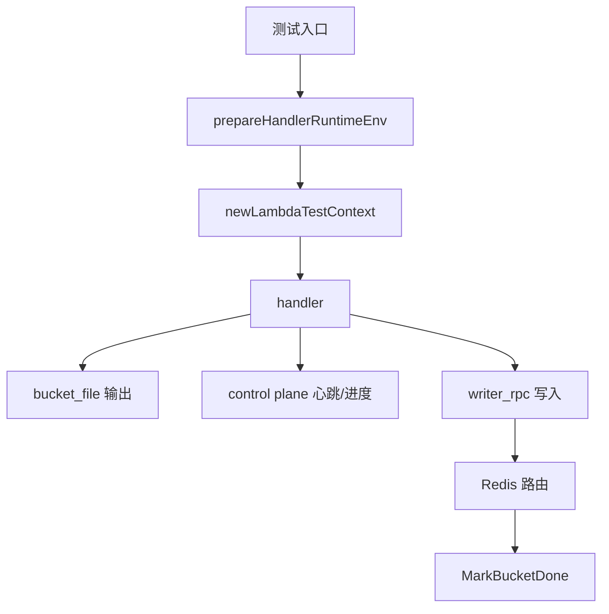

# Other — main_test.go

## main_test.go 测试模块

`main_test.go` 覆盖 `main` 包中 reader handler 的关键集成路径和配置归一化逻辑。它主要验证三类行为：

- `handler` 处理 HDFS Parquet 输入时，能正确写出 `bucket_file` 结果并向 control plane 上报心跳和进度。
- `writer_rpc` sink 能从 Redis 路由表读取 writer endpoint，并在测试结束后调用 writer 的 `MarkBucketDone`。
- `Input.Normalize`、`SinkInput`、`newTOSInventoryCSVConfig` 等配置辅助逻辑能保持预期默认值、校验规则和字段传递。

这些测试与 `main.go` 中的 `Input`、`SinkInput`、`ControlPlaneInput`、`HDFSParquetInput`、`TOSInventoryCSVInput`、`handler`、`millisecondsOrZero` 等实现直接耦合，因此更像端到端保护网，而不是纯单元测试集合。

## 测试分层

### 受环境变量保护的集成测试

以下测试默认跳过，需要显式设置环境变量：

- `TestHandler_HDFSParquetWithControlPlane_DirectInvocation`
  - 环境变量：`URI_READER_RUN_HANDLER_CONTROLPLANE_TEST=1`
  - 使用 `httptest.NewServer` 模拟 control plane。
  - 验证 `/api/v1/heartbeat` 和 `/api/v1/report_progress` 都被调用。
  - 验证上报 payload 中的 `job_id`、`kind=reader`、`reader_id`。
  - 验证 `bucket_file` sink 在 `defaultBucketFileSinkOutputDir` 下产生输出。

- `TestHandler_HDFSParquetWithRealControlPlane_DirectInvocation`
  - 环境变量：`URI_READER_RUN_HANDLER_REAL_CONTROLPLANE_TEST=1`
  - 默认 control plane 地址为 `http://127.0.0.1:8090`，可通过 `URI_READER_REAL_CONTROLPLANE_BASE_URL` 覆盖。
  - 先调用 `createReaderControlPlaneJob` 创建真实 job。
  - 再直接调用 `handler` 执行 HDFS Parquet reader。
  - 最后通过 `waitForRealControlPlaneReaderReported` 轮询 job detail，确认 reader 已上报文件进度。

- `TestHandler_HDFSParquetWithRedisWriterSink_DirectInvocation`
  - 环境变量：`URI_READER_RUN_HANDLER_REDIS_WRITER_TEST=1`
  - 使用真实 control plane、真实 Redis 路由和真实 writer Kitex 服务。
  - 先通过 `assertRedisWriterRoutesReady` 确认每个 bucket 都有 writer endpoint。
  - 调用 `handler`，sink 类型为 `writer_rpc`。
  - 调用 `finalizeRedisWriterBuckets` 对每个 bucket 执行 `writerservice.Client.MarkBucketDone`。
  - 最后等待 control plane 观察到 reader 进度。



## 直接 handler 测试的输入结构

三个直接调用 `handler` 的测试都构造 `Input`，而不是通过 Lambda 运行时触发。典型配置包括：

- `JobID`
- `SourceType: SourceTypeHDFSParquet`
- `Sink`
  - `Type: "bucket_file"` 或 `Type: "writer_rpc"`
- `Bucketing`
  - `NumBuckets: 4`
  - `HashAlg: HashAlgHive`
- `HDFSParquet`
  - `FilePaths: []string{testHandlerHDFSFile}`
  - `StoreURIField: "store_uri"`
- `Limits`
  - `ReaderWorkers: 2`
  - `BatchRows: 1000`
  - `ParquetParallelism: 4`
- `ControlPlane`
  - `Endpoint`
  - `HeartbeatIntervalSec: 1`
  - `ProgressReportIntervalSec: 1`

`newLambdaTestContext` 使用 `lambdacontext.NewContext` 注入 `ExecutorID`，handler 侧会把它作为 reader 身份来源。相关断言通过 `assertPostedReaderID` 和真实 control plane 查询确认该 ID 被正确传播。

## control plane 测试辅助结构

`testControlPlaneRecorder` 是内存记录器，用于 mock control plane 测试：

- `heartbeatCalls` 记录心跳次数。
- `progressCalls` 记录进度上报次数。
- `heartbeats` 保存每次心跳请求体。
- `progresses` 保存每次进度请求体。
- `mu sync.Mutex` 保护并发写入。

mock server 只接受两个路径：

- `/api/v1/heartbeat`
- `/api/v1/report_progress`

其他路径会直接 `t.Fatalf`，用于尽早暴露 handler 的接口路径变更。

真实 control plane 的 JSON 响应由以下结构解析：

- `controlPlaneEnvelope`
- `controlPlaneCreateJobResponse`
- `controlPlaneJobDetailResponse`

`doControlPlaneJSON` 统一完成请求构造、状态码检查、业务 `code` 检查和 `data` 反序列化。

## Redis writer sink 测试

`TestHandler_HDFSParquetWithRedisWriterSink_DirectInvocation` 验证 reader 与 writer RPC 路由的协作。

关键常量：

- `redisCluster = "toutiao.redis.videoarch_storage_test"`
- `redisKeyPrefix = "writer-reader-bucket4-job"`
- `numBuckets = 4`
- 默认 writer service name 为 `"uri-writer"`

`assertRedisWriterRoutesReady` 会检查 Redis 中每个 bucket 的路由键：

```text
{redisKeyPrefix}:bucket:{bucketID 的 5 位补零格式}
```

示例：

```text
writer-reader-bucket4-job:bucket:00000
writer-reader-bucket4-job:bucket:00001
```

`finalizeRedisWriterBuckets` 对每个 bucket 执行：

1. 从 Redis 读取 endpoint。
2. 使用 `normalizeWriterTestEndpoint` 规范化 endpoint。
3. 按 endpoint 复用 `writerservice.Client`。
4. 调用 `MarkBucketDone`。
5. 检查返回的 `ErrorCode` 必须为 `uri_writer.ErrorCode_SUCCESS`。

`normalizeWriterTestEndpoint` 和 `splitWriterTestEndpoint` 的主要作用是处理 IPv6 host。未加方括号的 IPv6 host 会被转换为 `[host]:port` 形式，以满足 Kitex host port 格式要求。

## 配置单元测试

### `SinkInput` Redis 嵌套配置优先级

`TestNewSinkWriterRPCPrefersNestedRedisConfig` 验证 `SinkInput.Redis` 中的嵌套配置会被以下方法读取：

- `redisCluster`
- `redisKeyPrefix`
- `readRedisTimeoutSeconds`
- `readRedisMaxRetries`

同时测试 writer RPC 相关批处理配置保持原值：

- `RPCTimeoutRetries`
- `EndpointBatchMaxWaitMS`
- `EndpointBatchMaxTasks`
- `EndpointBatchMaxObjects`
- `EndpointTaskQueueSize`

`millisecondsOrZero` 用于把毫秒整数转换为 `time.Duration`。非正数会返回 `0`，由 `TestMillisecondsOrZeroRejectsNonPositiveValues` 覆盖。

### endpoint batch 默认值

`TestSinkInputEndpointBatchDefaultsLeaveCallbackDefaults` 确认空 `SinkInput` 不会主动覆盖 callback 层默认值：

- `EndpointBatchMaxWaitMS` 转换后为 `0`
- `EndpointBatchMaxTasks` 为 `0`
- `EndpointBatchMaxObjects` 为 `0`
- `EndpointTaskQueueSize` 为 `0`

这保证未显式配置时，底层 writer callback 可以继续使用自己的默认策略。

### TOS inventory CSV 配置

`TestNewTOSInventoryCSVConfigUsesLimitsBatchRowsReaderWorkersAndSinkWorkers` 验证 `newTOSInventoryCSVConfig` 会从 `Input` 正确传递：

- `Limits.ReaderWorkers`
- `Limits.SinkWorkers`
- `Limits.BatchRows`
- `TOSInventoryCSV.CreateTimestampColumn`
- `TOSInventoryCSV.TaskType`

该测试防止新增字段后只更新输入结构、却没有传入具体 source 配置。

### `Input.Normalize` 校验

`TestInputNormalizeRejectsBothCreateTimeColumns` 验证 `TOSInventoryCSVInput` 中不能同时设置：

- `CreateTimestampColumn`
- `CreateTimeStrColumn`

错误信息需要包含 `"cannot both be set"`。

`TestInputNormalizeRejectsManifestExpandWithoutContentTypeColumn` 验证当 `TaskType` 为 `"manifest_expand"` 时，必须设置 content type column。错误信息需要包含 `"content_type_column is required"`。

### HDFS Parquet 字段默认值

`TestInputNormalizeDefaultsHDFSParquetFormatField` 验证 HDFS Parquet 输入在 `Normalize` 后会补齐默认字段：

- `FormatField: "format"`
- `CreateTimestampField: "created_at"`

`TestInputNormalizeKeepsCustomHDFSParquetFields` 验证显式配置不会被默认值覆盖：

- `FormatField: "media_format"`
- `CreateTimestampField: "event_created_at"`

### HDFS Parquet limits 传递

`TestHDFSParquetLimitsCarrySinkWorkers` 明确覆盖 `LimitsInput.SinkWorkers` 到 `hdfsparquet.Limits.SinkWorkers` 的传递关系，防止 reader worker、sink worker、parquet 并发等限制字段在转换时遗漏。

## 运行环境准备

`prepareHandlerRuntimeEnv` 为直接调用 handler 的测试创建隔离日志目录，并通过 `t.Setenv` 设置：

- `HDFS_LOG_DIR`
- `KITEX_LOG_DIR`

这避免 HDFS native client 和 Kitex 在测试环境中写入默认路径，也减少不同测试之间的日志目录冲突。

`assertReaderOutputProduced` 会在最多 2 秒内轮询 `outputDir`，只要目录存在且包含文件即认为 bucket file sink 已输出成功。

## 与主代码的关系

`main_test.go` 不定义业务逻辑，而是围绕 `main.go` 的公开结构和包内辅助方法建立回归保护。它直接验证以下生产代码契约：

- `handler` 能接受标准化后的 `Input` 并执行 source 到 sink 的完整链路。
- `ControlPlaneInput` 的 endpoint 与上报间隔会驱动 heartbeat/progress 请求。
- `SinkInput` 的 Redis 嵌套配置优先于旧式平铺字段。
- `Input.Normalize` 负责补默认值和拒绝非法组合。
- `newTOSInventoryCSVConfig` 与 `hdfsparquet.Limits` 必须完整接收并传递 concurrency、batch 和字段配置。

修改 `main.go` 中的输入 schema、默认值、control plane API 路径、writer RPC 路由格式或 HDFS Parquet 字段映射时，应同步检查本文件中的断言是否仍代表预期行为。