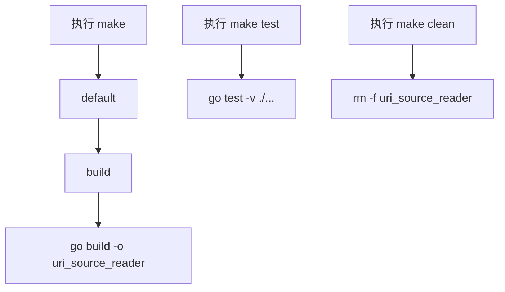

# Other — Makefile

## 模块概览

`Makefile` 提供代码库的基础开发命令入口，用于构建、测试和清理 Go 项目。它不包含业务逻辑，也没有内部函数调用关系；它的作用是把常用的 `go` 命令封装成稳定的 `make` 目标，方便开发者和自动化环境统一执行。

## 目标定义

```makefile
default: build
```

`default` 是默认目标。直接执行 `make` 时，等价于执行：

```bash
make build
```

### `build`

```makefile
build:
	go build -o uri_source_reader
```

`build` 使用 Go 工具链编译当前目录下的 Go 包，并将输出文件命名为 `uri_source_reader`。

关键行为：

- 输出二进制文件位于仓库当前目录。
- `go build` 未显式指定包路径，因此会构建当前目录对应的 Go package。
- `-o uri_source_reader` 固定了产物名称，便于脚本、部署或本地运行时引用同一个文件名。

常用命令：

```bash
make build
./uri_source_reader
```

### `test`

```makefile
test:
	go test -v ./...
```

`test` 执行整个 Go module 下的测试。

关键行为：

- `./...` 会递归匹配当前目录及所有子目录中的 Go package。
- `-v` 开启详细输出，便于查看每个测试用例的执行情况。
- 适合在提交前、本地调试后或 CI 阶段运行。

常用命令：

```bash
make test
```

### `clean`

```makefile
clean:
	rm -f uri_source_reader
```

`clean` 删除 `build` 生成的二进制文件。

关键行为：

- 只清理 `uri_source_reader` 这个构建产物。
- `rm -f` 在文件不存在时不会报错。
- 不会清理测试缓存、Go build cache 或其他临时文件。

常用命令：

```bash
make clean
```

## 执行流程



## 与代码库的关系

`Makefile` 是项目级入口文件，连接的是 Go 工具链而不是项目内部函数或类型。它没有调用代码中的函数、方法或包级 API；实际的编译和测试范围由 Go module、package 结构以及测试文件决定。

开发者修改 Go 代码后，通常使用：

```bash
make test
make build
```

来验证代码行为并生成可执行文件。

## 维护注意事项

当前目标未声明为 `.PHONY`。如果仓库中出现名为 `build`、`test` 或 `clean` 的同名文件，`make` 可能会认为目标已经是最新状态，从而跳过命令执行。若后续扩展该文件，建议添加：

```makefile
.PHONY: default build test clean
```

如果项目未来需要区分平台、注入版本号、设置构建标签或输出到专门目录，可以在 `build` 目标中扩展 `go build` 参数，但应保持 `make build` 作为主要构建入口。