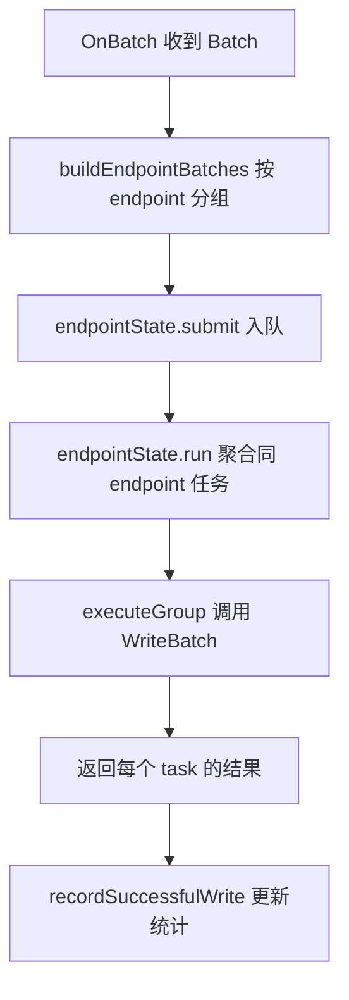

# Other — sink

## 模块概览

`sink` 包是读取链路的输出层。上游 reader 将输入文件解析、分桶后，以 `Batch` 形式交给 sink；sink 再选择本地落盘、控制台打印或通过 Redis 路由写入 writer RPC 服务。

核心回调边界定义在 `sink/types.go`：

```go
type BatchCallback interface {
	OnBatch(ctx context.Context, batch Batch) error
}

type ResultCallback interface {
	OnComplete(ctx context.Context, result Result) error
}
```

`Batch` 是增量输出单元，包含来源文件、扫描行数、有效 URI 数和按 bucket 聚合的对象记录：

```go
type Batch struct {
	FilePath      string
	ScannedRows   int
	ProcessedURIs int
	Buckets       map[int][]ObjectRecord
}
```

`ObjectRecord` 保存写入侧需要的对象元信息，包括 `StoreURI`、`Size`、`StorageClass`、`ContentType`、`VID`、`OID` 和 `CreateTimestamp`。`Result` 是任务完成后的汇总信息，由 `OnComplete` 消费。

## Sink 实现

### `ConsolePrintCallback`

`ConsolePrintCallback.OnBatch` 将每个批次的处理摘要打印到标准输出。它不会写文件，也不会实现 `OnComplete`。

输出格式按 bucket ID 排序，使用 `sortedBucketIDs` 保证日志稳定：

```text
processed batch file=... scanned_rows=... processed_uris=... buckets={2:2,7:1}
```

该实现主要适合调试或本地观察批次形态。

### `FileWriteCallback`

`FileWriteCallback` 将批次摘要和最终汇总写入一个指定文件。

通过 `NewFileWriteCallback(path)` 创建时会直接 `os.Create(path)`，也就是覆盖已有文件。内部使用 `bufio.Writer`，默认缓冲大小为 64 KiB，并用 `sync.Mutex` 串行化 `OnBatch`、`OnComplete` 和 `Close`。

关键方法：

- `OnBatch(ctx, batch)`：写入一行批次摘要。
- `OnComplete(ctx, result)`：写入一行最终摘要，并立即 `Flush`。
- `Close()`：刷新缓冲并关闭底层文件。

批次摘要格式：

```text
processed batch file=/tmp/part-00000.parquet scanned_rows=1000 processed_uris=3 buckets={2:2,7:1}
```

最终摘要格式：

```text
summary output_file=/path/to/output.log processed_files=334 processed_rows=54765489 processed_uris=60000000 processed_batches=1200
```

### `BucketFileCallback`

`BucketFileCallback` 将对象 URI 按 bucket 写入不同文件，适合生成后续系统可消费的分桶文件。

通过 `NewBucketFileCallback(outputDir)` 创建时会确保目录存在，并生成一个 `jobUUID`。每个 bucket 的文件名由 `fileName(bucketID)` 生成：

```go
func (c *BucketFileCallback) fileName(bucketID int) string {
	return fmt.Sprintf("part-%05d-%s_%05d.c000", bucketID, c.jobUUID, bucketID)
}
```

`OnBatch` 的行为：

1. 使用 `sortedBucketIDs(batch.Buckets)` 固定 bucket 处理顺序。
2. 对每个 bucket 调用 `getWriter(bucketID)` 懒加载文件和缓冲 writer。
3. 将每个 `ObjectRecord.StoreURI` 按行写入对应 bucket 文件。

`OnComplete` 会先刷新所有 bucket writer，然后写入 `summary.txt`：

```text
processed_files=334
processed_rows=54765489
processed_uris=60000000
```

`Close` 会刷新并关闭所有已打开的 bucket 文件，然后清空 `files` 和 `writers` map。

## Writer RPC Sink

`RedisWriterCallback` 是生产路径中更复杂的 sink：它根据 bucket ID 从 Redis 查询 writer endpoint，把同一 endpoint 上的多个 bucket 合并成 RPC 请求，并调用 `uri_writer.WriterService.WriteBatch`。

创建入口是：

```go
func NewRedisWriterCallback(cfg RedisWriterCallbackConfig) (*RedisWriterCallback, error)
```

主要配置项：

- `RedisCluster`：Redis 集群名或直连地址列表，必填。
- `RedisKeyPrefix`：bucket 到 endpoint 映射的 key 前缀，必填。
- `WriterServiceName`：Kitex 服务名，默认 `"uri-writer"`。
- `BucketCount`：大于 0 时会在初始化阶段预热 bucket endpoint。
- `ReaderID`：非空时写入 RPC request 的 `Base.Extra["reader_id"]`。
- `ConnectTimeout`、`RPCTimeout`：Kitex 连接和调用超时。
- `RPCTimeoutRetries`：RPC 超时类错误重试次数，默认 2。
- `ReadRedisTimeout`、`ReadRedisRetries`：Redis 读取超时和重试次数。
- `EndpointBatchMaxWait`、`EndpointBatchMaxTasks`、`EndpointBatchMaxObjects`：同 endpoint 微批聚合参数。
- `EndpointTaskQueueSize`：每个 endpoint 的任务队列长度。

### Redis 路由

bucket endpoint key 由 `bucketRedisKey(prefix, bucketID)` 生成：

```text
<prefix>:bucket:%05d
```

例如 `bucketRedisKey("job", 1)` 生成：

```text
job:bucket:00001
```

`lookupBucketEndpoint(ctx, bucketID)` 优先读取本地缓存 `bucketEndpoint`。缓存未命中时调用 `redisGet`，成功后会通过 `cacheBucketEndpoint` 写回缓存。

初始化时，如果 `BucketCount > 0`，`prewarmBucketEndpoints` 会按 `redisMGetBatchSize` 批量 `MGET`：

1. 扫描 `[0, BucketCount)` 的 bucket key。
2. 将非空 Redis 值转换为 endpoint。
3. 规范化 endpoint 格式。
4. 缓存 bucket 到 endpoint 的映射。
5. 为所有唯一 endpoint 预创建 Kitex client。

Redis 值只接受 `string` 和 `[]byte`，空字符串会被忽略。

### Endpoint 规范化

`normalizeWriterEndpoint` 会清理空白，并处理 IPv6 endpoint。对于未带方括号的 IPv6 host，会转换为 Kitex 可用格式：

```text
fdbd:dc53:22:74a::49:35588
```

规范化为：

```text
[fdbd:dc53:22:74a::49]:35588
```

底层解析逻辑在 `splitEndpoint` 中。

### 批次构建

`RedisWriterCallback.OnBatch` 首先调用 `buildEndpointBatches(ctx, batch)`。该函数把 `Batch.Buckets` 转换为按 endpoint 分组的 `[]endpointBatch`。

构建规则：

- bucket ID 先通过 `sortedBucketIDs` 排序。
- 空对象列表的 bucket 会跳过，不会产生 `DataRecord`。
- 每个非空 bucket 通过 `lookupBucketEndpoint` 找到 endpoint。
- 同一 endpoint 的多个 bucket 合并到一个 `endpointBatch`。
- endpoint 顺序按首次出现顺序保留，因此输出顺序稳定。
- 每个 bucket 转成一个 `uri_writer.DataRecord`。
- 每个 `ObjectRecord` 通过 `toObjectMetasWithBacking` 转成 `uri_writer.ObjectMeta`。

字段映射如下：

```go
uri_writer.ObjectMeta{
	StoreUri:        []byte(object.StoreURI),
	Size:            object.Size,
	StorageClass:    object.StorageClass,
	ContentType:     object.ContentType,
	Vid:             object.VID,
	Oid:             object.OID,
	CreateTimestamp: object.CreateTimestamp,
}
```

`buildEndpointBatches` 使用 `recordBacking` 和 `objectBacking` 预分配连续 backing 数组，减少大量对象转换时的分配压力。`writer_rpc_benchmark_test.go` 中的 benchmark 覆盖了接近线上日志形态的数据规模：约 26,750 个 bucket、56,000 个对象、256 个 endpoint。

### Endpoint 队列与微批

每个 endpoint 对应一个 `endpointState`。它持有：

- `client writerservice.Client`
- `taskCh chan endpointTask`
- `doneCh chan struct{}`
- 一个后台 goroutine：`endpointState.run`

`OnBatch` 会为每个 `endpointBatch` 获取 `endpointState`，然后并发调用 `state.submit(...)`。因此不同 endpoint 可以并行写入；同一 endpoint 内部由单个 `endpointState.run` 串行消费 `taskCh`，保证同 endpoint 写入不会并发冲突。

微批聚合发生在 `endpointState.run`：



聚合限制由以下方法读取：

- `batchMaxWait()`：等待更多同 endpoint task 的最大时间，默认 `3ms`。
- `batchMaxTasks()`：一次 group 最多聚合多少 task，默认 `8`。
- `batchMaxObjects()`：一次 group 最多包含多少对象，默认 `120000`。
- `endpointTaskQueueSize(callback)`：每个 endpoint 队列大小，默认 `24`。

`endpointTaskGroup` 会记录聚合原因：

- `"max_tasks"`：达到最大 task 数。
- `"max_objects"`：达到或即将超过对象数上限。
- `"max_wait"`：等待窗口结束。
- `"drained"`：当前队列已取空。
- `"closed"`：队列关闭。

这些值会进入慢 endpoint 日志，便于判断慢是队列堆积、RPC 慢还是聚合窗口导致。

### RPC 写入与重试

实际 RPC 调用在 `endpointState.executeGroup` 中完成。它构造 `uri_writer.WriteBatchRequest`：

```go
req := &uri_writer.WriteBatchRequest{
	SeqNo: seqNo,
	Batch: group.records,
}
```

`SeqNo` 来自 `RedisWriterCallback.nextSequence()`，使用 `atomic.Int64` 全局递增。writer 返回的 `AckSeqNo` 会记录到 metrics。

错误处理分几类：

- RPC error：
  - 如果 context 已取消，返回 `ctx.Err()`。
  - 如果 `isRetryableWriteBatchRPCError(err)` 为真，并且未超过 `RPCTimeoutRetries`，等待 `retryableWriteBatchInterval` 后重试。
  - 其他错误包装为 `[WriteBatch error]`。
- `uri_writer.ErrorCode_SUCCESS`：成功返回。
- `uri_writer.ErrorCode_RETRYABLE_ERROR`：最多按 `retryableWriteBatchRetryCount` 重试 3 次。
- `uri_writer.ErrorCode_FATAL_ERROR`：直接失败。
- `uri_writer.ErrorCode_BUCKET_NOT_OWNED`：直接失败。
- `uri_writer.ErrorCode_BACK_PRESSURE`：指数退避后继续重试，初始 `100ms`，最大 `10s`。
- 其他错误码：按默认错误返回。

`isRetryableWriteBatchRPCError` 会识别以下超时或连接类错误文本：

- `context.DeadlineExceeded`
- `"rpc timeout"`
- `"deadline exceeded"`
- `"connection read timeout"`
- `"connection has been closed"`
- `"peer close"`

### 成功统计与完成语义

`OnBatch` 收集所有 endpoint 结果后，只对成功结果调用：

```go
c.recordSuccessfulWrite(write.bucketID, write.endpoint, write.uriCount)
```

该方法会更新：

- `bucketEndpoint[bucketID] = normalizeWriterEndpoint(endpoint)`
- `bucketTotals[bucketID] += uriCount`

`RedisWriterCallback.OnComplete` 当前是 no-op，不会调用 writer 的 `MarkBucketDone`。测试 `TestRedisWriterCallbackOnCompleteDoesNotCallMarkBucketDone` 明确固定了这个语义。

`Close` 会关闭 Redis client，并关闭所有 `endpointState` 的 `taskCh`，等待对应 goroutine 退出。

## 指标与日志

`RedisWriterCallback.OnBatch` 会构造 `writerRPCBatchMetrics`，记录批次构建、endpoint state 查找、提交、RPC 和重试耗时。

批次级日志由 `logWriterRPCBatchMetrics` 输出，包含：

- `status`
- `file_path`
- `scanned_rows`
- `processed_uris`
- `bucket_count`
- `endpoint_count`
- `records`
- `objects`
- `success`
- `errors`
- `build_elapsed`
- `state_lookup_elapsed`
- `submit_elapsed`
- `total_elapsed`
- `rpc_attempts`
- `timeout_retries`
- `retryable_retries`
- `backpressure_retries`
- queue、RPC、submit 的 p50/p90/p95/max
- 慢 endpoint 分类计数

慢 endpoint 判断阈值是 `writerRPCSlowEndpointThreshold = 500ms`。`classifySlowEndpointMetrics` 会将慢原因分为：

- `queue_only`
- `rpc_only`
- `queue_rpc`
- `mixed`

`logWriterRPCSlowEndpointMetrics` 会按 `submitElapsed` 降序打印最多 `writerRPCSlowEndpointLogLimit = 3` 个慢 endpoint 的详细信息，包括 `seq_no`、`ack_seq_no`、队列长度、聚合原因、等待时间、RPC 时间和错误。

## 与主流程的连接

`main.go` 中的 `newSink` 根据输入配置创建 sink：

```go
switch sinkCfg.Type {
case "", "bucket_file":
	return sink.NewBucketFileCallback(defaultBucketFileSinkOutputDir)
case "writer_rpc":
	return sink.NewRedisWriterCallback(sink.RedisWriterCallbackConfig{...})
default:
	return nil, fmt.Errorf("unsupported sink type: %q", sinkCfg.Type)
}
```

默认 sink 类型是 `"bucket_file"`。当类型为 `"writer_rpc"` 时，配置会从 `SinkInput` 和任务输入中组装：

- Redis key prefix 优先使用 sink 配置；为空时使用 `in.JobID`。
- `BucketCount` 来自 `in.Bucketing.NumBuckets`，用于 Redis 预热。
- `ReaderID` 由调用方传入，并透传到 writer RPC request。
- endpoint 微批、队列大小、Redis 读取和 RPC 超时参数都从 sink 配置读取。

`newTOSInventoryCSVConfig` 会把 sink 实例作为 reader 的 `Sink` 字段传入，因此 reader 只依赖回调接口，不需要知道最终输出是文件还是 RPC。

## 开发注意事项

新增 sink 实现时，应优先实现 `OnBatch(context.Context, Batch) error`。如果需要任务级汇总，再实现 `OnComplete(context.Context, Result) error` 和必要的 `Close()` 方法。

涉及 map 遍历时应使用 `sortedBucketIDs`，否则日志、文件写入和测试结果会受 Go map 随机遍历顺序影响。

本地文件 sink 都使用 `sync.Mutex` 保护内部 writer 和文件句柄。如果上游配置了多个 sink worker，不能绕过这些锁直接操作内部字段。

`RedisWriterCallback` 的并发模型是“endpoint 间并行、endpoint 内串行”。修改 `endpointState.run`、`drainAvailableTasks` 或 `waitForNextTask` 时，需要同时验证：

- 同 endpoint 不出现并发 `WriteBatch`。
- 不同 endpoint 仍能并行。
- `EndpointBatchMaxTasks` 和 `EndpointBatchMaxObjects` 能正确切分 group。
- context 取消时不会阻塞 `submit` 或重试 sleep。
- `Close` 能关闭队列并等待 goroutine 退出。

RPC 对象转换路径对分配敏感。`buildEndpointBatches` 当前通过 backing slice 降低分配，修改 `toObjectMetasWithBacking` 或 `endpointBatchBuildState` 时应跑对应 benchmark，避免退化大批量日志场景。