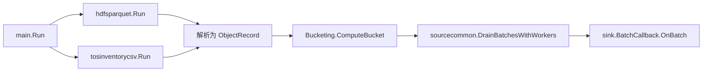

# Other — source

## `internal/source` 模块

`internal/source` 负责把不同来源的数据读取成统一的 `sink.Batch`：解析对象 URI，补齐元数据，按 `Bucketing.ComputeBucket` 分桶，然后交给 `sink.BatchCallback`。当前支持两类来源：

- `hdfsparquet`：读取 HDFS 上的 Parquet/Hive 表文件。
- `tosinventorycsv`：读取 TOS Inventory CSV 文件。
- `manifest`：共享的 HLS/DASH 清单展开逻辑。
- `sourcecommon`：共享的 Sink drain、进度回调和并发投递逻辑。

## 统一输出模型

所有来源最终都输出 `sink.Batch`：

- `sink.ObjectRecord` 表示单个对象，包含 `StoreURI`、`Size`、`StorageClass`、`ContentType`、`VID`、`OID`、`CreateTimestamp`。
- `sink.Batch` 包含 `FilePath`、`ScannedRows`、`ProcessedURIs` 和 `Buckets map[int][]ObjectRecord`。
- `sink.BatchCallback.OnBatch(ctx, batch)` 消费分桶后的批次。
- 如果 Sink 同时实现 `sink.ResultCallback`，来源读取结束后会调用 `OnComplete(ctx, result)`。
- 如果 Sink 实现 `io.Closer`，`hdfsparquet.Run` 和 `tosinventorycsv.runWithClient` 会在退出时关闭它。

`ProgressObserver` 在两个来源中保持同样的语义：`OnFilesResolved`、`OnFileDone`、`OnRowsRead`、`OnBucketsSeen`。

## HDFS Parquet 来源

入口是 `hdfsparquet.Run(ctx, HDFSParquetConfig)`。它的执行管线分三段：

1. `readFiles` / `readFile` 从 HDFS 打开 Parquet 文件，调用 `readSelectedColumns` 读取配置列，输出 `ReadBatch`。
2. `ParseURIFromBatches` 调用 `parseBatch` 和 `parseRowObjects`，把行数据转换为 `URIBatch`。
3. `DivideIntoBuckets` 按 `Bucketing` 分桶，并通过 `sourcecommon.DrainBatchesWithWorkers` 投递给 Sink。

`ResolveFiles` 支持两种文件解析方式：如果传入 `FilePaths`，只解析 HDFS URI 并返回路径部分，不访问 HDFS 列表；否则从 `RootPath` 递归查找 `part-` 文件，跳过 `_SUCCESS`、`.`、`..` 和隐藏文件。

`readSelectedColumns` 使用 `parquet-go` 的 `ParquetColumnReader` 读取列。`StoreURIField` 是必需列；`FormatField` 和 `CreateTimestampField` 是可选列，缺失时静默为空或 `0`；`ExtraField`、`VIDField`、`OIDField` 只要配置了就必须能解析到列。列匹配由 `matchColumnPath` 完成，优先匹配 `parquet_go_root.<field>`，再做大小写不敏感的后缀匹配；多列命中会返回歧义错误。

行解析的核心是 `parseRowObjects`：

- 主对象来自 `store_uri`，空字符串会被跳过。
- `extra` 只有在存在 `extraURIQueryClient` 时才解析，不会直接把 JSON 字段值当 URI 兜底。
- `parseExtraObjects` 会同时调用 `QueryExtraURI(ctx, queryInput, true)` 和 `QueryExtraURI(ctx, queryInput, false)`，合并 file extra 与 video extra 的 URI。
- `xquery.ErrNotFound` 和 `xquery.ErrNotAnnotated` 会被忽略，其他 extra 查询错误会中断当前批次。
- `VID`、`OID`、`CreateTimestamp` 会传播到主对象、extra 对象和清单展开对象。
- 最后通过 `dedupeObjectsByStoreURI` 按 `StoreURI` 去重。

当 `ExpandTS` 为 true，且 `manifest.ShouldExpand(storeURI, format)` 返回 true 时，`parseManifestObjects` 会调用 `manifest.Expand` 展开 HLS/DASH 清单。触发条件是 `format` 为 `hls` / `dash`，或 URI 后缀为 `.m3u8` / `.mpd`。如果 StorageGW client 为空，或者清单展开失败，当前实现会保留原始索引对象并继续处理。

`extra_query_client.go` 通过 `sync.Once` 缓存 `video_extra_query` client。测试通过替换 `newVideoExtraQueryClient` 和调用 `resetVideoExtraQueryClientForTest` 验证单例行为。

## TOS Inventory CSV 来源

入口是 `tosinventorycsv.Run(ctx, Config)`，实际测试和内部复用常用 `runWithClient(ctx, cfg, client)` 注入 fake StorageGW client。CSV 来源先把每个 CSV 对象下载到本地临时文件，再读取解析。

关键路径：

- `normalizeCSVURIs` 会去掉空值并排序。
- `stageCSVObjectLocally` 使用 StorageGW 下载对象，最多重试 3 次，间隔 `200ms`。
- 临时目录优先使用 Lambda context 的 `TempDir` 或 `TmpfsDir`，否则使用 `/tmp`。
- `newCSVReader` 支持无压缩和 `gzip`，并设置 `FieldsPerRecord = -1` 与 `ReuseRecord = true`。
- `buildRowExtractor` 根据 `CSVFormat.HasHeader` 选择按表头列名或按列下标解析。
- `rowExtractor.objectFromRecord` 从 `store_uri_column` 获取完整 URI；如果没有配置，则用 `bucket + "/" + key` 拼接。

时间字段由 `parseCreateTimestamp` 处理：可以直接读取 Unix 时间戳，也可以读取 RFC3339 字符串；Unix 时间戳会通过 `normalizeUnixTimestampToSeconds` 自动把纳秒、微秒、毫秒归一到秒。

`objectsFromCSVRecord` 根据 `TaskType` 决定行输出：

- 空 `TaskType`：直接输出当前 `ObjectRecord`。
- `TaskTypeManifestExpand`：根据 `ContentType` 判断是否为 HLS/DASH；非清单内容会跳过；清单内容会调用 `manifest.Expand`，并把展开对象的 `OID` 设置为原始 `StoreURI`。
- 其他 `TaskType`：返回 unsupported 错误。

CSV 来源在 `processFile` 内部直接分桶并构造 `sink.Batch`，然后把 `sourcecommon.BatchEnvelope` 送入共享 drain 阶段。

## 共享清单展开

`internal/source/manifest` 封装 HLS/DASH 解析：

- `FormatFromContentType` 支持 `application/x-mpegurl` 和 `application/dash+xml`。
- `ShouldExpand` 统一判断格式字段和 URI 后缀。
- `NewParser` 根据格式或后缀选择 `media-parser-go` 的 M3U8 或 DASH parser。
- `NewIndexReader` 用 StorageGW 读取清单对象内容。
- `Expand` 会尝试 3 次，成功后按 `segments.PostOrderList()` 返回 URI；失败时记录 warn 并返回空结果。

调用方依赖这个“失败返回空”的语义来避免单个坏清单阻断整批任务。

## 并发与错误传播

`sourcecommon.DrainBatchesWithWorkers` 是 Sink 阶段的共享实现。它会对输入批次执行 `Transformer`，然后调用 `sinkCb.OnBatch`，最后触发 `progress.OnRowsRead` 和 `progress.OnBucketsSeen`。`SinkWorkers` 控制并发投递；首个 transform 或 Sink 错误会取消上下文并返回已有统计。

HDFS Parquet 还有独立的三段并发：读取、解析、分桶。`Limits.ReaderWorkers` 控制读取 worker 数，也影响解析 worker 数；`Limits.ParquetParallelism` 控制 Parquet 解码并行度；`Limits.BatchRows` 控制列读取批大小。`parseBatch` 在行数较大且 `parallelism > 1` 时会把同一批行切块并行解析。

贡献新来源时，保持两个约定最重要：输出必须是 `sink.Batch` 或 `sourcecommon.BatchEnvelope`，分桶必须使用 `Bucketing.ComputeBucket`；进度和 Sink 投递应复用 `sourcecommon.DrainBatchesWithWorkers`，避免不同来源出现统计和取消语义不一致。