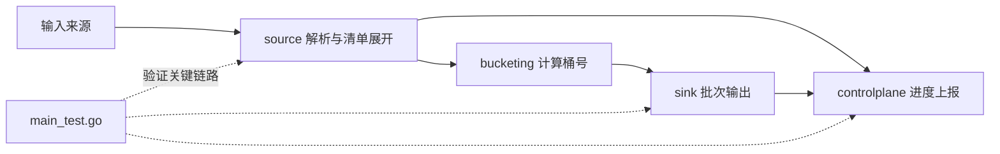

# Other

## 模块概览

`Other` 汇总了项目的支撑层与横向模块：构建入口、模块依赖、读取链路的公共能力、输出层、控制面上报、测试保护网，以及一次独立的诊断页面。它们共同支撑 `uri_source_reader` 从输入读取、URI 分桶、批次输出到运行状态上报的完整 reader 工作流。

## 子模块协作

[go.mod](go-mod.md) 定义整个 Go module 的边界和依赖来源，支撑 `source`、`sink`、`controlplane` 等运行时代码使用 HDFS、Hertz、Kitex、Redis、Lambda SDK 等组件。

[Makefile](makefile.md) 和 [build.sh](build-sh.md) 是开发与部署入口：前者封装本地常用的 `go build`、`go test`、清理操作，后者面向 Linux 环境准备依赖并生成 `output/uri_source_reader`。两者不参与运行时调用链，但决定代码如何被构建、测试和交付。

[source](source.md) 是读取链路的入口层，负责将 `hdfsparquet`、`tosinventorycsv` 等来源解析为统一的 `sink.Batch`。其中 `manifest` 处理 HLS/DASH 清单展开，`sourcecommon` 负责 Sink drain、进度回调和并发投递。

[bucketing](bucketing.md) 为 `source` 提供统一桶号计算。`Config.ComputeBucket` 使用 `hive` 或 `spark` 哈希策略把 `store_uri` 映射到稳定 bucket id，使不同输入来源能产出一致的分桶结果。

[sink](sink.md) 是输出边界。上游通过 `BatchCallback.OnBatch` 投递包含 `ObjectRecord` 的 `Batch`，下游可选择控制台输出、本地 bucket 文件，或通过 Redis 路由到 writer RPC。`ResultCallback.OnComplete` 则承接任务完成后的汇总结果。

[controlplane](controlplane.md) 负责运行状态上报。`Tracker` 累计 reader 进度，`Reporter` 周期性读取快照并通过 `Client.SendHeartbeat`、`Client.SendProgress` 上报到控制面接口，使读取链路具备可观测性。

[main_test.go](main-test-go.md) 连接这些模块形成测试保护网，覆盖 `handler` 的 HDFS Parquet、control plane、Redis writer sink、配置归一化等关键路径，验证 `source`、`sink` 与 `controlplane` 的组合行为。

[diagnostics](diagnostics.md) 相对独立，提供 `writer_rpc_diagnosis.html` 静态诊断看板，用于沉淀一次 writer RPC 性能排查结果。它不接入主运行链路，但服务于 `sink` 中 writer RPC 输出路径的性能分析。