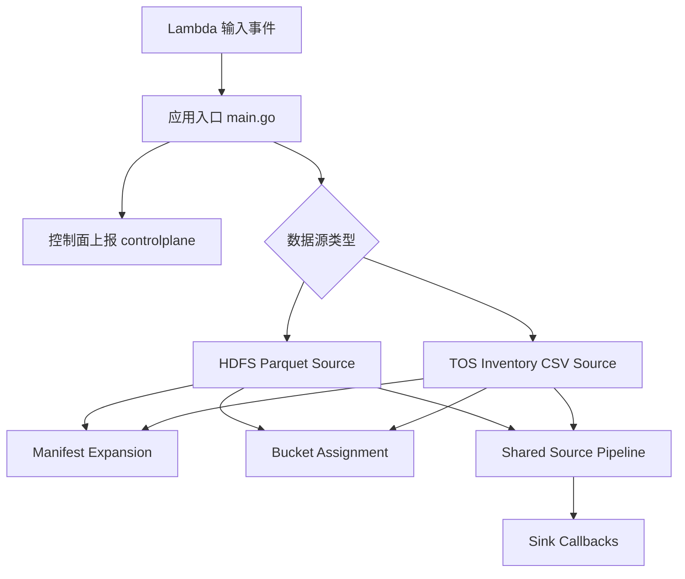

# uri_source_reader — Wiki

## 项目概览

`uri_source_reader` 是一个用于读取 URI 清单、展开媒体资源、按 bucket 分发并上报执行状态的 Go Lambda reader。它接收一次读取任务配置，从 HDFS Parquet 或 TOS Inventory CSV 中抽取对象 URI，将对象稳定映射到 bucket，再通过不同 sink 输出到本地文件、控制台或 Redis 路由的 writer RPC endpoint。

这个项目的主线很清晰：`main.go` 负责把外部事件标准化为任务配置，具体读取逻辑交给数据源模块，公共批处理能力由 source common 和 sink 承接，任务状态则由 control plane reporting 周期性上报。新开发者可以先从[应用入口 main.go](application-entry-point.md)理解任务如何被调度，再顺着数据源和 sink 读下去。



## 它解决什么问题

在视频架构场景中，上游清单通常来自不同存储和格式：有些是 HDFS 上的 Parquet 文件，有些是 TOS Inventory CSV；记录中可能直接是可处理对象，也可能是 HLS/DASH manifest，需要继续展开为实际分片对象。`uri_source_reader` 把这些差异收敛成统一的 `sink.Batch` 输出，让后续 writer 只关心“这一批对象属于哪个 bucket”。

分桶逻辑由[Bucket Assignment](bucket-assignment.md)集中实现，保证同一个 URI 在相同配置下总是落到同一个 bucket。媒体清单展开由[Manifest Expansion](manifest-expansion.md)复用，避免不同数据源各自实现 HLS/DASH 解析。最终输出层由[Sink Callbacks](sink-callbacks.md)统一承接，支持调试打印、本地文件写入、按 bucket 拆文件以及 Redis 路由写入。

## 端到端执行流程

一次任务从[Application Entry Point](application-entry-point.md)开始。`handler` 接收 Lambda `Input` 后调用 `Input.Normalize` 做参数校验和默认值填充，然后初始化 `Tracker`、`Client` 和 `Reporter`。这些对象来自[Control Plane Reporting](control-plane-reporting.md)，用于持续上报 reader 的心跳和读取进度。

随后入口根据 `SourceType` 路由到具体数据源：

- `SourceTypeHDFSParquet` 调用[HDFS Parquet Source](hdfs-parquet-source.md)的 `hdfsparquet.Run`
- `SourceTypeTOSInventoryCSV` 调用[TOS Inventory CSV Source](tos-inventory-csv-source.md)的 `tosinventorycsv.Run`

HDFS Parquet 路径会先解析 HDFS 文件列表，再读取目标列。读取列时会处理 Parquet schema 路径兼容问题，例如列路径匹配、路径片段规范化和历史路径格式修正。之后 `ParseURIFromBatches` 将行数据转换成对象记录，必要时通过 manifest 模块展开 `.m3u8` 或 `.mpd` 中引用的子对象，最后按 bucket 分组并交给 sink。

TOS Inventory CSV 路径会从 TOS 拉取 Inventory CSV 对象，在本地暂存后逐行解析。每行被转换成 `sink.ObjectRecord`，再按相同的 bucket 配置组装成 `sink.Batch`。这条链路同样可以复用 manifest 展开和共享批处理阶段。

两个数据源在后半段都会汇入[Shared Source Pipeline](shared-source-pipeline.md)。这里负责把源数据项转换为标准 batch，调用 `BatchCallback.OnBatch` 输出，并通过 `ProgressObserver` 汇报读取行数和 bucket 信息。它也统一处理 worker 并发和错误取消，避免不同 reader 重复实现批次消费逻辑。

## 核心模块如何协作

[HDFS Parquet Source](hdfs-parquet-source.md)是当前最复杂的数据源模块。它连接 HDFS 文件解析、Parquet 列读取、URI 抽取、manifest 展开和 bucket 分组，是理解完整读取链路的最佳入口之一。它与[Manifest Expansion](manifest-expansion.md)的关系尤其重要：当 Parquet 行中的对象是 HLS/DASH manifest 时，解析链路会调用 `Expand`，通过 `ObjectClient.GetObjectWithContext` 获取 manifest 内容，再交给 `media-parser-go` 解析出子 URI。

[TOS Inventory CSV Source](tos-inventory-csv-source.md)更轻量，重点在对象清单的读取和行解析。它与 HDFS 路径共享相同的分桶和 sink 输出模型，因此新增 sink 或调整 bucket 策略时，通常会同时影响两类数据源。

[Sink Callbacks](sink-callbacks.md)定义了输出边界。上游只生成 `sink.Batch`，具体写到哪里由 callback 决定。`RedisWriterCallback` 会根据 Redis 中的 bucket 路由选择 writer RPC endpoint；`BucketFileCallback` 则适合本地排查，因为它会按 bucket 拆分输出文件。

[Control Plane Reporting](control-plane-reporting.md)贯穿任务生命周期。入口初始化 reporter 后，读取过程中由 tracker 维护状态和累计进度，reporter 周期性发送心跳和进度；任务结束时再 flush 最终进度。控制面看到的是 reader worker 的存活状态、读取行数和 bucket 进展，而不是各个数据源的内部细节。

## 开发与运行基础

项目 Go module 为：

```text
code.byted.org/videoarch/uri_source_reader
```

当前 `go.mod` 使用 Go `1.25`，主要依赖包括 Lambda SDK、Hertz、Kitex、Redis、HDFS SDK、StorageGW 相关能力以及 `media-parser-go`。本地开发前需要确保 Go 版本匹配，并能访问内部 `code.byted.org` 依赖源。

常用入口可以参考[Other](other.md)中提到的 `Makefile` 和 `build.sh`。一般开发顺序是先运行测试确认基础链路，再按数据源或 sink 模块做局部修改。涉及读取行为时，优先补充对应数据源的测试；涉及输出格式或控制面进度时，同时检查 sink callback 和 reporter 的交互。