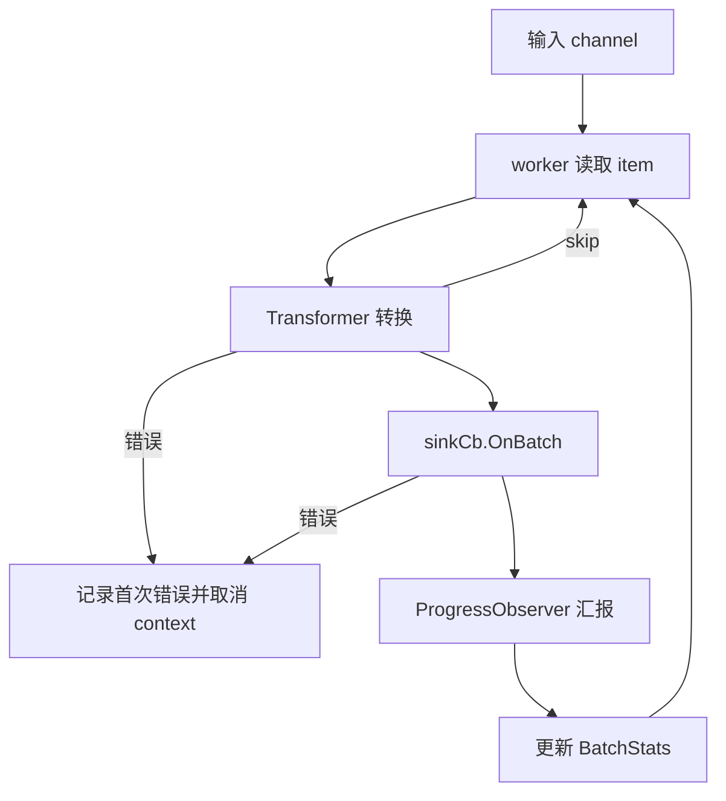
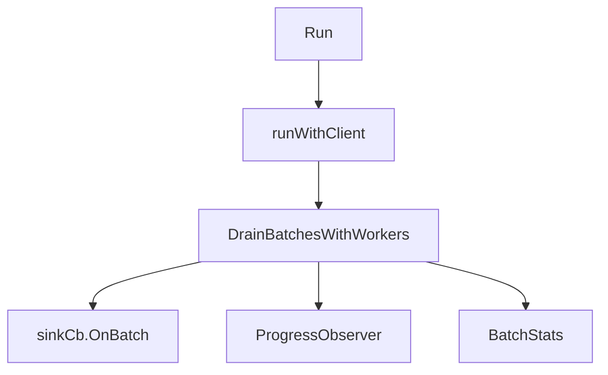

# Shared Source Pipeline

## 模块概览

`sourcecommon/sink_stage.go` 提供共享的“批次消费阶段”：从输入 channel 读取源数据项，将每个数据项转换成 `sink.Batch`，可选写入 `sink.BatchCallback`，并向进度观察者汇报读取行数和 bucket 信息。

它把不同数据源的共同行为集中起来，避免各个 reader 重复实现这些逻辑：

- 批次转换：通过泛型 `Transformer[T]` 适配不同输入类型。
- Sink 写入：通过 `sink.BatchCallback.OnBatch` 输出标准 `sink.Batch`。
- 进度汇报：通过 `ProgressObserver` 汇报行数和 bucket。
- 并发处理：通过 `DrainBatchesWithWorkers` 控制 worker 数量。
- 错误传播：首次错误会取消共享 context，并让其他 worker 尽快退出。

该模块当前被 `source/tosinventorycsv/reader.go` 和 `source/hdfsparquet/bucketer.go` 复用。

## 核心数据结构

### `ProgressObserver`

```go
type ProgressObserver interface {
	OnRowsRead(rows int)
	OnBucketsSeen(bucketIDs []int)
}
```

`ProgressObserver` 是批次处理阶段对外暴露的进度回调接口。

`DrainBatchesWithWorkers` 在一个批次成功转换并成功写入 sink 后调用：

```go
progress.OnRowsRead(envelope.Batch.ScannedRows)
progress.OnBucketsSeen(envelope.BucketIDs)
```

因此，进度只统计已经完成当前处理阶段的批次。若 `transform` 失败、返回 `skip`，或 `sinkCb.OnBatch` 失败，该批次不会触发进度回调。

### `BatchEnvelope`

```go
type BatchEnvelope struct {
	Batch     sink.Batch
	BucketIDs []int
}
```

`BatchEnvelope` 包装一个标准 `sink.Batch`，并附带排序后的 bucket ID 列表。`Batch.Buckets` 本身是 `map[int][]sink.ObjectRecord`，遍历顺序不稳定；`BucketIDs` 用于给进度观察者提供确定顺序的 bucket 列表。

推荐通过 `NewBatchEnvelope` 构造：

```go
func NewBatchEnvelope(batch sink.Batch) BatchEnvelope {
	return BatchEnvelope{
		Batch:     batch,
		BucketIDs: SortedBucketIDs(batch.Buckets),
	}
}
```

### `BatchStats`

```go
type BatchStats struct {
	ProcessedURIs    int
	ProcessedBatches int
}
```

`BatchStats` 是 drain 阶段的返回统计：

- `ProcessedBatches`：成功完成转换、sink 写入和进度汇报前置条件的批次数。
- `ProcessedURIs`：累加每个成功批次的 `Batch.ProcessedURIs`。

发生错误或 context 取消时，函数仍会返回已经完成的部分统计。

### `Transformer[T]`

```go
type Transformer[T any] func(item T) (BatchEnvelope, bool, error)
```

`Transformer[T]` 将输入 channel 中的元素转换为 `BatchEnvelope`。

返回值语义：

- `BatchEnvelope`：转换后的批次。
- `skip == true`：当前输入项被跳过，不写 sink，不汇报进度，不计入统计。
- `error != nil`：当前处理失败，触发整个 drain 阶段取消。

调用方负责在 transformer 中完成源格式到 `sink.Batch` 的转换。例如 TOS inventory CSV 的 `processFile` 会生成 `BatchEnvelope`，HDFS Parquet 的 `DivideIntoBuckets` 也会构造同样的输出结构。

## 执行流程



`DrainBatchesWithWorkers` 是主实现。`DrainBatches` 只是单 worker 版本的便捷封装：

```go
func DrainBatches[T any](
	ctx context.Context,
	in <-chan T,
	sinkCb sink.BatchCallback,
	progress ProgressObserver,
	transform Transformer[T],
) (BatchStats, error) {
	return DrainBatchesWithWorkers(ctx, in, sinkCb, progress, transform, 1)
}
```

### `DrainBatchesWithWorkers`

```go
func DrainBatchesWithWorkers[T any](
	ctx context.Context,
	in <-chan T,
	sinkCb sink.BatchCallback,
	progress ProgressObserver,
	transform Transformer[T],
	workers int,
) (BatchStats, error)
```

执行步骤：

1. 当 `workers <= 0` 时，自动降级为 `1`。
2. 基于传入的 `ctx` 创建可取消的子 context。
3. 启动指定数量的 worker goroutine。
4. 每个 worker 从 `in` 中读取 item。
5. 调用 `transform(item)` 生成 `BatchEnvelope`。
6. 若 `skip == true`，记录日志并继续读取下一个 item。
7. 若 `sinkCb != nil`，调用 `sinkCb.OnBatch(ctx, envelope.Batch)`。
8. 若 `progress != nil`，调用 `OnRowsRead` 和 `OnBucketsSeen`。
9. 使用 atomic 累加 `ProcessedBatches` 和 `ProcessedURIs`。
10. 所有 worker 退出后，返回统计和错误状态。

## 错误与取消语义

模块使用“首次错误优先”的策略：

```go
setFirstErr := func(err error) {
	if err == nil {
		return
	}
	errMu.Lock()
	if firstErr == nil {
		firstErr = err
		cancel()
	}
	errMu.Unlock()
}
```

当任意 worker 遇到 `transform` 错误或 `sinkCb.OnBatch` 错误时：

- 该错误会被保存为 `firstErr`。
- 共享 context 会被取消。
- 其他 worker 在下一次 `select` 时会通过 `ctx.Done()` 尽快退出。
- 最终返回已经完成的 `BatchStats` 和 `firstErr`。

如果没有业务错误，但外部 context 被取消，函数会返回当前统计和 `ctx.Err()`。

需要注意：`batchIndex` 在调用 `transform` 前递增，因此日志中的 `batch_index` 表示“开始处理过的输入项序号”，不等同于成功处理批次数。

## 并发模型

`DrainBatchesWithWorkers` 对共享计数使用 `sync/atomic`：

```go
atomic.AddInt64(&processedBatches, 1)
atomic.AddInt64(&processedURIs, int64(envelope.Batch.ProcessedURIs))
```

错误状态使用 `sync.Mutex` 保护，确保只有第一个错误被返回。

并发使用时需要关注两个调用方责任：

- `transform` 必须是并发安全的，或只访问当前 item 的局部状态。
- `sinkCb.OnBatch` 如果在多 worker 下被并发调用，其实现也必须是并发安全的。

如果 sink 实现不能并发写入，应使用 `DrainBatches` 或将 `workers` 设置为 `1`。

## Bucket ID 排序

`SortedBucketIDs` 用于从 `map[int][]sink.ObjectRecord` 提取稳定排序的 bucket ID：

```go
func SortedBucketIDs(buckets map[int][]sink.ObjectRecord) []int {
	ids := make([]int, 0, len(buckets))
	for bucketID := range buckets {
		ids = append(ids, bucketID)
	}
	sort.Ints(ids)
	return ids
}
```

这让 `ProgressObserver.OnBucketsSeen` 接收到的 bucket 列表具有确定顺序，便于测试、日志分析和进度聚合。

## 与代码库其他模块的关系

TOS inventory CSV 的主流程大致是：



已知调用关系包括：

- `source/tosinventorycsv/reader.go` 的 `runWithClient` 调用 `DrainBatchesWithWorkers`。
- `source/tosinventorycsv/reader.go` 的 `processFile` 调用 `NewBatchEnvelope`。
- `source/hdfsparquet/bucketer.go` 的 `DivideIntoBuckets` 调用 `DrainBatchesWithWorkers`、`BatchEnvelope` 和 `NewBatchEnvelope`。
- `sink/types.go` 提供 `sink.BatchCallback.OnBatch`，是该模块写出批次的下游接口。

## 扩展新数据源时的使用方式

新数据源通常只需要实现输入枚举和 transformer，然后复用 drain 阶段：

```go
stats, err := sourcecommon.DrainBatchesWithWorkers(
	ctx,
	inputCh,
	sinkCb,
	progress,
	func(item MyInput) (sourcecommon.BatchEnvelope, bool, error) {
		batch, skip, err := convertToSinkBatch(item)
		if err != nil || skip {
			return sourcecommon.BatchEnvelope{}, skip, err
		}
		return sourcecommon.NewBatchEnvelope(batch), false, nil
	},
	workers,
)
```

实现 transformer 时应保持以下约定：

- 无可处理数据时返回 `skip == true`，不要返回空批次。
- 转换失败时返回非空 error，让 drain 阶段统一取消。
- 成功时使用 `NewBatchEnvelope`，避免手动维护 `BucketIDs` 顺序。
- `Batch.ScannedRows` 和 `Batch.ProcessedURIs` 应准确填写，因为它们直接影响进度和最终统计。