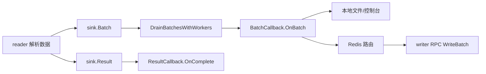

# Sink Callbacks

## 模块定位

`sink` 模块定义 URI 读取流程的输出回调层。上游 reader 将解析出的对象聚合成 `Batch`，再通过 `BatchCallback.OnBatch` 交给具体 sink；读取结束后通过 `ResultCallback.OnComplete` 写入汇总信息或执行收尾逻辑。

当前实现包含三类输出方式：

- `ConsolePrintCallback`：将每个 batch 的处理摘要打印到标准输出。
- `FileWriteCallback`：将 batch 摘要和最终 summary 写入单个文件。
- `BucketFileCallback`：按 bucket 拆分写入本地文件，每行一个 `StoreURI`。
- `RedisWriterCallback`：根据 Redis 中的 bucket 路由，将对象写入对应 writer RPC endpoint。



## 核心数据结构

### `ObjectRecord`

`ObjectRecord` 是 sink 层接收的最小对象记录：

```go
type ObjectRecord struct {
    StoreURI        string
    Size            int64
    StorageClass    string
    ContentType     string
    VID             string
    OID             string
    CreateTimestamp int64
}
```

HDFS Parquet 和 TOS inventory CSV reader 都会把原始输入转换成这个结构。`RedisWriterCallback` 会进一步把它转换成 `uri_writer.ObjectMeta`，字段映射由 `toObjectMetasWithBacking` 完成。

### `Batch`

`Batch` 表示一次送入 sink 的分桶结果：

```go
type Batch struct {
    FilePath      string
    ScannedRows   int
    ProcessedURIs int
    Buckets       map[int][]ObjectRecord
}
```

`Buckets` 的 key 是 bucket ID，value 是该 bucket 下的对象列表。多个实现都会通过 `sortedBucketIDs` 对 bucket ID 排序，保证输出顺序稳定。

### `Result`

`Result` 表示一次 reader 运行完成后的汇总：

```go
type Result struct {
    Files            []string
    ProcessedFiles   int
    ProcessedRows    int
    ProcessedURIs    int
    ProcessedBatches int
}
```

本地文件类 callback 会使用它写 summary；`RedisWriterCallback.OnComplete` 当前是 no-op，不会推动 writer finalize。

## 回调契约

`sink/types.go` 定义两个接口：

```go
type BatchCallback interface {
    OnBatch(ctx context.Context, batch Batch) error
}

type ResultCallback interface {
    OnComplete(ctx context.Context, result Result) error
}
```

上游通过接口调用 sink，不依赖具体实现。主要调用路径是：

- `source/sourcecommon.DrainBatchesWithWorkers` 调用 `OnBatch`。
- `source/tosinventorycsv.runWithClient` 和 `source/hdfsparquet.Run` 在读取完成后调用 `OnComplete`。
- `main.newSink` 根据启动参数创建具体 callback，例如 `NewBucketFileCallback` 或 `NewRedisWriterCallback`。

实现 callback 时需要注意：`OnBatch` 可能被并发调用，当前内置实现都通过 `sync.Mutex` 或 per-endpoint 队列保护共享状态。

## 本地输出实现

### `ConsolePrintCallback`

`ConsolePrintCallback.OnBatch` 输出一行 batch 摘要：

```text
processed batch file=<path> scanned_rows=<n> processed_uris=<n> buckets={0:10,1:8}
```

它只用于观察处理进度，不持久化对象 URI。内部使用 `mu sync.Mutex`，避免并发 worker 同时打印导致日志行交错。

### `FileWriteCallback`

`NewFileWriteCallback(path string)` 会使用 `os.Create` 创建或截断目标文件，并初始化 64 KiB 的 `bufio.Writer`。

`FileWriteCallback.OnBatch` 写入每个 batch 的摘要，格式与 `ConsolePrintCallback` 类似。`FileWriteCallback.OnComplete` 追加最终 summary：

```text
summary output_file=<path> processed_files=<n> processed_rows=<n> processed_uris=<n> processed_batches=<n>
```

`Close` 会先 `Flush`，再关闭底层文件。调用方应在 reader 结束后关闭 callback，确保缓冲数据落盘。

### `BucketFileCallback`

`NewBucketFileCallback(outputDir string)` 会创建输出目录，并为本次任务生成 `jobUUID`。每个 bucket 的输出文件名由 `fileName` 生成：

```go
part-%05d-%s_%05d.c000
```

例如 bucket 12 会写到类似：

```text
part-00012-<jobUUID>_00012.c000
```

`BucketFileCallback.OnBatch` 按 bucket ID 排序后处理，每个 `ObjectRecord` 只写入 `StoreURI`，一行一个 URI。文件按需打开，`getWriter` 使用 `os.OpenFile` 的 `O_CREATE|O_WRONLY|O_APPEND` 模式，因此同一个 callback 生命周期内的多批数据会追加到对应 bucket 文件。

`OnComplete` 会先刷新所有 bucket writer，再写入 `summary.txt`：

```text
processed_files=<n>
processed_rows=<n>
processed_uris=<n>
```

`Close` 会刷新并关闭所有已打开的 bucket 文件，然后清空 `files` 和 `writers` map。

## Redis Writer RPC 输出

`RedisWriterCallback` 是面向生产写入链路的 sink。它将 `Batch.Buckets` 按 Redis 中记录的 bucket-owner endpoint 分组，然后对每个 endpoint 调用 writer 服务的 `WriteBatch` RPC。

### 配置入口

构造函数是：

```go
func NewRedisWriterCallback(cfg RedisWriterCallbackConfig) (*RedisWriterCallback, error)
```

关键配置包括：

- `RedisCluster`：必填，Redis 集群名或直连地址列表。
- `RedisKeyPrefix`：必填，用于构造 bucket 路由 key。
- `WriterServiceName`：为空时默认 `"uri-writer"`。
- `BucketCount`：大于 0 时用于启动阶段预热 bucket endpoint。
- `EndpointBatchMaxWait`、`EndpointBatchMaxTasks`、`EndpointBatchMaxObjects`：控制同 endpoint 任务合批。
- `EndpointTaskQueueSize`：每个 endpoint 后台队列大小。
- `ReaderID`：非空时写入 `WriteBatchRequest.Base.Extra["reader_id"]`。
- `ConnectTimeout`、`RPCTimeout`、`RPCTimeoutRetries`：Kitex 客户端和 RPC 超时策略。
- `ReadRedisTimeout`、`ReadRedisRetries`：Redis 读取超时与重试。

默认值在 `NewRedisWriterCallback` 内集中填充。例如 `RPCTimeout` 默认 10 秒，`EndpointBatchMaxTasks` 默认 8，`EndpointBatchMaxObjects` 默认 120000。

### Redis 路由

bucket 路由 key 由 `bucketRedisKey` 生成：

```go
bucketRedisKey("prefix", 7) // "prefix:bucket:00007"
bucketRedisKey("", 7)       // "bucket:00007"
```

`lookupBucketEndpoint` 的流程是：

1. 先调用 `cachedBucketEndpoint` 查本地缓存。
2. 缓存未命中时通过 `redisGet` 读取 Redis。
3. 使用 `normalizeWriterEndpoint` 标准化 endpoint。
4. 调用 `cacheBucketEndpoint` 写入本地缓存。

如果配置了 `BucketCount`，构造阶段会执行 `prewarmBucketEndpoints`，按 `redisMGetBatchSize` 批量读取 bucket 路由，并提前为唯一 endpoint 创建 Kitex client。

### endpoint 分组与对象转换

`RedisWriterCallback.OnBatch` 先调用 `buildEndpointBatches`。该函数会：

1. 使用 `sortedBucketIDs` 稳定遍历 `batch.Buckets`。
2. 对每个非空 bucket 调用 `lookupBucketEndpoint`。
3. 按 endpoint 聚合成 `endpointBatch`。
4. 把 `ObjectRecord` 转换成 `uri_writer.DataRecord` 和 `uri_writer.ObjectMeta`。

转换逻辑在 `toObjectMetasWithBacking` 中完成。它使用调用方传入的 backing slice，减少每个对象单独分配的开销。

### endpoint 状态与合批执行

每个 writer endpoint 对应一个 `endpointState`。`endpointStateFor` 会复用已存在状态；首次访问时通过 `clientForEndpoint` 创建 Kitex client，再调用 `newEndpointState` 启动后台 goroutine。

`endpointState.submit` 将当前 endpoint 的 records 封装成 `endpointTask` 放入 `taskCh`，然后等待 `resultCh` 返回。后台 `run` 循环负责把多个 task 合并成一个 `endpointTaskGroup`：

- `drainAvailableTasks` 会立即尽量吸收队列中已有任务。
- `waitForNextTask` 会最多等待 `batchMaxWait`，争取和后续任务合批。
- 合批受 `batchMaxTasks` 和 `batchMaxObjects` 限制。
- 如果新任务超过限制，会作为 carry 留到下一轮处理。

合批完成后，`finishGroup` 调用 `executeGroup` 执行一次 RPC，并把同一个执行结果回传给 group 中的每个 task。

### RPC 写入与重试

`executeGroup` 构造请求：

```go
req := &uri_writer.WriteBatchRequest{
    SeqNo: seqNo,
    Batch: group.records,
}
```

`seqNo` 来自 `RedisWriterCallback.nextSequence`，使用 `atomic.Int64` 单调递增。

错误处理策略分为三类：

- RPC 调用错误：如果 `isRetryableWriteBatchRPCError` 判断为超时、连接关闭等可重试错误，并且未超过 `RPCTimeoutRetries`，等待 `retryableWriteBatchInterval` 后重试。
- `ErrorCode_RETRYABLE_ERROR`：最多重试 `retryableWriteBatchRetryCount` 次。
- `ErrorCode_BACK_PRESSURE`：使用指数退避，从 `backPressureInitialBackoff` 开始，最大到 `backPressureMaxBackoff`。

以下响应会直接返回错误：

- `ErrorCode_FATAL_ERROR`
- `ErrorCode_BUCKET_NOT_OWNED`
- 未识别的错误码
- 超过重试次数后的 `RETRYABLE_ERROR`

`ErrorCode_SUCCESS` 会记录 `ackSeqNo` 并返回成功。`OnBatch` 收集所有 endpoint 结果后，只要有任一 endpoint 失败，就返回第一个错误；成功的写入会通过 `recordSuccessfulWrite` 更新 `bucketTotals` 和 `bucketEndpoint`。

## 指标与慢 endpoint 日志

`RedisWriterCallback.OnBatch` 会为每批数据构造 `writerRPCBatchMetrics`，记录构建、状态查找、提交、RPC、重试、队列等待等耗时。

`logWriterRPCBatchMetrics` 输出 batch 级别日志，包含：

- endpoint 数量、record 数量、object 数量
- 成功和失败 endpoint 数
- RPC attempts、timeout retries、retryable retries、backpressure retries
- queue wait、RPC elapsed、submit elapsed 的 p50/p90/p95/max
- 慢 endpoint 分类计数

慢 endpoint 判断由 `isSlowEndpointMetrics` 完成，阈值是 `writerRPCSlowEndpointThreshold`，当前为 500 ms。`classifySlowEndpointMetrics` 会把慢点分类为：

- `queue_only`
- `rpc_only`
- `queue_rpc`
- `mixed`

`logWriterRPCSlowEndpointMetrics` 会按 `submitElapsed` 排序，最多输出 `writerRPCSlowEndpointLogLimit` 个慢 endpoint 的详细信息。

## 生命周期与资源释放

本地文件类 callback 都提供 `Close` 方法，但它不是接口的一部分。调用方如果持有具体类型或统一封装了关闭逻辑，需要显式调用它，否则 buffered writer 中的数据可能尚未完全落盘。

`RedisWriterCallback.Close` 会：

1. 关闭 Redis client。
2. 拷贝当前所有 `endpointState`。
3. 对每个 state 调用 `endpointState.close`。
4. `endpointState.close` 关闭 `taskCh` 并等待后台 `run` 退出。

`RedisWriterCallback.OnComplete` 当前不做任何事情。这意味着 writer RPC 的最终提交、finalize 或一致性确认不在这个 callback 中完成。新增相关语义时，应明确和 writer 服务的幂等、ack、重试策略配合。