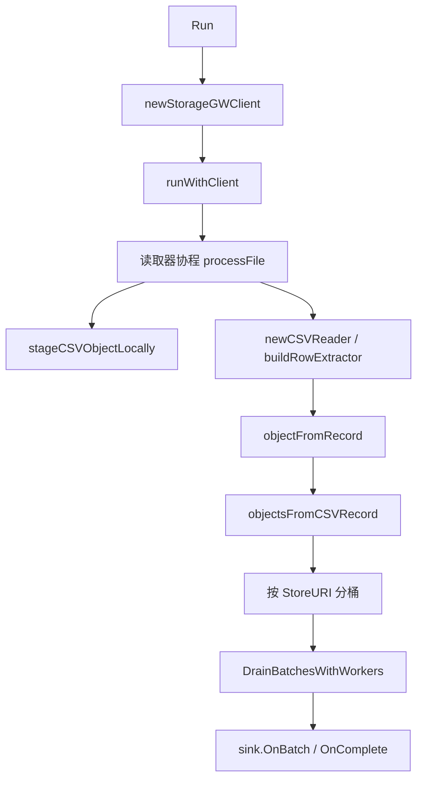

# TOS Inventory CSV Source

## 模块职责

`internal/source/tosinventorycsv` 从 TOS 上的 Inventory CSV 对象读取对象清单，将每一行转换为 `sink.ObjectRecord`，按 `sharedbucketing.Config` 计算桶号后组装成 `sink.Batch`，再交给下游 `sink.BatchCallback` 处理。

入口函数是 `Run(ctx, cfg)`。生产路径会创建 StorageGW 客户端并调用 `runWithClient`；测试路径直接使用 `runWithClient(ctx, cfg, client)` 注入假的 `storageGWObjectClient`。

## 整体执行流程

`runWithClient` 负责调度：
- `normalizeCSVURIs` 会去掉空字符串并排序，结果写入 `sink.Result.Files`。
- `ReaderWorkers` 控制并发读取 CSV 文件，默认 `1`，最多不会超过文件数。
- `SinkWorkers` 控制 `sourcecommon.DrainBatchesWithWorkers` 的并发消费数量，默认 `1`。
- `batchCh` 连接读取阶段和 sink 阶段，容量为 `max(ReaderWorkers, SinkWorkers)`。
- 任一文件读取失败或 sink 阶段失败时，会调用 `cancel()` 取消共享上下文。
- 如果 `cfg.Sink` 实现了 `io.Closer`，`runWithClient` 会在退出前关闭它。
- 如果 `cfg.Sink` 实现了 `sink.ResultCallback`，空文件列表和正常完成后都会调用 `OnComplete(ctx, result)`。

最终 `Result.ProcessedURIs` 和 `Result.ProcessedBatches` 以 `DrainBatchesWithWorkers` 返回的 `BatchStats` 为准，而不是仅读取阶段本地统计。

## 配置模型

核心配置类型是 `Config`：

- `CSVURIs`：TOS CSV 对象路径列表，格式由 `parseTOSObjectPath` 解析为 `bucket/key`。
- `Bucket`：当 CSV 没有直接提供 `StoreURIColumn` 时，用它和 `KeyColumn` 拼出 `store_uri`。
- `StoreURIColumn` / `KeyColumn`：对象 URI 来源。优先使用 `StoreURIColumn`；为空时必须提供 `KeyColumn`，并且 `Bucket` 不能为空。
- `SizeColumn`、`ContentTypeColumn`、`StorageClassColumn`、`CreateTimestampColumn`、`CreateTimeStrColumn`：可选元数据列。
- `CSVFormat.HasHeader`：为 `true` 时列配置按表头名称匹配；为 `false` 时列配置按从 `0` 开始的列下标解析。
- `CSVFormat.Compression`：支持空字符串、`none` 和 `gzip`。
- `TaskType`：空字符串表示按 CSV 原始对象输出；`manifest_expand` 会尝试展开媒体 manifest。
- `BatchRows`：每个 batch 累积的 CSV 有效行数，默认 `1000`。
- `Bucketing`：通过 `ComputeBucket(object.StoreURI)` 计算目标桶。
- `Sink`：下游 batch 回调，类型别名为 `sink.BatchCallback`。
- `Progress`：进度观察器，可接收文件、行数、桶等进度事件。

## CSV 读取与列选择

`newCSVReader` 使用 `bufio.NewReaderSize` 包一层 `1 MiB` 缓冲区，并创建标准库 `csv.Reader`：

- `FieldsPerRecord = -1`：允许每行字段数不一致。
- `ReuseRecord = true`：减少大 CSV 读取时的分配。
- gzip 文件通过 `gzip.NewReader` 包装，关闭函数只关闭 gzip reader；底层文件由调用方关闭。

`buildRowExtractor` 根据 `CSVFormat.HasHeader` 选择列解析方式：

- 有表头时，先读取第一行 header，构造 `map[string]int`，再由 `selectorFromHeader` 按列名查找。
- 无表头时，先读取第一条数据行作为 `firstRecord`，再由 `selectorFromIndex` 校验列下标范围，之后这条记录会被返回给 `processFile` 继续处理。
- 未配置的列会得到 `csvColumnSelector{index: -1}`，读取值时返回空字符串。

需要注意：`csvColumnSelector.required` 当前只被设置，没有在 `value` 或 `objectFromRecord` 中直接检查。实际必填约束主要由 `objectFromRecord` 对 `store_uri`、`key` 和 `bucket` 的逻辑保证。

## 行到对象的转换

`rowExtractor.objectFromRecord(record)` 负责把 CSV 行变成 `sink.ObjectRecord`：

1. 先读取 `storeURI`。
2. 如果 `storeURI` 为空，则读取 `key`，并用 `buildStoreURI(bucket, key)` 生成 `bucket/key`。
3. `Size` 通过 `parseOptionalInt64` 解析；空值为 `0`。
4. `CreateTimestamp` 通过 `parseCreateTimestamp` 解析：
   - 优先使用数值时间戳列。
   - 数值时间戳会通过 `normalizeUnixTimestampToSeconds` 归一化到秒，支持秒、毫秒、微秒、纳秒量级。
   - 如果没有数值时间戳，则按 `time.RFC3339Nano` 解析字符串时间列。
5. 直接保留 `StorageClass` 和 `ContentType` 字段原值。

`isBlankRecord` 会跳过所有字段都为空字符串的记录。

## 本地暂存与重试

CSV 对象不会直接流式解析，而是先由 `stageCSVObjectLocally` 下载到本地临时文件。这样做让后续 gzip/CSV 读取只面对本地文件，也便于失败时统一重试。

暂存流程：
- `parseTOSObjectPath` 把 `bucket/key` 拆成 `parsedTOSObjectPath`。
- `stageCSVObjectLocally` 最多尝试 `stageRetryMaxAttempts = 3` 次。
- 每次通过 `client.GetObjectWithContext(ctx, bucket, key, nil)` 获取对象。
- `stageObjectToLocalFile` 使用 `os.CreateTemp(resolveLocalTmpDir(ctx), tempFilePattern(key))` 创建临时文件。
- `copyToFileWithContext` 用 `1 MiB` buffer 拷贝，同时在每轮读取前检查 `ctx.Done()`。
- 暂存成功后返回 `stagedLocalFile`，调用方必须执行 `cleanup()` 删除临时文件。

`resolveLocalTmpDir` 优先使用 Lambda 上下文里的 `TempDir`，其次使用 `TmpfsDir`，否则回退到 `/tmp`。重试间隔由 `sleepWithContext(ctx, 200*time.Millisecond)` 控制，取消上下文会立即中断等待。

## Batch 生成与下游连接

`processFile` 内部按 bucket 聚合对象：

- 每条有效 CSV 行会先转成一个基础 `sink.ObjectRecord`。
- `objectsFromCSVRecord` 可能返回一个或多个对象。
- 每个对象用 `cfg.Bucketing.ComputeBucket(object.StoreURI)` 得到 bucket id。
- 当前文件内累积到 `BatchRows` 行后调用 `flush()`。
- 文件读完后会再 flush 一次剩余对象。

每次 flush 生成的 `sink.Batch` 包含：
- `FilePath`：当前 CSV 对象路径。
- `ScannedRows`：本 batch 覆盖的有效 CSV 行数，不是字节数。
- `ProcessedURIs`：本 batch 实际输出的对象数量。
- `Buckets`：`map[int][]sink.ObjectRecord`，按 bucket id 分组。

`sourcecommon.NewBatchEnvelope(batch)` 会把 batch 包装后送入 `batchCh`，再由 `sourcecommon.DrainBatchesWithWorkers` 调用下游 `OnBatch` 并汇总 `BatchStats`。

## Manifest 展开模式

`objectsFromCSVRecord(ctx, client, object, taskType)` 根据 `TaskType` 决定是否展开 manifest：

- 空字符串：直接返回当前 `object`。
- `TaskTypeManifestExpand`，即 `"manifest_expand"`：
  - 先用 `manifest.FormatFromContentType(object.ContentType)` 判断内容类型是否支持展开。
  - 不支持时返回 `ok=false`，该 CSV 行不会输出对象。
  - 支持时先保留原始 manifest 对象。
  - 再调用 `manifest.Expand(ctx, client, object.StoreURI, format)` 读取 manifest 内容并解析内部 URI。
  - 展开失败时吞掉错误，仍返回原始 manifest 对象。
  - 展开出的对象会设置 `StoreURI` 为子资源 URI，`OID` 为原 manifest 的 `StoreURI`，并继承 `CreateTimestamp`。
  - 最后通过 `dedupeObjectsByStoreURI` 去重并过滤空 URI。

这个调用链会进入 `internal/source/manifest`，由 `Expand` 创建 parser 和 index reader，并继续通过 StorageGW 读取 manifest 依赖的对象。

## 进度与统计

`ProgressObserver` 定义了四个事件：

- `OnFilesResolved(total int)`：`runWithClient` 完成 CSV URI 归一化后调用。
- `OnFileDone(filePath string, bytesRead int64)`：单个文件成功处理并 flush 后调用。当前传入的是 `stagedFile.objectSize`。
- `OnRowsRead(rows int)` 和 `OnBucketsSeen(bucketIDs []int)`：本模块没有直接调用，但会把 `cfg.Progress` 传给 `DrainBatchesWithWorkers`，由 sink 阶段统一上报 batch 进度。

文件级 `fileResult.rows` 统计的是有效 CSV 行数，`fileResult.uris` 统计的是分桶后的对象数；最终结果中的 URI 和 batch 数以 sink 阶段统计为准。

## 错误处理边界

常见错误来源包括：

- CSV URI 为空或不是 `bucket/key` 格式：`parseTOSObjectPath` 返回错误。
- StorageGW 客户端为空：`runWithClient` 返回 `storagegw client is nil`。
- 暂存失败：`stageCSVObjectLocally` 会包装为 `failed after 3 attempts`。
- 不支持的压缩格式：`newCSVReader` 返回 `unsupported csv compression`。
- 表头缺失、列名不存在、列下标非法或越界：`buildRowExtractor` 返回错误。
- 行数据缺少 `store_uri` 且无法通过 `bucket + key` 构造：`objectFromRecord` 返回错误。
- `TaskType` 不是空字符串或 `manifest_expand`：`objectsFromCSVRecord` 返回错误。
- 下游 sink 返回错误：`DrainBatchesWithWorkers` 的错误会取消上下文，并在文件阶段没有更早错误时作为最终错误返回。

Manifest 展开是一个有意放宽的边界：`manifest.Expand` 失败不会使 CSV 行失败，而是退回只输出原始 manifest 对象。

## 贡献时的注意点

修改读取路径时要同时关注三类测试入口：`runWithClient` 的端到端行为、`stageCSVObjectLocally` 的重试和临时文件清理、`newCSVReader` 的大文件读取特性。这个模块已经通过 `ReaderWorkers` 和 `SinkWorkers` 分离了文件读取并发与 sink 写入并发，新增逻辑应避免在 `processFile` 中引入共享可变状态。

如果新增 CSV 字段，优先扩展 `Config`、`buildRowExtractor` 和 `rowExtractor.objectFromRecord` 这条链路；如果新增任务类型，集中扩展 `objectsFromCSVRecord`，并明确失败时是阻断整行还是退回原始对象。