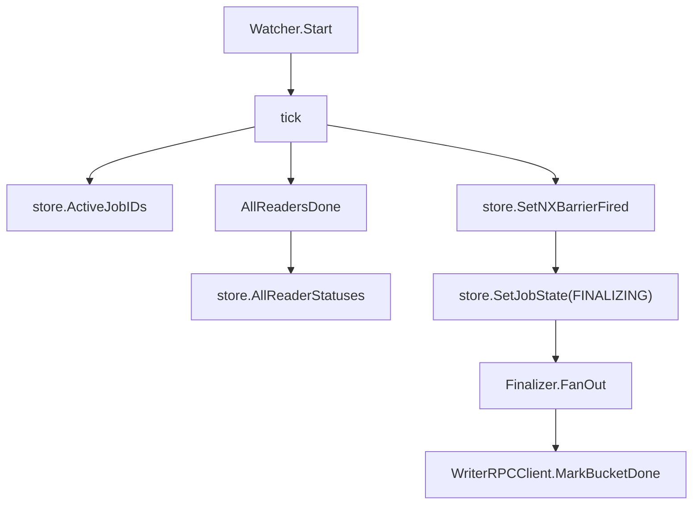

# Barrier and Finalization

## 模块定位

Barrier and Finalization 模块负责在一个 job 的所有 Reader 都完成后，触发 Writer 侧收尾动作。

核心流程是：

1. `barrier.Watcher.Start` 周期扫描活跃 job。
2. `barrier.AllReadersDone` 判断某个 job 下的 reader 集合是否非空且全部为 `types.WorkerStateDone`。
3. `store.SetNXBarrierFired` 用 Redis `SETNX` 语义保证同一个 job 的 barrier 只触发一次。
4. job 状态被推进到 `types.JobStateFinalizing`。
5. 注入的 `finalizer.Finalizer.FanOut` 按 bucket 调用 Writer 服务的 `MarkBucketDone`。



## `internal/barrier`

`internal/barrier` 维护 Reader-Done Barrier 的后台协程。它不直接依赖 Writer RPC，而是通过本包定义的接口注入最终动作：

```go
type Finalizer interface {
	FanOut(ctx context.Context, jobID string) error
}
```

当前实际实现由 `internal/finalizer.Finalizer` 提供，并在 `cmd/main.go` 中组装。

### `Watcher`

`Watcher` 是 barrier 的运行实体：

```go
type Watcher struct {
	st        *store.Store
	cfg       *config.Config
	finalizer Finalizer
}
```

通过 `New(st, cfg, fin)` 构造。`Watcher` 本身只持有三类依赖：

- `store.Store`：读取活跃 job、reader 状态，并写入 barrier/job 状态。
- `config.Config`：读取 barrier 检查间隔。
- `Finalizer`：barrier 触发后的 fan-out 动作。

### `Start`

`Start(ctx)` 是阻塞式后台循环，通过 `ctx.Done()` 停止：

```go
func (w *Watcher) Start(ctx context.Context)
```

检查间隔来自 `cfg.Barrier.CheckIntervalSec`，当配置小于等于 0 时回退到 `10s`。每次 ticker 触发后调用 `w.tick(ctx)`。

这个函数适合在服务启动阶段以 goroutine 形式运行，例如由 `cmd/main.go` 创建 `Watcher` 后启动。

### `tick`

`tick(ctx)` 是单轮扫描逻辑：

1. 调用 `w.st.ActiveJobIDs(ctx)` 获取当前活跃 job。
2. 对每个 `jobID` 调用 `AllReadersDone(ctx, w.st, jobID)`。
3. 若 reader 全部完成，调用 `w.st.SetNXBarrierFired(ctx, jobID)`。
4. 只有 `SetNXBarrierFired` 返回 `ok == true` 时才继续执行 fan-out。
5. 写入 `types.JobStateFinalizing`。
6. 调用 `w.finalizer.FanOut(ctx, jobID)`。

`SetNXBarrierFired` 是这里的幂等关键点。即使多个 control panel 实例同时运行，只有一个实例能成功设置 `cp:job:{jobId}:barrier_fired`，从而避免重复触发 Writer fan-out。

需要注意：`SetJobState` 的错误被忽略，`FanOut` 的错误只记录日志，不会重试整个 barrier。真正的调用重试发生在 finalizer 内部的单个 bucket dispatch 上。

### `AllReadersDone`

```go
func AllReadersDone(ctx context.Context, st *store.Store, jobID string) bool
```

判定规则非常保守：

- `st.AllReaderStatuses(ctx, jobID)` 出错，返回 `false`。
- reader 状态集合为空，返回 `false`。
- 只要有任意 reader 状态不是 `types.WorkerStateDone`，返回 `false`。
- 只有集合非空且全部为 `types.WorkerStateDone`，返回 `true`。

根据执行流，`AllReaderStatuses` 会继续读取 `KeyReaders` 对应集合，并通过 store 内部的 `effectiveWorkerStatus`、`isTerminalWorkerStatus` 计算有效 worker 状态。因此 barrier 依赖的是 store 层归一化后的 reader 状态，而不是直接扫描原始字段。

## `internal/finalizer`

`internal/finalizer` 在 barrier 触发后负责对 Writer 服务做 bucket 级 fan-out。它不直接创建 Writer RPC 客户端，而是依赖接口：

```go
type WriterRPCClient interface {
	MarkBucketDone(ctx context.Context, endpoint string, bucketID int) error
}
```

这样可以避免 `finalizer` 与 `writerrpc` 之间形成包循环，也便于测试时注入 mock。

### `Finalizer`

```go
type Finalizer struct {
	st  *store.Store
	cfg *config.Config
	rpc WriterRPCClient
}
```

通过 `New(st, cfg, rpc)` 构造。构造函数会显式校验依赖：

- `st == nil` 返回 `finalizer: nil store`
- `cfg == nil` 返回 `finalizer: nil config`
- `rpc == nil` 返回 `finalizer: nil WriterRPCClient`

这意味着服务启动时必须注入真实可用的 Writer RPC 实现，不能静默退化为空实现。

### `FanOut`

```go
func (f *Finalizer) FanOut(ctx context.Context, jobID string) error
```

`FanOut` 是 finalization 的核心入口。执行过程如下：

1. 调用 `f.st.BucketAssignAll(ctx, jobID)` 获取 job 的 bucket 分配。
2. 如果读取失败，直接返回错误。
3. 如果分配为空，返回 `empty bucket_assign`。
4. 提取所有 bucket ID 并使用 `sort.Ints` 排序。
5. 按 `cfg.Fanout.Concurrency` 控制并发，默认值为 `64`。
6. 对每个 bucket 启动 goroutine：
   - 调用 `f.st.RouterEndpoint(ctx, jobID, bid)` 找到 Writer endpoint。
   - endpoint 为空时记录 warn，并计入 `dispatchFailed`。
   - 调用 `f.callWithRetry(ctx, endpoint, bid)`。
   - 调用失败时记录 error，并计入 `dispatchFailed`。
7. 等待全部 goroutine 完成后记录汇总日志。

bucket ID 排序保证 dispatch 的启动顺序稳定，但由于实际调用是并发 goroutine，Writer 侧接收顺序不保证严格递增。

一个重要行为是：`FanOut` 会统计并记录 `dispatch_failed`，但在部分 bucket dispatch 失败时仍返回 `nil`。当前只有 `BucketAssignAll` 失败或 bucket 分配为空会让 `FanOut` 返回错误。调用方 `barrier.tick` 也只记录 `FanOut` 返回的错误，不会基于 `dispatch_failed` 做二次处理。

### `callWithRetry`

```go
func (f *Finalizer) callWithRetry(ctx context.Context, endpoint string, bucketID int) error
```

`callWithRetry` 封装单个 bucket 的 Writer RPC 调用：

- 最大重试次数来自 `cfg.Fanout.MaxRetries`，默认 `3`。
- 单次 RPC 超时来自 `cfg.WriterRPC.TimeoutMs`，默认 `3s`。
- 每次调用使用 `context.WithTimeout(ctx, timeout)`。
- 调用目标是 `f.rpc.MarkBucketDone(callCtx, endpoint, bucketID)`。
- 失败后使用指数退避：`200ms`, `400ms`, `800ms`...
- 每次退避额外加入 `0-50ms` 抖动。
- 如果外层 `ctx` 在退避期间取消，立即返回 `ctx.Err()`。

`maxRetries` 表示总尝试次数，不是“失败后的额外重试次数”。例如配置为 `3` 时最多调用 `MarkBucketDone` 三次。

## 幂等性与状态推进

Barrier 的一次性语义由 store 层的 `SetNXBarrierFired` 提供。`tick` 中只有成功设置 barrier fired 标记的实例才会进入 finalization：

```go
ok, err := w.st.SetNXBarrierFired(ctx, jobID)
if err != nil {
	// 记录错误并跳过
}
if !ok {
	// 已有其他实例触发过
}
```

成功触发后，`Watcher` 会把 job 状态写为 `types.JobStateFinalizing`，再执行 `Finalizer.FanOut`。这说明 job 状态推进发生在 fan-out 之前，而不是所有 Writer RPC 成功之后。

## 错误处理模型

这个模块整体采用“后台任务记录日志并继续扫描”的模式：

- `ActiveJobIDs` 失败：本轮扫描结束。
- `AllReaderStatuses` 失败：该 job 被视为未完成。
- `SetNXBarrierFired` 失败：该 job 本轮跳过。
- `SetJobState` 失败：错误被忽略，仍继续 fan-out。
- `FanOut` 返回错误：barrier 记录 error，但 fired 标记已经写入。
- 单个 bucket dispatch 失败：finalizer 记录 error 并计数，不影响其他 bucket。

贡献代码时需要特别注意：`barrier_fired` 一旦写入，后续 `tick` 不会再次触发同一个 job 的 fan-out。若要改变失败恢复语义，需要同时设计 fired 标记、job 状态和 bucket dispatch 失败的补偿策略。

## 与代码库其他部分的连接

`cmd/main.go` 负责组装依赖：

- 创建 `internal/finalizer.Finalizer`。
- 创建 `internal/barrier.Watcher`。
- 调用 `Watcher.Start` 启动后台扫描。

`internal/store` 提供 barrier 和 finalizer 所需的状态访问能力：

- `ActiveJobIDs`
- `AllReaderStatuses`
- `SetNXBarrierFired`
- `SetJobState`
- `BucketAssignAll`
- `RouterEndpoint`

`internal/types` 提供状态常量：

- `types.WorkerStateDone`
- `types.JobStateFinalizing`

Writer RPC 的真实实现位于 `internal/writerrpc`，但 `finalizer` 只知道 `WriterRPCClient` 接口，从而保持包依赖方向清晰。