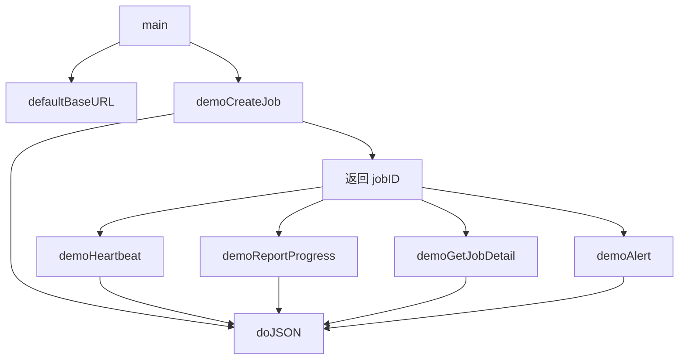

# Client Example

## 模块定位

`examples/hertz_client` 是 `uri_task_control_panel` 控制面的 Hertz HTTP 客户端调用示例。它不是服务端运行时的一部分，而是一个可执行 demo，用于验证控制面 API 的 happy path：

1. 创建 Job：`POST /api/v1/jobs`
2. 上报 Writer 心跳：`POST /api/v1/heartbeat`
3. 上报 Writer bucket 进度：`POST /api/v1/report_progress`
4. 查询 Job 聚合详情：`GET /api/v1/jobs/{job_id}`
5. 上报告警：`POST /api/v1/alert`

该模块集中展示了两类接入方式：

- 如何用 Hertz `client.Client` 调用控制面 HTTP API。
- 如何复用 `internal/types` 中的 DTO 结构构造请求和解析响应。

## 运行方式

默认访问本地控制面服务：

```bash
go run ./examples/hertz_client
```

通过环境变量指定服务地址：

```bash
BASE_URL=http://uri-task-control-panel.bytedance.net go run ./examples/hertz_client
```

通过命令行参数指定服务地址：

```bash
go run ./examples/hertz_client -base-url http://127.0.0.1:8090
```

`defaultBaseURL()` 会优先读取 `BASE_URL` 环境变量；如果未设置，则回退到 `http://127.0.0.1:8090`。

## 执行流程

`main()` 是唯一入口，负责创建 Hertz client、设置全局超时上下文，并串行执行五个 demo 函数。前一步的输出会影响后续步骤：`demoCreateJob()` 返回的 `jobID` 会传入心跳、进度、详情查询和告警上报。



`main()` 使用：

```go
ctx, cancel := context.WithTimeout(context.Background(), 15*time.Second)
```

因此整个 demo 链路共享 15 秒超时。任一步骤返回错误时都会通过 `logs.Fatal` 终止进程。

## 响应 Envelope 解析

控制面接口统一返回类似结构：

```json
{
  "code": 0,
  "message": "ok",
  "data": {}
}
```

客户端用本地 `Envelope` 对应服务端响应结构：

```go
type Envelope struct {
    Code    int             `json:"code"`
    Message string          `json:"message"`
    Data    json.RawMessage `json:"data,omitempty"`
}
```

`Data` 使用 `json.RawMessage` 延迟解析，原因是不同接口的 `data` 结构不同，例如：

- `types.CreateJobResponse`
- `types.HeartbeatResponse`
- `types.ProgressResponse`
- `types.JobDetailResponse`
- `map[string]bool`

泛型函数 `parseEnvelope[T any]` 封装了解析逻辑：

```go
env, data, err := parseEnvelope[types.CreateJobResponse](raw)
```

它按顺序完成三件事：

1. 将 HTTP body 解析为 `Envelope`。
2. 检查 `env.Code`，非 `0` 时返回业务错误。
3. 如果 `data` 非空且不是 `null`，再反序列化为调用方指定的类型 `T`。

这让每个 demo 函数只需要关心自己的响应 DTO，而不用重复处理统一响应壳。

## HTTP 调用封装

`doJSON()` 是本模块唯一的 HTTP helper：

```go
func doJSON(ctx context.Context, cli *client.Client, method, url string, body []byte) ([]byte, error)
```

它完成以下工作：

- 使用 `protocol.AcquireRequest()` 和 `protocol.AcquireResponse()` 获取 Hertz 协议对象。
- 设置 HTTP method、URL 和 `application/json` content type。
- 当 `body` 非空时设置请求体。
- 调用 `cli.Do(ctx, req, resp)` 发送请求。
- 要求 HTTP status 必须是 `200 OK`。
- 复制响应 body 后返回，避免 `ReleaseResponse()` 后底层内存被复用。

由于 `doJSON()` 只返回原始 body，业务响应解析统一交给 `parseEnvelope[T]`。这种拆分让 HTTP 传输错误、HTTP 状态码错误和业务码错误分别在不同层处理。

## Job 创建示例

`demoCreateJob()` 构造 `types.CreateJobRequest`，调用：

```go
POST {base}/api/v1/jobs
```

请求中覆盖了控制面创建任务所需的主要配置：

- `SourceType`: 使用 `types.SourceTypeHDFSParquet`
- `Source`: 通过 `types.SourceSpec` 描述 HDFS 输入路径、文件 glob 和 URI 字段提取规则
- `Output`: 通过 `types.OutputSpec` 描述 HDFS 输出目录和分区
- `Bucketing`: 使用 `types.BucketingSpec` 配置 bucket 数、hash 算法和 seed
- `Concurrency`: 使用 `types.ConcurrencySpec` 配置 writer/reader 数量
- `ReaderRuntime`: 使用 `types.ReaderRuntimeSpec` 和 `types.ReaderLimitsSpec` 配置 reader worker 限制
- `Sink`: 使用 `types.ReaderSinkSpec` 配置 reader 到 writer 的 RPC sink，以及 Redis 队列信息

响应解析为 `types.CreateJobResponse`：

```go
env, data, err := parseEnvelope[types.CreateJobResponse](raw)
```

函数会校验 `data.JobID` 非空，并将其返回给后续 demo 步骤。这里的 `jobID` 是整个示例链路的关键上下文。

## Writer 心跳示例

`demoHeartbeat()` 构造 `types.HeartbeatRequest`，调用：

```go
POST {base}/api/v1/heartbeat
```

请求模拟一个 Writer 实例存活上报：

```go
types.HeartbeatRequest{
    JobID:     jobID,
    Kind:      "writer",
    WriterID:  "writer-demo-0",
    IP:        "127.0.0.1",
    Port:      9100,
    Buckets:   []int32{0, 1, 2, 3},
    Timestamp: time.Now().UTC(),
}
```

响应解析为 `types.HeartbeatResponse`，主要读取 `NextIntervalSec`，用于展示服务端建议的下一次心跳间隔。

## 进度上报示例

`demoReportProgress()` 构造 `types.ProgressRequest`，调用：

```go
POST {base}/api/v1/report_progress
```

它模拟 Writer 对单个 bucket 的处理进度上报。核心字段在 `types.BucketProgress` 中：

- `BucketID`
- `Status`
- `TotalUrisReceived`
- `BytesReceived`
- `RunFilesGenerated`
- `PeakLocalDiskUsageMb`
- `MergeProgress`
- `HDFSWriteProgress`
- `LastUpdateTime`

响应解析为 `types.ProgressResponse`，并读取 `Ack` 表示服务端确认收到进度。

## Job 详情查询示例

`demoGetJobDetail()` 调用：

```go
GET {base}/api/v1/jobs/{job_id}
```

该接口不需要请求体，因此传给 `doJSON()` 的 body 为 `nil`：

```go
raw, err := doJSON(ctx, cli, consts.MethodGet, url, nil)
```

响应解析为 `types.JobDetailResponse`，示例日志会输出：

- `data.State`
- `data.Summary.BucketsTotal`
- `len(data.Writers)`
- `len(data.Readers)`

这个步骤用于确认前面创建任务、心跳和进度上报是否已经反映到聚合详情中。

## 告警上报示例

`demoAlert()` 构造 `types.AlertRequest`，调用：

```go
POST {base}/api/v1/alert
```

请求模拟 Writer 异常告警：

```go
types.AlertRequest{
    JobID:     jobID,
    Kind:      "writer",
    WriterID:  "writer-demo-0",
    Message:   "demo alert from hertz_client example",
    Timestamp: time.Now().UTC(),
}
```

响应的业务 `data` 是简单对象 `{ "ack": true }`，因此解析为：

```go
env, data, err := parseEnvelope[map[string]bool](raw)
```

这里展示了 `parseEnvelope[T]` 不要求响应一定是强类型 DTO；当接口响应很简单时，也可以直接使用 map。

## 与代码库其他模块的关系

`examples/hertz_client` 依赖 `internal/types` 中定义的请求和响应 DTO，而不是自己声明 API schema。这保证示例客户端与服务端控制面接口共享同一套字段定义。

主要依赖关系包括：

- `types.CreateJobRequest`
- `types.CreateJobResponse`
- `types.SourceSpec`
- `types.SourceExtractSpec`
- `types.OutputSpec`
- `types.BucketingSpec`
- `types.ConcurrencySpec`
- `types.ReaderRuntimeSpec`
- `types.ReaderLimitsSpec`
- `types.ReaderSinkSpec`
- `types.ReaderSinkRedisSpec`
- `types.HeartbeatRequest`
- `types.HeartbeatResponse`
- `types.ProgressRequest`
- `types.ProgressResponse`
- `types.BucketProgress`
- `types.JobDetailResponse`
- `types.AlertRequest`

当控制面 API DTO 发生字段变更时，这个 example 通常也需要同步调整。它可以作为手动联调入口，也可以作为开发者理解控制面 API 调用顺序的最小参考实现。

## 扩展建议

新增接口示例时，建议沿用当前模式：

```go
func demoSomething(ctx context.Context, cli *client.Client, base string, jobID string) error {
    req := types.SomeRequest{
        JobID: jobID,
    }
    body, _ := json.Marshal(req)

    raw, err := doJSON(ctx, cli, consts.MethodPost, base+"/api/v1/something", body)
    if err != nil {
        return err
    }

    env, data, err := parseEnvelope[types.SomeResponse](raw)
    if err != nil {
        return err
    }

    logs.Info("[hertz_client] something ok code=%d msg=%s data=%v", env.Code, env.Message, data)
    return nil
}
```

保持三个约定：

1. 请求结构优先使用 `internal/types` 中已有 DTO。
2. HTTP 调用统一走 `doJSON()`。
3. Envelope 响应统一用 `parseEnvelope[T]` 解析。