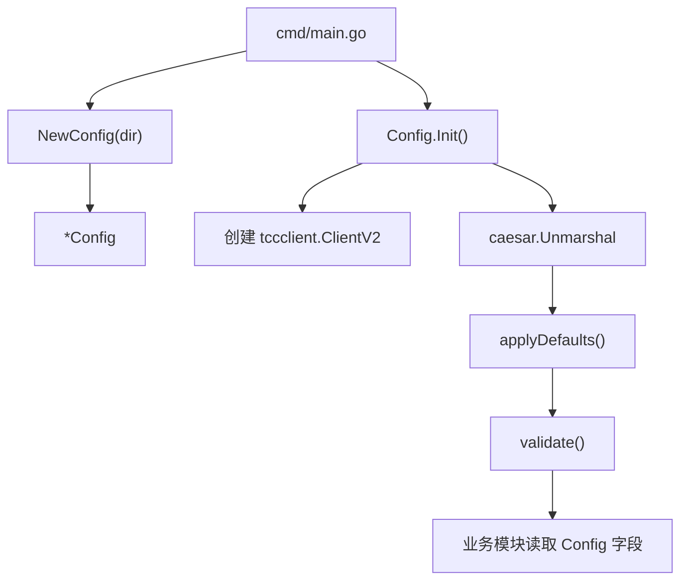

# Configuration

## 配置模块

配置模块位于 `internal/config/config.go`，负责加载 `uri_task_control_panel` 的运行期配置，并为 Redis、心跳、Barrier、fan-out、Job、Writer RPC、Lambda 和 StorageGW 等子系统提供统一配置入口。

该模块的核心类型是 `Config`，核心生命周期是：

1. `NewConfig(dir)` 创建未初始化的配置对象。
2. `(*Config).Init()` 连接 TCC，并通过 `caesar.Unmarshal` 合并本地 YAML 与 TCC 配置。
3. `applyDefaults()` 补齐历史配置缺失字段。
4. `validate()` 校验关键字段，避免服务以危险的零值启动。



## 设计目标

配置加载遵循 `videoarch/asuna` 风格：

- 本地配置作为基线兜底：`conf/base.yml` 和 `conf/{PSM}.yaml`
- TCC 提供在线下发与热更新配置源
- `caesar_config/v4` 负责本地 YAML 与 TCC 值的合并反序列化
- 模块自身只维护结构定义、默认值和合法性校验

历史版本曾基于环境变量加载配置，当前实现已经切换到本地 YAML + TCC 的组合方式。环境变量仍用于确定当前服务身份，例如 `env.PSM()` 和 `env.Cluster()`。

## 核心类型

### `Config`

`Config` 是控制面的顶层运行期配置对象：

```go
type Config struct {
    dir string

    Redis     Redis     `yaml:"Redis"`
    Heartbeat Heartbeat `yaml:"Heartbeat"`
    Barrier   Barrier   `yaml:"Barrier"`
    Fanout    Fanout    `yaml:"Fanout"`
    Job       Job       `yaml:"Job"`
    WriterRPC WriterRPC `yaml:"WriterRPC"`
    Lambda    Lambda    `yaml:"Lambda"`
    StorageGW StorageGW `yaml:"StorageGW"`

    tcc *tccclient.ClientV2
}
```

字段分为三类：

- `dir`：本地配置目录，由 `NewConfig(dir)` 注入，供 `caesar.WithLocalBase(c.dir)` 使用。
- 导出的子配置结构：业务模块通过这些字段读取运行参数。
- `tcc`：TCC 客户端实例，由 `Init()` 创建并保存。

`Config` 本身不封装 getter 方法，代码中直接读取结构字段。测试代码也按需直接构造 `Config`、`Heartbeat`、`Job`、`Barrier`、`Fanout`、`WriterRPC`、`StorageGW` 等结构。

### `Redis`

Redis 连接配置：

```go
type Redis struct {
    Cluster  string   `yaml:"Cluster"`
    Addrs    []string `yaml:"Addrs"`
    Password string   `yaml:"Password"`
    DB       int      `yaml:"DB"`
}
```

`Redis.Cluster` 是 `kv/goredis v5` 注册的集群名或 consul PSM。配置了 `Addrs` 时，`Cluster` 只作为 metrics tag 使用，不再依赖 consul 服务发现。

`validate()` 要求 `Redis.Cluster` 和 `Redis.Addrs` 至少配置一个：

```go
if c.Redis.Cluster == "" && len(c.Redis.Addrs) == 0 {
    return errors.New("Redis.Cluster and Redis.Addrs are both empty")
}
```

### `Heartbeat`

心跳相关阈值：

```go
type Heartbeat struct {
    TTLSec          int `yaml:"TTLSec"`
    NextIntervalSec int `yaml:"NextIntervalSec"`
}
```

默认值：

- `TTLSec`: `90`
- `NextIntervalSec`: `30`

这些字段会被 barrier、collector、store 相关逻辑使用。测试中 `internal/barrier/barrier_test.go`、`internal/api/handlers_test.go`、`internal/collector/collector_test.go` 和 `internal/finalizer/finalizer_test.go` 都直接构造或读取该配置。

### `Barrier`

Reader-Done Barrier 后台扫描配置：

```go
type Barrier struct {
    CheckIntervalSec int `yaml:"CheckIntervalSec"`
}
```

默认值：

- `CheckIntervalSec`: `10`

`internal/barrier` 的 watcher 流程依赖该扫描间隔。

### `Fanout`

fan-out 执行 `MarkBucketDone` 的并发与重试配置：

```go
type Fanout struct {
    Concurrency int `yaml:"Concurrency"`
    MaxRetries  int `yaml:"MaxRetries"`
}
```

默认值：

- `Concurrency`: `64`
- `MaxRetries`: `3`

`internal/finalizer` 的 fan-out 测试会构造该配置，用于验证缺失 endpoint 或 RPC 失败时不会错误标记 bucket 失败。

### `Job`

Job 元数据配置：

```go
type Job struct {
    TTLSec int `yaml:"TTLSec"`
}
```

默认值：

- `TTLSec`: `604800`

该值用于 Job 元数据 TTL，当前默认等于 7 天。

### `WriterRPC`

调用 Writer 服务的 KiteX 客户端配置：

```go
type WriterRPC struct {
    PSM       string `yaml:"PSM"`
    TimeoutMs int    `yaml:"TimeoutMs"`
}
```

`PSM` 是 Kitex 逻辑服务名，例如 `bytedance.videoarch.uri_writer`。fan-out 实际会通过 `WithHostPorts(endpoint)` 精确路由，不依赖服务发现。

默认值：

- `TimeoutMs`: `3000`

`validate()` 要求：

- `WriterRPC.TimeoutMs > 0`
- `WriterRPC.PSM` 非空

### `Lambda`

创建 Reader/Writer FaaS 实例所需的网关参数：

```go
type Lambda struct {
    GatewayURL           string `yaml:"GatewayURL"`
    ReaderFunction       string `yaml:"ReaderFunction"`
    WriterFunction       string `yaml:"WriterFunction"`
    Qualifier            string `yaml:"Qualifier"`
    InvokeType           string `yaml:"InvokeType"`
    TimeoutMs            int    `yaml:"TimeoutMs"`
    ControlPlaneEndpoint string `yaml:"ControlPlaneEndpoint"`
    ControlPlanePSM      string `yaml:"ControlPlanePSM"`
    ControlPlaneCluster  string `yaml:"ControlPlaneCluster"`
}
```

默认值：

- `GatewayURL`: `https://boe-v-lambda.bytedance.net/lambda/apis/gateway/v1/invoke`
- `ReaderFunction`: `uri_source_reader`
- `WriterFunction`: `uri_writer`
- `Qualifier`: `prod`
- `InvokeType`: `async`
- `TimeoutMs`: `5000`
- `ControlPlanePSM`: `env.PSM()`
- `ControlPlaneCluster`: `env.Cluster()`

`ControlPlaneEndpoint` 没有默认值，也没有在 `validate()` 中强制非空。

### `StorageGW`

TOS root 扫描使用的存储网关配置：

```go
type StorageGW struct {
    AccessKey    string `yaml:"AccessKey"`
    SecretKey    string `yaml:"SecretKey"`
    PSM          string `yaml:"PSM"`
    Cluster      string `yaml:"Cluster"`
    IDC          string `yaml:"IDC"`
    ListPageSize int    `yaml:"ListPageSize"`
}
```

默认值：

- `PSM`: `env.PSM()`
- `ListPageSize`: `1000`

`validate()` 要求：

- `StorageGW.PSM` 非空
- `StorageGW.ListPageSize > 0`
- `StorageGW.AccessKey` 和 `StorageGW.SecretKey` 必须同时配置或同时为空

文件扫描相关测试会直接使用 `StorageGW`，例如 `TestSDKFileScannerScanTOSFilesPaginatesAndSkipsMarkers` 和 `TestSDKFileScannerScanTOSFilesRequiresCredential`。

## 初始化流程

### `NewConfig`

```go
func NewConfig(dir string) *Config {
    return &Config{dir: dir}
}
```

`NewConfig` 只保存本地配置目录，不执行 IO，也不连接 TCC。主程序负责传入配置目录，调用方通常来自 `cmd/main.go`。

### `Init`

```go
func (c *Config) Init() error
```

`Init()` 是完整配置加载入口，执行顺序固定：

1. 创建 TCC 配置：
   - `tccclient.NewConfigV2()`
   - `cfg.Confspace = env.Cluster()`
   - `cfg.SetFirstGetTimeout(time.Second * 2)`

2. 创建 TCC 客户端：
   - `tccclient.NewClientV2(env.PSM(), cfg)`

3. 合并反序列化配置：
   - `caesar.Unmarshal(c, caesar.WithLocalBase(c.dir), caesar.WithConfigGetter(tcc.Get))`

4. 打印配置日志：
   - `logs.Info("conf %#v", c)`

5. 应用默认值：
   - `c.applyDefaults()`

6. 校验配置：
   - `return c.validate()`

如果 TCC 客户端创建失败，`Init()` 直接返回错误。  
如果 `caesar.Unmarshal` 失败，会先调用 `logs.Fatal("load config error: %s", err.Error())`，然后返回该错误。最终是否 panic 由 `main` 决定。

## 默认值策略

`applyDefaults()` 的目标是兼容老 YAML 中缺失的新字段，并避免零值带来的危险行为，例如 TTL 为 0、并发数为 0、超时时间为 0。

该函数只在字段为空或小于等于 0 时补默认值，不覆盖已经加载到的有效配置：

```go
if c.Fanout.Concurrency <= 0 {
    c.Fanout.Concurrency = 64
}
```

字符串字段通常在为空时补齐，例如：

```go
if c.Lambda.ReaderFunction == "" {
    c.Lambda.ReaderFunction = "uri_source_reader"
}
```

默认值应用发生在 `caesar.Unmarshal` 之后、`validate()` 之前，因此最终校验检查的是“配置源 + 默认值”合并后的结果。

## 校验规则

`validate()` 负责阻止服务以无效配置启动。它返回第一个遇到的错误，不聚合多个错误。

主要规则包括：

- Redis 至少需要配置 `Cluster` 或 `Addrs`
- 所有 TTL、间隔、并发、重试、超时、分页大小必须大于 0
- `WriterRPC.PSM` 必须配置
- Lambda 网关、函数名、版本标识、调用类型必须配置
- `StorageGW.PSM` 必须配置
- `StorageGW.AccessKey` 和 `StorageGW.SecretKey` 必须成对出现

成对密钥校验使用异或式判断：

```go
if (c.StorageGW.AccessKey == "") != (c.StorageGW.SecretKey == "") {
    return errors.New("StorageGW.AccessKey and StorageGW.SecretKey must be configured together")
}
```

这意味着以下配置合法：

- 两者都为空：使用非显式 AK/SK 的认证方式
- 两者都非空：显式配置访问凭证

以下配置非法：

- 只配置 `AccessKey`
- 只配置 `SecretKey`

## 与代码库其他模块的关系

配置模块位于启动链路的前段。`cmd/main.go` 调用 `NewConfig` 和 `Init` 后，其他模块通过传入的 `*config.Config` 或子配置结构读取运行参数。

主要使用方向包括：

- API handler 测试通过 `Config`、`Heartbeat`、`Job` 构造测试服务。
- Barrier watcher 使用 `Heartbeat`、`Barrier`、`Job` 控制心跳和扫描行为。
- Collector 使用 `Config`、`Heartbeat`、`Job`。
- Finalizer fan-out 使用 `Fanout`、`WriterRPC`、`Config`。
- Job 文件扫描使用 `StorageGW` 控制存储网关访问和分页大小。
- Job manager 使用 `Config` 创建作业流程。

配置模块不反向依赖这些业务模块。它只提供数据结构、加载逻辑、默认值和校验规则。

## 开发注意事项

新增配置项时，应同时更新以下位置：

1. 在合适的子配置结构中增加字段，并添加 `yaml` tag。
2. 如果零值不可接受，在 `applyDefaults()` 中补默认值，或在 `validate()` 中强制要求显式配置。
3. 如果字段是业务启动必需项，在 `validate()` 中返回清晰错误。
4. 更新对应 YAML 配置和使用该字段的业务模块测试。

不要直接依赖环境变量扩展新的业务配置。当前模块的加载范式是本地 YAML + TCC，环境变量主要用于服务身份和默认值推导，例如 `env.PSM()`、`env.Cluster()`。