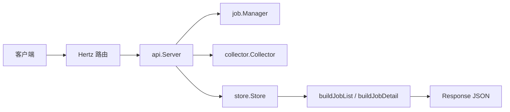

# HTTP API

## 模块定位

`internal/api` 提供控制面的 HTTP/JSON 接口层，基于 CloudWeGo Hertz 实现。它负责路由注册、请求绑定、基础参数校验、统一响应包装，以及把 HTTP 请求转发到任务管理、进度采集和 Redis 存储相关模块。

核心入口是 `Server`：

```go
type Server struct {
	cfg       *config.Config
	st        *store.Store
	jobMgr    *job.Manager
	collector *collector.Collector
}
```

`cmd/main.go` 通过 `NewServer(cfg, st, jobMgr, col)` 构造实例，再调用 `Register(h)` 注册路由。

## 对外接口

`Register` 注册 `/api/v1` 下的业务接口，以及独立的 `/health` 健康检查。

| 方法 | 路径 | Handler | 说明 |
|---|---|---|---|
| `POST` | `/api/v1/jobs` | `handleCreateJob` | 创建一次写表任务 |
| `GET` | `/api/v1/jobs` | `handleListJobs` | 查询 Redis 中仍保留的任务列表 |
| `GET` | `/api/v1/jobs/:job_id` | `handleGetJob` | 查询单个任务聚合详情 |
| `POST` | `/api/v1/heartbeat` | `handleHeartbeat` | Reader/Writer 心跳保活 |
| `POST` | `/api/v1/report_progress` | `handleReportProgress` | Reader/Writer 进度上报 |
| `POST` | `/api/v1/alert` | `handleAlert` | 异常告警上报 |
| `POST` | `/api/v1/ops/purge_all_jobs` | `handlePurgeAllJobs` | 清理全部任务及关联元数据 |
| `GET` | `/health` | 匿名函数 | 返回纯文本 `ok` |

除 `/health` 外，接口统一返回：

```json
{
  "code": 0,
  "message": "ok",
  "data": {}
}
```

统一响应由 `Response`、`ok` 和 `fail` 实现。`ok` 固定返回 HTTP 200 且 `code=0`；`fail` 使用调用方传入的 HTTP 状态码和业务错误码。

## 组件关系



`api.Server` 不直接实现任务调度或 Redis 命令细节，而是作为编排层连接这些模块：

- `job.Manager`：由 `handleCreateJob` 调用，负责创建任务。
- `collector.Collector`：由 `handleHeartbeat` 和 `handleReportProgress` 调用，负责写入心跳和进度。
- `store.Store`：由查询、告警、清理接口调用，负责读取或写入 Redis 中的任务元数据、worker 状态、bucket 状态和告警列表。
- `types`：定义请求和响应 DTO，是 HTTP API 的 JSON 合约来源。

## 创建任务流程

`handleCreateJob` 绑定 `types.CreateJobRequest`，然后调用 `s.jobMgr.CreateJob(ctx, &req)`。

请求体主要由以下结构组成：

- `SourceType`：数据源类型，当前 DTO 中包含 `types.SourceTypeHDFSParquet` 和 `types.SourceTypeTOSInventoryCSV`。
- `Source` / `Sources`：输入源配置。
- `Output`：输出 HDFS 目录和分区配置。
- `Bucketing`：分桶数量、hash 算法和 Spark seed。
- `Concurrency`：Writer 和 Reader 并发数。
- `ReaderRuntime` / `WriterRuntime` / `Sink`：运行时覆盖参数。
- `Callback`：回调通道配置。

成功响应为 `types.CreateJobResponse`，包含 `job_id`、`state`、分桶数、worker 数和创建时间。

错误处理：

- 请求绑定失败：HTTP 400，`code=40001`
- `job.Manager.CreateJob` 返回错误：HTTP 400，`code=40010`

## 心跳与进度上报

`handleHeartbeat` 处理 `types.HeartbeatRequest`：

```go
type HeartbeatRequest struct {
	JobID     string    `json:"job_id"`
	Kind      string    `json:"kind"`
	WriterID  string    `json:"writer_id,omitempty"`
	ReaderID  string    `json:"reader_id,omitempty"`
	IP        string    `json:"ip"`
	Port      int       `json:"port"`
	Buckets   []int32   `json:"buckets,omitempty"`
	Timestamp time.Time `json:"timestamp"`
}
```

它会额外校验 `job_id` 和 `kind` 非空，然后调用 `s.collector.Heartbeat`。成功后返回 `types.HeartbeatResponse`，其中 `next_interval_sec` 来自 `s.cfg.Heartbeat.NextIntervalSec`。

`handleReportProgress` 处理 `types.ProgressRequest`，同样要求 `job_id` 和 `kind` 非空，然后调用 `s.collector.ReportProgress`。成功返回：

```json
{
  "ack": true
}
```

Writer 进度通过 `buckets` 上报，Reader 进度通过 `files`、`buckets_seen` 等字段上报。`ProgressRequest` 使用同一个 DTO 合并 Reader 和 Writer 两种形态，具体含义由 `kind`、`writer_id`、`reader_id` 区分。

## 任务列表查询

`handleListJobs` 调用 `buildJobList` 构造 `types.ListJobsResponse`。

`buildJobList` 的处理步骤：

1. 通过 `s.st.JobIDs(ctx)` 获取当前 Redis 中的任务 ID。
2. 对每个任务调用 `s.st.JobMetaRaw(ctx, jobID)` 读取元数据。
3. 从 Redis hash 字段中恢复 `state`、`num_buckets`、`num_writers`、`num_readers`、`create_time`、`finish_time`。
4. 用 `parseJobConfigView(meta["request"])` 解析创建请求快照，填充 `source_type`、`source_root`、`output_hdfs_dir`。
5. 按 `create_time` 倒序排序；时间相同则按 `job_id` 升序。

`jobListSourceRoot` 根据 `JobConfigView.SourceType` 选择列表页展示的源路径：

- `hdfs_parquet` 使用 `cfg.Source.HDFSRoot`
- `tos_inventory_csv` 使用 `cfg.Source.TOSCSVRoot`
- 其他类型返回空字符串

如果某个 job 的元数据读取失败，`buildJobList` 会跳过该 job，而不是让整个列表失败。

## 单任务详情查询

`handleGetJob` 查询 `/api/v1/jobs/:job_id`。它支持查询参数：

```text
include_buckets=true|false
```

解析由 `parseBoolQueryArg` 完成，默认值是 `false`。非法布尔值会返回 HTTP 400，`code=40002`。

核心聚合逻辑在 `buildJobDetail(ctx, jobID, includeBuckets)`。

### 轻量模式

当 `include_buckets=false` 时，返回 `types.JobDetailLiteResponse`。该模式不会扫描 bucket 详情，因此适合列表跳转后的常规详情展示。

轻量响应包含：

- job 基础信息：`job_id`、`state`、`create_time`、`finish_time`
- 输出路径：`hdfs_output_path`、`hdfs_temp_dir`
- 创建请求快照：`config`
- Reader 聚合进度：`files_total`、`files_done`、`rows_read`、`bytes_read`
- Writer 轻量视图：`[]types.WriterLiteView`
- Reader 视图：`[]types.WorkerView`

### 完整 bucket 模式

当 `include_buckets=true` 时，返回 `types.JobDetailResponse`。该模式会读取 bucket 分配和 bucket hash，额外构造：

- `summary.buckets_pending`
- `summary.buckets_running`
- `summary.buckets_merging`
- `summary.buckets_done`
- `summary.buckets_failed`
- 每个 Writer 的 `buckets`
- 每个 Writer 的 `buckets_done`

主要读取路径：

1. `s.st.JobMetaRaw(ctx, jobID)` 读取任务元数据。
2. `s.st.BucketAssignAll(ctx, jobID)` 读取 bucket 到 writer index 的分配关系。
3. `s.st.BucketHashes(ctx, jobID, allBucketIDs)` 批量读取 bucket 进度。
4. `buildWorkerBucketsFromHashes` 把 Redis hash 转为 `types.BucketProgress`。
5. `applyBucketSummary` 按 bucket 状态聚合 summary。
6. `s.st.ListWorkerIDs`、`s.st.ListReaderIDs` 获取 worker ID。
7. `s.st.WorkerHashes` 批量读取 worker hash。
8. 组装 Writer 和 Reader 视图。

`buildJobDetail` 对部分 Redis 读取错误采取容错策略：除任务元数据外，worker、reader、bucket 的读取错误多数被忽略并表现为空数据或丢失状态。这让详情接口尽量返回可用信息，而不是因为局部进度缺失整体失败。

## Worker 状态计算

HTTP API 返回的 worker 状态不是简单透传 Redis 字段，而是经过 `effectiveDetailWorkerStatus` 修正。

规则如下：

- 空状态返回 `lost`。
- `done` 和 `failed` 是终态，直接返回。
- 没有心跳时间时：
  - `booting` 保持 `booting`
  - 其他状态视为 `lost`
- 配置了 `ttlSec` 且 `now - lastHB > ttlSec` 时，视为 `lost`
- 其他情况保持原状态

这意味着详情页看到的 Writer/Reader 状态会反映心跳 TTL，而不是仅依赖最近一次上报的 `status`。

## Bucket 进度聚合

`buildWorkerBucketsFromHashes` 把 Redis 中的 bucket hash 转成 `types.BucketProgress`，字段映射包括：

- `status` → `Status`
- `total_uris` → `TotalUrisReceived`
- `bytes` → `BytesReceived`
- `run_files` → `RunFilesGenerated`
- `peak_local_disk_mb` → `PeakLocalDiskUsageMb`
- `merge_progress` → `MergeProgress`
- `hdfs_write_progress` → `HDFSWriteProgress`
- `final_path` → `FinalParquetPath`
- `final_size` → `FinalByteSize`
- `last_update` → `LastUpdateTime`

bucket 会按 `bucket_id` 升序输出。缺失 hash 的 bucket 会被跳过。

状态分组由 `bucketStateGroup` 定义：

- `types.BucketStateDone` → done
- `types.BucketStateFailed` → failed
- `types.BucketStateMerging`、`types.BucketStateWritingHDFS` → merging
- `types.BucketStateRunning` → running
- 其他状态 → pending

`applyBucketSummary` 根据这些分组计算 `JobSummary`。`BucketsPending` 使用总数减去 running、merging、done、failed 得到，并保证不会小于 0。

## 告警与清理接口

`handleAlert` 绑定 `types.AlertRequest`，要求 `job_id` 非空。如果 `timestamp` 为空，会填充当前 UTC 时间。请求体会被 JSON 序列化后通过 `s.st.AppendAlert(ctx, req.JobID, body)` 写入 Redis LIST。

`handlePurgeAllJobs` 调用 `s.st.PurgeAllJobs(ctx)` 清理控制面记录的全部任务及关联元数据，返回 `types.PurgeAllJobsResponse`：

```json
{
  "ack": true,
  "jobs_purged": 3
}
```

当前模块中没有看到鉴权、权限校验或环境保护逻辑，因此 `/api/v1/ops/purge_all_jobs` 的访问控制需要由上游网关、部署环境或其他中间件保证。

## DTO 与 JSON 合约

HTTP API 的请求和响应结构主要定义在 `internal/types/dto.go`。这些结构体的 JSON tag 是接口字段名的来源。

需要注意命名风格并不完全统一：

- 大多数字段使用 snake_case，例如 `job_id`、`source_type`、`files_total`。
- `BucketProgress` 使用 camelCase，例如 `bucketId`、`totalUrisReceived`、`lastUpdateTime`。
- `ProgressRequest.LastUpdateTime` 的 JSON 字段也是 `lastUpdateTime`。

贡献新接口或扩展字段时，应优先沿用对应 DTO 所在响应体的既有命名风格，避免同一个对象内混用新的风格。

## 工具函数

`handlers.go` 中有一组只服务 API 聚合逻辑的辅助函数：

- `atoi`、`atoi64`、`atof64`：从 Redis 字符串字段解析数值，失败时返回零值。
- `orDefault`：为空字符串提供默认值。
- `parseUnixTime`：解析 Unix 秒级时间戳。
- `parseRFC3339Time`：解析 `time.RFC3339Nano` 或 `time.RFC3339`。
- `parseJobConfigView`：把任务元数据中的 `request` JSON 快照解析为 `types.JobConfigView`，失败时返回空结构。
- `parseBoolQueryArg`：解析查询参数中的布尔值。
- `countDoneBuckets`：统计状态分组为 done 的 bucket 数量。
- `latestBucketUpdate`：返回 bucket 列表中最新的更新时间；当前源码中未被调用。

这些函数大多采用“解析失败返回零值”的策略，符合详情接口尽量返回部分可用信息的设计。扩展时需要注意：这种策略适合展示聚合，不适合需要强一致校验的写入路径。