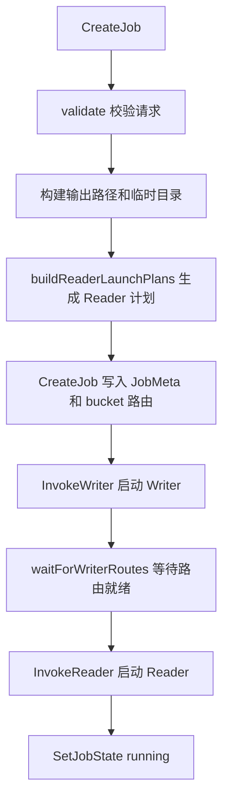

# Job Orchestration

## 模块概览

`internal/job` 是任务编排层，负责把 `types.CreateJobRequest` 转换成可运行的 Reader / Writer FaaS 实例，并在 Redis 中初始化 Job 元数据、Worker 元数据和 bucket 到 writer 的路由表。

模块入口是 `Manager.CreateJob`。它不直接处理数据文件内容，而是完成控制面编排：

- 校验请求参数。
- 生成 `jobID`、HDFS 输出路径和 Writer 临时目录。
- 解析输入文件并生成 Reader 启动计划。
- 按 `bucketId % numWriters` 构建 bucket 路由分配。
- 先启动 Writer，等待 Writer 注册所有 bucket 路由。
- 再启动 Reader，并将 Job 状态切换为 `running`。

## 核心组件

### `Manager`

`Manager` 是 Job 编排入口：

```go
type Manager struct {
	st                      *store.Store
	cfg                     *config.Config
	scheduler               scheduler.FaaSLauncher
	scanner                 fileScanner
	writerRouteReadyTimeout time.Duration
	writerReadyPollInterval time.Duration
}
```

依赖关系：

- `store.Store`：写入 Job 元数据、Worker 元数据、Job 状态，并检查 Writer 路由是否注册完成。
- `config.Config`：提供 Redis、Lambda、Heartbeat、Writer RPC、StorageGW 等默认配置。
- `scheduler.FaaSLauncher`：启动 Reader 和 Writer FaaS 实例。
- `fileScanner`：扫描 HDFS 或 TOS 输入文件。
- `writerRouteReadyTimeout` / `writerReadyPollInterval`：控制等待 Writer 路由就绪的轮询行为。

`New` 会初始化默认 `sdkFileScanner`，并通过 `defaultWriterRouteReadyTimeout` 设置 Writer 路由等待超时。默认超时为 `max(cfg.Heartbeat.NextIntervalSec*3, 30)` 秒；没有配置时为 30 秒。

## 创建 Job 的执行流程

`CreateJob` 是同步编排流程。只有当 Writer 已启动、bucket 路由已注册、Reader 已启动且 Redis 状态切到 `running` 后，接口才返回成功。



关键步骤如下：

1. `validate(req)` 校验请求完整性和 source 类型。
2. 生成 `jobID := uuid.NewString()` 和 UTC `CreateTime`。
3. `buildHDFSOutputPath` 根据 `output.hdfs_dir` 和 `output.partitions` 生成最终输出路径。
4. `buildWriterHDFSTempDir` 生成 Writer staging 目录：`<output>/_staging/<jobID>`。
5. `buildReaderLaunchPlans` 解析输入文件，并按实际文件数减少 Reader 数量，避免空分片。
6. `BuildBucketAssign(N, M)` 生成 `bucketId -> writerIdx` 路由表。
7. `store.CreateJob` 写入 `store.JobMeta` 和 bucket 分配。
8. 启动所有 Writer，并写入 `store.WorkerMeta{Kind: types.KindWriter}`。
9. `waitForWriterRoutes` 轮询 `Store.AllRouterBucketsRegistered`，等待所有 bucket 路由注册完成。
10. 启动所有 Reader，并写入 `store.WorkerMeta{Kind: types.KindReader}`。
11. `Store.SetJobState(..., types.JobStateRunning)` 标记 Job 进入运行态。

如果 Writer 启动、Reader 启动、Worker 元数据写入或状态切换失败，`CreateJob` 会调用 `MarkJobFinished(..., types.JobStateFailed, ...)` 将 Job 标记为失败。

## 请求校验

`validate` 支持两类 source：

- `types.SourceTypeHDFSParquet`
- `types.SourceTypeTOSInventoryCSV`

通用必填项：

- `source_type`
- `output.hdfs_dir`
- `bucketing.num_buckets > 0`
- `concurrency.num_writers > 0`
- `concurrency.num_readers > 0`

`hdfs_parquet` 要求至少提供：

- `source.hdfs_root`
- 或 `source.extract.file_paths`

`tos_inventory_csv` 会对 `flattenCreateJobSources(req)` 返回的每个 source 执行 `validateTOSInventoryCSVSource`。它要求至少提供：

- `tos_csv_root`
- 或 `extract.csv_uris`

并额外校验：

- `create_timestamp_column` 和 `create_time_str_column` 不能同时设置。
- `task_type` 只能为空或 `types.TOSInventoryTaskTypeManifestExpand`。
- 当 `task_type=manifest_expand` 时必须提供 `content_type_column`。
- 必须能得到对象 URI：提供 `store_uri_column`，或同时提供 `key_column` 和 `bucket`。

## 输出路径构建

`buildHDFSOutputPath(baseDir, partitions)` 负责生成最终 HDFS 输出路径。

没有分区时直接返回清理后的 `baseDir`：

```text
hdfs://nn/path/output
```

有分区时追加 `key=value` 目录：

```text
hdfs://nn/path/output/dt=20260716/hour=10
```

每个 `types.OutputPartition` 都必须包含非空 `Key` 和 `Value`。

`buildWriterHDFSTempDir(baseDir, jobID)` 生成 Writer 临时目录：

```text
hdfs://nn/path/output/_staging/<jobID>
```

如果 `baseDir` 是 URI 形式，会通过 `url.Parse` 保留 scheme 和 host，只修改 path；如果是普通路径，则使用 `path.Join`。

## Bucket 到 Writer 的分配

`BuildBucketAssign(numBuckets, numWriters)` 使用固定规则：

```go
writerIdx = bucketId % numWriters
```

返回值是 `map[int]int`，表示 `bucketId -> writerIdx`。

`bucketIDsForWriterIdx(numBuckets, numWriters, writerIdx)` 则反向计算某个 Writer 承载的 bucket 列表：

```go
for i := writerIdx; i < numBuckets; i += numWriters {
	out = append(out, int32(i))
}
```

这个规则同时用于 Redis 路由表初始化和 Writer 启动参数，因此 Reader 按 bucket 路由写入时能找到对应 Writer。

## Reader 启动计划

`buildReaderLaunchPlans` 根据 `SourceType` 分派：

- `hdfs_parquet`：调用 `resolveHDFSInputFiles`，再用 `partitionFilePaths` 均分文件。
- `tos_inventory_csv`：调用 `buildTOSInventoryCSVReaderLaunchPlans`，支持多个 source。

### HDFS Parquet

`resolveHDFSInputFiles` 优先使用 `source.extract.file_paths`。这些路径会经过 `normalizeHDFSFilePaths` 标准化，并由 `parseHDFSURI` 校验必须是 `hdfs://<namenode>/<path>`。

如果没有显式 `file_paths`，则使用 `fileScanner.ScanHDFSFiles(ctx, source.HDFSRoot, source.FileGlob)` 扫描目录。

`ScanHDFSFiles` 的过滤规则：

- 跳过目录。
- 跳过 `_SUCCESS`、`.`、`..` 和以 `.` 开头的文件。
- 未配置 `fileGlob` 时，只保留文件名以 `part` 开头的文件。
- 配置 `fileGlob` 时使用 `path.Match` 匹配文件名。

### TOS Inventory CSV

`buildTOSInventoryCSVReaderLaunchPlans` 支持 `req.Source` 和 `req.Sources` 两种输入形式。`flattenCreateJobSources` 会把它们统一成 `[]sourceRef`，其中 label 用于错误信息，例如 `source` 或 `sources[0]`。

每个 source 通过 `resolveTOSInventoryCSVFiles` 解析文件：

- 优先使用 `source.extract.csv_uris`。
- 如果没有显式 CSV URI，则扫描 `source.tos_csv_root`。
- 返回结果会排序，保证启动计划稳定。

多 source 场景下，`concurrency.num_readers` 必须大于等于有效 source 数量。`allocateReadersByFileCount` 会先给每个 source 至少分配 1 个 Reader，再按文件数量容量比例分配额外 Reader，且不会给某个 source 分配超过其文件数的 Reader。

## 文件扫描器

`fileScanner` 是输入文件发现接口：

```go
type fileScanner interface {
	ScanHDFSFiles(ctx context.Context, rootPath, fileGlob string) ([]string, error)
	ScanTOSFiles(ctx context.Context, rootPath string) ([]string, error)
}
```

默认实现是 `sdkFileScanner`。

### HDFS 扫描

`ScanHDFSFiles` 使用 `hdfs.Connect(hdfs.WithNameNode(parsedRoot.NameNode))` 连接 NameNode，然后调用 `fs.List(parsedRoot.Path)` 列出目录文件。

`parseHDFSURI` 要求 URI 形式为：

```text
hdfs://<namenode>/<path>
```

返回的 `parsedHDFSURI` 包含：

- `NameNode`：`hdfs://<host>`
- `Path`：URI path 部分

### TOS 扫描

`ScanTOSFiles` 使用 StorageGW 分页列举对象。`getStorageGWClient` 通过 `sync.Once` 延迟初始化客户端，并从配置读取：

- `StorageGW.PSM`
- `StorageGW.AccessKey`
- `StorageGW.SecretKey`
- `StorageGW.Cluster`
- `StorageGW.IDC`
- `StorageGW.ListPageSize`

`parseTOSURI` 支持两种格式：

```text
tos://bucket/prefix
bucket/prefix
```

返回对象路径格式为：

```text
bucket/key
```

`shouldSkipTOSObject` 会跳过：

- 空 key。
- 不在 prefix 下的对象。
- `_SUCCESS`、隐藏文件和目录 marker。
- 非 `.csv` 文件。

分页时，如果 `ListObjectsInfo.StartAfter` 为空，会回退到最后一个对象的 key；如果游标没有前进，会返回错误，避免死循环。

## Reader / Writer 启动参数

### Writer 参数

`buildWriterInvokeArgs` 构造 `scheduler.WriterInvokeArgs`，核心字段包括：

- `JobID`
- `BucketIDs`
- `HDFSOutputPath`
- `HDFSTempDir`
- `SkipStartupCheck`
- `Sort`
- `ControlPlane`
- `Router`
- `Lambda`

默认值来源：

- Control Plane endpoint：`WriterRuntime.ControlPlane.Endpoint` 或 `cfg.Lambda.ControlPlaneEndpoint`
- Control Plane PSM：`cfg.Lambda.ControlPlanePSM`
- Control Plane cluster：`cfg.Lambda.ControlPlaneCluster`
- Heartbeat interval：`cfg.Heartbeat.NextIntervalSec`
- Writer progress report interval：默认 60 秒
- Router cluster：`redisCluster()`
- Router key prefix：默认 `jobID`
- Router TTL：`max(300, cfg.Heartbeat.TTLSec)`

如果 `req.HDFSTempDir` 为空，函数会尝试通过 `buildWriterHDFSTempDir` 兜底生成，并在失败时记录 warning。

### Reader 参数

`buildReaderInvokeArgs` 构造 `scheduler.ReaderInvokeArgs`，公共字段包括：

- `JobID`
- `SourceType`
- `Bucketing`
- `Limits`
- `Sink`
- `ControlPlane`
- `Lambda`

当 `Bucketing.HashAlg` 为空时，默认设置为 `"hive"`。

`hdfs_parquet` 会填充 `scheduler.ReaderHDFSParquetInput`，并要求 `source.extract.store_uri_field` 非空。

`tos_inventory_csv` 会填充 `scheduler.ReaderTOSInventoryInput`，包括 CSV URI、bucket/key/store URI 列、size、content type、storage class、创建时间列和 CSV 格式。

### Reader Sink

`buildReaderSinkInput` 默认 sink 类型为 `"writer_rpc"`。

当 sink 为 `writer_rpc` 时，会自动补齐：

- `WriterServiceName`：默认 `cfg.WriterRPC.PSM`
- Redis cluster：默认 `redisCluster()`
- Redis key prefix：默认 `jobID`
- 连接超时：默认 `millisToSeconds(cfg.WriterRPC.TimeoutMs)`
- RPC 超时：默认 `millisToSeconds(cfg.WriterRPC.TimeoutMs)`

这使 Reader 能通过 Redis 读取 Writer 路由信息，再通过 RPC 写入对应 Writer。

## 状态与失败处理

`CreateJob` 的 Redis 写入顺序很重要：

1. 先 `CreateJob` 写入 Job 元数据和 bucket 分配。
2. 启动 Writer。
3. 写入 Writer metadata。
4. 等待 Writer 注册路由。
5. 启动 Reader。
6. 写入 Reader metadata。
7. 设置 Job 状态为 `running`。

Writer 路由必须在 Reader 启动前就绪，否则 Reader 可能无法根据 bucket 找到 Writer endpoint。`waitForWriterRoutes` 使用带超时的 context 轮询 `AllRouterBucketsRegistered(jobID, numBuckets)`，直到所有 bucket 都注册或超时。

失败时，当前实现不会回滚已启动的 FaaS 实例；它只将 Job 标记为 `failed`。因此贡献代码时要注意：新增的启动步骤如果位于 `CreateJob` 中间，也应在失败路径调用 `MarkJobFinished`，并返回带上下文的错误。

## 与其他模块的连接

`internal/job` 位于控制面中间层：

- 向上接收 `types.CreateJobRequest`，返回 `types.CreateJobResponse`。
- 向下调用 `store.Store` 写 Redis 状态和路由。
- 向下调用 `scheduler.FaaSLauncher` 启动 Reader / Writer。
- 从 `config.Config` 读取默认运行时参数。
- 通过 HDFS SDK 和 StorageGW SDK 解析输入文件。

`cmd/main.go` 通过 `job.New(st, cfg, sched)` 构造 `Manager`，实际创建任务时调用 `Manager.CreateJob`。

## 开发注意事项

修改这个模块时，优先保持以下不变量：

- Reader 启动前必须等待 Writer 路由全部注册。
- `effectiveReq.Concurrency.NumReaders` 必须反映实际启动的 Reader 数量。
- bucket 分配规则必须与 Writer 启动参数保持一致。
- 多 source 的 TOS Inventory CSV 至少要给每个有效 source 一个 Reader。
- 文件列表需要排序，避免相同请求在不同运行中产生不稳定的 Reader 分片。
- URI 解析应继续使用 `url.Parse`、`path.Join`、`path.Match` 等标准 API，避免手写字符串拼接破坏 scheme、host 或 prefix 语义。