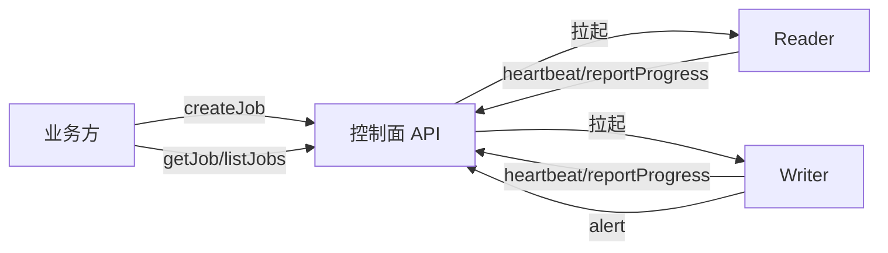

# Other — api

## 模块概览

`api/swagger.yaml` 是 `uri_task_control_panel` 控制面服务的 OpenAPI 3.0.3 接口契约，描述业务方、Reader、Writer 与运维系统访问控制面的 HTTP/JSON 协议。该模块本身不包含可执行代码；调用图中没有检测到内部调用、外部调用或执行流，说明它承担的是 API 规范、数据模型和接口语义定义的职责。

控制面围绕 Job 生命周期工作：业务方通过 `createJob` 创建写表任务，Reader/Writer 通过 `heartbeat` 与 `reportProgress` 上报状态，控制面维护 Redis 中的 Job 元数据、worker 快照、bucket 进度和告警列表，业务方再通过 `getJob` 或 `listJobs` 查询聚合视图。



## 统一响应格式

所有 JSON 接口都使用 `Envelope` 包装响应：

```json
{
  "code": 0,
  "message": "ok",
  "data": {}
}
```

`code=0` 表示成功，此时 `data` 才承载业务负载。错误响应仍使用同一个 `Envelope` 结构，常见业务码包括：

- `40001`：参数格式错误，通常对应绑定或校验失败。
- `40002`：必填字段缺失。
- `40010`：任务创建失败。
- `40401`：任务不存在。
- `50001`：内部错误，例如 Redis 等下游异常。

`/health` 是例外，它返回 `text/plain` 的固定字符串 `ok`，用于 LB 或容器编排存活探针。

## Job 创建接口

`POST /api/v1/jobs` 对应 `createJob`，请求体为 `CreateJobRequest`。它要求提供 `source_type`、`source`、`output`、`bucketing` 和 `concurrency`，用于创建 Job、分配 `job_id`、构建 bucket 到 Writer 的路由表，并拉起 Reader/Writer。

核心配置对象包括：

- `SourceSpec`：定义输入数据源。`source_type=hdfs_parquet` 时使用 `hdfs_root`、`file_glob` 或 `extract.file_paths`；`source_type=tos_inventory_csv` 时使用 `tos_csv_root` 或 `extract.csv_uris`。
- `OutputSpec`：定义 HDFS 输出根目录和有序 Hive 分区。`partitions` 的数组顺序就是目录层级顺序。
- `BucketingSpec`：定义 `num_buckets`、`hash_alg` 和可选的 `spark_seed`。
- `ConcurrencySpec`：定义 `num_writers` 和 `num_readers`。
- `ReaderRuntimeSpec`、`ReaderSinkSpec`、`WriterRuntimeSpec`：分别透传 Reader、Reader sink 和 Writer 运行时参数。
- `LambdaRuntimeSpec`：透传 Lambda 网关调度参数，不进入 Reader/Writer payload。
- `CallbackSpec`：当前仅存储和透传，不主动触发飞书通知。

成功响应为 `CreateJobResponse`，包含 `job_id`、`state`、`num_buckets`、`num_writers`、`num_readers` 和 `create_time`。当前主流程在拉起 Reader/Writer 后返回 `RUNNING`。

## 任务查询接口

`GET /api/v1/jobs` 对应 `listJobs`，返回 `ListJobsResponse`。每个 `JobListItem` 是轻量任务摘要，包含 Job 状态、创建/结束时间、bucket 数、Reader/Writer 数，以及 `source_type`、`source_root` 和 `output_hdfs_dir`。

`GET /api/v1/jobs/{job_id}` 对应 `getJob`，返回单个 Job 的聚合详情。接口支持 `include_buckets` 查询参数：

- `include_buckets=false`：默认轻量模式，返回 `JobDetailLiteResponse`，不会扫描 bucket 维度数据。
- `include_buckets=true`：完整模式，返回 `JobDetailResponse`，包含 bucket 聚合、Writer 维度 bucket 明细和完整进度统计。

两种响应都包含 `job_id`、`state`、`create_time`、`finish_time`、`hdfs_output_path`、`hdfs_temp_dir`、`config` 和 `summary`。`config` 使用 `JobConfigView`，完整镜像创建请求，便于排查任务启动参数。

Job 状态枚举由契约描述为 `PENDING`、`RUNNING`、`FINALIZING`、`SUCCEEDED`、`FAILED`、`CANCELLED`。

## Worker 心跳与进度

`POST /api/v1/heartbeat` 对应 `heartbeat`，请求体为 `HeartbeatRequest`。Reader 和 Writer 每 30 秒左右上报一次心跳，控制面更新 worker 快照中的 `last_hb` 和运行状态，并返回 `HeartbeatResponse.next_interval_sec`。

`HeartbeatRequest.kind` 决定必填字段：

- `kind=writer`：`writer_id` 和 `buckets` 必填。
- `kind=reader`：`reader_id` 必填，`buckets` 可省略。

`LOST` 状态不是通过 Redis key TTL 直接得到，而是在查询详情时根据 `last_hb` 超时推断；如果 worker 当前状态不是 `DONE` 且心跳超过 `Heartbeat.TTLSec`，展示层会返回 `LOST`。

`POST /api/v1/report_progress` 对应 `reportProgress`，请求体为 `ProgressRequest`：

- Writer 使用 `kind=writer`，填充 `writer_id` 和 `buckets`。每个元素为 `BucketProgress`，包含 `bucketId`、`status`、`totalUrisReceived`、`bytesReceived`、`runFilesGenerated`、`peakLocalDiskUsageMb`、`mergeProgress`、`hdfsWriteProgress` 等字段。
- Reader 使用 `kind=reader`，填充 `reader_id` 和 `files`。`ReaderFilesProgress` 记录 `files_total`、`files_done`、`rows_read` 和 `bytes_read`。

服务端按 bucket 维度更新 `cp:job:{jobId}:bucket:{bucketId}`，并覆盖 worker 快照。Job 的 `summary` 不维护在线 counter，而是在 `getJob` 查询时基于 bucket hash 或 worker 快照现算。

## 告警与运维接口

`POST /api/v1/alert` 对应 `alert`，请求体为 `AlertRequest`。Reader/Writer 在不可恢复异常路径下调用该接口。控制面将告警写入 `cp:job:{jobId}:alerts`，保留最近 1000 条，成功时返回 `{ "ack": true }`。

`POST /api/v1/ops/purge_all_jobs` 对应 `purgeAllJobs`，用于删除当前控制面记录的全部任务及关联元数据，包括 job hash、bucket 快照、worker 快照、`bucket_assign`、router bucket、alerts、barrier 标记，以及 `cp:jobs:all` 和 `cp:jobs:active`。这是强副作用接口，只应在明确需要清理控制面状态时调用。

## 数据模型约定

本模块采用 OpenAPI schema 作为跨组件数据契约。新增字段时应优先扩展现有 schema，而不是创建语义重复的新对象。常用 schema 的职责如下：

- `CreateJobRequest`：业务方提交任务的完整配置入口。
- `JobConfigView`：查询详情时返回的配置快照，与创建请求保持镜像关系。
- `WorkerView`：完整模式下 Reader/Writer 的展示视图。
- `WriterLiteView`：轻量模式下 Writer 的展示视图，不包含 bucket 扫描结果。
- `JobSummary`：完整模式下基于 bucket 维度计算的聚合结果。
- `JobSummaryLite`：轻量模式下只保留不依赖 bucket 扫描的字段。
- `BucketProgress`：Writer 上报的 bucket 级进度，字段名使用 camelCase，与 Writer 侧 controlplane 结构对齐。
- `ReaderFilesProgress`：Reader 上报的文件级进度。

开发者修改控制面实现、Reader/Writer 上报逻辑或客户端 SDK 时，应以这里的字段名、必填约束、枚举值和响应包装为准。尤其需要注意 `include_buckets=false` 的轻量查询语义：实现层不应在该模式下扫描 bucket 数据，否则会破坏接口用于快速列表和低成本诊断的设计目的。