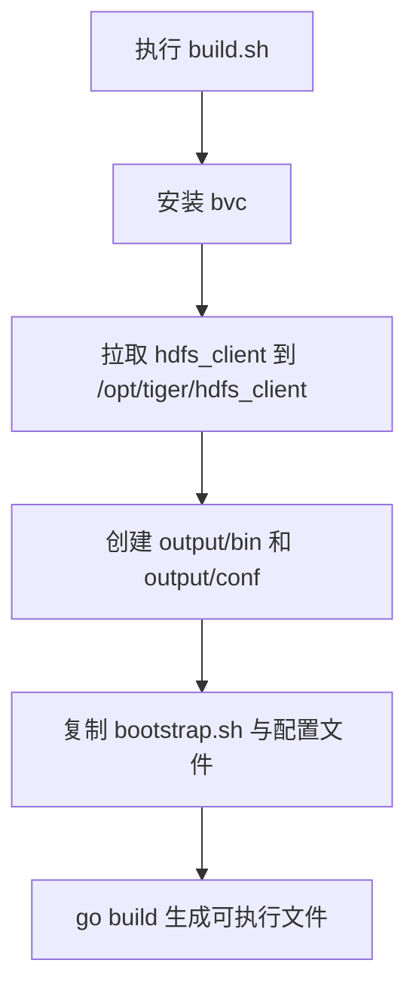

# Other — build.sh

## 模块职责

`build.sh` 是项目的构建入口脚本，用于准备运行依赖、整理发布产物目录，并将 Go 主程序编译到 `output/bin/`。它不是业务模块，没有函数、类或内部调用关系；它的作用是在构建环境中串联系统依赖安装、配置复制和 `go build`。

## 构建流程



脚本按顺序执行以下步骤：

1. 设置产物名称：

```bash
RUN_NAME="bytedance.videoarch.uri_task_control_panel"
```

该变量用于最终 Go 二进制文件名，产物路径为：

```bash
output/bin/bytedance.videoarch.uri_task_control_panel
```

2. 安装构建期依赖：

```bash
apt update -y
apt install -y bvc
```

脚本假设运行环境支持 `apt`，通常意味着 Debian/Ubuntu 系统或兼容的构建镜像。执行用户也需要具备安装系统包的权限。

3. 拉取 HDFS 客户端：

```bash
bvc clone -f data/inf/hdfs_client /opt/tiger/hdfs_client
```

这里通过 `bvc` 将 `data/inf/hdfs_client` 克隆到固定路径 `/opt/tiger/hdfs_client`。该目录通常是运行期或构建期依赖路径，后续 Go 编译命令本身没有直接引用它，但运行环境可能依赖该客户端文件布局。

4. 创建输出目录：

```bash
mkdir -p output/bin output/conf
```

`output/bin` 存放编译后的二进制文件，`output/conf` 存放发布用配置文件。

5. 准备启动脚本：

```bash
cp script/bootstrap.sh output 2>/dev/null
chmod +x output/bootstrap.sh
cp script/bootstrap.sh output/bootstrap_staging.sh
chmod +x output/bootstrap_staging.sh
```

同一个 `script/bootstrap.sh` 会被复制成两个产物：

- `output/bootstrap.sh`
- `output/bootstrap_staging.sh`

两者都会被设置为可执行文件。第一条 `cp` 将错误输出重定向到 `/dev/null`，因此如果复制失败，错误信息不会显示；但脚本没有使用 `set -e`，失败不会立即中止。

6. 复制配置文件：

```bash
find conf/ -type f ! -name "*_local.*" | xargs -I{} cp {} output/conf/
```

该命令会把 `conf/` 下所有非本地配置文件复制到 `output/conf/`。名称匹配 `*_local.*` 的文件会被排除，避免把本地开发配置打进发布产物。

注意：这里使用普通 `cp` 复制到同一个目标目录，不保留 `conf/` 下的子目录结构。如果不同子目录中存在同名配置文件，后复制的文件会覆盖先复制的文件。

7. 编译 Go 主程序：

```bash
go build -o output/bin/${RUN_NAME} ./cmd/main.go
```

编译入口是 `./cmd/main.go`，输出文件名由 `RUN_NAME` 决定。

## 与代码库的关系

`build.sh` 连接了项目中的几个固定路径：

- `cmd/main.go`：Go 程序入口。
- `script/bootstrap.sh`：运行启动脚本来源。
- `conf/`：发布配置来源。
- `output/`：构建产物目录。
- `/opt/tiger/hdfs_client`：通过 `bvc` 准备的外部客户端依赖。

构建完成后，发布系统通常只需要消费 `output/` 目录，其中包含可执行文件、启动脚本和配置文件。

## 重要约束

脚本依赖以下环境条件：

- 系统提供 `bash`。
- 系统提供 `apt`，且当前用户有安装包权限。
- `bvc` 包可通过 `apt install -y bvc` 安装。
- Go 工具链已可用，`go build` 能正常执行。
- 项目根目录下存在 `cmd/main.go`、`script/bootstrap.sh` 和 `conf/`。

脚本没有显式设置：

```bash
set -e
set -u
set -o pipefail
```

因此中间步骤失败时不一定会立刻停止，最终退出码主要取决于最后的 `go build`。如果需要让构建失败更早暴露，后续维护时可以考虑补充严格模式，并逐项确认现有构建环境是否依赖“失败后继续执行”的行为。

## 修改建议

修改该脚本时应保持以下约定：

- 如果变更二进制名称，修改 `RUN_NAME`，并确认部署系统期望的文件名同步更新。
- 如果新增发布配置，放入 `conf/`，但本地私有配置应继续使用 `*_local.*` 命名以避免被打包。
- 如果启动逻辑变化，优先修改 `script/bootstrap.sh`，因为 `bootstrap.sh` 和 `bootstrap_staging.sh` 都从该文件复制生成。
- 如果需要保留配置子目录结构，不应继续使用当前的 `find ... | xargs cp ... output/conf/` 模式，需要改成保留路径的复制方式。