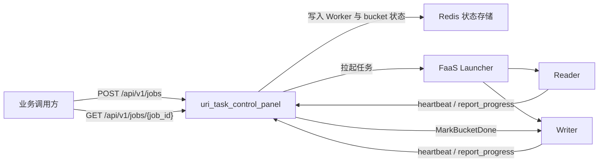

# Other — docs

## 模块定位

`docs/integration.md` 是 `uri_task_control_panel` 面向接入方的开发者文档，描述 VDA Store URI 排序任务控制面服务的外部契约、调用方式、数据流和运维建议。它不是运行时代码模块，不包含函数、类或可执行调用链；它承担的是把控制面服务的 HTTP API、任务生命周期和 Reader/Writer 对接方式固定为可维护的接入说明。

该文档主要服务三类读者：

- Reader / Writer 组件开发者：理解心跳、进度上报、Reader-Done Barrier 等交互约定。
- 业务调用方：通过 `/api/v1/jobs` 创建任务并查询任务状态。
- 运维与联调人员：确认 PSM、端口、错误码、超时、上报频率和依赖文档。

## 与代码库的关系

`docs/integration.md` 不是接口定义的唯一来源，而是围绕代码库内其他资产组织出来的接入说明：

| 关联文件或模块 | 作用 |
| --- | --- |
| `api/swagger.yaml` | HTTP 路由、请求体、响应体、错误码等 schema 的权威定义 |
| `examples/hertz_client/main.go` | 使用 CloudWeGo Hertz Client 调用控制面的完整示例 |
| `docs/summary-aggregation-comparison.md` | Job summary 聚合方案的设计背景 |
| 控制面服务实现 | 实际处理 `CreateJob`、`Heartbeat`、`ReportProgress`、`GetJob`、`Alert` 等接口 |
| 下游 `uri_writer` | 控制面在 Reader 全量完成后通过 Overpass / KiteX 调用 `MarkBucketDone` |
| 下游 `uri_source_reader` | 控制面根据 `CreateJob` 请求组装 Reader 输入并拉起 Reader |

文档中的 Swagger 锚点直接指向 `api/swagger.yaml`，例如 `createJob`、`heartbeat`、`reportProgress`、`getJob`、`alert`、`health`。贡献者修改接口字段、状态语义或错误码时，需要同步检查这份文档是否仍然准确。

## 控制面职责

文档把 `bytedance.videoarch.uri_task_control_panel` 定义为 VDA Store URI 排序任务的 Control Plane Service。服务本身监听 HTTP 端口 `8090`，使用 CloudWeGo Hertz 提供 HTTP/JSON API。

控制面承担三类核心职责：

1. 任务编排  
   `POST /api/v1/jobs` 接收 `CreateJob` 请求，基于 bucketing 和 concurrency 配置构建 `bucket -> writer` 路由表，并通过 FaaS Launcher 拉起 Reader / Writer。

2. 状态汇聚  
   Reader / Writer 通过 `/api/v1/heartbeat` 和 `/api/v1/report_progress` 上报存活状态与进度。控制面将 Worker 哈希和 bucket 快照写入 Redis。`GET /api/v1/jobs/{job_id}` 查询时会基于 bucket hash 现算 summary。

3. Reader-Done Barrier  
   Reader 全量完成后，控制面向 Writer fan-out 调用 `MarkBucketDone`，推进 bucket 收尾流程。Writer 的后续终态仍通过进度上报进入控制面。



## HTTP API 契约

所有业务接口统一使用 HTTP/JSON，路径前缀为 `/api/v1`。响应统一包装为 Envelope：

```json
{
  "code": 0,
  "message": "ok",
  "data": {}
}
```

当前文档覆盖的接口包括：

| 路径 | 方法 | 用途 |
| --- | --- | --- |
| `/api/v1/jobs` | `POST` | 创建一次写表任务 |
| `/api/v1/jobs` | `GET` | 列出 Redis 中仍保留的任务基础信息 |
| `/api/v1/heartbeat` | `POST` | Reader / Writer 心跳保活 |
| `/api/v1/report_progress` | `POST` | Reader / Writer 进度上报 |
| `/api/v1/jobs/{job_id}` | `GET` | 查询 Job 聚合详情 |
| `/api/v1/alert` | `POST` | 异常告警上报，当前仅写 Redis |
| `/health` | `GET` | 健康检查，供 LB 或容器探针使用 |

文档明确说明 `GET /api/v1/jobs` 不包含 summary，而 `GET /api/v1/jobs/{job_id}` 的 summary 是查询时基于 bucket hash 现算出来的结果。控制面不再维护 `done_buckets`、`failed_buckets` 这类在线计数。

## `CreateJob` 请求结构

`CreateJob` 是接入文档中最重要的请求体。文档给出的 JSON 示例覆盖以下配置区域：

- `source_type`：当前支持 `hdfs_parquet` 和 `tos_inventory_csv`。
- `source`：输入数据位置与字段抽取配置。
- `output`：输出 HDFS 目录与分区。
- `bucketing`：bucket 数量、hash 算法与 `spark_seed`。
- `concurrency`：Reader / Writer 并发数。
- `reader_runtime.limits`：Reader 内部 worker、sink worker、parquet 并发和 batch 行数。
- `sink`：Reader 到 Writer 的对接方式，当前默认按 `writer_rpc` 组装 Reader 输入。

需要特别注意几个字段演进约定：

- 输出目录字段是 `output.hdfs_dir`，不是 `output.hdfs_path`。
- `spark_seed` 位于 `bucketing.spark_seed`，不在 `source.extract.spark_seed`。
- Reader 和 Writer 的对接方式使用顶层 `sink`，不再通过 `source.extract.callback` 或 `reader_runtime.callback` 传递。
- `sink.redis` 使用嵌套结构：`cluster`、`key_prefix`、`read_timeout_seconds`、`max_retries`。
- `sink.type` 为空时，控制面当前默认按 `writer_rpc` 处理。
- 控制面会基于 `output.hdfs_dir` 自动生成 Writer 使用的 `hdfs_temp_dir`，规则为 `${output.hdfs_dir}/_staging/${job_id}`。

## 数据源模式

### `hdfs_parquet`

`hdfs_parquet` 是当前主链路。文档说明它已经对齐 `uri_source_reader` 最新 Input：

- 支持 `source.hdfs_root` + `source.file_glob`。
- 当提供 `source.extract.file_paths` 时，`source.hdfs_root` 可以为空。
- 支持透传 `source.extract.format_field`、`create_timestamp_field`、`vid_field`、`oid_field`、`extra_field`、`expand_ts`。

### `tos_inventory_csv`

`tos_inventory_csv` 支持两种输入入口：

- 直接通过 `source.extract.csv_uris` 传入 CSV 文件列表。
- 通过 `source.tos_csv_root` 让控制面使用存储网关 SDK 扫描 root 下文件。

两种入口最终都会被控制面归一化为 `csv_uris`，再按文件列表分片分发给 Reader。如果 `csv_uris` 来自 `source.tos_csv_root` 扫描，下发给 Reader 的路径格式是不带协议头的 `bucket/key`。

使用 `source.tos_csv_root` 时，服务配置还需要提供 `StorageGW.AccessKey` 和 `StorageGW.SecretKey`，用于初始化存储网关 client。

当 `source.extract.store_uri_column` 为空时，`tos_inventory_csv` 需要同时提供 `source.extract.bucket` 和 `source.extract.key_column`，由 Reader 拼接 `store_uri`。

`tos_inventory_csv` 还支持透传以下字段给 Reader：

- `source.extract.task_type`
- `source.extract.size_column`
- `source.extract.content_type_column`
- `source.extract.storage_class_column`
- `source.extract.create_timestamp_column`
- `source.extract.create_time_str_column`

其中 `task_type=manifest_expand` 时必须提供 `content_type_column`，用于展开 HLS/DASH manifest。`create_timestamp_column` 和 `create_time_str_column` 不能同时设置。

## Reader / Writer 并发与分片

`concurrency.num_readers` 表示请求的 Reader 上限，不一定等于最终实际拉起的 Reader 数量。

控制面会根据实际输入规模自动下调 Reader 数：

- 对 `hdfs_parquet`，如果实际输入文件数小于 `num_readers`，会下调到非空分片数。
- 对 `tos_inventory_csv`，如果 `csv_uris` 数量小于 `num_readers`，也会下调到非空分片数。

下调后的实际 Reader 数会写入任务元数据。因此 `CreateJob` 响应、`GET /api/v1/jobs` 和 `GET /api/v1/jobs/{job_id}` 中看到的 `num_readers` 或 `config.concurrency.num_readers` 可能小于原始请求值。

## Hertz Client 调用模式

文档推荐字节内 Go 服务使用 CloudWeGo Hertz Client 直接调用控制面。仓库内的 `examples/hertz_client/main.go` 是完整示例，覆盖：

- `CreateJob`
- `Heartbeat`
- `ReportProgress`
- `GetJobDetail`
- `Alert`

示例使用以下 Hertz 代码模式：

```go
req := protocol.AcquireRequest()
resp := protocol.AcquireResponse()
defer protocol.ReleaseRequest(req)
defer protocol.ReleaseResponse(resp)

req.SetMethod(consts.MethodPost)
req.SetRequestURI("http://127.0.0.1:8090/api/v1/heartbeat")
req.Header.SetContentTypeBytes([]byte("application/json"))
```

请求体通过 `json.Marshal` 序列化，例如心跳请求使用 `types.HeartbeatRequest`：

```go
body, _ := json.Marshal(types.HeartbeatRequest{
    JobID: "<job_id>",
    Kind: "writer",
    WriterID: "writer-0",
    IP: "127.0.0.1",
    Port: 9100,
    Timestamp: time.Now().UTC(),
})
req.SetBody(body)
```

示例中还包含泛型 `parseEnvelope[T any]`，用于统一解析 `{code, message, data}` 包装。

控制面地址可以通过环境变量或 flag 注入：

```bash
BASE_URL=http://uri-task-control-panel.bytedance.net go run ./examples/hertz_client
go run ./examples/hertz_client -base-url http://127.0.0.1:8090
```

默认地址是 `http://127.0.0.1:8090`。

## 错误码约定

文档定义了控制面对外稳定暴露的错误码：

| code | HTTP | 含义 |
| --- | --- | --- |
| `0` | `200` | 成功，`message` 为 `"ok"` |
| `40001` | `400` | 参数格式错误，例如 `BindAndValidate` 解析失败或 `job_id` 缺失 |
| `40002` | `400` | 必填字段缺失，例如 `kind`、`job_id`、Writer ID 或 Reader ID 缺失 |
| `40010` | `400` | 任务创建失败，例如 `bucketing.num_buckets` 非法或 Redis 写入失败 |
| `40401` | `404` | 任务不存在，例如 `cp:job:{jobId}` 未找到或元数据缺失 |
| `50001` | `500` | 内部错误，例如 Redis 读写异常或 Collector 写入失败 |

贡献者在修改 handler、参数校验或 Redis 读写错误处理时，应同步确认这些错误码是否仍与实现一致。

## 心跳、进度与告警

文档给出客户端侧上报频率建议：

| 上报接口 | 建议频率 | 说明 |
| --- | --- | --- |
| `/api/v1/heartbeat` | 30 秒一次 | 与配置 `Heartbeat.NextIntervalSec` 对齐 |
| `/api/v1/report_progress` Writer | 30 秒一次，或 bucket 状态切换时立即上报 | 常见状态包括 `RUNNING`、`MERGING`、`WRITING_HDFS`、`DONE`、`FAILED` |
| `/api/v1/report_progress` Reader | 30 秒一次 | `files_total`、`files_done` 保持累计单调递增 |
| `/api/v1/alert` | 事件驱动 | 当前仅写 Redis，不主动发送飞书通知 |

如果 Worker 的 `last_hb` 超过 90 秒未更新，详情查询中会展示为 `LOST`。Writer 在 `MarkBucketDone` 成功后，建议立即补发终态进度，保证控制面详情页尽快反映 bucket 收尾结果。

## 超时与重试建议

控制面当前不做主动限流。客户端侧建议：

- `DialTimeout=1s`
- `ReadTimeout=3s`
- `GET /api/v1/jobs/{job_id}` 在 bucket 数量较大时可放宽到 5 秒

重试策略需要区分接口语义：

- `/api/v1/heartbeat` 和 `/api/v1/report_progress` 属于幂等上报，可以按指数退避重试 3 次。
- `POST /api/v1/jobs` 不应盲目重试，应基于上一次响应中的 `job_id` 判断是否需要继续查询或补偿。

## 维护建议

修改 `docs/integration.md` 时，应优先确认以下来源：

- `api/swagger.yaml` 中的路径、字段、响应 schema 和错误码。
- `examples/hertz_client/main.go` 中的真实客户端调用方式。
- Reader 输入结构是否仍与 `reader_runtime.limits`、`source.extract`、`sink` 文档一致。
- Writer 的 `MarkBucketDone` 行为和 bucket 状态枚举是否发生变化。
- Redis key、summary 聚合方式、Worker `LOST` 判定阈值是否与服务实现一致。

这份文档的价值在于降低跨服务接入成本。接口字段、任务生命周期或下游协议发生变化时，应把文档更新作为同一变更的一部分处理。