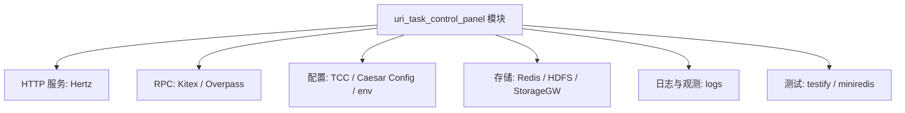

# Other — go.mod

## go.mod

`go.mod` 定义当前 Go 模块的身份、语言版本和依赖边界。它不包含可执行逻辑，因此没有内部调用、外部调用或运行时执行流；它由 Go 工具链在构建、测试、依赖解析和模块缓存下载时读取。

当前模块路径为：

```go
module code.byted.org/videoarch/uri_task_control_panel
```

这意味着仓库内代码应以该路径作为模块根路径进行包引用，例如同仓库内部包会挂在 `code.byted.org/videoarch/uri_task_control_panel/...` 下。

## Go 版本

```go
go 1.23.0
```

该声明影响 Go 命令的模块语义、标准库兼容行为和语言版本选择。开发、CI 和构建环境应使用兼容 Go 1.23 的工具链，避免因为本地 Go 版本过低导致解析或编译行为不一致。

## 直接依赖

第一组 `require` 是项目显式依赖，通常对应业务代码、框架代码或测试代码直接 import 的包。

主要依赖可以按职责理解：



### 服务框架

`code.byted.org/middleware/hertz v1.14.3` 和 `github.com/cloudwego/hertz v0.10.4` 表明项目使用 Hertz 作为 HTTP 服务框架。前者是字节内部中间件封装，后者是 CloudWeGo 开源基础框架。业务代码中如果涉及 HTTP 路由、请求上下文、中间件或服务启动，通常会依赖这一组包。

`code.byted.org/kite/kitex v1.20.3` 是内部 Kitex 依赖，用于 RPC 服务或 RPC 客户端相关逻辑。`code.byted.org/overpass/bytedance_videoarch_uri_task_control_panel` 是 Overpass 生成的服务客户端依赖，版本使用伪版本：

```go
v0.0.0-20260520120833-80095d4e5c46
```

这类版本绑定到具体提交，更新时要确认 IDL、生成代码和调用方字段兼容。

### 配置与环境

`code.byted.org/gopkg/env v1.7.20` 用于读取运行环境信息。

`code.byted.org/gopkg/tccclient v1.6.8` 和 `code.byted.org/videoarch/caesar_config/v4 v4.0.5` 说明项目存在动态配置或业务配置读取能力。修改配置相关代码时，需要同时关注配置 key、默认值、失败降级策略和环境隔离。

### 存储与外部资源

`code.byted.org/kv/goredis/v5 v5.7.7` 和 `code.byted.org/kv/redis-v6 v1.1.7` 都是 Redis 相关依赖。代码贡献时应确认具体包的使用位置，避免在新增逻辑中混用两套 Redis API 造成连接池、序列化或错误处理风格不一致。

`code.byted.org/inf/hdfs-go-sdk-on-cgo v1.1.5` 表示项目依赖 HDFS SDK，且包名包含 `cgo`，构建环境可能需要满足 CGO 及相关系统库要求。

`code.byted.org/videoarch/storagegw-go v1.1.57` 是 VideoArch 存储网关 SDK，通常用于统一访问对象存储或内部存储服务。

### 日志、标识与测试

`code.byted.org/gopkg/logs/v2 v2.1.60` 是直接日志依赖。新增日志时应优先沿用仓库已有的 `logs/v2` 使用方式。

`github.com/google/uuid v1.6.0` 用于 UUID 生成或解析。

`github.com/stretchr/testify v1.11.1` 是测试断言库，`github.com/alicebob/miniredis/v2 v2.38.0` 用于在单元测试中启动内存 Redis。涉及 Redis 行为的测试应优先考虑 `miniredis`，减少对真实环境的依赖。

## 间接依赖

第二组 `require` 全部带有 `// indirect`，表示它们不是当前模块直接 import 的主要依赖，而是由直接依赖传递引入。它们覆盖的能力包括：

- 链路追踪与监控：`bytedtrace`、`trace-client-go`、`metrics`、`prometheus`、`lidar/profiler`
- 服务发现与服务治理：`consul`、`service_mesh`、`hystrix`、`circuitbreaker`
- RPC 与序列化：`cloudwego/kitex`、`thrift`、`protobuf`、`grpc`、`sonic`
- 安全与身份：`kms`、`spiffe`、`zero-trust`、`cryptoutils`
- 配置解析：`viper`、`toml`、`yaml`、`ini`
- 压缩与底层优化：`lz4`、`snappy`、`compress`、`netpoll`

维护时通常不直接修改间接依赖版本，除非需要修复漏洞、解决冲突或配合直接依赖升级。更常见的做法是修改直接依赖版本后运行：

```bash
go mod tidy
```

让 Go 工具链重新收敛间接依赖集合。

## 依赖解析方式

Go 使用最小版本选择机制解析依赖图。`go.mod` 中声明的版本是模块构建时的最低可接受版本；如果传递依赖要求更高版本，最终构建版本可能被提升并记录在 `go.sum` 中。

这个文件没有 `replace` 或 `exclude` 指令，说明当前依赖解析完全依赖模块仓库中的版本声明。引入本地替换或临时分支时应谨慎，避免把调试用 `replace` 提交到主分支。

## 与代码库的连接方式

`go.mod` 是整个仓库的依赖入口：

- 编译业务代码时，Go 根据 `module` 路径解析仓库内部包。
- 运行测试时，`testify`、`miniredis` 等测试依赖由这里声明。
- HTTP、RPC、配置、存储、日志等基础能力通过直接依赖提供。
- 观测、安全、服务治理等能力多由框架依赖传递引入。

由于本模块没有执行流，理解它时重点不是调用关系，而是依赖边界：新增业务代码应优先复用这里已经存在的框架和 SDK，避免引入功能重复的库。

## 维护建议

新增依赖时优先使用 `go get` 或现有构建工具更新版本，再运行 `go mod tidy`。不要只手动编辑 `go.mod`，否则容易遗漏 `go.sum` 或保留无用间接依赖。

升级核心框架依赖时需要特别关注这些包：

```go
code.byted.org/middleware/hertz
github.com/cloudwego/hertz
code.byted.org/kite/kitex
code.byted.org/overpass/bytedance_videoarch_uri_task_control_panel
code.byted.org/kv/goredis/v5
code.byted.org/kv/redis-v6
```

这些依赖可能影响服务启动、请求处理、RPC 调用、连接池、序列化和错误处理，升级后应至少运行完整单元测试，并覆盖 HTTP、RPC、Redis 和配置读取相关路径。