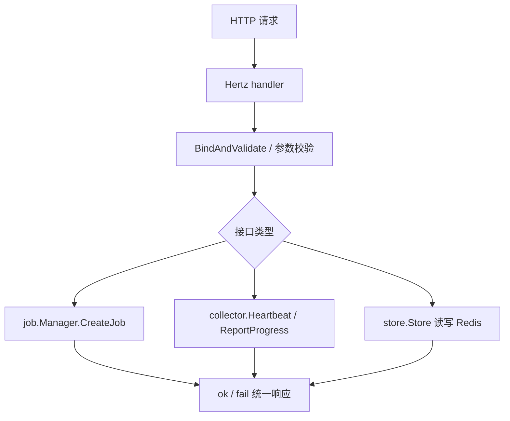

# Other — internal-api

## internal/api 模块

`internal/api` 提供基于 CloudWeGo Hertz 的 HTTP/JSON 控制面接口。它负责接收外部请求、做基础参数校验、调用 `job.Manager` 或 `collector.Collector` 执行业务动作，并从 `store.Store` 聚合 Redis 中的任务、worker、bucket 进度数据返回给调用方。

模块入口是 `Server`：

```go
type Server struct {
	cfg       *config.Config
	st        *store.Store
	jobMgr    *job.Manager
	collector *collector.Collector
}
```

`NewServer(cfg, st, jobMgr, col)` 注入配置、Redis 存储层、任务管理器和进度采集器。`Register(h *server.Hertz)` 在 Hertz 实例上注册 `/api/v1` 路由和 `/health` 健康检查。

## 路由与处理器

`Register` 注册的接口如下：

| 方法 | 路径 | 处理函数 | 作用 |
| --- | --- | --- | --- |
| `POST` | `/api/v1/jobs` | `handleCreateJob` | 创建任务 |
| `GET` | `/api/v1/jobs` | `handleListJobs` | 查询任务列表 |
| `GET` | `/api/v1/jobs/:job_id` | `handleGetJob` | 查询单个任务详情 |
| `POST` | `/api/v1/heartbeat` | `handleHeartbeat` | 接收 Reader/Writer 心跳 |
| `POST` | `/api/v1/report_progress` | `handleReportProgress` | 接收 Reader/Writer 进度 |
| `POST` | `/api/v1/alert` | `handleAlert` | 写入任务告警 |
| `POST` | `/api/v1/ops/purge_all_jobs` | `handlePurgeAllJobs` | 清理控制面记录的全部任务 |
| `GET` | `/health` | 内联 handler | 返回 `ok` |

所有业务响应都通过 `Response` 包装：

```go
type Response struct {
	Code    int         `json:"code"`
	Message string      `json:"message"`
	Data    interface{} `json:"data,omitempty"`
}
```

成功响应由 `ok` 写出，格式为 `{code: 0, message: "ok", data: ...}`。失败响应由 `fail` 写出，`code != 0`，HTTP 状态码由调用处决定。

## 主要请求流程



`handleCreateJob` 绑定 `types.CreateJobRequest`，调用 `s.jobMgr.CreateJob(ctx, &req)` 创建任务。创建失败按 `40010` 返回，绑定失败按 `40001` 返回。

`handleHeartbeat` 绑定 `types.HeartbeatRequest`，要求 `job_id` 和 `kind` 非空，然后调用 `s.collector.Heartbeat`。成功时返回 `types.HeartbeatResponse{NextIntervalSec: s.cfg.Heartbeat.NextIntervalSec}`。

`handleReportProgress` 绑定 `types.ProgressRequest`，同样要求 `job_id` 和 `kind` 非空，然后调用 `s.collector.ReportProgress`。成功时返回 `types.ProgressResponse{Ack: true}`。

`handleAlert` 绑定 `types.AlertRequest`，要求 `job_id` 非空。如果 `Timestamp` 为空，会用 `time.Now().UTC()` 补齐。请求体被 JSON 序列化后通过 `s.st.AppendAlert(ctx, req.JobID, body)` 写入 Redis LIST。

`handlePurgeAllJobs` 调用 `s.st.PurgeAllJobs(ctx)` 删除控制面记录的任务及关联元数据，返回 `types.PurgeAllJobsResponse`。

## 任务列表聚合

`handleListJobs` 的核心逻辑在 `buildJobList(ctx)`。

它先通过 `s.st.JobIDs(ctx)` 获取当前 Redis 中仍保留的任务 ID，然后逐个读取 `s.st.JobMetaRaw(ctx, jobID)`。每个任务被转换成 `types.JobListItem`：

```go
type JobListItem struct {
	JobID         string     `json:"job_id"`
	State         string     `json:"state"`
	CreateTime    time.Time  `json:"create_time"`
	FinishTime    *time.Time `json:"finish_time,omitempty"`
	NumBuckets    int        `json:"num_buckets"`
	NumWriters    int        `json:"num_writers"`
	NumReaders    int        `json:"num_readers"`
	SourceType    string     `json:"source_type,omitempty"`
	SourceRoot    string     `json:"source_root,omitempty"`
	OutputHDFSDir string     `json:"output_hdfs_dir,omitempty"`
}
```

`buildJobList` 依赖 `cp:job:{jobId}` hash 中的字段：

- `state`
- `request`
- `num_buckets`
- `num_writers`
- `num_readers`
- `create_time`
- `finish_time`

`request` 字段会通过 `parseJobConfigView` 反序列化为 `types.JobConfigView`，再用于填充：

- `SourceType`
- `SourceRoot`
- `OutputHDFSDir`

`jobListSourceRoot` 根据 `SourceType` 选择数据源根路径：

- `types.SourceTypeHDFSParquet` 使用 `cfg.Source.HDFSRoot`
- `types.SourceTypeTOSInventoryCSV` 使用 `cfg.Source.TOSCSVRoot`
- 其他类型返回空字符串

列表结果按 `CreateTime` 倒序排列；如果创建时间相同，则按 `JobID` 升序排列。

## 任务详情聚合

`handleGetJob` 从路径参数读取 `job_id`，并解析 query 参数 `include_buckets`。参数解析使用 `parseBoolQueryArg`，支持 Go 标准布尔字符串；非法值会返回 `40002`。

核心逻辑在：

```go
func (s *Server) buildJobDetail(ctx context.Context, jobID string, includeBuckets bool) (interface{}, error)
```

当 `includeBuckets=true` 时返回 `*types.JobDetailResponse`，包含 bucket 明细和 bucket 派生统计。当 `includeBuckets=false` 时返回 `*types.JobDetailLiteResponse`，跳过 bucket 明细扫描，只保留不依赖 bucket hash 的轻量字段。

### 详情数据来源

`buildJobDetail` 读取以下 Redis 数据：

| 数据 | Store 方法 | 说明 |
| --- | --- | --- |
| Job 元数据 | `JobMetaRaw` | 读取 `cp:job:{jobId}` |
| Writer ID 集合 | `ListWorkerIDs` | 读取 `cp:job:{jobId}:workers` |
| Reader ID 集合 | `ListReaderIDs` | 读取 `cp:job:{jobId}:readers` |
| Worker hash | `WorkerHashes` | 批量读取 writer/reader hash |
| Bucket 分配表 | `BucketAssignAll` | `includeBuckets=true` 时读取 bucket 到 writer index 的映射 |
| Bucket hash | `BucketHashes` | `includeBuckets=true` 时批量读取 bucket 进度 |

Job 配置快照来自 `meta["request"]`，由 `parseJobConfigView` 解析为 `types.JobConfigView`。该结构完整镜像创建请求中的核心配置，包括 `Source`、`Output`、`Bucketing`、`Concurrency`、`LambdaRuntime`、`ReaderRuntime`、`Sink`、`WriterRuntime` 和 `Callback`。

### `include_buckets=true` 的完整详情

完整响应类型是 `types.JobDetailResponse`：

```go
type JobDetailResponse struct {
	JobID          string        `json:"job_id"`
	State          string        `json:"state"`
	CreateTime     time.Time     `json:"create_time"`
	FinishTime     *time.Time    `json:"finish_time"`
	HDFSOutputPath string        `json:"hdfs_output_path,omitempty"`
	HDFSTempDir    string        `json:"hdfs_temp_dir,omitempty"`
	Config         JobConfigView `json:"config"`
	Summary        JobSummary    `json:"summary"`
	Writers        []WorkerView  `json:"writers"`
	Readers        []WorkerView  `json:"readers"`
}
```

完整模式会读取 `BucketAssignAll` 和 `BucketHashes`，然后用 `buildWorkerBucketsFromHashes` 将 bucket hash 转成 `types.BucketProgress`。Writer 视图中的 `Buckets` 和 `BucketsDone` 只在完整模式下填充。

`types.JobSummary` 的 bucket 字段也只在完整模式下计算：

- `BucketsTotal` 来自 `configView.Bucketing.NumBuckets`
- `BucketsDone`
- `BucketsFailed`
- `BucketsRunning`
- `BucketsMerging`
- `BucketsPending`

`applyBucketSummary` 按 `bucketStateGroup` 分组：

- `types.BucketStateDone` 归为 done
- `types.BucketStateFailed` 归为 failed
- `types.BucketStateMerging` 和 `types.BucketStateWritingHDFS` 归为 merging
- `types.BucketStateRunning` 归为 running
- 其他状态归为 pending

`BucketsPending` 由总数减去已归类数量得到，并且不会小于 0。

### `include_buckets=false` 的轻量详情

轻量响应类型是 `types.JobDetailLiteResponse`：

```go
type JobDetailLiteResponse struct {
	JobID          string           `json:"job_id"`
	State          string           `json:"state"`
	CreateTime     time.Time        `json:"create_time"`
	FinishTime     *time.Time       `json:"finish_time"`
	HDFSOutputPath string           `json:"hdfs_output_path,omitempty"`
	HDFSTempDir    string           `json:"hdfs_temp_dir,omitempty"`
	Config         JobConfigView    `json:"config"`
	Summary        JobSummaryLite   `json:"summary"`
	Writers        []WriterLiteView `json:"writers"`
	Readers        []WorkerView     `json:"readers"`
}
```

轻量模式不会扫描 bucket hash，因此不会输出这些 bucket 派生字段：

- writer 的 `buckets`
- writer 的 `buckets_done`
- summary 的 `buckets_done`
- summary 的 `buckets_pending`
- summary 的 `buckets_running`
- summary 的 `buckets_merging`
- summary 的 `buckets_failed`

轻量 summary 使用 `types.JobSummaryLite`，只保留：

- `BucketsTotal`
- `FilesTotal`
- `FilesDone`
- `RowsRead`
- `BytesRead`

这可以避免详情页在 bucket 数量很大时产生大量 Redis 读取。

## Worker 视图与状态判断

Writer 和 Reader 的展示结构主要使用 `types.WorkerView`：

```go
type WorkerView struct {
	WriterID        string               `json:"writer_id,omitempty"`
	ReaderID        string               `json:"reader_id,omitempty"`
	Status          string               `json:"status"`
	IP              string               `json:"ip,omitempty"`
	Port            int                  `json:"port,omitempty"`
	BucketsAssigned int                  `json:"buckets_assigned,omitempty"`
	BucketsDone     int                  `json:"buckets_done,omitempty"`
	BucketsSeen     int                  `json:"buckets_seen,omitempty"`
	Files           *ReaderFilesProgress `json:"files,omitempty"`
	Buckets         []BucketProgress     `json:"buckets,omitempty"`
	LastUpdateTime  *time.Time           `json:"lastUpdateTime,omitempty"`
	LastHB          time.Time            `json:"last_hb"`
}
```

轻量模式下 Writer 使用 `types.WriterLiteView`，不包含 bucket 明细和 `BucketsDone`。

Worker 状态通过 `effectiveDetailWorkerStatus` 做展示层修正：

- 空状态视为 `types.WorkerStateLost`
- `types.WorkerStateDone` 和 `types.WorkerStateFailed` 是终态，即使心跳过期也保持原状态
- 没有 `last_hb` 时，如果状态是 `types.WorkerStateBooting`，保持 `BOOTING`
- 没有 `last_hb` 且不是 `BOOTING`，视为 `LOST`
- `last_hb` 超过 `s.cfg.Heartbeat.TTLSec` 时，视为 `LOST`
- 其他情况保持原状态

这个规则让刚创建但还没上报心跳的 worker 能显示为 `BOOTING`，同时能把过期的运行中 worker 标记为 `LOST`。

## 排序规则

`buildJobDetail` 会稳定排序 Writer 和 Reader，保证 API 输出可预测。

Writer 排序规则：

1. 有 `writer_idx` 的排在没有 index 的前面
2. `writer_idx` 小的排在前面
3. index 相同或没有 index 时，按 `WriterID` 升序

Reader 排序规则类似：

1. 有 `reader_idx` 的排在没有 index 的前面
2. `reader_idx` 小的排在前面
3. index 相同或没有 index 时，按 `ReaderID` 升序

这些 index 来自 store 层写入的 worker hash 字段：

- writer 使用 `writer_idx`
- reader 使用 `reader_idx`

## Reader 进度聚合

Reader hash 中的文件进度字段会被汇总到详情 summary：

- `files_total`
- `files_done`
- `rows_read`
- `bytes_read`

单个 Reader 只要这些字段中任意一个大于 0，就会生成 `types.ReaderFilesProgress` 并放入 `WorkerView.Files`。

`buildJobDetail` 会累加所有 Reader 的：

- `FilesTotal`
- `FilesDone`
- `RowsRead`
- `BytesRead`

完整模式和轻量模式都会返回这些聚合值，因为它们不依赖 bucket 扫描。

## Bucket 进度转换

`buildWorkerBucketsFromHashes(bucketIDs, bucketHashes)` 将 Redis bucket hash 转换为 `types.BucketProgress`。它会先对 bucket ID 升序排序，再逐个读取 hash 字段：

| Redis 字段 | 响应字段 |
| --- | --- |
| `status` | `Status` |
| `total_uris` | `TotalUrisReceived` |
| `bytes` | `BytesReceived` |
| `run_files` | `RunFilesGenerated` |
| `peak_local_disk_mb` | `PeakLocalDiskUsageMb` |
| `merge_progress` | `MergeProgress` |
| `hdfs_write_progress` | `HDFSWriteProgress` |
| `final_path` | `FinalParquetPath` |
| `final_size` | `FinalByteSize` |
| `last_update` | `LastUpdateTime` |

如果某个 bucket hash 为空，该 bucket 不会出现在返回数组中。`countDoneBuckets` 根据 `bucketStateGroup` 统计 Writer 视图中的完成 bucket 数。

## 与其他模块的关系

`internal/api` 本身不直接实现任务调度、心跳落库或进度落库，而是作为 HTTP 边界层连接其他模块：

- `internal/config` 提供 `config.Config`，主要用于心跳间隔和 TTL 判断
- `internal/job` 提供 `job.Manager`，由 `handleCreateJob` 调用创建任务
- `internal/collector` 提供 `collector.Collector`，由心跳和进度接口调用
- `internal/store` 封装 Redis 访问，供列表、详情、告警和清理接口使用
- `internal/types` 定义所有请求、响应、状态和配置快照 DTO

API 层的聚合逻辑集中在 `buildJobList` 和 `buildJobDetail`。如果新增响应字段，通常需要同时检查：

- `internal/types/dto.go` 中对应响应结构
- `store.Store` 是否已经写入或能读取对应 Redis 字段
- `buildJobList` 或 `buildJobDetail` 是否需要解析、汇总或排序
- `handlers_test.go` 是否覆盖完整模式和轻量模式差异

## 测试覆盖重点

`internal/api/handlers_test.go` 使用 `miniredis` 和 `goredis.NewClientWithServers` 构造隔离 Redis，通过 `newTestServer` 创建带测试配置的 `Server` 和 `store.Store`。

已有测试覆盖了这些行为：

- `TestBuildJobDetailIncludesNestedSourceAndOutputConfig` 验证详情接口会保留嵌套配置，并聚合 writer、reader、bucket 和 summary
- `TestBuildJobDetailSkipsBucketDerivedFieldsWhenBucketsExcluded` 验证 `includeBuckets=false` 不输出 bucket 派生字段
- `TestBuildJobListReturnsActiveJobsBasicInfo` 验证任务列表字段和创建时间倒序
- `TestBuildJobDetailAndListDoNotFallbackHDFSPaths` 验证缺失的 `HDFSOutputPath` 和 `HDFSTempDir` 不会被 fallback 成其他路径
- `TestBuildJobDetailKeepsDoneWorkersAndMarksStaleRunningLost` 验证终态 worker 保持终态，过期运行中 worker 变为 `LOST`
- `TestBuildJobDetailSummarizesBucketsFromBucketHashes` 验证 bucket 状态分组与 summary 计算
- `TestBuildJobDetailKeepsBootingWorkersWithoutHeartbeat` 验证无心跳的 booting worker 保持 `BOOTING`
- `TestBuildJobDetailSortsWritersAndReadersByIndex` 验证 worker 按 index 稳定排序

这些测试主要围绕 `buildJobDetail` 和 `buildJobList`，因此修改聚合逻辑时应优先补充或更新这些用例。