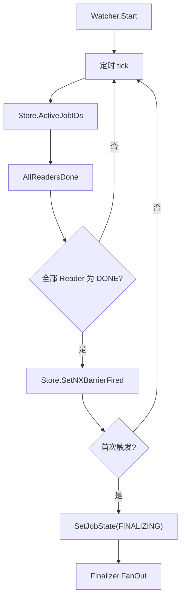

# Other — internal-barrier

## internal/barrier 模块

`internal/barrier` 维护 Reader-Done Barrier 后台协程。它负责周期性扫描 Redis 中的活跃任务，在确认某个 Job 下所有 Reader 都进入 `DONE` 后，将 Job 状态推进到 `FINALIZING`，并调用注入的 `Finalizer.FanOut(ctx, jobID)` 触发后续 fan-out。

该模块不直接处理 bucket、Writer RPC 或任务成功判定；这些逻辑分别在 `internal/finalizer` 和 `internal/store` 中完成。

## 核心流程



`Watcher.Start(ctx)` 是阻塞方法，通常以 goroutine 方式启动：

```go
fin, err := finalizer.New(st, cfg, writerCli)
if err != nil {
	logs.Fatal("[main] finalizer init: %v", err)
}

w := barrier.New(st, cfg, fin)
go w.Start(rootCtx)
```

实际装配发生在 `cmd/main.go`。`rootCtx` 在 Hertz shutdown hook 中取消，`Watcher.Start` 收到 `ctx.Done()` 后退出。

## 关键类型

### `Finalizer`

```go
type Finalizer interface {
	FanOut(ctx context.Context, jobID string) error
}
```

`barrier` 只依赖这个最小接口。当前真实实现是 `internal/finalizer.Finalizer`，其 `FanOut` 会读取 bucket assignment，并按 bucket 调用 Writer 的 `MarkBucketDone`。

这种接口边界让 `barrier` 不需要依赖 Writer RPC，也便于单测用 `fakeFinalizer` 统计调用次数。

### `Watcher`

```go
type Watcher struct {
	st        *store.Store
	cfg       *config.Config
	finalizer Finalizer
}
```

`Watcher` 是后台扫描器，包含三个依赖：

- `st *store.Store`：访问 Redis 中的 Job、Reader 状态和 barrier fired 标记。
- `cfg *config.Config`：读取 `cfg.Barrier.CheckIntervalSec` 控制扫描周期。
- `finalizer Finalizer`：Barrier 首次触发后执行 fan-out。

使用 `New(st, cfg, fin)` 构造：

```go
func New(st *store.Store, cfg *config.Config, fin Finalizer) *Watcher
```

当前构造函数不做 nil 校验，调用方需要保证三个依赖都已正确初始化。

## 扫描与触发逻辑

### `Start(ctx context.Context)`

`Start` 根据 `cfg.Barrier.CheckIntervalSec` 创建 `time.Ticker`：

```go
interval := time.Duration(w.cfg.Barrier.CheckIntervalSec) * time.Second
if interval <= 0 {
	interval = 10 * time.Second
}
```

虽然 `config.validate()` 要求 `Barrier.CheckIntervalSec > 0`，这里仍保留了运行期兜底。需要注意：`Start` 不会启动后立即扫描，第一次执行发生在第一个 ticker 周期到达时。

### `tick(ctx context.Context)`

`tick` 是每轮扫描的主体：

1. 调用 `w.st.ActiveJobIDs(ctx)` 读取 `cp:jobs:active`。
2. 对每个 `jobID` 调用 `AllReadersDone(ctx, w.st, jobID)`。
3. 如果所有 Reader 已完成，调用 `w.st.SetNXBarrierFired(ctx, jobID)`。
4. 只有 SETNX 成功的第一次触发会继续执行。
5. 调用 `w.st.SetJobState(ctx, jobID, types.JobStateFinalizing)`。
6. 调用 `w.finalizer.FanOut(ctx, jobID)`。

`SetJobState` 和 `FanOut` 的错误处理并不对称：`SetJobState` 的返回值被忽略，`FanOut` 失败只记录日志。Barrier 的一次性语义由 `SetNXBarrierFired` 决定，因此一旦 fired 标记写入成功，即使后续 fan-out 报错，下一轮扫描也不会再次触发。

## Reader 完成判定

### `AllReadersDone(ctx, st, jobID)`

```go
func AllReadersDone(ctx context.Context, st *store.Store, jobID string) bool
```

判定规则很窄：

- `st.AllReaderStatuses(ctx, jobID)` 返回错误时，结果为 `false`。
- Reader 集合为空时，结果为 `false`。
- 任意 Reader 状态不是 `types.WorkerStateDone` 时，结果为 `false`。
- 只有 Reader 集合非空且所有状态都等于 `DONE` 时，结果为 `true`。

Reader 状态来自 `store.AllReaderStatuses`，它会读取：

- `cp:job:{jobId}:readers`
- `cp:job:{jobId}:reader:{readerId}` hash 中的 `status` 和 `last_hb`

`store.AllReaderStatuses` 会把缺失状态、缺失心跳、心跳超时的非终态 Reader 视为 `LOST`。已经是终态的 Reader 会保持原状态，其中 `DONE` 不会因为心跳过期被改判为 `LOST`。

因此，Barrier 只接受全员 `DONE`，不会把 `FAILED` 或 `LOST` 当作可通过状态。

## Redis 数据约定

`barrier` 直接或间接依赖以下 key：

| Key | 访问方 | 用途 |
| --- | --- | --- |
| `cp:jobs:active` | `Store.ActiveJobIDs` | 当前仍需后台处理的 Job 集合 |
| `cp:job:{jobId}:readers` | `Store.AllReaderStatuses` | Job 下 Reader ID 集合 |
| `cp:job:{jobId}:reader:{readerId}` | `Store.AllReaderStatuses` | Reader 状态与心跳 |
| `cp:job:{jobId}:barrier_fired` | `Store.SetNXBarrierFired` | Barrier 一次性触发标记 |
| `cp:job:{jobId}` | `Store.SetJobState` | Job 元数据 hash，写入 `state=FINALIZING` |

`SetNXBarrierFired` 使用：

```go
SETNX cp:job:{jobId}:barrier_fired 1 EX 86400
```

返回 `true` 表示当前进程或当前轮扫描是首次触发者。这个设计可以防止同一个 Watcher 多轮重复触发，也能覆盖多实例部署时的并发竞争。

## 与其他模块的关系

`internal/job` 创建任务时会写入 Job 元数据、worker 元数据和 `cp:jobs:active`。Reader 运行期间通过 `internal/collector` 上报心跳与进度，最终把 Reader 状态写成 `DONE`。

`internal/barrier` 只负责观察这些状态并完成一次状态跃迁：

```text
RUNNING -> FINALIZING
```

进入 `FINALIZING` 后，`internal/finalizer` 负责 fan-out Writer。Writer 后续上报 bucket 完成状态时，`store.maybeMarkJobSucceeded` 会在所有 bucket 都完成后调用 `MarkJobFinished`，将 Job 标记为 `SUCCEEDED` 并从 `cp:jobs:active` 移除。

## 测试覆盖

`internal/barrier/barrier_test.go` 使用 `miniredis` 和真实 `store.Store` 测试模块行为。

`TestAllReadersDone` 覆盖 Reader 完成判定：

- 没有 Reader 时返回 `false`。
- 部分 Reader 为 `RUNNING` 时返回 `false`。
- 只有所有 Reader 都为 `DONE` 时返回 `true`。

`TestWatcherFiresOnce` 覆盖 Watcher 的一次性触发：

- 手动写入 `cp:jobs:active`、Reader 集合和 `DONE` 状态。
- 启动 `Watcher.Start(ctx)`。
- 使用 `fakeFinalizer` 统计 `FanOut` 调用次数。
- 等待多个扫描周期后确认 `FanOut` 只调用一次。
- 确认 `cp:job:{jobId}` 的 `state` 被写成 `FINALIZING`。

## 修改注意事项

修改 `barrier` 时优先保持以下语义不变：

- 空 Reader 集合不能触发 Barrier。
- 只有所有 Reader 都是 `types.WorkerStateDone` 才能触发。
- `SetNXBarrierFired` 必须先于 `Finalizer.FanOut`，否则会引入重复 fan-out 风险。
- `Watcher.Start` 必须响应 `ctx.Done()`，避免进程优雅停机时后台协程泄漏。
- `barrier` 不应直接依赖 Writer RPC；继续通过 `Finalizer` 接口连接 `internal/finalizer`。