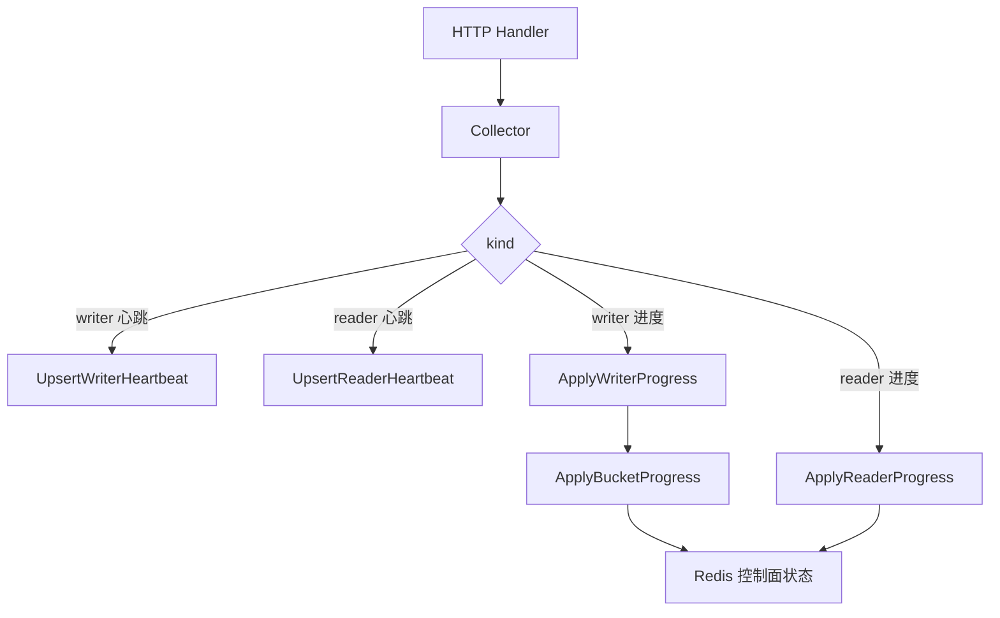

# Other — internal-collector

## 模块职责

`internal/collector` 是控制面接收运行时上报的写入入口，负责处理 Reader/Writer 的心跳与进度上报，并把请求转换为 `internal/store.Store` 的 Redis 写操作。

核心类型是 `Collector`：

```go
type Collector struct {
	st *store.Store
}

func New(st *store.Store) *Collector
```

`Collector` 本身不直接操作 Redis，也不做复杂状态聚合；它只负责按 `types.ProgressRequest.Kind` / `types.HeartbeatRequest.Kind` 分流，并统一补齐上报时间。

## 对外入口

### `Heartbeat`

```go
func (c *Collector) Heartbeat(ctx context.Context, req *types.HeartbeatRequest) error
```

`Heartbeat` 处理 `/api/v1/heartbeat`。它使用 `time.Now().UTC()` 作为当前心跳时间，然后根据 `req.Kind` 写入不同 worker 的心跳：

- `types.KindWriter`：调用 `Store.UpsertWriterHeartbeat(ctx, req.JobID, req, now)`
- `types.KindReader`：调用 `Store.UpsertReaderHeartbeat(ctx, req.JobID, req, now)`
- 其他值：返回 `unknown kind: <kind>`

Writer 心跳会写入 `writer_id`、`ip`、`port`、`buckets`、`buckets_assigned`、`last_hb`、`status`，并把 writer ID 加入 `cp:job:{jobId}:workers`。Reader 心跳写入 `reader_id`、`ip`、`port`、`last_hb`、`status`，并加入 `cp:job:{jobId}:readers`。

状态更新规则在 `store.heartbeatWorkerStatus` 中：如果当前 worker 已经是 `DONE` 或 `FAILED`，心跳不会把它改回 `RUNNING`；否则心跳会把状态设为 `RUNNING`。

### `ReportProgress`

```go
func (c *Collector) ReportProgress(ctx context.Context, req *types.ProgressRequest) error
```

`ReportProgress` 处理 `/api/v1/report_progress`。它先确定本次上报时间：

```go
progressTime := req.LastUpdateTime.UTC()
if progressTime.IsZero() {
	progressTime = time.Now().UTC()
}
```

之后按 worker 类型分流。

Writer 进度路径：

1. 调用 `Store.ApplyWriterProgress(ctx, req.JobID, req.WriterID, req.WorkerStatus, req.ErrorMessage, progressTime)` 写入 writer 实例级字段。
2. 遍历 `req.Buckets`。
3. 每个 bucket 优先使用 `BucketProgress.LastUpdateTime.UTC()`；如果为空，则回退到 `progressTime`。
4. 调用 `Store.ApplyBucketProgress(ctx, req.JobID, req.WriterID, &req.Buckets[i], bucketTime)` 写入 bucket 快照。

Reader 进度路径：

```go
c.st.ApplyReaderProgress(
	ctx,
	req.JobID,
	req.ReaderID,
	req.Files,
	req.BucketsSeen,
	req.WorkerStatus,
	req.ErrorMessage,
	progressTime,
)
```

Reader 进度会写入文件处理统计、`buckets_seen`、`last_update_time`、`error_message`，并在 `WorkerStatus` 合法时更新 reader 状态。



## Redis 写入模型

Collector 依赖 `internal/store` 的 key 约定：

- Job：`store.KeyJob(jobID)` → `cp:job:{jobID}`
- Writer：`store.KeyWriter(jobID, writerID)` → `cp:job:{jobID}:writer:{writerID}`
- Reader：`store.KeyReader(jobID, readerID)` → `cp:job:{jobID}:reader:{readerID}`
- Bucket：`store.KeyBucket(jobID, bucketID)` → `cp:job:{jobID}:bucket:{bucketID}`
- Writer 集合：`store.KeyWorkers(jobID)` → `cp:job:{jobID}:workers`
- Reader 集合：`store.KeyReaders(jobID)` → `cp:job:{jobID}:readers`
- 已完成 bucket 集合：`store.KeyDoneBucketIDs(jobID)` → `cp:job:{jobID}:done_bucket_ids`

`ReportProgress` 不等价于心跳。测试 `TestReportProgressDoesNotTouchWriterHeartbeat` 明确保护这一点：Writer 上报 bucket 进度时，不应覆盖 `ip`、`port`、`buckets`、`buckets_assigned`、`last_hb` 等心跳字段。进度上报只更新 `last_update_time`、worker 进度状态、错误信息以及 bucket 快照。

## 状态语义

worker 上报状态通过 `store.normalizeReportedWorkerStatus` 过滤，只接受以下值：

- `types.WorkerStateBooting`
- `types.WorkerStateRunning`
- `types.WorkerStateDone`
- `types.WorkerStateFailed`
- `types.WorkerStateLost`

空字符串或未知状态不会写入 `status` 字段。这允许 Writer/Reader 只上报进度数据，而不改变当前 worker 状态。

bucket 状态来自 `types.BucketProgress.Status`，常见值包括：

- `types.BucketStateRunning`
- `types.BucketStateMerging`
- `types.BucketStateWritingHDFS`
- `types.BucketStateDone`
- `types.BucketStateFailed`

当 `ApplyBucketProgress` 看到某个 bucket 从非 `DONE` 变为 `DONE` 时，会触发 `maybeMarkJobSucceeded`。该逻辑只对 `types.JobStateFinalizing` 的 Job 生效：如果 `cp:job:{jobId}:done_bucket_ids` 的数量达到 `num_buckets`，则调用 `MarkJobFinished` 把 Job 标记为 `types.JobStateSucceeded`，并写入 `finish_time`。

测试 `TestReportProgressAutoMarksJobSucceeded` 覆盖了这个行为：Job 初始为 `FINALIZING`，两个 bucket 都上报 `DONE` 后，`cp:job:j1` 的 `state` 会变为 `SUCCEEDED`，`finish_time` 使用最后完成 bucket 的 `LastUpdateTime`。

## 与 HTTP 层的关系

`internal/api` 中的 handler 负责请求解析和基础校验：

- `handleHeartbeat` 绑定 `types.HeartbeatRequest`，要求 `job_id` 和 `kind` 非空，然后调用 `s.collector.Heartbeat`。
- `handleReportProgress` 绑定 `types.ProgressRequest`，要求 `job_id` 和 `kind` 非空，然后调用 `s.collector.ReportProgress`。

Collector 不负责 HTTP 状态码、响应结构或请求绑定。成功时由 handler 返回：

- 心跳：`types.HeartbeatResponse{NextIntervalSec: s.cfg.Heartbeat.NextIntervalSec}`
- 进度：`types.ProgressResponse{Ack: true}`

## 测试覆盖点

`internal/collector/collector_test.go` 使用 `miniredis` 和 `goredis.NewClientWithServers` 构造真实 Redis 行为的单测环境。辅助函数 `newTestCollector` 创建：

- `Collector`
- `store.Store`
- `miniredis.Miniredis`
- 测试配置：`Heartbeat.TTLSec = 90`，`Job.TTLSec = 60`

现有测试重点保护三个约束：

- `TestReportProgressDoesNotTouchWriterHeartbeat`：Writer 进度上报不能污染心跳字段，也不能改写 `last_hb`。
- `TestReportProgressAutoMarksJobSucceeded`：`FINALIZING` Job 的所有 bucket 完成后自动变为 `SUCCEEDED`。
- `TestReportProgressStoresExplicitWorkerStatus`：Reader 显式上报 `WorkerStatus` 和 `ErrorMessage` 时，Redis 中对应 reader hash 必须持久化这些字段。

## 贡献注意事项

修改 `Collector.ReportProgress` 时，需要保持 Writer 和 Reader 的路径差异：Writer 有 bucket 级进度，Reader 主要是文件级进度和 `buckets_seen`。不要在进度上报路径中顺手刷新 `last_hb`，否则会破坏心跳 TTL/失联判断的语义。

修改状态流转时，应同时检查 `store.normalizeReportedWorkerStatus`、`store.heartbeatWorkerStatus`、`store.maybeMarkJobSucceeded` 和 collector 测试。尤其是 Job 自动成功逻辑只应该由 bucket 首次进入 `DONE` 触发，并且只对 `FINALIZING` 状态生效。