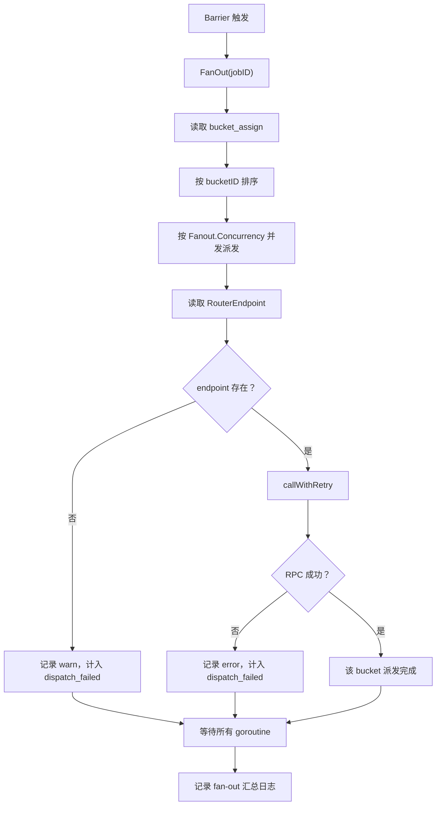

# Other — internal-finalizer

## 模块职责

`internal/finalizer` 负责在 Reader-Done Barrier 触发后，把收尾信号 fan-out 给每个 bucket 所属的 Writer 实例。它的核心动作是调用下游 Writer 的 `MarkBucketDone(ctx, endpoint, bucketID)`，通知 Writer 对对应 bucket 进入最终归并、写 HDFS 或上报终态流程。

该模块只做“派发收尾信号”，不直接决定 bucket 或 job 的最终成功失败状态。bucket 的 `DONE`、`FAILED` 等状态仍由 Writer 通过进度上报写入 Redis；job 是否 `SUCCEEDED` 由 `store.ApplyBucketProgress` 内部的 `maybeMarkJobSucceeded` 在所有 bucket 转为 `DONE` 后推进。

## 运行位置

生产入口在 `cmd/main.go` 中装配：

```go
writerCli, err := writerrpc.NewClient(
	cfg.WriterRPC.PSM,
	time.Duration(cfg.WriterRPC.TimeoutMs)*time.Millisecond,
)

fin, err := finalizer.New(st, cfg, writerCli)
w := barrier.New(st, cfg, fin)
go w.Start(rootCtx)
```

`barrier.Watcher` 在所有 Reader 状态都为 `DONE` 后，通过 `SetNXBarrierFired` 保证每个 job 只触发一次，然后调用：

```go
w.finalizer.FanOut(ctx, jobID)
```

## 核心类型

### `WriterRPCClient`

```go
type WriterRPCClient interface {
	MarkBucketDone(ctx context.Context, endpoint string, bucketID int) error
}
```

这是 `finalizer` 对 Writer RPC 层的最小依赖。模块不直接 import `internal/writerrpc`，避免形成包依赖环。真实实现是 `internal/writerrpc.Client`，它通过同名方法隐式实现该接口。

### `Finalizer`

```go
type Finalizer struct {
	st  *store.Store
	cfg *config.Config
	rpc WriterRPCClient
}
```

`Finalizer` 持有三类依赖：

- `store.Store`：读取 bucket 分配表和 Router endpoint。
- `config.Config`：读取 fan-out 并发、重试次数、RPC 超时。
- `WriterRPCClient`：向 Writer 发送 `MarkBucketDone`。

构造函数 `New(st, cfg, rpc)` 会显式拒绝 nil 依赖：

```go
if st == nil {
	return nil, errors.New("finalizer: nil store")
}
if cfg == nil {
	return nil, errors.New("finalizer: nil config")
}
if rpc == nil {
	return nil, errors.New("finalizer: nil WriterRPCClient")
}
```

这能避免启动后才发现 finalizer 静默不可用。

## FanOut 执行流程

`FanOut(ctx, jobID)` 是模块主入口。它的流程如下：



### 读取 bucket 分配

`FanOut` 先调用：

```go
assign, err := f.st.BucketAssignAll(ctx, jobID)
```

该方法读取 Redis hash：

```go
store.KeyBucketAssign(jobID)
// cp:job:{jobID}:bucket_assign
```

返回 `map[int]int`，表示 `bucketID -> writerIdx`。`finalizer` 当前只使用 map 的 key，也就是 bucket 列表；实际 Writer endpoint 来自 Router 既有 key。

如果 `BucketAssignAll` 返回错误，`FanOut` 直接返回错误。如果分配表为空，返回：

```go
errors.New("empty bucket_assign")
```

### 固定派发顺序

bucket id 会被排序：

```go
sort.Ints(bucketIDs)
```

这让 fan-out 的调度顺序稳定，便于日志排查和测试复现。实际 RPC 是并发执行的，因此完成顺序不保证与 bucket id 顺序一致。

### 并发控制

并发数来自：

```go
f.cfg.Fanout.Concurrency
```

如果配置小于等于 0，代码兜底为 `64`：

```go
if concurrency <= 0 {
	concurrency = 64
}
```

实现上使用 buffered channel 作为 semaphore：

```go
sem := make(chan struct{}, concurrency)
sem <- struct{}{}
go func() {
	defer func() { <-sem }()
	// 派发逻辑
}()
```

### endpoint 查找

每个 bucket 的 endpoint 通过：

```go
endpoint, _ := f.st.RouterEndpoint(ctx, jobID, bid)
```

`RouterEndpoint` 读取 Router 既有 key：

```go
store.KeyRouterBucket(jobID, bucketID)
// {jobID}:bucket:{bucketID padded to 5 digits}
```

例如 bucket 0 的 key 格式是：

```go
fmt.Sprintf("%s:bucket:%05d", jobID, 0)
```

如果 endpoint 为空，`FanOut` 只记录 warn 并增加 `dispatchFailed` 计数，不会调用 RPC，也不会改写 bucket 状态。

## 重试与超时

实际 RPC 调用封装在 `callWithRetry(ctx, endpoint, bucketID)` 中。

重试次数来自：

```go
f.cfg.Fanout.MaxRetries
```

如果配置小于等于 0，兜底为 `3`。

单次 RPC 超时来自：

```go
f.cfg.WriterRPC.TimeoutMs
```

如果配置小于等于 0，兜底为 `3 * time.Second`。

每次尝试都会创建独立的 timeout context：

```go
callCtx, cancel := context.WithTimeout(ctx, timeout)
err := f.rpc.MarkBucketDone(callCtx, endpoint, bucketID)
cancel()
```

失败后使用指数退避加随机抖动：

```go
backoff := time.Duration(1<<attempt) * 200 * time.Millisecond
jitter := time.Duration(rand.Int63n(int64(50 * time.Millisecond)))
```

如果父 `ctx` 在退避等待期间取消，`callWithRetry` 返回 `ctx.Err()`。

## 失败语义

`finalizer` 的失败语义比较克制：

- `BucketAssignAll` 读取失败：`FanOut` 返回错误。
- `bucket_assign` 为空：`FanOut` 返回 `empty bucket_assign`。
- 单个 bucket 缺少 endpoint：记录 warn，计入 `dispatch_failed`，`FanOut` 最终仍返回 nil。
- 单个 bucket RPC 多次失败：记录 error，计入 `dispatch_failed`，`FanOut` 最终仍返回 nil。
- bucket 状态不会因为 fan-out 失败被改成 `FAILED`。

测试文件明确覆盖了后两点：

- `TestFanOutMissingEndpointDoesNotMarkBucketFailed`
- `TestFanOutRPCErrorDoesNotMarkBucketFailed`

这两个测试都会先把 bucket 状态设为 `types.BucketStateRunning`，执行 `fin.FanOut(ctx, jobID)` 后断言 Redis 中 `status` 仍然是 `RUNNING`。

这种设计意味着 finalizer 不是状态裁决者。它只负责尽力通知 Writer；Writer 后续是否成功完成，仍通过常规进度上报路径体现。

## 与 `internal/writerrpc` 的关系

`internal/writerrpc.Client` 实现了 `WriterRPCClient`：

```go
func (c *Client) MarkBucketDone(ctx context.Context, endpoint string, bucketID int) error
```

它会为每个 endpoint 创建或复用一个 Kitex client，并用：

```go
kitexclient.WithHostPorts(normalized)
```

精确路由到目标 Writer 实例。`finalizer` 不关心 Kitex client 的创建、endpoint 规范化、业务错误码翻译；这些都封装在 `writerrpc` 中。

## 与 `internal/store` 的关系

`finalizer` 主要依赖以下 store 方法：

- `BucketAssignAll(ctx, jobID)`：读取 `cp:job:{jobID}:bucket_assign`。
- `RouterEndpoint(ctx, jobID, bucketID)`：读取 Router 注册的 bucket endpoint。
- `Client()`：仅测试中直接读取底层 Redis，验证 bucket 状态未被错误改写。

测试辅助函数 `newTestStore(t)` 使用 `miniredis` 和 `goredis.NewUnitTestOption()` 创建隔离 Redis 环境，并通过：

```go
store.New(cli, cfg)
```

构造真实 `store.Store`，避免 mock 掉 Redis key 行为。

## 测试结构

`finalizer_test.go` 使用 `stubWriterRPCClient` 替代真实 Writer RPC：

```go
type stubWriterRPCClient struct {
	calls int
	err   error
}

func (s *stubWriterRPCClient) MarkBucketDone(context.Context, string, int) error {
	s.calls++
	return s.err
}
```

两个关键测试关注边界行为：

- 缺少 Router endpoint 时，`rpc.calls == 0`，bucket 保持 `RUNNING`。
- RPC 持续返回错误时，调用次数等于 `Fanout.MaxRetries`，bucket 仍保持 `RUNNING`。

这组测试保护了一个重要约束：fan-out 派发失败不能被 finalizer 解释为业务失败。业务终态必须来自 Writer 的进度上报。