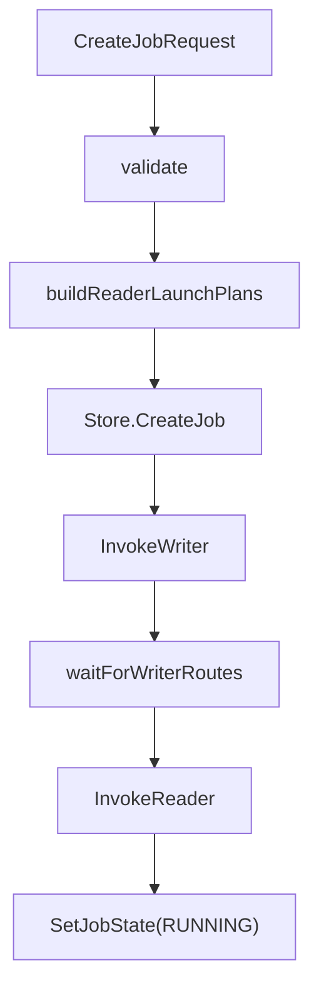

# Other — internal-job

## internal/job 模块

`internal/job` 是控制面创建任务的编排层，负责把 `types.CreateJobRequest` 转换成可执行的 Writer/Reader 启动计划，并把任务元数据写入 Redis。模块的主入口是 `Manager.CreateJob`，它连接了三类依赖：

- `store.Store`：持久化 job、bucket 分配表和 worker 元数据。
- `scheduler.FaaSLauncher`：通过 `InvokeWriter`、`InvokeReader` 拉起 Writer/Reader 实例。
- `fileScanner`：扫描 HDFS 或 TOS 输入文件，生成 Reader 文件分片。



### 创建任务流程

`Manager.CreateJob(ctx, req)` 按同步编排流程执行：

1. 调用 `validate` 校验请求。
2. 生成 `jobID`，并用 `buildHDFSOutputPath`、`buildWriterHDFSTempDir` 写入 `req.HDFSOutputPath` 和 `req.HDFSTempDir`。
3. 调用 `buildReaderLaunchPlans` 扫描输入文件并切分 Reader 文件分片。
4. 用 `BuildBucketAssign(numBuckets, numWriters)` 生成 `bucketID -> writerIdx` 分配表。
5. 调用 `Store.CreateJob` 写入 job hash、`bucket_assign`、active/all job 集合。此时 job 状态是 `types.JobStatePending`。
6. 按 writer index 依次调用 `scheduler.InvokeWriter`，每个 Writer 的 bucket 列表来自 `bucketIDsForWriterIdx`。
7. 所有 Writer 拉起成功后，调用 `Store.CreateWorkerMetadata` 写入 Writer 元数据。
8. 调用 `waitForWriterRoutes` 轮询 `Store.AllRouterBucketsRegistered`，等待所有 `KeyRouterBucket(jobID, bucketID)` 路由注册完成。
9. 路由齐备后，逐个构造 `scheduler.ReaderInvokeArgs` 并调用 `scheduler.InvokeReader`。
10. Reader 全部拉起成功后，写入 Reader 元数据，并调用 `Store.SetJobState(..., types.JobStateRunning)`。

任何 Writer/Reader 拉起失败、worker id 为空、worker 元数据写入失败或 writer route 等待超时，都会调用 `Store.MarkJobFinished(..., types.JobStateFailed, ...)` 标记任务失败。

### Writer 分桶模型

`BuildBucketAssign(numBuckets, numWriters)` 使用固定规则：

```go
writerIdx = bucketID % numWriters
```

例如 `BuildBucketAssign(8, 3)` 生成：

```text
0->0, 1->1, 2->2, 3->0, 4->1, 5->2, 6->0, 7->1
```

`bucketIDsForWriterIdx(numBuckets, numWriters, writerIdx)` 生成某个 Writer 承载的 bucket 列表。例如 8 个 bucket、3 个 writer 时：

- writer 0: `0, 3, 6`
- writer 1: `1, 4, 7`
- writer 2: `2, 5`

这些 bucket id 会通过 `scheduler.BucketIDsFromInts` 转成字符串，写入 `scheduler.WriterInvokeArgs.BucketIDs`。

### 输出路径

`buildHDFSOutputPath(baseDir, partitions)` 负责生成最终输出目录：

- 无分区时，去掉末尾 `/` 后返回 `baseDir`。
- 有分区时，按请求顺序追加 `key=value` 路径段。

示例：

```text
/warehouse/user_log + [{dt,2025-12-31},{hr,23}]
=> /warehouse/user_log/dt=2025-12-31/hr=23
```

`buildWriterHDFSTempDir(baseDir, jobID)` 生成 Writer staging 目录：

```text
/output + job-1 => /output/_staging/job-1
hdfs://haruna/path/ + job-2 => hdfs://haruna/path/_staging/job-2
```

URI 形式会用 `net/url` 解析并通过 `path.Join` 修改 `Path`，因此要求同时包含 scheme 和 host。

### Reader 启动计划

`buildReaderLaunchPlans` 根据 `req.SourceType` 分两条路径。

#### HDFS Parquet

`types.SourceTypeHDFSParquet` 支持两种输入方式：

- `source.extract.file_paths`：显式文件列表。
- `source.hdfs_root` + `source.file_glob`：扫描 HDFS 目录。

显式文件列表会经过 `normalizeHDFSFilePaths`，它要求每个路径都能被 `parseHDFSURI` 解析成 `hdfs://namenode/path`，并按字典序排序。

目录扫描由 `fileScanner.ScanHDFSFiles(ctx, rootPath, fileGlob)` 完成。默认实现 `sdkFileScanner.ScanHDFSFiles` 会：

- 使用 `parseHDFSURI` 拆出 NameNode 和路径。
- 通过 HDFS SDK `hdfs.Connect`、`fs.List` 列目录。
- 跳过目录、`_SUCCESS`、`.`、`..` 和以 `.` 开头的文件。
- `file_glob` 为空时只保留 basename 以 `part` 开头的文件。
- `file_glob` 非空时用 `path.Match` 匹配 basename。
- 返回排序后的完整文件路径。

Reader 数量会被限制为 `min(req.Concurrency.NumReaders, len(files))`，避免生成空文件分片。实际生效的 Reader 数会写回持久化请求快照中的 `concurrency.num_readers`。

#### TOS Inventory CSV

`types.SourceTypeTOSInventoryCSV` 支持单源 `req.Source`，也支持额外的 `req.Sources`。`flattenCreateJobSources` 会把它们展开成带标签的 `sourceRef`，标签用于错误信息，例如 `source`、`sources[0]`。

每个 source 支持两种 CSV 输入方式：

- `source.extract.csv_uris`：显式 CSV URI 列表。
- `source.tos_csv_root`：扫描 TOS 前缀。

`resolveTOSInventoryCSVFiles` 会对显式 `CSVURIs` 去空白、拒绝空字符串、排序；如果没有显式列表，则调用 `ScanTOSFiles` 扫描 root。

多 TOS root 场景下，`buildTOSInventoryCSVReaderLaunchPlans` 有两个重要约束：

- 任意 root 没有 CSV 文件都会报错，错误中包含空 root 描述。
- `concurrency.num_readers` 必须大于等于非空 source 数量，保证每个 source 至少一个 Reader。

Reader 数按文件数分配：`allocateReadersByFileCount` 先给每个 source 分配 1 个 Reader，再按各 source 的可切分容量分配剩余 Reader。每个 source 内部通过 `partitionFilePaths` 做连续分片。

### TOS 文件扫描

默认扫描器是 `sdkFileScanner`。`parseTOSURI` 同时接受两种 root 写法：

```text
tos://bucket/path/to/root
bucket/path/to/root
```

解析结果会规范化为：

- `Bucket`: bucket 名。
- `Prefix`: 去掉首尾 `/` 后追加一个尾部 `/`，非空前缀始终以 `/` 结束。

`ScanTOSFiles` 使用 StorageGW `ListObjectsWithContext` 分页列对象：

- page size 默认 `1000`，可由 `cfg.StorageGW.ListPageSize` 覆盖。
- 每页传入 `bucket`、`prefix`、`startAfter` 和 `maxKeys`。
- 如果 `ListObjectsInfo.IsTruncated` 为真，优先用 `ListObjectsInfo.StartAfter` 作为下一页游标；为空时退回到当前页最后一个 object key。
- 游标为空或没有推进时返回分页错误，避免死循环。

`shouldSkipTOSObject` 会跳过：

- 空 key。
- 不在目标 prefix 下的 key。
- basename 为 `_SUCCESS`、`.`、`..` 或以 `.` 开头的对象。
- 以 `/` 结尾的目录 marker。
- basename 后缀不是 `.csv` 的对象。

注意：后缀判断只接受 `.csv`，当前实现不会把 `.csv.gz` 作为扫描结果保留；如果需要支持压缩 CSV root 扫描，需要修改 `shouldSkipTOSObject`。

StorageGW 客户端由 `getStorageGWClient` 懒加载。配置了 `cfg` 时，必须提供 `cfg.StorageGW.AccessKey` 和 `cfg.StorageGW.SecretKey`，否则返回 `storagegw credentials are not configured`。可选项包括 `StorageGW.Cluster`、`StorageGW.IDC` 和 `StorageGW.PSM`。

### Reader/Writer 启动参数

`buildWriterInvokeArgs` 生成 `scheduler.WriterInvokeArgs`：

- `JobID`
- `BucketIDs`
- `HDFSOutputPath`
- `HDFSTempDir`
- `SkipStartupCheck`
- `Sort`
- `ControlPlane`
- `Router`
- `Lambda`

默认值来源：

- Writer control plane endpoint：`cfg.Lambda.ControlPlaneEndpoint`
- Writer control plane PSM：`cfg.Lambda.ControlPlanePSM`
- Writer control plane cluster：`cfg.Lambda.ControlPlaneCluster`
- heartbeat interval：`cfg.Heartbeat.NextIntervalSec`
- progress report interval：常量 `defaultWriterProgressReportIntervalSec`，值为 `60`
- router cluster：`cfg.Redis.Cluster`，为空时用 `cfg.Redis.Addrs` 拼接
- router key prefix：`jobID`
- router TTL：`max(300, cfg.Heartbeat.TTLSec)`

`buildReaderInvokeArgs` 生成 `scheduler.ReaderInvokeArgs`。公共部分包括：

- `SourceType`
- `Bucketing`
- `Limits`
- `Sink`
- `ControlPlane`
- `Lambda`

当 `Bucketing.HashAlg` 为空时，默认设置为 `"hive"`。

HDFS Parquet 必须提供 `source.extract.store_uri_field`，否则构造 Reader 参数时报错。TOS Inventory CSV 会透传 `TaskType`、`Bucket`、各列名以及 `CSVFormat`。

`buildReaderSinkInput` 默认 sink 类型为 `"writer_rpc"`。当 sink 是 `writer_rpc` 时：

- `WriterServiceName` 默认取 `cfg.WriterRPC.PSM`
- Redis cluster 默认取 `redisCluster()`
- Redis key prefix 默认取 `jobID`
- connect/rpc timeout 默认由 `cfg.WriterRPC.TimeoutMs` 向上换算成秒

### 校验规则

`validate` 检查通用必填项：

- `source_type`
- `output.hdfs_dir`
- `bucketing.num_buckets > 0`
- `concurrency.num_writers > 0`
- `concurrency.num_readers > 0`

`hdfs_parquet` 要求 `source.hdfs_root` 或 `source.extract.file_paths` 至少一个存在。

`tos_inventory_csv` 对每个展开后的 source 调用 `validateTOSInventoryCSVSource`：

- `tos_csv_root` 或 `extract.csv_uris` 至少一个存在。
- `create_timestamp_column` 与 `create_time_str_column` 不能同时设置。
- `task_type` 只支持空值或 `types.TOSInventoryTaskTypeManifestExpand`。
- `task_type=manifest_expand` 时必须设置 `content_type_column`。
- 如果 `store_uri_column` 为空，则必须设置 `key_column` 和 `bucket`。

### 与其他包的关系

`internal/job` 不直接处理 HTTP 请求，也不直接实现真实 FaaS 平台调用。它依赖的边界都通过接口或 DTO 表达：

- 请求/响应和 source/runtime 配置来自 `internal/types`。
- Redis key 和持久化行为来自 `internal/store`，例如 `KeyJob`、`KeyWriter`、`KeyReader`、`KeyRouterBucket`。
- Worker 启动协议来自 `internal/scheduler`，例如 `WriterInvokeArgs`、`ReaderInvokeArgs`、`FaaSLauncher`。
- 默认值来自 `internal/config.Config`，尤其是 `Heartbeat`、`Job`、`WriterRPC`、`Lambda`、`Redis`、`StorageGW`。

修改这个模块时，重点保持三个契约稳定：持久化请求快照应反映实际 Reader 数，Writer route 未就绪前不能拉起 Reader，启动失败必须把 job 标记为 `FAILED`。