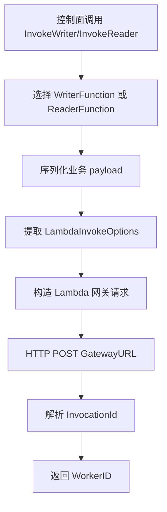

# Other — internal-scheduler

## internal/scheduler 模块

`internal/scheduler` 封装控制面拉起 Reader/Writer FaaS 实例的能力。它不直接实现任务调度循环，而是定义控制面与执行侧之间的启动契约：控制面组装 `WriterInvokeArgs` 或 `ReaderInvokeArgs`，通过 `FaaSLauncher` 拉起远端实例，并获得可用于后续跟踪的 `WorkerID`。

模块提供两类实现：

- `LogLauncher`：本地联调和单元测试用的 stub，只打印日志并生成随机 worker id。
- `LambdaLauncher`：真实通过 Lambda 网关发起 HTTP invoke，用于拉起配置中的 Reader/Writer 函数。

## 核心接口

`FaaSLauncher` 是上层依赖的最小接口：

```go
type FaaSLauncher interface {
	InvokeWriter(ctx context.Context, args WriterInvokeArgs) (*WriterInstance, error)
	InvokeReader(ctx context.Context, args ReaderInvokeArgs) (*ReaderInstance, error)
}
```

上层只需要依赖该接口，不需要关心当前使用的是日志 stub 还是真实 Lambda 网关。`WriterInstance` 和 `ReaderInstance` 当前都只暴露 `WorkerID`，表示 FaaS 平台创建出的实例标识。

## 启动参数模型

`WriterInvokeArgs` 是拉起 Writer 的 payload：

```go
type WriterInvokeArgs struct {
	JobID            string                  `json:"job_id"`
	BucketIDs        []string                `json:"bucket_ids"`
	HDFSOutputPath   string                  `json:"hdfs_output_path,omitempty"`
	HDFSTempDir      string                  `json:"hdfs_temp_dir,omitempty"`
	SkipStartupCheck bool                    `json:"skip_startup_check,omitempty"`
	Sort             WriterSortInput         `json:"sort,omitempty"`
	ControlPlane     WriterControlPlaneInput `json:"control_plane,omitempty"`
	Router           WriterRouterInput       `json:"router,omitempty"`
	Lambda           LambdaInvokeOptions     `json:"-"`
}
```

`ReaderInvokeArgs` 是拉起 Reader 的 payload，支持 HDFS Parquet 和 TOS Inventory CSV 两类输入：

```go
type ReaderInvokeArgs struct {
	JobID           string                   `json:"job_id,omitempty"`
	SourceType      string                   `json:"source_type"`
	HDFSParquet     *ReaderHDFSParquetInput  `json:"hdfs_parquet,omitempty"`
	TOSInventoryCSV *ReaderTOSInventoryInput `json:"tos_inventory_csv,omitempty"`
	Bucketing       ReaderBucketingInput     `json:"bucketing"`
	Limits          ReaderLimitsInput        `json:"limits,omitempty"`
	Sink            *ReaderSinkInput         `json:"sink,omitempty"`
	ControlPlane    *ReaderControlPlaneInput `json:"control_plane,omitempty"`
	Lambda          LambdaInvokeOptions      `json:"-"`
}
```

需要注意 `Lambda` 字段带有 `json:"-"`，不会进入 Reader/Writer 函数的业务 payload。它只用于控制 Lambda 网关层面的 invoke 选项，例如 `LambdaInvokeOptions.Cluster` 会被转换为网关请求里的 `Annotations.Cluster`。

## LambdaLauncher 工作流

`NewLambdaLauncher(cfg *config.Config)` 从 `config.Config.Lambda` 读取网关配置，并创建带超时的 `http.Client`。如果 `cfg.Lambda.TimeoutMs <= 0`，默认使用 5 秒超时。

`InvokeWriter` 和 `InvokeReader` 都委托给内部的 `invoke`：



网关请求结构由 `lambdaInvokeRequest` 表示：

```go
type lambdaInvokeRequest struct {
	FuncName    string                   `json:"FuncName"`
	Qualifier   string                   `json:"Qualifier"`
	InvokeType  string                   `json:"InvokeType"`
	Payload     string                   `json:"Payload"`
	Annotations *lambdaInvokeAnnotations `json:"Annotations,omitempty"`
}
```

关键行为：

- `FuncName` 来自 `cfg.Lambda.WriterFunction` 或 `cfg.Lambda.ReaderFunction`。
- `Qualifier` 来自 `cfg.Lambda.Qualifier`。
- `InvokeType` 会通过 `strings.ToLower` 转为小写。
- `Payload` 是已经 JSON 序列化后的字符串，而不是嵌套对象。
- 当 `LambdaInvokeOptions.Cluster` 非空时，写入 `Annotations.Cluster`。
- 响应中的 `response.InvocationId` 会被转换成 `WorkerID`，格式为 `InvocationId + ":1"`。
- 响应中的 `ExecutedVersion` 会被解析到 `lambdaInvokeResponse`，但当前未参与返回值或校验。

## 错误处理

`LambdaLauncher.invoke` 对以下情况返回错误：

- `LambdaLauncher` 或其 `cfg` 为 `nil`。
- payload 序列化失败。
- Lambda invoke request 序列化失败。
- `http.NewRequestWithContext` 创建请求失败。
- HTTP 请求失败。
- HTTP 状态码不是 `200 OK`。
- 网关响应 JSON 解码失败。
- 网关响应 `code != 0`。
- `response.InvocationId` 为空。

网关业务失败时，错误信息会包含函数名、`code`、`message` 和 `trace_id`，便于定位远端 Lambda 网关问题。

## LogLauncher

`LogLauncher` 是本地实现：

```go
func NewLogLauncher() *LogLauncher
```

`InvokeWriter` 会生成形如 `writer-<uuid>` 的 worker id，并记录 job、bucket 数量和输出路径。`InvokeReader` 会生成形如 `reader-<uuid>` 的 worker id，并记录 job、source type、bucket 数量和输入文件数量。

`readerFilePathsForLog` 只用于日志统计：

- `HDFSParquet != nil` 时返回 `HDFSParquet.FilePaths`。
- `TOSInventoryCSV != nil` 时返回 `TOSInventoryCSV.CSVURIs`。
- 两者都为空时返回 `nil`。

## 配置依赖

真实 Lambda 调用依赖 `internal/config.Config` 中的 `Lambda` 配置：

```go
type Lambda struct {
	GatewayURL           string `yaml:"GatewayURL"`
	ReaderFunction       string `yaml:"ReaderFunction"`
	WriterFunction       string `yaml:"WriterFunction"`
	Qualifier            string `yaml:"Qualifier"`
	InvokeType           string `yaml:"InvokeType"`
	TimeoutMs            int    `yaml:"TimeoutMs"`
	ControlPlaneEndpoint string `yaml:"ControlPlaneEndpoint"`
	ControlPlanePSM      string `yaml:"ControlPlanePSM"`
	ControlPlaneCluster  string `yaml:"ControlPlaneCluster"`
}
```

`config.applyDefaults` 会为 Lambda 配置补默认值，例如默认网关地址、`uri_source_reader`、`uri_writer`、`prod`、`async` 和 5000ms 超时。`LambdaLauncher` 本身只消费其中的 `GatewayURL`、函数名、`Qualifier`、`InvokeType` 和 `TimeoutMs`。

## Lambda 注解测试

`TestLambdaLauncherInvokeWriterPassesClusterAnnotation` 覆盖了 Writer invoke 的关键契约：

- 使用 `httptest.NewServer` 模拟 Lambda 网关。
- 构造 `NewLambdaLauncher(&config.Config{Lambda: ...})`。
- 调用 `InvokeWriter`，传入 `WriterInvokeArgs` 和 `LambdaInvokeOptions{Cluster: "default_test_lq"}`。
- 断言网关请求中的 `Annotations.Cluster` 被正确设置。
- 断言业务 `Payload` 中不包含 `"Lambda"`，说明 `json:"-"` 生效。
- 断言 `Payload` 中仍包含业务字段，例如 `"job_id":"job-1"`。
- 断言返回的 `WorkerID` 为 `"inv-1:1"`。

这个测试保护了一个容易破坏的边界：Lambda invoke 选项属于网关元数据，不应该泄露给 Reader/Writer 的业务 payload。