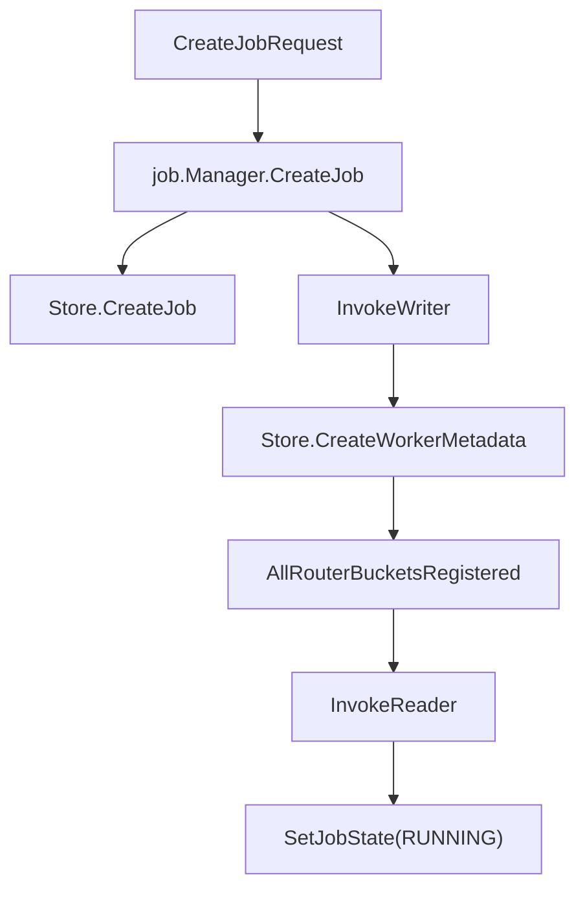

# Other — internal-store

## 模块概览

`internal/store` 是控制面对 Redis 的唯一持久化访问层。它把任务元数据、worker 状态、bucket 进度、reader barrier、告警记录和清理逻辑封装在 `Store` 上，调用方不直接拼 Redis key 或散落执行 Redis 命令。

核心类型：

- `Store`：持有 `*goredis.Client` 和 `*config.Config`。
- `JobMeta`：写入 `cp:job:{jobId}` 的任务静态元数据。
- `WorkerMeta`：写入 writer/reader hash 的静态 worker 元数据。

该模块使用字节内部 `code.byted.org/kv/goredis/v5`。代码模式接近 go-redis v6：通过 `client.WithContext(ctx)` 派生带上下文的 client，命令返回 `*redis.XxxCmd`，空值用 `redisv6.Nil` 判断。

## Redis Key 模型

所有 key 构造函数集中在 `keys.go`，调用方应始终使用这些函数，避免手写字符串。

| 函数 | Redis key | 用途 |
| --- | --- | --- |
| `KeyJob(jobID)` | `cp:job:{jobId}` | job 主 hash |
| `KeyBucketAssign(jobID)` | `cp:job:{jobId}:bucket_assign` | bucket 到 writer index 的路由表 |
| `KeyWriter(jobID, writerID)` | `cp:job:{jobId}:writer:{writerID}` | writer hash |
| `KeyReader(jobID, readerID)` | `cp:job:{jobId}:reader:{readerID}` | reader hash |
| `KeyBucket(jobID, bucketID)` | `cp:job:{jobId}:bucket:{bucketID}` | bucket 进度快照 |
| `KeyWorkers(jobID)` | `cp:job:{jobId}:workers` | writer ID 集合 |
| `KeyReaders(jobID)` | `cp:job:{jobId}:readers` | reader ID 集合 |
| `KeyDoneBucketIDs(jobID)` | `cp:job:{jobId}:done_bucket_ids` | 已完成 bucket 去重集合 |
| `KeyJobsActive()` | `cp:jobs:active` | 活跃 job 集合 |
| `KeyJobsAll()` | `cp:jobs:all` | 当前 Redis 中保留的全部 job 集合 |
| `KeyAlerts(jobID)` | `cp:job:{jobId}:alerts` | job 告警列表 |
| `KeyBarrierFired(jobID)` | `cp:job:{jobId}:barrier_fired` | reader barrier 单次触发标记 |
| `KeyRouterBucket(jobID, bucketID)` | `{jobId}:bucket:%05d` | writer router 已有注册 key，控制面只读 |

`KeyRouterBucket` 不使用 `cp:` 前缀，这是 writer/router 侧已有格式。`Store` 只通过 `AllRouterBucketsRegistered` 和 `RouterEndpoint` 读取它，用于等待 writer 路由就绪和 fan-out 定点调用。

## 初始化和 Redis 客户端

`New(rdb, cfg)` 只包装已有的 `*goredis.Client` 和配置。真实服务通常先调用 `NewClient(cfg)` 创建 Redis 客户端，再构造 `Store`。

`NewClient(cfg)` 支持两种连接方式：

1. `cfg.Redis.Cluster` 非空：调用 `goredis.NewClientWithOption`，走 goredis 服务发现，并设置 1 秒级别的 dial/read/write/pool timeout。
2. `cfg.Redis.Cluster` 为空但 `cfg.Redis.Addrs` 非空：调用 `goredis.NewClientWithServers` 直连显式地址。该路径会关闭 GDPR 校验、auto-load conf 和 consul service discovery，适合本地和单测。

测试里通过 `newTestStore` 使用 `miniredis` 和 `goredis.NewUnitTestOption()` 创建本地 Redis，避免依赖真实集群。

## 任务创建流程

`internal/job.Manager.CreateJob` 是任务编排入口，`internal/store.Store.CreateJob` 负责把编排结果落到 Redis。

`CreateJob(ctx, jobID, meta, bucketAssign)` 写入：

- `cp:job:{jobId}` hash：`state`、`request`、`hdfs_output_path`、`hdfs_temp_dir`、`num_buckets`、`num_writers`、`num_readers`、`create_time`。
- `cp:job:{jobId}:bucket_assign` hash：字段名是 bucket ID，字段值是 writer index。
- `cp:jobs:active` set。
- `cp:jobs:all` set。

`bucketAssign` 会按 4096 个 entry 分批 `HMSet`，避免单次写入过大。`cfg.Job.TTLSec > 0` 时，`KeyJob` 和 `KeyBucketAssign` 会设置 TTL。worker hash、bucket hash、reader hash 默认不在创建或上报时设置 TTL。

## Worker 元数据和心跳

`CreateWorkerMetadata(ctx, jobID, workers)` 批量写入成功拉起的 worker 静态信息：

- writer 写入 `writer_id`、`writer_idx`，加入 `KeyWorkers(jobID)`，并用 `HSetNX` 把 `status` 初始化为 `BOOTING`。
- reader 写入 `reader_id`、`reader_idx`，加入 `KeyReaders(jobID)`，并用 `HSetNX` 把 `status` 初始化为 `BOOTING`。

该函数会校验：

- `jobID` 不能为空。
- `WorkerMeta.ID` 不能为空。
- `WorkerMeta.Idx` 不能小于 0。
- `WorkerMeta.Kind` 只能是 `types.KindWriter` 或 `types.KindReader`。

`UpsertWriterHeartbeat` 和 `UpsertReaderHeartbeat` 处理 `/api/v1/heartbeat` 的写入：

- writer 心跳写入 `writer_id`、`ip`、`port`、`buckets`、`buckets_assigned`、`last_hb`、`status`。
- reader 心跳写入 `reader_id`、`ip`、`port`、`last_hb`、`status`。
- writer/reader 都会加入对应集合。
- 心跳不会设置 Redis key TTL。

状态更新通过 `heartbeatWorkerStatus(currentStatus)` 保护终态：如果当前状态已经是 `DONE` 或 `FAILED`，心跳不会把它改回 `RUNNING`；否则心跳状态为 `RUNNING`。

## 进度写入

`internal/collector.Collector.ReportProgress` 根据 `ProgressRequest.Kind` 分流：

- writer：先调用 `ApplyWriterProgress`，再对每个 `BucketProgress` 调用 `ApplyBucketProgress`。
- reader：调用 `ApplyReaderProgress`。

### Writer 进度

`ApplyWriterProgress(ctx, jobID, writerID, workerStatus, errorMessage, progressTime)` 更新 writer 实例级字段：

- `writer_id`
- `last_update_time`
- `error_message`
- `status`，仅当 `workerStatus` 能被 `normalizeReportedWorkerStatus` 识别时写入

如果 `writerID` 为空，函数直接返回 `nil`。这是一个容错路径，避免空 writer 上报制造无效 key。

### Bucket 进度

`ApplyBucketProgress(ctx, jobID, writerID, p, progressTime)` 把单个 bucket 的完整快照写入 `KeyBucket(jobID, bucketID)`：

- `writer_id`
- `status`
- `total_uris`
- `bytes`
- `run_files`
- `peak_local_disk_mb`
- `merge_progress`
- `hdfs_write_progress`
- `final_path`
- `final_size`
- `last_update`

数值字段以字符串形式写入 Redis。浮点进度使用 `strconv.FormatFloat(..., 'f', 4, 64)`，因此 Redis 中保存为四位小数，例如 `1.0000`。

如果 `writerID` 非空，该函数还会刷新对应 writer hash 的 `writer_id` 和 `last_update_time`，并把 writer 加入 `KeyWorkers(jobID)`。

当 bucket 状态从非 `DONE` 变为 `DONE` 时，`shouldCheckJobSuccessOnBucketUpdate(prevStatus, newStatus)` 返回 `true`，随后调用 `maybeMarkJobSucceeded`。重复上报同一个已完成 bucket 不会重复推进成功判定。

### Reader 进度

`ApplyReaderProgress(ctx, jobID, readerID, files, bucketsSeen, workerStatus, errorMessage, progressTime)` 更新 reader hash：

- `reader_id`
- `buckets_seen`
- `last_update_time`
- `error_message`
- `files_total`、`files_done`、`rows_read`、`bytes_read`，仅当 `files != nil` 时写入
- `status`，仅当 `workerStatus` 是合法 worker 状态时写入

该函数也会把 reader 加入 `KeyReaders(jobID)`，但不会设置 TTL。

## Job 成功判定

job 成功不是由 reader 直接决定，而是由 reader barrier 触发 writer fan-out 后，writer 逐个 bucket 上报 `DONE` 来完成。

流程如下：

1. `barrier.Watcher` 周期扫描 `ActiveJobIDs()`。
2. `barrier.AllReadersDone` 调用 `AllReaderStatuses`。
3. reader 全部为 `DONE` 时，`SetNXBarrierFired` 设置一次性 barrier key。
4. barrier 把 job 状态置为 `FINALIZING`，并调用 `finalizer.FanOut`。
5. finalizer 通过 `BucketAssignAll` 获取 bucket 列表，通过 `RouterEndpoint` 找 writer 端点并调用 writer。
6. writer 上报 bucket `DONE`。
7. `ApplyBucketProgress` 调用 `maybeMarkJobSucceeded`。
8. 当 `KeyDoneBucketIDs(jobID)` 的集合大小等于 `num_buckets`，`MarkJobFinished(jobID, SUCCEEDED, finishTime)` 写终态并从 `cp:jobs:active` 移除。

`maybeMarkJobSucceeded` 只在 job 当前状态为 `FINALIZING` 时推进成功。若 job 已经是 `SUCCEEDED`、`FAILED` 或 `CANCELLED`，不会被 bucket 上报覆盖。若 job 仍是 `RUNNING`，即使某个 bucket 上报 `DONE`，也不会提前把 job 标记成功。

`KeyDoneBucketIDs` 使用 set 去重，因此同一个 bucket 重复上报 `DONE` 不会导致完成计数膨胀。

## Reader 状态有效性

`AllReaderStatuses(ctx, jobID)` 返回 job 下所有 reader 的有效状态，而不是简单返回 Redis 中的原始 `status` 字段。

状态计算由 `effectiveWorkerStatus(status, lastHBUnix, now, ttlSec)` 完成：

- 空状态视为 `LOST`。
- `DONE` 和 `FAILED` 是终态，即使 `last_hb` 过期也保持原状态。
- 非终态如果没有有效 `last_hb`，视为 `LOST`。
- `cfg.Heartbeat.TTLSec > 0` 且心跳超时，视为 `LOST`。
- 其他情况返回原状态，例如 `RUNNING` 或 `BOOTING`。

这个逻辑直接影响 `barrier.AllReadersDone`：只有所有 reader 的有效状态都是 `DONE` 时，barrier 才会触发 fan-out。

## 查询接口支持

`internal/api` 使用 `Store` 聚合 job 详情和列表展示。常用读取方法包括：

- `JobIDs(ctx)`：从 `cp:jobs:all` 读取并排序返回全部 job ID，不使用 `SCAN`，避免 Redis mesh 不支持的问题。
- `ActiveJobIDs(ctx)`：读取 `cp:jobs:active`。
- `JobMetaRaw(ctx, jobID)`：读取 job hash；hash 不存在时返回 `job {id} not found`。
- `ListWorkerIDs(ctx, jobID)` / `ListReaderIDs(ctx, jobID)`：读取 worker/reader ID 集合。
- `WorkerHashes(ctx, jobID, kind, ids)`：批量读取 writer 或 reader hash。
- `BucketHashes(ctx, jobID, bucketIDs)`：批量读取 bucket hash。
- `BucketStatuses(ctx, jobID, bucketIDs)`：只批量读取 bucket 的 `status` 字段。
- `BucketAssignAll(ctx, jobID)`：解析 `bucket_assign` hash，返回 `map[int]int`。

批量方法统一使用 Redis pipeline，避免 detail 接口按 worker 或 bucket 逐个往返 Redis。空 hash 会被跳过，因此返回 map 只包含实际存在的对象。

## Router 和 Finalizer 相关方法

`AllRouterBucketsRegistered(ctx, jobID, numBuckets)` 用 pipeline 检查 `0..numBuckets-1` 每个 `KeyRouterBucket` 是否存在。`job.Manager.CreateJob` 在拉起 writer 后调用它，确保 writer router 端点都注册完成，再启动 reader。

`RouterEndpoint(ctx, jobID, bucketID)` 读取单个 router endpoint。Redis 返回 `redisv6.Nil` 时，该方法返回空字符串和 `nil` error。`finalizer.FanOut` 会把空 endpoint 视为该 bucket dispatch 失败。

`SetBucketStatus(ctx, jobID, bucketID, status)` 是直接覆盖 bucket 状态的轻量方法，主要用于 fan-out 失败等需要标记 bucket 状态的场景。

## 告警和 Barrier 幂等

`AppendAlert(ctx, jobID, payload)` 使用 `LPUSH` 写入 `KeyAlerts(jobID)`，随后 `LTRIM 0 999`，只保留最近 1000 条告警。

`SetNXBarrierFired(ctx, jobID)` 对 `KeyBarrierFired(jobID)` 执行 `SETNX 1 EX 86400`。返回值含义：

- `true`：本次首次设置成功，可以触发 finalizer。
- `false`：之前已经触发过，调用方应跳过。

这个 key 的 24 小时 TTL 用于防止 barrier watcher 重复 fan-out，同时避免永久残留。

## 清理逻辑

`PurgeAllJobs(ctx)` 删除控制面已知的全部 job 及关联元数据，返回清理的 job 数量。

它先通过 `allKnownJobIDs` 合并：

- `JobIDs(ctx)` 从 `cp:jobs:all` 取到的 job。
- `ActiveJobIDs(ctx)` 从 `cp:jobs:active` 取到的 job。

然后对每个 job 调用 `keysForJobPurge` 收集待删除 key：

- job 主 hash、bucket assign、workers/readers 集合。
- done bucket set、alerts、barrier fired key。
- 每个 writer hash。
- 每个 reader hash。
- 每个 bucket hash。
- 每个 router bucket key。

bucket ID 来源优先使用 `JobMetaRaw` 中的 `num_buckets`，生成 `0..num_buckets-1`；如果 job hash 不存在或字段不可用，则退回解析 `BucketAssignAll`。

删除前会用 `dedupeStrings` 去重，最后由 `deleteKeysInChunks` 按 256 个 key 一批执行 `DEL`，避免单次命令过大。

## 关键状态规则

worker 上报状态必须经过 `normalizeReportedWorkerStatus` 才会写入 Redis。合法值包括：

- `types.WorkerStateBooting`
- `types.WorkerStateRunning`
- `types.WorkerStateDone`
- `types.WorkerStateFailed`
- `types.WorkerStateLost`

心跳路径使用 `heartbeatWorkerStatus`，不会覆盖 `DONE` 和 `FAILED`。进度路径则可以显式写入合法状态，例如 reader 上报 `FAILED` 时会保存 `error_message` 并把状态置为 `FAILED`。

job 终态通过 `MarkJobFinished(ctx, jobID, state, now)` 写入：

- `state`
- `finish_time`
- 从 `KeyJobsActive()` 移除 jobID

`SetJobState(ctx, jobID, state)` 只更新 `state` 字段，不维护 `finish_time` 或 active set，适合 `PENDING -> RUNNING -> FINALIZING` 这类中间态切换。

## 贡献注意事项

新增 Redis 字段时，应同时检查三类代码：

- 写入侧：`CreateJob`、`CreateWorkerMetadata`、心跳或进度上报方法。
- 读取侧：`internal/api` 的详情构建逻辑，以及 `WorkerHashes` / `BucketHashes` 的调用处。
- 测试侧：`internal/store/store_test.go` 中对应 Redis hash 字段断言。

新增 key 时，应提供 `Key...` 构造函数，并把清理路径接入 `keysForJobPurge` 或全局清理逻辑。不要在业务模块中散落手写 key 字符串。

对批量读取或批量写入，应优先使用 pipeline。现有代码已经在 `CreateJob`、`WorkerHashes`、`BucketHashes`、`BucketStatuses`、`AllReaderStatuses`、`AllRouterBucketsRegistered` 中采用该模式。

处理 Redis 空值时，应区分真实错误和 `redisv6.Nil`。例如 `RouterEndpoint` 把不存在的 router key 转为空 endpoint，`BucketStatuses` 对不存在的 bucket status 直接跳过。