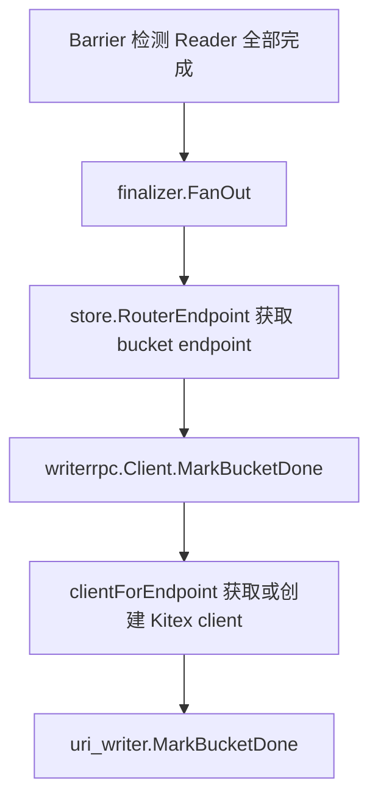

# Other — internal-writerrpc

## 模块概览

`internal/writerrpc` 是控制面对 `uri_writer` 服务的 KiteX/Overpass 客户端封装。它只负责一件事：根据 Writer 心跳注册出来的具体 `endpoint`，精确路由调用目标 Writer 实例的 `MarkBucketDone(bucketId)`。

这个模块不走 PSM 服务发现来挑选 Writer，而是在每个 RPC client 上使用 `kitexclient.WithHostPorts(endpoint)` 指定目标地址。这样 Reader-Done Barrier 做 fan-out 时，可以把每个 bucket 的收尾信号发到持有该 bucket 的具体 Writer 实例。

## 关键类型与函数

### `Client`

`Client` 是本模块的核心结构体：

```go
type Client struct {
    destService    string
    rpcTimeout     time.Duration
    connectTimeout time.Duration

    mu         sync.RWMutex
    byEndpoint map[string]writerservice.Client
}
```

字段含义：

- `destService`：Kitex 逻辑服务名，来自 `WriterRPC.PSM`，例如 `bytedance.videoarch.uri_writer`。
- `rpcTimeout`：单次 RPC 调用超时。
- `connectTimeout`：建立连接超时，当前与 `rpcTimeout` 使用同一个配置值。
- `byEndpoint`：按规范化后的 endpoint 缓存 `writerservice.Client`。
- `mu`：保护 `byEndpoint` 的并发读写。

`Client` 隐式实现了 `finalizer.WriterRPCClient` 接口：

```go
type WriterRPCClient interface {
    MarkBucketDone(ctx context.Context, endpoint string, bucketID int) error
}
```

因此 `cmd/main.go` 中可以直接把 `*writerrpc.Client` 注入到 `finalizer.New`。

### `NewClient`

```go
func NewClient(destService string, timeout time.Duration) (*Client, error)
```

`NewClient` 构造 Writer RPC 客户端工厂，并做基础参数校验：

- `destService == ""` 时返回 `writerrpc: empty dest service`。
- `timeout <= 0` 时返回 `writerrpc: timeout must be > 0`。
- 成功时初始化 `byEndpoint` 缓存，并把 `rpcTimeout`、`connectTimeout` 都设为传入的 `timeout`。

运行时入口在 `cmd/main.go`：

```go
writerCli, err := writerrpc.NewClient(
    cfg.WriterRPC.PSM,
    time.Duration(cfg.WriterRPC.TimeoutMs)*time.Millisecond,
)
```

对应配置结构是 `config.WriterRPC`：

```go
type WriterRPC struct {
    PSM       string `yaml:"PSM"`
    TimeoutMs int    `yaml:"TimeoutMs"`
}
```

### `DestService`

```go
func (c *Client) DestService() string
```

返回客户端绑定的逻辑服务名，主要用于日志、诊断或调试场景。当前主调用链不依赖该方法完成业务逻辑。

### `MarkBucketDone`

```go
func (c *Client) MarkBucketDone(ctx context.Context, endpoint string, bucketID int) error
```

`MarkBucketDone` 是模块对外的主要能力。它的执行过程是：

1. 调用 `clientForEndpoint(endpoint)` 获取或创建目标 Writer 的 `writerservice.Client`。
2. 构造 `uri_writer.MarkBucketDoneRequest`，把 `bucketID` 转为 `int32` 写入 `BucketId`。
3. 调用生成客户端的 `cli.MarkBucketDone(ctx, req)`。
4. 把传输错误、空响应、业务错误码统一转换为 Go `error`。
5. 只有 `resp.ErrorCode == uri_writer.ErrorCode_SUCCESS` 时返回 `nil`。

请求结构：

```go
resp, err := cli.MarkBucketDone(ctx, &uri_writer.MarkBucketDoneRequest{
    BucketId: int32(bucketID),
})
```

错误处理分三类：

- RPC 调用失败：返回包含 service、endpoint、bucket 的包装错误。
- 响应为空：返回 `writerrpc: empty MarkBucketDoneResponse`。
- Writer 返回非成功业务码：记录错误日志，并返回包含 `ErrorCode` 与 `Message` 的错误。

业务错误日志格式：

```go
logs.Error("[writerrpc] mark_bucket_done business error service=%s endpoint=%s bucket=%d code=%s msg=%s", ...)
```

## Endpoint 客户端缓存

`clientForEndpoint` 是私有方法，负责 endpoint 级别的客户端复用：

```go
func (c *Client) clientForEndpoint(endpoint string) (writerservice.Client, error)
```

它使用双重检查锁模式：

1. 空 endpoint 直接报错。
2. 通过 `normalizeEndpoint` 规范化地址。
3. 先加读锁查 `byEndpoint`。
4. 未命中时加写锁再次检查。
5. 仍未命中时调用 `writerservice.NewClient` 创建新客户端。
6. 创建成功后写入 `byEndpoint[normalized]`。

创建 Kitex client 时使用的关键选项：

```go
writerservice.NewClient(
    c.destService,
    kitexclient.WithHostPorts(normalized),
    kitexclient.WithRPCTimeout(c.rpcTimeout),
    kitexclient.WithConnectTimeout(c.connectTimeout),
)
```

这里的重点是 `WithHostPorts(normalized)`：它让调用固定打到指定 Writer 实例，而不是通过 `destService` 做服务发现负载均衡。`destService` 仍然保留为 Kitex 的逻辑服务名，用于客户端构造、日志、指标等基础能力。

该缓存当前没有淘汰逻辑。现有使用场景下 endpoint 数量与任务内 Writer 实例相关，生命周期跟随控制面进程；如果未来 Writer endpoint 数量变得长期高频变化，需要重新评估缓存上限或淘汰策略。

## Endpoint 规范化

```go
func normalizeEndpoint(endpoint string) string
```

`normalizeEndpoint` 解决的是裸 IPv6 host:port 无法直接被 `net.SplitHostPort` / Kitex hostport 语义稳定识别的问题。

处理规则：

- 空字符串原样返回。
- `net.SplitHostPort(endpoint)` 成功时，说明已经是合法 hostport，原样返回。
- 包含 `[` 或 `]` 但解析失败时，认为格式不明确，原样返回。
- 冒号数量少于 2 时，通常是 IPv4、域名或非法地址，原样返回。
- 对多冒号字符串，按最后一个冒号拆分 host 与 port。
- port 必须是数字。
- host 必须能解析为 IPv6，且不能是 IPv4。
- 满足以上条件时，用 `net.JoinHostPort(host, port)` 返回带方括号的 IPv6 endpoint。

示例：

```text
127.0.0.1:9000
=> 127.0.0.1:9000

writer.internal:9000
=> writer.internal:9000

[2605:340:cd50:f09:16a0:3fd1:f03a:17b]:42459
=> [2605:340:cd50:f09:16a0:3fd1:f03a:17b]:42459

2605:340:cd50:f09:16a0:3fd1:f03a:17b:42459
=> [2605:340:cd50:f09:16a0:3fd1:f03a:17b]:42459

not-an-endpoint
=> not-an-endpoint
```

对应测试在 `TestNormalizeEndpoint` 中覆盖了 IPv4、域名、已带方括号 IPv6、裸 IPv6 和非法 endpoint。

## 调用链位置

`internal/writerrpc` 位于 Reader-Done Barrier 的收尾链路中：



主程序装配关系：

```go
writerCli, err := writerrpc.NewClient(
    cfg.WriterRPC.PSM,
    time.Duration(cfg.WriterRPC.TimeoutMs)*time.Millisecond,
)

fin, err := finalizer.New(st, cfg, writerCli)
```

`finalizer.FanOut` 会按 bucket 遍历路由表，通过 `store.RouterEndpoint(ctx, jobID, bid)` 找到 bucket 对应 Writer endpoint，然后调用：

```go
f.rpc.MarkBucketDone(callCtx, endpoint, bid)
```

这里的 `f.rpc` 实际就是 `*writerrpc.Client`。

## 贡献注意事项

修改本模块时需要特别关注三点：

1. 不要把 `WithHostPorts(endpoint)` 改成普通 PSM 服务发现调用。fan-out 语义要求按 bucket 精确命中具体 Writer 实例。
2. 新增 endpoint 格式支持时，应同步扩展 `TestNormalizeEndpoint`，尤其覆盖 IPv6、非法地址和已规范化地址。
3. `MarkBucketDone` 的错误要保留 service、endpoint、bucket 等上下文。上层 `finalizer.callWithRetry` 会基于返回的 `error` 做重试和日志记录，错误上下文是排障入口。