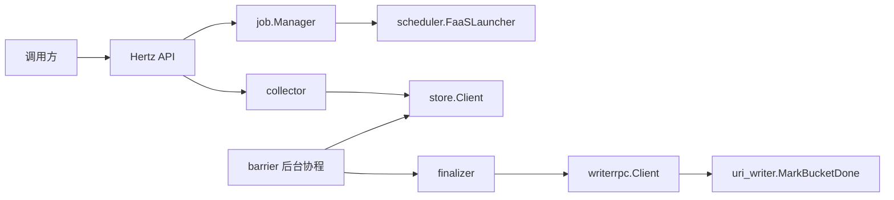

# Other — README.md

## README.md 模块说明

`README.md` 是 `uri_task_control_panel` 仓库的入口文档，面向接入方和维护者说明控制面服务的定位、运行方式、接口契约、配置入口和关键实现约定。它本身不包含可执行代码，因此没有内部调用、外部调用或运行时执行流；它的作用是把仓库中多个实际代码模块串成一张可理解的系统图。

## 服务定位

`uri_task_control_panel` 是 VDA Store URI 排序任务的控制面服务，核心职责包括：

- 创建 URI 排序任务；
- 启动 Reader / Writer 相关执行单元；
- 接收 Reader / Writer 心跳和进度上报；
- 汇聚 Job、Bucket、Worker 状态；
- 在 Reader 全部完成后触发 Reader-Done Barrier；
- 通过 fan-out 调用 Writer 的 `MarkBucketDone(bucketId)` 完成 bucket 收尾；
- 将任务元数据、worker 快照、bucket 快照等状态写入 Redis。

服务位于 Reader 与 Writer 之间，上游对接 `videoarch/uri_source_reader`，下游对接 `videoarch/uri_writer`，Writer RPC 通过 `overpass/bytedance_videoarch_uri_task_control_panel` 生成客户端完成调用。

## 架构概览



这张图概括了 README 中描述的主流程：HTTP 入口负责接收创建任务、心跳、进度和查询请求；`job` 负责创建任务与 bucket 到 writer 的路由；`collector` 写入运行态快照；`barrier` 定期判断 Reader 是否全部完成；`finalizer` 在收尾阶段 fan-out 调用 Writer；`store` 统一封装 Redis 访问。

## 目录结构与职责

README 将代码划分为几个主要区域：

- `api/swagger.yaml`：OpenAPI 3.0.3 接口描述，是 HTTP/JSON 契约的机器可读版本。
- `cmd/`：进程入口，负责启动服务。
- `conf/`：本地 yaml 基线和 Hertz 配置，包括 `base.yml` 与 `hertz.config.yaml`。
- `docs/`：接入指南和方案说明，例如 `integration.md` 与 `summary-aggregation-comparison.md`。
- `examples/hertz_client/main.go`：Hertz Client 调用示例。
- `internal/api/`：Hertz HTTP Gateway，暴露 7 个业务接口和 `/health`。
- `internal/barrier/`：Reader-Done Barrier 后台扫描与触发逻辑。
- `internal/collector/`：`/heartbeat`、`/report_progress` 的入库逻辑。
- `internal/config/`：配置加载，包含 yaml、TCC 和 `caesar_config` 对接。
- `internal/finalizer/`：Reader 完成后的 `MarkBucketDone` fan-out。
- `internal/job/`：Job 创建、bucket 分配、bucket 到 writer 的路由表构建。
- `internal/scheduler/`：`FaaSLauncher` 抽象和 `LambdaLauncher` 默认实现。
- `internal/store/`：Redis 操作封装。
- `internal/types/`：状态机常量和请求/响应 DTO。
- `internal/writerrpc/`：KiteX/Overpass Writer 客户端代理。

## HTTP 接口契约

README 记录了当前服务暴露的主要接口：

| 路径 | 方法 | 作用 |
| --- | --- | --- |
| `/api/v1/jobs` | `POST` | 创建一次写表任务 |
| `/api/v1/jobs` | `GET` | 列出当前 Redis 中仍保留的任务基础信息 |
| `/api/v1/heartbeat` | `POST` | Reader / Writer 心跳保活 |
| `/api/v1/report_progress` | `POST` | Reader / Writer 进度上报 |
| `/api/v1/jobs/{job_id}` | `GET` | 查询 Job 聚合详情 |
| `/api/v1/alert` | `POST` | 异常告警上报 |
| `/api/v1/ops/purge_all_jobs` | `POST` | 清理控制面记录的全部任务及关联元数据 |
| `/health` | `GET` | 健康检查 |

所有业务响应统一使用 Envelope 结构 `{code, message, data}`。Hertz handler 使用标准签名：

```go
func(ctx context.Context, c *app.RequestContext)
```

接口 schema 的权威描述位于 `api/swagger.yaml`，接入细节和错误码表位于 `docs/integration.md`。

## Job 创建与 Reader 启动口径

README 明确了 `CreateJobRequest` 中多个字段的实际含义，尤其是 Reader 输入和并发控制：

- `CreateJobRequest.concurrency.num_readers` 表示期望启动的 Reader 上限，而不是绝对启动数量。
- `hdfs_parquet` 支持 `source.extract.file_paths` 显式文件列表；使用该字段时 `source.hdfs_root` 可以为空。
- `hdfs_parquet` 支持透传 `source.extract.vid_field` 和 `source.extract.oid_field`。
- `tos_inventory_csv` 支持 `source.tos_csv_root`，控制面会通过存储网关 SDK 扫描 root 下文件并分发给 Reader。
- `tos_inventory_csv` 也支持 `source.extract.csv_uris` 直传文件列表。
- `source.tos_csv_root` 和 `source.extract.csv_uris` 最终都会归一化为 `csv_uris` 后下发。
- 当 `csv_uris` 由 `source.tos_csv_root` 扫描生成时，下发形式是 `bucket/key`，不带 `tos://` 协议头。
- `tos_inventory_csv` 未提供 `source.extract.store_uri_column` 时，需要同时提供 `source.extract.bucket` 与 `source.extract.key_column`。
- `source.extract.create_timestamp_column` 和 `source.extract.create_time_str_column` 不能同时设置。
- 控制面会基于 `output.hdfs_dir` 生成 Writer 使用的 `hdfs_temp_dir`，规则是 `${output.hdfs_dir}/_staging/${job_id}`。
- 实际输入文件数小于请求 Reader 数时，控制面会自动下调实际 Reader 数。

下调后的 Reader 数会体现在 `POST /api/v1/jobs` 响应、Redis Job 元数据，以及 `GET /api/v1/jobs`、`GET /api/v1/jobs/{job_id}` 的 `num_readers` / `config.concurrency.num_readers` 中。

## 配置加载链路

服务配置加载流程与 `videoarch/asuna` 对齐：

1. 进程入口调用 `byted.Init()` 初始化 PSM、Cluster、日志和 Metrics 等基础设施。
2. 通过 `config.NewConfig(local.ConfDir())` 解析 `conf` 目录。
3. 调用 `cfg.Init()`，内部使用 `tccclient.NewClientV2(env.PSM(), ...)` 和 `caesar.Unmarshal`。
4. 先读取 `conf/base.yml` 作为本地基线。
5. 再通过 `caesar.WithConfigGetter(tcc.Get)` 使用 TCC 同名 key 覆盖本地配置。

关键配置分组包括：

- `Redis`：Redis 集群名、本地地址、密码和 DB。
- `Heartbeat`：worker 心跳超时阈值和下次心跳建议间隔。
- `Barrier`：Reader-Done Barrier 扫描间隔。
- `Fanout`：`MarkBucketDone` fan-out 并发和重试次数。
- `Job`：Job 元数据 TTL。
- `WriterRPC`：Writer 服务 PSM 和单次 RPC 超时。
- `Lambda`：Lambda 网关、Reader/Writer 函数名、调用方式、超时和控制面 PSM 信息。

## Redis 访问约定

所有 Redis 访问封装在 `internal/store`，对外通过 `store.NewClient(cfg)` 注入。

README 中强调了几个实现约定：

- Redis 底层使用 `code.byted.org/kv/goredis/v5`。
- 当 `Redis.Cluster` 非空时，使用 `goredis.NewClient(cluster)` 走服务发现。
- 当 `Redis.Cluster` 为空且 `Redis.Addrs` 非空时，使用 `goredis.NewClientWithServers("", addrs, opt)` 本地直连。
- 单元测试通过 `goredis.NewUnitTestOption()` 和 miniredis 直连。
- 批量写使用普通 `Pipeline()`，收尾调用 `pipe.Exec()`。
- `/report_progress` 只写 bucket / worker 快照，不维护 Job 级 `done_buckets` / `failed_buckets` 在线计数。
- `GET /jobs/{job_id}` 的 `summary` 基于 bucket hash 现算。
- `FINALIZING -> SUCCEEDED` 通过 `cp:job:{jobId}:done_bucket_ids` 集合做幂等去重和完成判定。
- Worker hash 不依赖 Redis key TTL，`LOST` 状态在查询时根据 `last_hb` 和超时阈值推断。

这些约定意味着 Redis 既是任务元数据存储，也是运行态快照存储；聚合查询部分偏向读时计算，而不是完全依赖写时维护计数。

## 状态模型

README 记录了当前代码中的状态枚举。

Job 状态：

- `PENDING`
- `RUNNING`
- `FINALIZING`
- `SUCCEEDED`
- `FAILED`
- `CANCELLED`

Bucket 状态：

- `RUNNING`
- `MERGING`
- `WRITING_HDFS`
- `DONE`
- `FAILED`

Worker 状态：

- `BOOTING`
- `RUNNING`
- `DONE`
- `LOST`

当前主流程已经使用 `PENDING`、`RUNNING`、`FINALIZING` 和 `SUCCEEDED`。`FAILED` 主要依赖显式终态写入，自动失败收敛尚未补齐。`CANCELLED` 已定义但取消接口尚未实现。

`GET /jobs/{job_id}` 的 bucket 汇总按四组计算：

- `RUNNING`
- `MERGING | WRITING_HDFS`
- `DONE`
- `FAILED`

Worker 不引入单独的 `DRAINING` 状态，收尾阶段主要由 Bucket 状态推进体现。

## Writer RPC 与收尾 fan-out

控制面通过 `internal/writerrpc/client.go` 调用 Writer 的 `MarkBucketDone(bucketId)`。底层客户端来自 `overpass/bytedance_videoarch_uri_task_control_panel`。

关键路由规则：

- 逻辑服务名来自 `WriterRPC.PSM`。
- fan-out 时通过 `WithHostPorts(endpoint)` 精确路由到目标 Writer。
- `WriterRPC.TimeoutMs` 控制单次调用超时。
- `Fanout.Concurrency` 控制并发。
- `Fanout.MaxRetries` 控制单 bucket 失败重试次数。

这个机制服务于 Reader-Done Barrier：当 Reader 全部完成后，控制面需要通知每个 Writer 完成对应 bucket 的最终收尾。

## 本地开发与测试入口

README 定义了最短本地启动路径：

```bash
docker run --rm -p 6379:6379 redis:7
make run
```

默认健康检查：

```bash
curl http://127.0.0.1:8090/health
```

测试入口：

```bash
make test
```

当前 README 指出的重点测试包括：

- `internal/job/manager_test.go`：验证 bucket_assign 构建逻辑。
- `internal/store/store_test.go`：基于 miniredis 验证 Redis 操作。
- `internal/barrier/barrier_test.go`：验证 Reader-Done Barrier 触发判定。

## 示例代码入口

完整 Hertz Client 示例位于 `examples/hertz_client/main.go`。README 中的精简片段展示了两个核心调用：

- 使用 `types.CreateJobRequest` 调用 `POST /api/v1/jobs`。
- 使用 `types.HeartbeatRequest` 调用 `POST /api/v1/heartbeat`。

示例中的 `postJSON` helper 使用 CloudWeGo Hertz Client 构造 `protocol.Request` / `protocol.Response`，发送 JSON POST，并解析统一 Envelope：

```go
var env struct {
    Code int             `json:"code"`
    Msg  string          `json:"message"`
    Data json.RawMessage `json:"data"`
}
```

当 `env.Code != 0` 时，示例直接按业务错误处理。

## 与其他文档的关系

`README.md` 是入口索引，不承载所有细节：

- API schema 以 `api/swagger.yaml` 为准。
- 接入流程、错误码、限流和超时建议见 `docs/integration.md`。
- Summary 聚合设计取舍见 `docs/summary-aggregation-comparison.md`。
- 详细设计方案链接到《VDA Store URI 排序任务控制面服务设计方案》。

维护 README 时，应优先保证它反映当前代码的真实边界：已实现能力、配置入口、状态口径、接口列表和已知 TODO。更细的接口字段、错误码和接入步骤应放在对应文档中，README 只保留入口和关键约定。