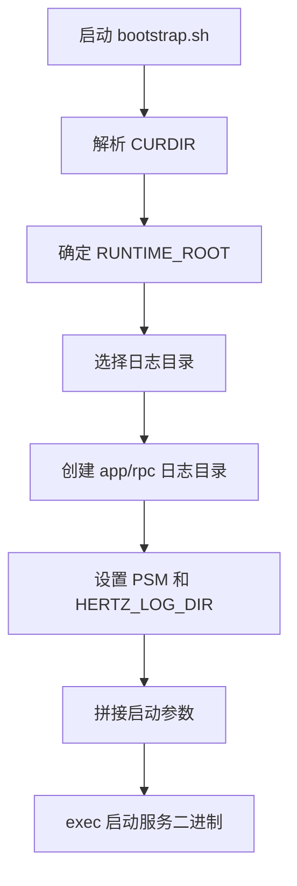

# Other — script

## `script/bootstrap.sh`

`bootstrap.sh` 是服务进程的启动入口脚本，负责在运行二进制文件前准备运行目录、日志目录、关键环境变量和启动参数。脚本最终通过 `exec` 启动：

```bash
$CURDIR/bin/bytedance.videoarch.uri_task_control_panel $args
```

该模块本身不包含函数、类或被代码调用的 API；它是独立的运行时脚本，通常由部署系统、容器入口或本地启动流程调用。

## 启动职责

脚本主要完成以下工作：

1. 确定脚本所在目录 `CURDIR`。
2. 解析运行根目录 `RUNTIME_ROOT` 和端口参数 `PORT`。
3. 根据运行环境选择日志目录。
4. 创建 `app` 和 `rpc` 日志子目录。
5. 在 host network 模式下导出服务端口和调试端口。
6. 设置 Hertz 相关环境变量。
7. 拼接二进制启动参数。
8. 使用 `exec` 将当前 shell 进程替换为服务进程。

## 执行流程



## 参数约定

脚本支持两个位置参数：

```bash
./bootstrap.sh [RUNTIME_ROOT] [PORT]
```

### `$1`：`RUNTIME_ROOT`

如果传入第一个参数，脚本将其作为运行根目录：

```bash
RUNTIME_ROOT=$1
```

如果没有传入，则默认使用脚本所在目录：

```bash
RUNTIME_ROOT=${CURDIR}
```

`RUNTIME_ROOT` 主要用于推导默认日志目录：

```bash
RUNTIME_LOG_ROOT=$RUNTIME_ROOT/log
```

脚本中还定义了：

```bash
RUNTIME_CONF_ROOT=$RUNTIME_ROOT/conf
```

但当前实现没有继续使用 `RUNTIME_CONF_ROOT`。实际传给服务的配置目录来自脚本目录下的 `conf/`：

```bash
CONF_DIR=$CURDIR/conf/
```

这意味着配置文件位置与 `bootstrap.sh` 所在目录绑定，而不是与传入的 `RUNTIME_ROOT` 绑定。

### `$2`：`PORT`

第二个参数会被保存为：

```bash
PORT=$2
```

如果 `PORT` 非空，脚本会追加服务启动参数：

```bash
-port=$PORT
```

最终命令类似：

```bash
bin/bytedance.videoarch.uri_task_control_panel \
  -psm=bytedance.videoarch.uri_task_control_panel \
  -conf-dir=/path/to/script/conf/ \
  -log-dir=/path/to/log \
  -port=8080
```

如果未传入端口，则不会添加 `-port` 参数。

## 环境变量

### `HERTZTOOL_VERSION`

脚本固定导出 Hertz 工具版本：

```bash
export HERTZTOOL_VERSION=v3.4.2
```

该变量通常用于 Hertz 相关运行时或工具链识别版本。

### `IS_TCE_DOCKER_ENV` 与 `RUNTIME_LOGDIR`

日志目录选择逻辑如下：

```bash
if [ "${IS_TCE_DOCKER_ENV}" == 1 ] && [ -n "${RUNTIME_LOGDIR}" ]; then
    RUNTIME_LOG_ROOT=$RUNTIME_LOGDIR
else
    RUNTIME_LOG_ROOT=$RUNTIME_ROOT/log
fi
```

在 TCE Docker 环境中，如果外部注入了 `RUNTIME_LOGDIR`，脚本优先使用该目录作为日志根目录。否则使用：

```bash
$RUNTIME_ROOT/log
```

随后脚本确保以下目录存在：

```bash
$RUNTIME_LOG_ROOT/app
$RUNTIME_LOG_ROOT/rpc
```

### `IS_HOST_NETWORK`、`PORT0`、`PORT1`

当启用 host network 模式时：

```bash
if [ "$IS_HOST_NETWORK" == "1" ]; then
    export RUNTIME_SERVICE_PORT=$PORT0
    export RUNTIME_DEBUG_PORT=$PORT1
fi
```

这里脚本期望外部环境已经提供 `PORT0` 和 `PORT1`。它们会被映射为：

```bash
RUNTIME_SERVICE_PORT=$PORT0
RUNTIME_DEBUG_PORT=$PORT1
```

这段逻辑不会直接影响 `-port` 参数；`-port` 仍然只由第二个位置参数 `$2` 决定。

### `HERTZ_LOG_DIR`

脚本将最终选定的日志根目录导出给服务：

```bash
export HERTZ_LOG_DIR=$RUNTIME_LOG_ROOT
```

同时也将同一个路径作为命令行参数传入：

```bash
-log-dir=$HERTZ_LOG_DIR
```

### `PSM`

服务名固定为：

```bash
SVC_NAME=bytedance.videoarch.uri_task_control_panel
```

脚本导出：

```bash
export PSM=$SVC_NAME
```

并通过启动参数传入：

```bash
-psm=$SVC_NAME
```

## 二进制与配置目录

脚本约定二进制文件位于：

```bash
$CURDIR/bin/bytedance.videoarch.uri_task_control_panel
```

其中 `CURDIR` 是 `bootstrap.sh` 所在目录。

配置目录固定为：

```bash
$CURDIR/conf/
```

启动参数中使用：

```bash
-conf-dir=$CONF_DIR
```

因此，部署包需要保持如下结构：

```text
script目录/
  bootstrap.sh
  bin/
    bytedance.videoarch.uri_task_control_panel
  conf/
    ...
```

如果移动 `bootstrap.sh`，需要同步保证 `bin/` 和 `conf/` 仍然位于脚本所在目录下。

## 启动命令构造

核心启动参数由 `args` 拼接完成：

```bash
args="-psm=$SVC_NAME -conf-dir=$CONF_DIR -log-dir=$HERTZ_LOG_DIR"
```

当 `PORT` 非空时追加：

```bash
args+=" -port=$PORT"
```

脚本会先打印完整命令：

```bash
echo "$CURDIR/bin/${BinaryName} $args"
```

然后执行：

```bash
exec $CURDIR/bin/${BinaryName} $args
```

使用 `exec` 后，shell 进程会被服务二进制进程替换。这对容器和进程管理很重要：服务进程会成为当前进程，信号可以直接传递给服务本身。

## 与代码库其他部分的关系

`bootstrap.sh` 不被 Go/JavaScript/Python 等代码模块直接调用，也不暴露可复用函数。它连接代码库的方式主要是运行时约定：

- 依赖 `bin/bytedance.videoarch.uri_task_control_panel` 作为实际服务程序。
- 依赖 `conf/` 目录作为服务配置来源。
- 向服务传入 `-psm`、`-conf-dir`、`-log-dir` 和可选 `-port` 参数。
- 通过 `HERTZ_LOG_DIR`、`PSM`、`RUNTIME_SERVICE_PORT`、`RUNTIME_DEBUG_PORT` 等环境变量影响服务运行环境。
- 为日志系统预创建 `app` 和 `rpc` 目录。

## 维护注意事项

路径变量当前没有统一加引号，例如：

```bash
if [ ! -d $RUNTIME_LOG_ROOT/app ]; then
    mkdir -p $RUNTIME_LOG_ROOT/app
fi
```

如果运行路径中包含空格，可能导致 shell 解析异常。现有部署路径通常不包含空格，因此当前实现可以工作；如果后续需要增强通用性，应将路径引用改为带引号的形式。

`RUNTIME_CONF_ROOT` 当前被赋值但未使用：

```bash
RUNTIME_CONF_ROOT=$RUNTIME_ROOT/conf
```

如果未来希望配置目录跟随 `RUNTIME_ROOT`，需要明确调整：

```bash
CONF_DIR=$RUNTIME_CONF_ROOT/
```

但这会改变现有配置加载位置，修改前需要确认部署包结构和运行平台约定。