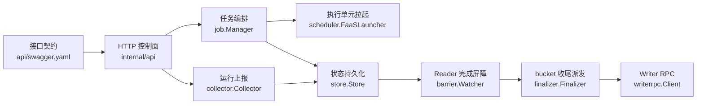

# Other

## 模块概览

`Other` 汇总了 `uri_task_control_panel` 的入口文档、接口契约、配置与核心内部模块。它们共同支撑一个控制面闭环：业务方创建 Job，控制面拉起 Reader/Writer，运行期间接收心跳与进度，Reader 全部完成后触发收尾屏障，再按 bucket 路由通知 Writer 完成最终处理。

## 子模块协作

[README.md](README.md) 给出仓库级定位，说明控制面位于 `uri_source_reader` 与 `uri_writer` 之间，负责 Job 生命周期、Reader-Done Barrier、Writer fan-out 和 Redis 状态管理。

[api](api.md) 定义 HTTP/JSON 契约，[docs](docs.md) 面向接入方解释这些契约的使用方式。运行时由 [internal-api](internal-api.md) 注册 `/api/v1` 路由，并把请求转发到 `job.Manager`、`collector.Collector` 或 `store.Store` 的聚合查询能力。

[internal-job](internal-job.md) 是创建任务的编排层。它校验 `CreateJobRequest`，生成 Reader/Writer 启动计划，通过 [internal-scheduler](internal-scheduler.md) 的 `FaaSLauncher` 拉起执行单元，并把 Job、bucket 分配和 worker 元数据写入 [internal-store](internal-store.md)。

[internal-collector](internal-collector.md) 处理 Reader/Writer 的 `heartbeat` 和 `reportProgress`。它不做复杂聚合，而是把上报转换为 `Store` 写入；`Store` 再负责维护 worker 快照、bucket 状态、告警、活跃 Job 集合以及 Job 终态推进。

[internal-barrier](internal-barrier.md) 周期性读取 `Store.ActiveJobIDs` 并判断 `AllReadersDone`。当某个 Job 的所有 Reader 都完成后，它通过 `SetNXBarrierFired` 保证只触发一次，然后调用 [internal-finalizer](internal-finalizer.md)。

[internal-finalizer](internal-finalizer.md) 根据 bucket 到 Writer 的路由表做 fan-out，通过 [internal-writerrpc](internal-writerrpc.md) 精确调用目标 Writer endpoint 的 `MarkBucketDone(bucketId)`。bucket 是否最终 `DONE` 仍由 Writer 后续进度上报决定，Job 成功推进由 `store.ApplyBucketProgress` 聚合完成。

## 运行与配置边界

[conf](conf.md) 提供 Redis、心跳、任务控制、Lambda、StorageGW、Writer RPC、Hertz 启动与日志配置。[go.mod](go.mod.md) 固定模块路径、Go 版本和框架依赖边界。[build.sh](build.sh.md) 负责构建产物与配置复制，[script](script.md) 中的 `bootstrap.sh` 负责运行前目录、日志和环境变量准备。

整体上，配置和脚本决定服务如何启动，`api/swagger.yaml` 与接入文档决定外部如何调用，`internal/*` 模块负责把一次 URI 排序任务从创建推进到执行、屏障、收尾和状态查询。