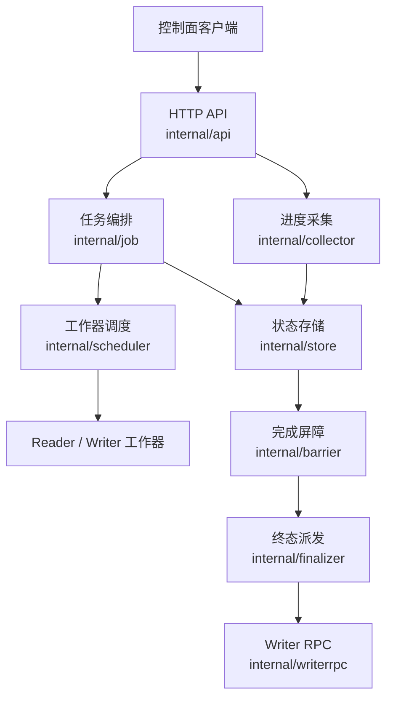

# uri_task_control_panel — Wiki

## 项目概览

`uri_task_control_panel` 是 VDA Store URI 排序任务的控制面服务。它不直接搬运或写入业务数据，而是负责任务生命周期编排：接收创建任务请求，拉起 Reader 和 Writer 工作器，汇聚运行期心跳与进度，在所有 Reader 完成后触发 Reader-Done Barrier，并按 bucket 路由通知 Writer 做最终收尾。

这个仓库的主模块是：

```text
code.byted.org/videoarch/uri_task_control_panel
```

服务面向三个主要角色：

- 上游 Reader：读取输入 URI / HDFS 文件并上报处理进度。
- 下游 Writer：接收 bucket 数据写入，并在控制面通知后完成 bucket 收尾。
- 控制面客户端：通过 HTTP API 创建任务、查询状态、上报心跳和告警。

新开发者可以先从 [Service Entry Point](service-entry-point.md) 了解进程如何启动，再阅读 [HTTP API](http-api.md)、[Job Orchestration](job-orchestration.md)、[Persistence and State Store](persistence-and-state-store.md) 和 [Barrier and Finalization](barrier-and-finalization.md)。这几页覆盖了最核心的执行路径。

## 整体架构



`cmd/main.go` 是服务入口，负责按顺序装配配置、Redis、任务编排器、进度采集器、Writer RPC 客户端、Barrier 后台循环和 Hertz HTTP 服务。配置由 [Configuration](configuration.md) 统一加载，本地基线位于 `conf/base.yml`，运行期配置会通过 TCC 合并并补默认值。

HTTP 层位于 `internal/api`，它负责请求绑定、基础校验和统一响应包装。真正的业务动作会下沉到 `internal/job`、`internal/collector` 和 `internal/store`，避免 Handler 直接承载状态机逻辑。

`internal/store` 是 Redis 状态访问的唯一封装层。任务元数据、worker 状态、心跳、bucket 进度、barrier 触发标记和终态推进都通过 [Persistence and State Store](persistence-and-state-store.md) 完成。

## 核心执行流程

### 创建任务

创建任务从 `POST /api/v1/jobs` 进入 [HTTP API](http-api.md)，随后交给 [Job Orchestration](job-orchestration.md) 的 `Manager.CreateJob`。

编排层会校验请求参数，生成 `jobID`、输出路径和 Writer 临时目录，然后解析输入源并生成 Reader 启动计划。对于 bucket 路由，控制面按照 `bucketId % numWriters` 建立 bucket 到 Writer 的分配关系，并写入 Redis。

启动顺序很重要：服务会先拉起 Writer，等待 Writer 注册好 bucket 路由，再拉起 Reader，最后把 Job 状态推进到 `running`。工作器拉起能力由 [Worker Scheduling](worker-scheduling.md) 封装，当前支持本地日志 stub 和 Lambda 网关调用两种实现。

### 运行期上报

Reader 和 Writer 在运行过程中通过 `/api/v1/heartbeat` 刷新心跳，通过 `/api/v1/report_progress` 上报进度、错误、文件计数和 bucket 状态。这部分由 [Progress Collection](progress-collection.md) 接收，再统一写入 `internal/store`。

控制面查询任务详情时，会从 Redis 聚合 Job、Reader、Writer 和 bucket 维度的状态，返回给调用方。`examples/hertz_client` 提供了一个最小 happy path，可参考 [Client Example](client-example.md) 了解如何创建任务、上报进度并查询结果。

### Reader-Done Barrier 与收尾

[Barrier and Finalization](barrier-and-finalization.md) 是服务的关键后台流程。`barrier.Watcher.Start` 会周期扫描活跃 Job，读取所有 Reader 状态，并判断它们是否都已进入终态。

当某个 Job 的 Reader 集合非空且全部完成后，控制面使用 Redis `SETNX` 语义写入 barrier 触发标记，保证同一个 Job 只触发一次 fan-out。随后 Job 状态进入 `finalizing`，`internal/finalizer` 按 bucket 路由调用 [Writer RPC Integration](writer-rpc-integration.md)，向对应 Writer 实例发送 `MarkBucketDone`。

Writer RPC 不通过普通 PSM 服务发现做模糊路由，而是按 Writer 注册的 endpoint 创建 Kitex client，确保每个 bucket 的收尾请求精确送达对应 Writer。

## 本地启动

本项目使用 Go `1.23.0`。首次开发前可以先拉取依赖：

```bash
go mod download
```

配置入口在 `conf/` 下，主要包括：

```text
conf/base.yml
conf/hertz.config.yaml
```

本地启动服务：

```bash
go run ./cmd
```

如果只想验证 HTTP 调用链，可以在服务启动后运行示例客户端：

```bash
go run ./examples/hertz_client
```

默认示例会访问本地控制面服务；需要切换目标地址时，可通过 `BASE_URL` 指定。

## 阅读建议

如果你是第一次进入这个仓库，建议按运行链路阅读：

先看 [Service Entry Point](service-entry-point.md)，理解服务如何被装配；再看 [Configuration](configuration.md) 和 [HTTP API](http-api.md)，掌握配置与外部契约；随后阅读 [Job Orchestration](job-orchestration.md)、[Worker Scheduling](worker-scheduling.md) 和 [Progress Collection](progress-collection.md)，理解任务如何被启动和上报；最后阅读 [Persistence and State Store](persistence-and-state-store.md)、[Barrier and Finalization](barrier-and-finalization.md) 和 [Writer RPC Integration](writer-rpc-integration.md)，掌握状态机、Reader 完成屏障和 Writer 收尾逻辑。