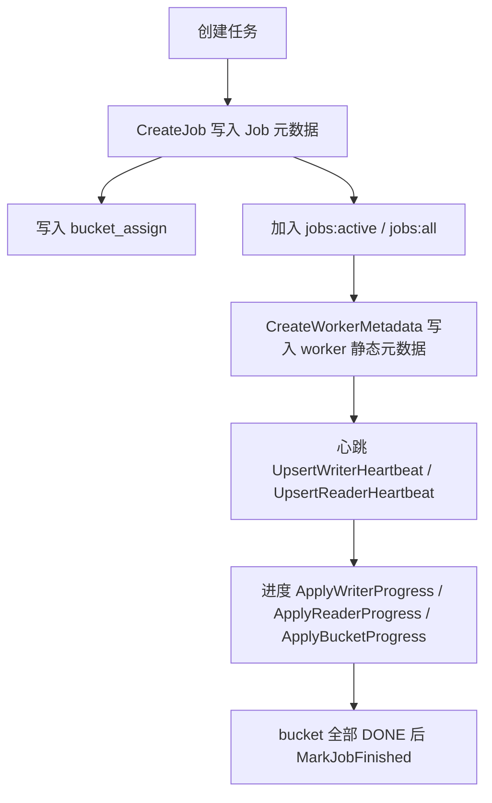
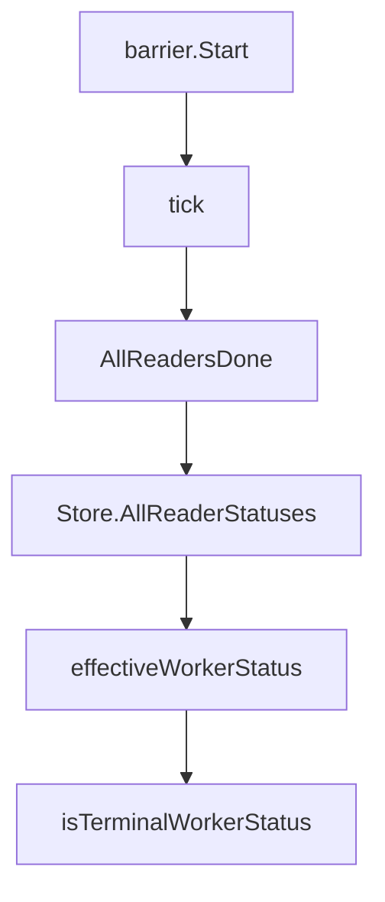

# Persistence and State Store

## 持久化与状态存储模块

`internal/store` 是控制面访问 Redis 的唯一封装层。它负责生成 Redis key、写入任务与 worker 元数据、接收心跳和进度、读取详情接口所需的聚合状态，并在 bucket 全部完成时自动推进 Job 终态。

该模块不包含业务调度逻辑，但承载了控制面状态机的持久化语义。上层模块通过 `Store` 调用 Redis，而不是直接拼接 key 或直接访问底层客户端。

## 核心组件

### `Store`

```go
type Store struct {
    rdb *goredis.Client
    cfg *config.Config
}
```

`Store` 持有 `goredis.Client` 和全局配置：

- `New(rdb, cfg)`：构造 `Store`。
- `Client()`：暴露底层 Redis 客户端，主要用于复用底层命令或测试注入。
- `NewClient(cfg)`：按配置创建 `*goredis.Client`。

Redis 客户端使用 `code.byted.org/kv/goredis/v5`，命令风格接近 `go-redis v6`：通过 `client.WithContext(ctx)` 派生带 context 的客户端，Redis 空值用 `redisv6.Nil` 判断。

### Redis Key 约定

所有控制面 key 都集中在 `internal/store/keys.go`：

| 函数 | Redis key | 用途 |
| --- | --- | --- |
| `KeyJob(jobID)` | `cp:job:{jobID}` | Job 元数据 HASH |
| `KeyBucketAssign(jobID)` | `cp:job:{jobID}:bucket_assign` | bucket 到 writer idx 的映射 HASH |
| `KeyWriter(jobID, writerID)` | `cp:job:{jobID}:writer:{writerID}` | writer 状态 HASH |
| `KeyReader(jobID, readerID)` | `cp:job:{jobID}:reader:{readerID}` | reader 状态 HASH |
| `KeyBucket(jobID, bucketID)` | `cp:job:{jobID}:bucket:{bucketID}` | bucket 进度 HASH |
| `KeyWorkers(jobID)` | `cp:job:{jobID}:workers` | writer ID SET |
| `KeyReaders(jobID)` | `cp:job:{jobID}:readers` | reader ID SET |
| `KeyDoneBucketIDs(jobID)` | `cp:job:{jobID}:done_bucket_ids` | 已完成 bucket ID SET |
| `KeyJobsActive()` | `cp:jobs:active` | 活跃 Job SET |
| `KeyJobsAll()` | `cp:jobs:all` | 已知 Job SET |
| `KeyAlerts(jobID)` | `cp:job:{jobID}:alerts` | 告警 LIST |
| `KeyBarrierFired(jobID)` | `cp:job:{jobID}:barrier_fired` | barrier 触发幂等标记 |
| `KeyRouterBucket(jobID, bucketID)` | `{jobID}:bucket:{00000}` | Router 既有 bucket endpoint key |

`KeyRouterBucket` 是控制面外部已有 key，控制面只读或在清理时删除，用于诊断和 fan-out endpoint 查找。

## Redis 连接初始化

`NewClient(cfg)` 支持两种连接方式：

1. `cfg.Redis.Cluster` 非空时，使用 `goredis.NewClientWithOption` 走服务发现，并设置 1 秒级别的 dial/read/write/pool timeout。
2. `cfg.Redis.Cluster` 为空但 `cfg.Redis.Addrs` 存在时，使用 `goredis.NewClientWithServers` 直连显式地址，适合本地环境和单测。

直连模式会关闭 GDPR 校验、关闭自动加载配置，并禁用 consul 服务发现：

```go
opt.DisableGDPRVerify = true
opt.DisableAutoLoadConf()
opt.SetServiceDiscoveryWithoutConsul()
```

如果配置了 `cfg.Redis.Password` 或 `cfg.Redis.DB`，会写入底层 Redis options。

## 数据写入流程



### 创建 Job：`CreateJob`

`CreateJob(ctx, jobID, meta, bucketAssign)` 一次性写入：

- `cp:job:{jobID}` HASH：
  - `state`
  - `request`
  - `hdfs_output_path`
  - `hdfs_temp_dir`
  - `num_buckets`
  - `num_writers`
  - `num_readers`
  - `create_time`
- `cp:job:{jobID}:bucket_assign` HASH：
  - 字段名为 bucket ID 字符串
  - 字段值为 writer idx
- `cp:jobs:active` SET
- `cp:jobs:all` SET

如果 `cfg.Job.TTLSec > 0`，`CreateJob` 会给 `KeyJob(jobID)` 和 `KeyBucketAssign(jobID)` 设置过期时间。

`bucketAssign` 写入时会按 4096 个 entry 分批 `HMSet`，避免单次 HMSET payload 过大。

### 写入 worker 元数据：`CreateWorkerMetadata`

`CreateWorkerMetadata(ctx, jobID, workers)` 用于批量写入已经成功拉起的 worker 静态信息。

writer 写入：

- `KeyWriter(jobID, worker.ID)` HASH：
  - `writer_id`
  - `writer_idx`
  - `status`，通过 `HSetNX` 初始化为 `types.WorkerStateBooting`
- `KeyWorkers(jobID)` SET

reader 写入：

- `KeyReader(jobID, worker.ID)` HASH：
  - `reader_id`
  - `reader_idx`
  - `status`，通过 `HSetNX` 初始化为 `types.WorkerStateBooting`
- `KeyReaders(jobID)` SET

该方法会校验：

- `jobID` 不能为空
- `worker.ID` 不能为空
- `worker.Idx` 不能小于 0
- `worker.Kind` 只能是 `types.KindWriter` 或 `types.KindReader`

### 心跳写入

`UpsertWriterHeartbeat(ctx, jobID, hb, now)` 写入 writer 心跳：

- `writer_id`
- `ip`
- `port`
- `buckets`
- `buckets_assigned`
- `last_hb`
- `status`

`hb.Buckets` 会被 JSON 序列化后存入 `buckets` 字段。

`UpsertReaderHeartbeat(ctx, jobID, hb, now)` 写入 reader 心跳：

- `reader_id`
- `ip`
- `port`
- `last_hb`
- `status`

心跳状态通过 `heartbeatWorkerStatus(currentStatus)` 计算：如果当前状态已经是 `DONE` 或 `FAILED`，保持终态不被心跳覆盖；否则写为 `RUNNING`。

### 进度写入

`ApplyWriterProgress(ctx, jobID, writerID, workerStatus, errorMessage, progressTime)` 写入 writer 实例级进度：

- `writer_id`
- `last_update_time`
- `error_message`
- 可选 `status`

`workerStatus` 会经过 `normalizeReportedWorkerStatus` 校验。只有 `BOOTING`、`RUNNING`、`DONE`、`FAILED`、`LOST` 会被接受，其他值会被忽略。

`ApplyReaderProgress(ctx, jobID, readerID, files, bucketsSeen, workerStatus, errorMessage, progressTime)` 写入 reader 进度：

- `reader_id`
- `buckets_seen`
- `last_update_time`
- `error_message`
- 可选文件进度：
  - `files_total`
  - `files_done`
  - `rows_read`
  - `bytes_read`
- 可选 `status`

`ApplyBucketProgress(ctx, jobID, writerID, p, progressTime)` 写入单个 bucket 的快照：

- `writer_id`
- `status`
- `total_uris`
- `bytes`
- `run_files`
- `peak_local_disk_mb`
- `merge_progress`
- `hdfs_write_progress`
- `final_path`
- `final_size`
- `last_update`

如果 `writerID` 非空，还会更新对应 writer 的 `last_update_time` 并加入 `KeyWorkers(jobID)`。

## Job 自动成功判定

`ApplyBucketProgress` 在 bucket 状态从非 `DONE` 变为 `DONE` 时，会调用 `maybeMarkJobSucceeded`。

判定条件：

1. `JobMetaRaw` 能读取到 Job 元数据。
2. 当前 Job 状态必须是 `types.JobStateFinalizing`。
3. `num_buckets` 大于 0。
4. 当前 bucket ID 被加入 `KeyDoneBucketIDs(jobID)`。
5. `SCard(KeyDoneBucketIDs(jobID)) == num_buckets`。

满足条件后调用：

```go
s.MarkJobFinished(ctx, jobID, types.JobStateSucceeded, finishTime)
```

`MarkJobFinished` 会写入：

- `state`
- `finish_time`

并从 `cp:jobs:active` 删除该 Job。

已经处于 `SUCCEEDED`、`FAILED`、`CANCELLED` 的 Job 不会被重复推进。

## 状态读取语义

### Job 列表

`ActiveJobIDs(ctx)` 直接读取 `cp:jobs:active`。

`JobIDs(ctx)` 只读取 `cp:jobs:all`，并去重、排序。这里刻意不使用 `SCAN`，避免 Redis mesh 不支持或表现不一致。

`JobMetaRaw(ctx, jobID)` 读取 `KeyJob(jobID)` HASH。如果 HASH 为空，返回 `job {jobID} not found`。

### Worker 读取

`ListWorkerIDs(ctx, jobID)` 读取 writer ID SET。

`ListReaderIDs(ctx, jobID)` 读取 reader ID SET。

`WorkerHash(ctx, jobID, kind, id)` 读取单个 worker HASH。`kind == types.KindWriter` 时读 writer，否则读 reader。

`WorkerHashes(ctx, jobID, kind, ids)` 批量 pipeline 读取 worker HASH，避免详情接口逐 worker 往返 Redis。空 HASH 会被跳过。

### Reader 有效状态：`AllReaderStatuses`

`AllReaderStatuses(ctx, jobID)` 用于 barrier 判断 reader 是否全部完成。它读取 `KeyReaders(jobID)` 下所有 reader 的 `status` 和 `last_hb`，再通过 `effectiveWorkerStatus` 转换成有效状态。

规则：

- `status` 为空：返回 `LOST`
- `status` 是终态 `DONE` 或 `FAILED`：直接返回原状态，即使心跳过期也不改写
- `last_hb` 为空或小于等于 0：返回 `LOST`
- `cfg.Heartbeat.TTLSec > 0` 且心跳超过 TTL：返回 `LOST`
- 其他情况：返回原 `status`

barrier 模块的调用链是：



### Bucket 读取

`BucketHash(ctx, jobID, bucketID)` 读取单个 bucket HASH。

`BucketHashes(ctx, jobID, bucketIDs)` 批量 pipeline 读取 bucket HASH，适合详情接口聚合多个 bucket。

`BucketStatuses(ctx, jobID, bucketIDs)` 只批量读取 `status` 字段，适合只需要判断状态的路径。

`BucketAssignAll(ctx, jobID)` 读取 `KeyBucketAssign(jobID)`，并把字符串字段转换为 `map[int]int`。转换失败的 entry 会被跳过。

`SetBucketStatus(ctx, jobID, bucketID, status)` 直接覆盖 bucket 的 `status` 字段，当前用于 fan-out 失败场景。

## Router endpoint 与 barrier 幂等

`AllRouterBucketsRegistered(ctx, jobID, numBuckets)` 会 pipeline 检查每个 `KeyRouterBucket(jobID, bucketID)` 是否存在。只要任意 bucket endpoint 不存在，就返回 `false`。

`RouterEndpoint(ctx, jobID, bucketID)` 读取 Router 既有 bucket endpoint。Redis 返回 `redisv6.Nil` 时，该方法返回空字符串和 `nil` 错误，调用方可以把“未注册 endpoint”作为普通分支处理。

`SetNXBarrierFired(ctx, jobID)` 使用：

```go
SETNX cp:job:{jobID}:barrier_fired 1 EX 86400
```

返回 `true` 表示首次设置成功，用于保证 barrier 行为只触发一次。

## 告警存储

`AppendAlert(ctx, jobID, payload)` 使用 pipeline：

1. `LPush(KeyAlerts(jobID), string(payload))`
2. `LTrim(KeyAlerts(jobID), 0, 999)`

每个 Job 最多保留最近 1000 条告警。

## 清理逻辑

`PurgeAllJobs(ctx)` 删除当前控制面已知的所有 Job 及其关联元数据。

清理流程：

1. `allKnownJobIDs(ctx)` 合并 `JobIDs(ctx)` 和 `ActiveJobIDs(ctx)`。
2. 对每个 Job 调用 `keysForJobPurge(ctx, jobID)` 收集 key。
3. 追加 `KeyJobsAll()` 和 `KeyJobsActive()`。
4. 使用 `dedupeStrings` 去重。
5. 通过 `deleteKeysInChunks` 按 256 个 key 一批执行 `DEL`。

`keysForJobPurge` 会收集：

- Job HASH
- bucket assign HASH
- writer ID SET
- reader ID SET
- done bucket SET
- alerts LIST
- barrier fired key
- 所有 writer HASH
- 所有 reader HASH
- 所有 bucket HASH
- 对应 Router bucket key

bucket ID 来源优先级：

1. `bucketIDsForPurge` 先读取 `JobMetaRaw` 的 `num_buckets`，生成 `[0, num_buckets)`。
2. 如果 Job 元数据不可用，再回退到 `BucketAssignAll` 中存在的 bucket ID。

## 状态常量

状态常量定义在 `internal/types/states.go`。

Job 状态：

- `PENDING`
- `RUNNING`
- `FINALIZING`
- `SUCCEEDED`
- `FAILED`
- `CANCELLED`

Bucket 状态：

- `RUNNING`
- `MERGING`
- `WRITING_HDFS`
- `DONE`
- `FAILED`

Worker 状态：

- `BOOTING`
- `RUNNING`
- `DONE`
- `FAILED`
- `LOST`

Worker kind：

- `writer`
- `reader`

## 与其他模块的关系

- `cmd/main.go` 调用 `NewClient` 和 `New` 初始化 Redis store。
- `internal/job/manager.go` 使用 `JobMeta`、`WorkerMeta` 和 `CreateJob` 创建任务记录。
- `internal/collector` 通过 `ApplyWriterProgress`、`ApplyReaderProgress`、`ApplyBucketProgress` 写入进度，并依赖 bucket 完成时的自动成功判定。
- `internal/barrier` 通过 `AllReaderStatuses` 判断 reader 是否全部完成，并通过 `SetNXBarrierFired` 做触发幂等。
- `internal/finalizer` 读取 `RouterEndpoint`，也会在 fan-out 失败时调用 `SetBucketStatus`。
- `internal/api` 通过 `JobIDs`、`ActiveJobIDs`、`JobMetaRaw`、`WorkerHashes`、`BucketHashes` 等方法构建列表和详情响应。

## 贡献注意事项

新增 Redis key 时应先在 `keys.go` 增加命名函数，避免调用方手写字符串。

新增状态字段时，需要同时考虑写入路径和读取聚合路径。例如 worker 状态字段如果影响 barrier，需要检查 `AllReaderStatuses`、`effectiveWorkerStatus` 和 `normalizeReportedWorkerStatus`。

批量读取场景应优先使用 pipeline，参考 `WorkerHashes`、`BucketHashes`、`BucketStatuses`。详情接口和清理路径都可能涉及大量 bucket，避免逐 key 往返 Redis。

不要在 Job 列表路径引入 `SCAN`。当前 `JobIDs` 明确只依赖 `cp:jobs:all`，是为了兼容 Redis mesh 行为。

心跳写入不应覆盖终态。`heartbeatWorkerStatus` 当前保证 `DONE` 和 `FAILED` 不会被后续心跳改回 `RUNNING`。