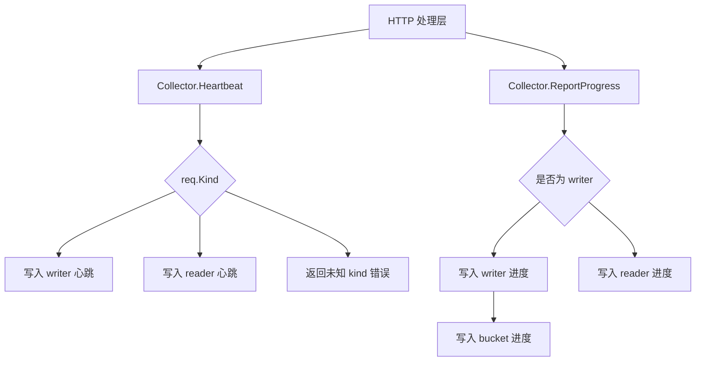

# Progress Collection

## 模块职责

`internal/collector` 是进度采集写入层，负责处理两个上报入口：

- `/api/v1/heartbeat`：刷新 writer 或 reader 的心跳状态。
- `/api/v1/report_progress`：写入 worker 进度、错误信息、文件计数、bucket 进度等运行状态。

该模块本身不保存状态，也不直接实现持久化逻辑。`Collector` 只做请求分流、时间戳归一化，并调用 `internal/store.Store` 完成实际写入。

## 核心类型

```go
type Collector struct {
	st *store.Store
}
```

`Collector` 持有一个 `*store.Store`，所有写入操作都通过它完成。

```go
func New(st *store.Store) *Collector
```

`New` 是模块构造入口。当前由 `cmd/main.go` 调用，用于把 store 注入采集层；测试中也通过 `newTestCollector` 间接调用。

## Heartbeat

```go
func (c *Collector) Heartbeat(ctx context.Context, req *types.HeartbeatRequest) error
```

`Heartbeat` 处理 `/api/v1/heartbeat` 请求。函数会使用当前 UTC 时间作为心跳写入时间：

```go
now := time.Now().UTC()
```

随后根据 `req.Kind` 选择不同的 store 写入方法：

- `types.KindWriter` 调用 `c.st.UpsertWriterHeartbeat(ctx, req.JobID, req, now)`
- `types.KindReader` 调用 `c.st.UpsertReaderHeartbeat(ctx, req.JobID, req, now)`
- 其他值返回 `unknown kind: ...` 错误

这里的 `Upsert` 语义表示心跳记录可以被创建或更新。`Collector` 不判断 worker 是否已存在，也不处理 TTL 细节；这些行为由 `store.Store` 负责。

## ReportProgress

```go
func (c *Collector) ReportProgress(ctx context.Context, req *types.ProgressRequest) error
```

`ReportProgress` 处理 `/api/v1/report_progress` 请求。它的主要职责是把一次进度上报拆分成 writer 进度、bucket 进度或 reader 进度写入。

### 时间戳处理

函数优先使用请求中的 `req.LastUpdateTime`：

```go
progressTime := req.LastUpdateTime.UTC()
if progressTime.IsZero() {
	progressTime = time.Now().UTC()
}
```

如果请求没有提供有效时间，则使用当前 UTC 时间。后续 writer、reader 和 bucket 写入都会基于这个归一化后的时间。

对于 writer 的 bucket 明细，每个 bucket 还可以带自己的 `LastUpdateTime`：

```go
bucketTime := req.Buckets[i].LastUpdateTime.UTC()
if bucketTime.IsZero() {
	bucketTime = progressTime
}
```

因此 bucket 的时间优先级是：

1. `req.Buckets[i].LastUpdateTime`
2. `req.LastUpdateTime`
3. 当前 UTC 时间

### Writer 进度写入

当 `req.Kind == types.KindWriter` 时，函数先写入 writer 级别状态：

```go
c.st.ApplyWriterProgress(
	ctx,
	req.JobID,
	req.WriterID,
	req.WorkerStatus,
	req.ErrorMessage,
	progressTime,
)
```

随后遍历 `req.Buckets`，逐个调用：

```go
c.st.ApplyBucketProgress(ctx, req.JobID, req.WriterID, &req.Buckets[i], bucketTime)
```

注意这里传入的是 `&req.Buckets[i]`，不是 range value 的地址，因此不会出现 Go 中常见的循环变量地址复用问题。

writer 进度上报不会刷新 writer heartbeat。测试 `TestReportProgressDoesNotTouchWriterHeartbeat` 覆盖了这一点，说明心跳和进度是两个独立写入路径。

### Reader 进度写入

当 `req.Kind` 不是 `types.KindWriter` 时，当前实现会走 reader 进度写入：

```go
c.st.ApplyReaderProgress(
	ctx,
	req.JobID,
	req.ReaderID,
	req.Files,
	req.BucketsSeen,
	req.WorkerStatus,
	req.ErrorMessage,
	progressTime,
)
```

这意味着 `ReportProgress` 只显式识别 writer；reader 以及其他非 writer kind 都会进入 reader 分支。调用方或上层 HTTP 解析逻辑应保证 `ProgressRequest.Kind` 已经被校验为合法值，否则可能把非法 kind 当作 reader 进度处理。

## 执行路径



## 与其他模块的关系

`collector` 位于 HTTP/API 层和持久化层之间：

- `cmd/main.go` 通过 `collector.New(st)` 创建 `Collector`。
- API handler 会把请求解析成 `types.HeartbeatRequest` 或 `types.ProgressRequest`。
- `Collector` 根据请求内容调用 `store.Store` 的写入方法。
- `store.Store` 负责实际的状态更新、TTL 刷新、任务状态推导等持久化相关逻辑。

本模块依赖的主要类型来自 `internal/types`：

- `types.HeartbeatRequest`
- `types.ProgressRequest`
- `types.KindWriter`
- `types.KindReader`

依赖的主要 store 方法包括：

- `UpsertWriterHeartbeat`
- `UpsertReaderHeartbeat`
- `ApplyWriterProgress`
- `ApplyBucketProgress`
- `ApplyReaderProgress`

## 贡献注意事项

修改 `Heartbeat` 时，需要保持 writer 和 reader 心跳路径的区分，并确保未知 kind 明确返回错误。

修改 `ReportProgress` 时，需要特别注意三点：

1. 进度上报不应隐式刷新 heartbeat，除非同时更新相关测试和调用约定。
2. writer 的 bucket 写入应继续使用索引取地址模式 `&req.Buckets[i]`。
3. 如果要严格校验 reader kind，应显式增加 `types.KindReader` 分支，并处理非法 kind 的错误返回，避免改变现有 reader 上报行为时引入兼容性问题。