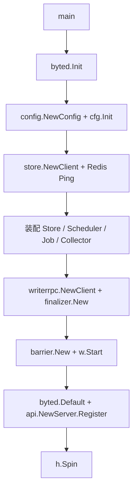

# Service Entry Point

## 服务入口模块

`cmd/main.go` 是进程入口，负责把配置、存储、调度、任务管理、采集、写入 RPC、终态处理、Barrier 后台循环和 Hertz HTTP 服务装配成一个可运行的服务。该模块不承载业务逻辑，核心职责是按正确顺序初始化依赖，并定义进程生命周期。

### 启动流程



`main()` 的执行顺序是固定的：

1. 调用 `byted.Init()` 初始化 ByteDance 基础运行环境，包括 PSM、Cluster、日志、Metrics 和 agentSDK。代码注释明确要求它必须早于 `env.PSM()`、`tccclient` 等环境相关能力。
2. 通过 `config.NewConfig(local.ConfDir())` 构造配置对象，再调用 `cfg.Init()` 完成配置加载、默认值填充和校验。调用链会进入 `applyDefaults` 和 `validate`。
3. 使用 `store.NewClient(cfg)` 创建 Redis 客户端。失败会 `logs.Fatal` 终止进程。
4. 启动时用 2 秒超时执行 `rdb.WithContext(pingCtx).Ping().Err()` 探活。探活失败只打印 `logs.Warn`，服务继续启动，便于单测或开发环境在 Redis 不可用时仍能拉起。
5. 构造业务组件：
   - `store.New(rdb, cfg)` 创建存储封装。
   - `scheduler.NewLambdaLauncher(cfg)` 创建 Lambda 调度器。
   - `job.New(st, cfg, sched)` 创建任务管理器。
   - `collector.New(st)` 创建采集组件。
   - `writerrpc.NewClient(cfg.WriterRPC.PSM, timeout)` 创建 Writer RPC 客户端。
   - `finalizer.New(st, cfg, writerCli)` 创建终态处理器。
6. 创建根上下文 `rootCtx`，用于控制后台协程生命周期。
7. 通过 `barrier.New(st, cfg, fin)` 创建 Barrier，并在 goroutine 中调用 `w.Start(rootCtx)`。
8. 使用 `byted.Default()` 创建 Hertz server，通过 `api.NewServer(cfg, st, jobMgr, col).Register(h)` 注册 HTTP 路由。
9. 注册 `h.OnShutdown` 钩子，停机时取消后台上下文并关闭 Redis 连接。
10. 调用 `h.Spin()` 启动服务。`Spin()` 内部会监听 `SIGINT`、`SIGTERM` 并触发 shutdown hook。

### 关键组件关系

`cmd/main.go` 只做依赖注入，不直接处理请求或任务状态。各组件的依赖方向如下：

| 组件 | 构造函数 | 主要依赖 | 在入口中的作用 |
|---|---|---|---|
| 配置 | `config.NewConfig` / `cfg.Init` | `local.ConfDir()` | 提供所有模块运行参数 |
| Redis 客户端 | `store.NewClient` | `cfg` | 底层 Redis 连接 |
| Store | `store.New` | `rdb`, `cfg` | 对业务存储访问进行封装 |
| Scheduler | `scheduler.NewLambdaLauncher` | `cfg` | 提供 Lambda 启动能力 |
| Job Manager | `job.New` | `st`, `cfg`, `sched` | 管理任务创建和调度 |
| Collector | `collector.New` | `st` | 提供状态/数据采集能力 |
| Writer RPC | `writerrpc.NewClient` | `cfg.WriterRPC` | 连接外部 Writer 服务 |
| Finalizer | `finalizer.New` | `st`, `cfg`, `writerCli` | 处理任务最终状态 |
| Barrier | `barrier.New` | `st`, `cfg`, `fin` | 后台扫描并推进状态 |
| API Server | `api.NewServer` | `cfg`, `st`, `jobMgr`, `col` | 注册 Hertz HTTP 接口 |

### 错误处理策略

入口模块把初始化错误分成两类：

- 致命错误：配置初始化、Redis 客户端创建、Writer RPC 客户端创建、Finalizer 创建失败都会调用 `logs.Fatal`。这些依赖缺失时服务无法正确提供能力。
- 非致命错误：Redis `Ping()` 失败只记录 warning。原因是 Redis 客户端已成功构造，探活失败可能只是开发、单测或启动阶段的临时环境问题。

这种策略意味着贡献代码时不要把业务依赖的真实初始化失败吞掉；只有“启动前探测类”问题才适合降级为日志。

### 生命周期与优雅停机

后台 Barrier 使用 `rootCtx` 控制：

```go
rootCtx, rootCancel := context.WithCancel(context.Background())
defer rootCancel()

w := barrier.New(st, cfg, fin)
go w.Start(rootCtx)
```

Hertz shutdown hook 中再次调用 `rootCancel()`，并关闭 Redis：

```go
h.OnShutdown = append(h.OnShutdown, func(_ context.Context) {
    logs.Info("[main] hertz on-shutdown hook running")
    rootCancel()
    _ = rdb.Close()
})
```

因此，`barrier.Start` 及其下游逻辑应持续尊重传入的 `context.Context`，避免在进程退出时阻塞。新增后台协程时也应接入同一个根上下文，或者在 shutdown hook 中显式释放资源。

### 与 API 层的连接

HTTP 服务由以下代码完成装配：

```go
h := byted.Default()
api.NewServer(cfg, st, jobMgr, col).Register(h)
```

入口模块只把 `cfg`、`st`、`jobMgr`、`col` 注入 API server，不关心具体路由。新增接口通常应在 `internal/api` 内扩展 `Server` 或其 `Register` 逻辑；只有当接口需要新的顶层依赖时，才需要修改 `cmd/main.go` 的装配代码。

### 修改建议

修改该模块时应优先保持“入口只装配，不承载业务逻辑”的边界。新增依赖时，建议按现有顺序放置：先配置和外部连接，再创建内部服务，再启动后台任务，最后注册 HTTP 服务和停机钩子。

如果新增组件持有连接、goroutine 或需要清理的资源，应同时补充 `h.OnShutdown` 逻辑。若组件依赖配置字段，应确保 `cfg.Init()` 的默认值和校验逻辑已经覆盖该字段，避免入口层出现零值兜底逻辑。