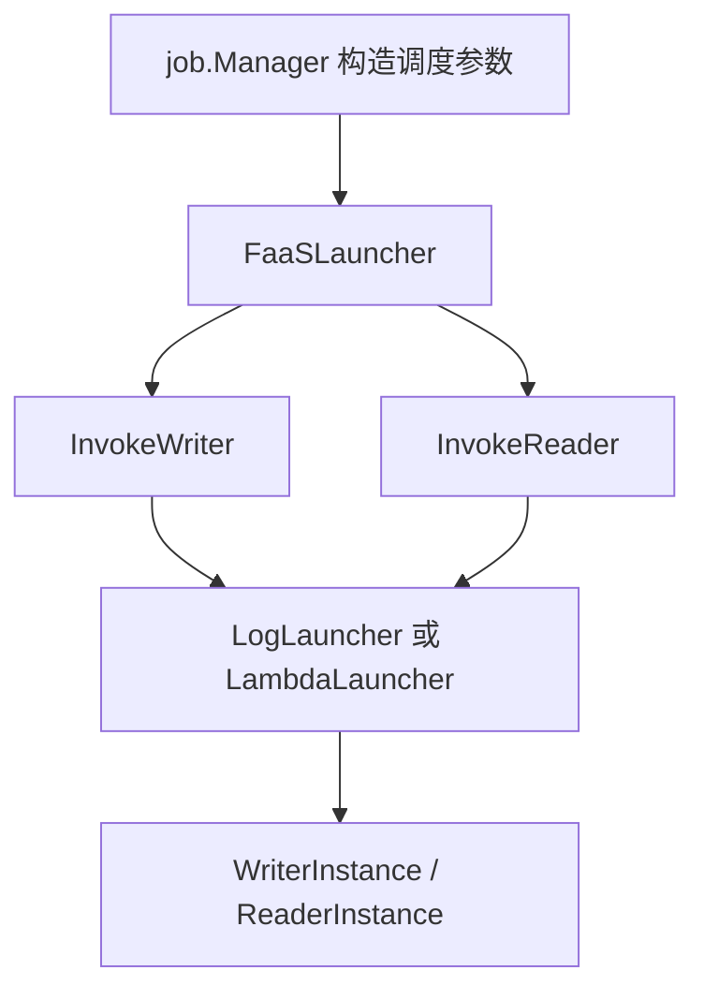
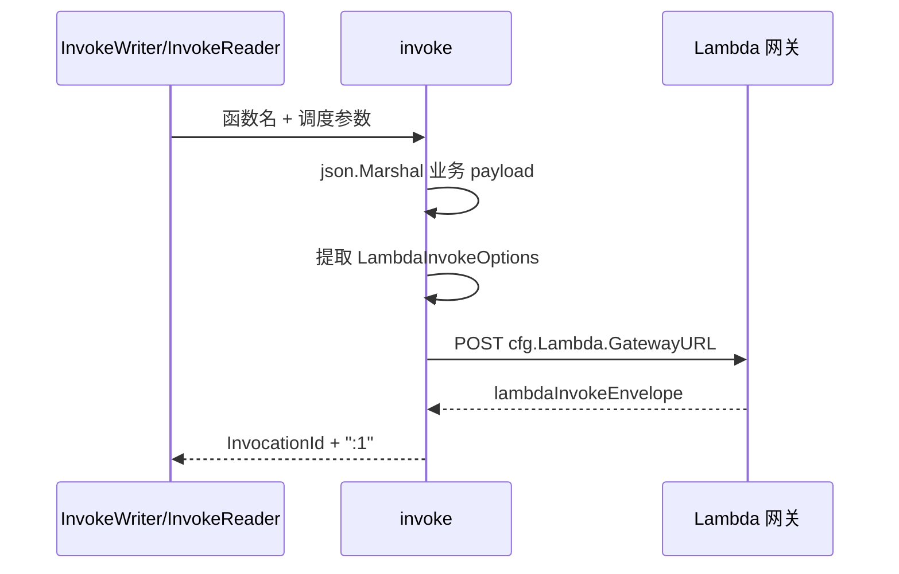

# Worker Scheduling

## 工作器调度模块

`internal/scheduler` 封装控制面拉起 Reader/Writer 工作器的能力。它把上层 `job.Manager` 与具体 FaaS 调用方式隔离开：任务管理逻辑只依赖 `FaaSLauncher` 接口，不需要知道底层是本地日志 stub 还是 Lambda 网关。

模块当前包含两类实现：

- `LogLauncher`：本地联调与单元测试用，只打印日志并返回伪造的 `WorkerID`。
- `LambdaLauncher`：通过 HTTP 调用 Lambda 网关，返回网关响应中的 `InvocationId` 作为工作器标识。



## 核心抽象

### `FaaSLauncher`

`FaaSLauncher` 是控制面对 FaaS 平台的最小依赖：

```go
type FaaSLauncher interface {
    InvokeWriter(ctx context.Context, args WriterInvokeArgs) (*WriterInstance, error)
    InvokeReader(ctx context.Context, args ReaderInvokeArgs) (*ReaderInstance, error)
}
```

上层代码通过这个接口拉起 Writer 或 Reader。`internal/job/manager.go` 中的 `buildWriterInvokeArgs`、`buildReaderInvokeArgs`、`buildReaderSinkInput` 等函数负责组装 `scheduler` 包中的参数结构，然后调用 `FaaSLauncher`。

这种边界使调度实现可以替换：

- 本地环境使用 `NewLogLauncher()`。
- 真实部署使用 `NewLambdaLauncher(cfg)`。
- 单元测试可以注入自定义 fake launcher，并返回 `WriterInstance` 或 `ReaderInstance`。

## 调度入参模型

### `WriterInvokeArgs`

`WriterInvokeArgs` 描述拉起 Writer 实例需要的参数：

```go
type WriterInvokeArgs struct {
    JobID            string
    BucketIDs        []string
    HDFSOutputPath   string
    HDFSTempDir      string
    SkipStartupCheck bool
    Sort             WriterSortInput
    ControlPlane     WriterControlPlaneInput
    Router           WriterRouterInput
    Lambda           LambdaInvokeOptions
}
```

关键字段含义：

- `JobID`：任务 ID。
- `BucketIDs`：Writer 负责处理的 bucket ID 列表，字符串形式。
- `HDFSOutputPath`、`HDFSTempDir`：Writer 输出路径与临时目录。
- `SkipStartupCheck`：是否跳过启动检查。
- `Sort`：排序相关参数，类型为 `WriterSortInput`。
- `ControlPlane`：Writer 回连控制面的配置，类型为 `WriterControlPlaneInput`。
- `Router`：Writer 路由注册配置，类型为 `WriterRouterInput`。
- `Lambda`：Lambda 调用级别的选项，不会进入业务 payload JSON。

`Lambda` 字段使用 `json:"-"`，因此 `json.Marshal(WriterInvokeArgs)` 时不会被序列化到 Lambda 函数的业务 payload 中。`LambdaLauncher` 会通过 `lambdaInvokeOptionsFromPayload` 单独读取它，并在网关请求的 `Annotations` 中传递。

### `ReaderInvokeArgs`

`ReaderInvokeArgs` 描述拉起 Reader 实例需要的参数：

```go
type ReaderInvokeArgs struct {
    JobID           string
    SourceType      string
    HDFSParquet     *ReaderHDFSParquetInput
    TOSInventoryCSV *ReaderTOSInventoryInput
    Bucketing       ReaderBucketingInput
    Limits          ReaderLimitsInput
    Sink            *ReaderSinkInput
    ControlPlane    *ReaderControlPlaneInput
    Lambda          LambdaInvokeOptions
}
```

Reader 支持两类输入源：

- `HDFSParquet`：通过 `ReaderHDFSParquetInput` 描述 HDFS Parquet 输入。
- `TOSInventoryCSV`：通过 `ReaderTOSInventoryInput` 描述 TOS inventory CSV 输入。

其他关键配置：

- `Bucketing`：分桶配置，包含 `NumBuckets`、`HashAlg`、`SparkSeed`。
- `Limits`：Reader 并发与批处理限制，类型为 `ReaderLimitsInput`。
- `Sink`：Reader 输出到 Writer 或 Redis 的配置，类型为 `ReaderSinkInput`。
- `ControlPlane`：Reader 回连控制面的配置。
- `Lambda`：Lambda 调用级别选项，同样不进入业务 payload JSON。

### `LambdaInvokeOptions`

`LambdaInvokeOptions` 目前只包含一个字段：

```go
type LambdaInvokeOptions struct {
    Cluster string
}
```

它用于控制 Lambda 网关调用的注解：

```json
{
  "Annotations": {
    "Cluster": "..."
  }
}
```

只有当 `Cluster` 去除空白后不为空时，`LambdaLauncher.invoke` 才会设置 `Annotations`。

## 实例标识

调度成功后返回轻量实例对象：

```go
type WriterInstance struct {
    WorkerID string
}

type ReaderInstance struct {
    WorkerID string
}
```

`WorkerID` 的来源取决于 launcher 实现：

- `LogLauncher`：生成 `writer-<uuid>` 或 `reader-<uuid>`。
- `LambdaLauncher`：使用 Lambda 网关返回的 `InvocationId`，并追加 `:1`。

## `LogLauncher`

`LogLauncher` 是本地 stub 实现：

```go
func NewLogLauncher() *LogLauncher
func (l *LogLauncher) InvokeWriter(ctx context.Context, a WriterInvokeArgs) (*WriterInstance, error)
func (l *LogLauncher) InvokeReader(ctx context.Context, a ReaderInvokeArgs) (*ReaderInstance, error)
```

`InvokeWriter` 会记录：

- `JobID`
- 生成的 writer worker ID
- bucket 数量
- HDFS 输出路径

`InvokeReader` 会记录：

- `JobID`
- 生成的 reader worker ID
- `SourceType`
- bucket 数量
- 输入文件数量

Reader 输入文件数量由 `readerFilePathsForLog` 计算：

```go
func readerFilePathsForLog(a ReaderInvokeArgs) []string {
    if a.HDFSParquet != nil {
        return a.HDFSParquet.FilePaths
    }
    if a.TOSInventoryCSV != nil {
        return a.TOSInventoryCSV.CSVURIs
    }
    return nil
}
```

这个函数只用于日志，不参与调度决策。

## `LambdaLauncher`

`LambdaLauncher` 是真实 Lambda 网关调用实现：

```go
type LambdaLauncher struct {
    cfg    *config.Config
    client *http.Client
}
```

通过 `NewLambdaLauncher(cfg)` 构造。构造函数会从 `cfg.Lambda.TimeoutMs` 设置 HTTP client timeout；如果配置值小于等于 0，则默认使用 `5 * time.Second`。

```go
func NewLambdaLauncher(cfg *config.Config) *LambdaLauncher {
    timeout := time.Duration(cfg.Lambda.TimeoutMs) * time.Millisecond
    if timeout <= 0 {
        timeout = 5 * time.Second
    }
    return &LambdaLauncher{
        cfg: cfg,
        client: &http.Client{
            Timeout: timeout,
        },
    }
}
```

`cmd/main.go` 会调用 `NewLambdaLauncher`，把配置中的 Lambda 网关能力注入到应用主流程。

### Writer 调用流程

```go
func (l *LambdaLauncher) InvokeWriter(ctx context.Context, args WriterInvokeArgs) (*WriterInstance, error) {
    invocationID, err := l.invoke(ctx, l.cfg.Lambda.WriterFunction, args)
    if err != nil {
        return nil, err
    }
    return &WriterInstance{WorkerID: invocationID}, nil
}
```

`InvokeWriter` 使用 `cfg.Lambda.WriterFunction` 作为函数名，并复用通用的 `invoke` 方法完成请求构造、HTTP 调用和响应解析。

### Reader 调用流程

```go
func (l *LambdaLauncher) InvokeReader(ctx context.Context, args ReaderInvokeArgs) (*ReaderInstance, error) {
    invocationID, err := l.invoke(ctx, l.cfg.Lambda.ReaderFunction, args)
    if err != nil {
        return nil, err
    }
    return &ReaderInstance{WorkerID: invocationID}, nil
}
```

`InvokeReader` 与 Writer 流程一致，只是函数名来自 `cfg.Lambda.ReaderFunction`。

## Lambda 网关请求格式

`invoke` 会先把 `WriterInvokeArgs` 或 `ReaderInvokeArgs` 序列化成业务 payload 字符串，然后包装成 Lambda 网关请求：

```go
type lambdaInvokeRequest struct {
    FuncName    string
    Qualifier   string
    InvokeType  string
    Payload     string
    Annotations *lambdaInvokeAnnotations
}
```

字段来源：

- `FuncName`：调用方传入，Writer 使用 `cfg.Lambda.WriterFunction`，Reader 使用 `cfg.Lambda.ReaderFunction`。
- `Qualifier`：来自 `cfg.Lambda.Qualifier`。
- `InvokeType`：来自 `cfg.Lambda.InvokeType`，会通过 `strings.ToLower` 转成小写。
- `Payload`：业务参数 JSON 字符串。
- `Annotations`：当 `LambdaInvokeOptions.Cluster` 非空时设置。

执行流程可以概括为：



## Lambda 响应处理

Lambda 网关响应会解析到：

```go
type lambdaInvokeEnvelope struct {
    Message  string
    Code     int
    TraceID  string
    Response lambdaInvokeResponse
}

type lambdaInvokeResponse struct {
    InvocationID    string
    ExecutedVersion string
}
```

`invoke` 的错误处理顺序如下：

1. `LambdaLauncher` 或 `cfg` 为空时，返回 `lambda launcher is nil`。
2. 业务 payload 序列化失败时，返回 `marshal lambda payload`。
3. 网关请求体序列化失败时，返回 `marshal lambda invoke request`。
4. 创建 HTTP 请求失败时，返回 `new lambda invoke request`。
5. HTTP 调用失败时，返回 `invoke lambda <funcName>`。
6. HTTP 状态码不是 `200 OK` 时，返回 `unexpected status=<status>`。
7. 响应 JSON 解码失败时，返回 `decode lambda invoke response`。
8. `env.Code != 0` 时，返回网关错误码、错误消息和 `trace_id`。
9. `env.Response.InvocationID` 为空时，返回 `returned empty invocation id`。

成功时返回：

```go
return env.Response.InvocationID + ":1", nil
```

因此 `WriterInstance.WorkerID` 和 `ReaderInstance.WorkerID` 在 Lambda 实现下不是原始 `InvocationId`，而是追加了 `:1` 的字符串。

## Lambda 选项提取

`lambdaInvokeOptionsFromPayload` 用于从不同 payload 形态中提取 `LambdaInvokeOptions`：

```go
func lambdaInvokeOptionsFromPayload(payload any) LambdaInvokeOptions
```

它支持三种路径：

- payload 实现 `lambdaInvokeOptionsCarrier` 接口。
- payload 是 `*WriterInvokeArgs`。
- payload 是 `*ReaderInvokeArgs`。

`WriterInvokeArgs` 和 `ReaderInvokeArgs` 都实现了内部接口：

```go
type lambdaInvokeOptionsCarrier interface {
    lambdaInvokeOptions() LambdaInvokeOptions
}

func (a WriterInvokeArgs) lambdaInvokeOptions() LambdaInvokeOptions { return a.Lambda }
func (a ReaderInvokeArgs) lambdaInvokeOptions() LambdaInvokeOptions { return a.Lambda }
```

由于 `InvokeWriter` 和 `InvokeReader` 当前传入的是值类型 `args`，主要命中的是 `lambdaInvokeOptionsCarrier` 分支。指针分支用于兼容未来直接传入 `*WriterInvokeArgs` 或 `*ReaderInvokeArgs` 的情况。

## 辅助函数

### `BucketIDsFromInts`

`BucketIDsFromInts` 把 `[]int32` bucket ID 转成 `[]string`：

```go
func BucketIDsFromInts(bucketIDs []int32) []string {
    out := make([]string, 0, len(bucketIDs))
    for _, bucketID := range bucketIDs {
        out = append(out, strconv.Itoa(int(bucketID)))
    }
    return out
}
```

`internal/job/manager.go` 的 `buildWriterInvokeArgs` 会使用它来构造 `WriterInvokeArgs.BucketIDs`。

## 与代码库其他部分的关系

`internal/scheduler` 位于任务控制面和 FaaS 平台之间：

- `cmd/main.go` 负责构造真实 `LambdaLauncher`。
- `internal/job/manager.go` 负责把任务配置转换为 `WriterInvokeArgs`、`ReaderInvokeArgs` 等调度参数。
- `internal/job/manager_test.go` 通过 `WriterInstance`、`ReaderInstance` 验证调度交互。
- `internal/scheduler/lambda_launcher_test.go` 验证 `LambdaInvokeOptions.Cluster` 会被转成 Lambda 网关的 `Annotations.Cluster`。

这个模块不负责决定任务如何分桶、输入源如何解析、Reader/Writer 如何执行任务。它只负责把已经构造好的调度参数交给底层 launcher，并把启动后的实例 ID 返回给调用方。

## 扩展真实 FaaS 能力时的注意点

新增 launcher 实现时，应优先实现 `FaaSLauncher`，避免让 `job.Manager` 依赖具体平台 SDK。

如果需要新增 Lambda 调用选项，推荐沿用现有模式：

1. 在 `LambdaInvokeOptions` 增加字段。
2. 保持业务 payload 字段 `json:"-"`，避免把调用控制参数传给 Reader/Writer 业务逻辑。
3. 在 `invoke` 中把调用级选项映射到网关请求字段，例如 `Annotations`。
4. 增加 `lambda_launcher_test.go` 覆盖请求体结构。

如果需要新增 Reader 输入源，应扩展 `ReaderInvokeArgs` 和对应输入结构，并同步检查：

- `internal/job/manager.go` 中的参数构造逻辑。
- `readerFilePathsForLog` 的日志文件数量统计。
- Reader 端实际消费的 JSON 字段名。