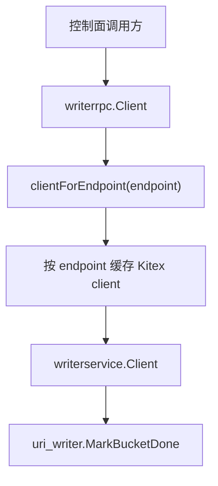

# Writer RPC Integration

## Writer RPC 集成

`internal/writerrpc` 封装了控制面到 `uri_writer` 服务的 Kitex RPC 调用。它的核心约束是：fan-out 必须精确路由到某个 Writer 实例，因此客户端不通过 PSM 服务发现寻址，而是为每个 `endpoint` 按需创建带 `kitexclient.WithHostPorts(endpoint)` 的 Kitex client。



## 主要职责

`Client` 是 Writer RPC 的集成边界，负责：

- 校验并保存 Writer 逻辑服务名 `destService`
- 按 endpoint 精确创建 `writerservice.Client`
- 缓存每个规范化 endpoint 对应的 Kitex client
- 设置 RPC 超时和连接超时
- 调用 `MarkBucketDone`
- 将 Writer 返回的业务错误码转换为 Go `error`

该结构体隐式实现 `finalizer.WriterRPCClient` 接口，因此可以直接传入 `finalizer.New`。当前调用入口包括 `cmd/main.go` 中的 `NewClient` 初始化，以及 `internal/scheduler/lambda_launcher.go` 中 `NewLambdaLauncher` 对 `Client` 的依赖。

## Client 结构

```go
type Client struct {
    destService    string
    rpcTimeout     time.Duration
    connectTimeout time.Duration

    mu         sync.RWMutex
    byEndpoint map[string]writerservice.Client
}
```

字段含义：

- `destService`：Kitex 逻辑服务名，用于 `writerservice.NewClient`，也用于日志和错误信息。
- `rpcTimeout`：通过 `kitexclient.WithRPCTimeout` 设置单次 RPC 超时。
- `connectTimeout`：通过 `kitexclient.WithConnectTimeout` 设置连接超时。
- `byEndpoint`：以规范化后的 endpoint 为 key，缓存 `writerservice.Client`。
- `mu`：保护 `byEndpoint`，支持并发调用下的安全读写。

## 初始化

`NewClient(destService string, timeout time.Duration) (*Client, error)` 负责构造封装客户端。

它会拒绝两类非法配置：

```go
if destService == "" {
    return nil, errors.New("writerrpc: empty dest service")
}
if timeout <= 0 {
    return nil, errors.New("writerrpc: timeout must be > 0")
}
```

成功创建后，`rpcTimeout` 和 `connectTimeout` 都使用同一个 `timeout` 值，`byEndpoint` 初始化为空 map。真正的 Kitex client 不会在 `NewClient` 阶段创建，而是在第一次访问某个 endpoint 时由 `clientForEndpoint` 懒加载。

`DestService()` 是一个轻量访问器，返回当前客户端绑定的逻辑服务名，主要用于诊断和日志场景。

## MarkBucketDone 调用流程

`MarkBucketDone(ctx context.Context, endpoint string, bucketID int) error` 是该模块暴露的核心业务方法。它用于通知指定 Writer 实例某个 bucket 已完成。

执行流程：

1. 调用 `clientForEndpoint(endpoint)` 获取精确路由到目标 endpoint 的 `writerservice.Client`。
2. 构造 `uri_writer.MarkBucketDoneRequest`，将 `bucketID` 转换为 `int32`。
3. 调用 Kitex 生成的 `cli.MarkBucketDone`。
4. 检查 RPC 错误、空响应和业务错误码。
5. 仅当 `resp.ErrorCode == uri_writer.ErrorCode_SUCCESS` 时返回 `nil`。

请求结构：

```go
resp, err := cli.MarkBucketDone(ctx, &uri_writer.MarkBucketDoneRequest{
    BucketId: int32(bucketID),
})
```

错误处理分为三层：

- RPC 层错误：包装为包含 `service`、`endpoint`、`bucket` 的错误。
- 空响应：返回 `writerrpc: empty MarkBucketDoneResponse`。
- 业务错误码：记录 `logs.Error`，并返回包含 `ErrorCode` 和 `Message` 的错误。

业务失败时的日志包含：

- `service`
- `endpoint`
- `bucket`
- `code`
- `msg`

这使得调用方可以区分网络、Kitex 调用失败与 Writer 业务拒绝。

## endpoint 精确路由与缓存

`clientForEndpoint(endpoint string) (writerservice.Client, error)` 是路由和缓存的核心。

它先拒绝空 endpoint：

```go
if endpoint == "" {
    return nil, errors.New("writerrpc: empty endpoint")
}
```

之后调用 `normalizeEndpoint(endpoint)` 生成缓存 key，并使用双重检查锁定模式：

1. 先用 `RLock` 查询 `byEndpoint`。
2. 未命中时进入写锁。
3. 写锁内再次查询，避免并发重复创建。
4. 仍未命中时调用 `writerservice.NewClient`。
5. 创建成功后写入 `byEndpoint`。

Kitex client 创建时使用：

```go
writerservice.NewClient(
    c.destService,
    kitexclient.WithHostPorts(normalized),
    kitexclient.WithRPCTimeout(c.rpcTimeout),
    kitexclient.WithConnectTimeout(c.connectTimeout),
)
```

这里的关键点是 `kitexclient.WithHostPorts(normalized)`。它让请求直接发往指定 host:port，而不是通过服务发现选择实例。

## endpoint 规范化

`normalizeEndpoint(endpoint string) string` 只处理一种实际问题：裸 IPv6 地址加端口时，需要转换成标准的 bracket host-port 形式。

示例：

```go
normalizeEndpoint("2001:db8::1:8080")
// 返回 "[2001:db8::1]:8080"
```

函数会保持以下输入不变：

- 空字符串
- 已经能通过 `net.SplitHostPort` 解析的 endpoint
- 已经包含 `[` 或 `]` 的 endpoint
- 冒号数量少于 2 的普通 IPv4 或域名地址
- 末尾端口不是数字的字符串
- host 不是 IPv6，或是 IPv4

规范化逻辑的目的不是修复任意非法 endpoint，而是在不改变常见地址格式的前提下，兼容 `host:port` 形式的 IPv6 endpoint。

该函数被 `clientForEndpoint` 调用，也由 `internal/writerrpc/client_test.go` 中的 `TestNormalizeEndpoint` 覆盖。

## 与代码库其他部分的连接

`writerrpc.Client` 位于控制面与 `uri_writer` 服务之间，向上承接调度和 finalizer 逻辑，向下调用 Kitex 生成代码。

当前已知连接点：

- `cmd/main.go` 调用 `NewClient` 创建 Writer RPC 客户端。
- `internal/scheduler/lambda_launcher.go` 的 `NewLambdaLauncher` 依赖该客户端类型。
- `Client` 的方法签名与 `finalizer.WriterRPCClient` 匹配，可作为 finalizer 的 Writer 通知实现。
- Kitex 生成包 `uri_writer/writerservice` 提供实际 RPC client。
- Kitex 生成包 `uri_writer` 提供 `MarkBucketDoneRequest`、`MarkBucketDoneResponse` 和 `ErrorCode_SUCCESS`。

## 贡献注意事项

修改该模块时需要保持三个语义不变：

1. endpoint 必须精确路由。不要把 `WithHostPorts` 替换为普通服务发现逻辑。
2. `byEndpoint` 必须并发安全。新增缓存行为时需要继续受 `mu` 保护。
3. `MarkBucketDone` 必须区分 RPC 错误、空响应和业务错误码，避免把 Writer 业务失败当作成功处理。

如果新增 Writer RPC 方法，建议沿用 `MarkBucketDone` 的模式：

```go
// 1. 通过 endpoint 获取精确路由 client
cli, err := c.clientForEndpoint(endpoint)
if err != nil {
    return err
}

// 2. 发起 Kitex RPC
resp, err := cli.SomeMethod(ctx, req)
if err != nil {
    return fmt.Errorf("writerrpc: rpc call some_method service=%s endpoint=%s: %w",
        c.destService, endpoint, err)
}

// 3. 检查空响应和业务错误码
if resp == nil {
    return errors.New("writerrpc: empty SomeMethodResponse")
}
```

这样可以保持调用链的诊断信息、错误语义和 endpoint 路由行为一致。