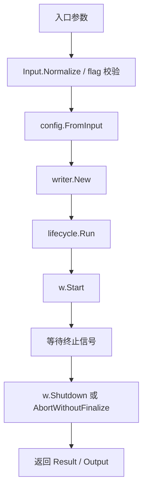

# Application Startup and Lifecycle

## 应用启动与生命周期

该模块负责把 Writer 实例从“启动参数”推进到“可接收 RPC 请求”，并在终止信号到达后完成收尾提交。它覆盖两个入口：

- `main.go`：FaaS/Lambda 入口，通过 `lambda.Start(handler)` 接收事件 payload。
- `cmd/writer_server/main.go`：本地或常驻进程入口，通过命令行 flag 启动 Writer Server。

核心边界很清晰：入口层只负责参数接收、归一化和构造 `config.Config`；真正的业务实例由 `writer.New` 创建；启动、阻塞等待和停机收尾由 `lifecycle.Run` 统一编排。

## 启动链路概览



## FaaS 入口：`main.go`

FaaS 模式的入口是：

```go
func main() {
    lambda.Start(handler)
}
```

`handler(ctx context.Context, in Input) (Output, error)` 是 Writer 实例的主要启动流程：

1. 调用 `in.Normalize()` 校验并填充默认值。
2. 通过 `toConfigInput(&in)` 将入口层 `Input` 转换为 `config.Input`。
3. 调用 `config.FromInput(ctx, ...)` 构造运行期配置。
4. 调用 `applyRuntimeMemoryLimit(cfg.Sort.MemoryLimitMB)` 设置 Go runtime 内存上限。
5. 调用 `reportLocalTmpDirQuota(ctx, cfg.Sort.LocalTmpDir)` 打印本地临时目录容量。
6. 调用 `writer.New(ctx, cfg)` 初始化 Writer。
7. 调用 `lifecycle.Run(ctx, w)` 启动服务并阻塞到停机。
8. 将 `lifecycle.Result` 转换为 `Output` 返回给 Lambda runtime。

`Input` 表示控制面下发的动态启动参数，包含 `JobID`、`BucketIDs`、HDFS 输出路径、HDFS staging 目录、排序参数、控制面参数和 Router 参数。

`Input.Normalize` 执行入口层校验：

- `job_id`、`bucket_ids`、`hdfs_output_path`、`hdfs_temp_dir` 必填。
- `hdfs_output_path` 和 `hdfs_temp_dir` 必须使用 `hdfs://` scheme。
- `Sort.ChunkRecords` 默认 `5_000_000`。
- `Sort.MaxConcurrentMerges` 默认 `4`。
- `Sort.RunFileCompression` 默认 `"snappy"`，只允许 `"zstd"`、`"snappy"`、`"none"`。
- `Sort.CPUBackPressureThresholdPercent` 默认 `85`。
- `ControlPlane.HeartbeatIntervalSec` 默认 `30`。
- `ControlPlane.ProgressReportIntervalSec` 默认 `60`。
- `ControlPlane.Cluster` 默认 `"default"`。
- `Router.KeyPrefix` 默认使用 `JobID`。
- `Router.TTLSeconds` 默认 `300`。

`toConfigInput` 是入口层和 `config` 包之间的隔离点。它避免 `config` 反向依赖 `main` 包，同时显式传递 `SortConfig`、`ControlPlaneConfig`、`RouterConfig` 和 `HDFSConfig`。其中 `SkipStartupCheck` 会映射到 `config.HDFSConfig.SkipStartupCheck`，仅跳过启动阶段 HDFS 目录创建和可写性预检查。

## 本地 Server 入口：`cmd/writer_server/main.go`

`cmd/writer_server/main.go` 提供非 Lambda 的启动方式，适合本地调试、集成测试或常驻进程部署。

启动流程由 `main()` 串联：

1. `parseFlags()` 读取命令行参数。
2. `loadDotEnvIfPresent(opts.envFile)` 加载 `.env` 文件。
3. `prepareRuntimeEnv()` 准备运行时日志目录。
4. 校验 `job-id`、`bucket-ids`、`hdfs-output-path`、`hdfs-temp-dir`。
5. `splitBucketIDs(opts.bucketIDs)` 将逗号分隔的 bucket 表达式转换为 `[]string`。
6. 调用 `config.FromInput(context.Background(), config.Input{...})` 构造配置。
7. 调用 `writer.New(context.Background(), cfg)` 初始化 Writer。
8. 调用 `lifecycle.Run(context.Background(), w)` 启动并等待停机。

本地入口支持的关键 flag 包括：

- `-job-id`
- `-bucket-ids`
- `-hdfs-output-path`
- `-hdfs-temp-dir`
- `-redis-cluster`
- `-key-prefix`
- `-redis-ttl-seconds`
- `-writer-id`
- `-service-ip`
- `-service-port`
- `-chunk-records`
- `-local-tmp-dir`
- `-hdfs-name-node`
- `-hdfs-user`
- `-hdfs-token`
- `-skip-hdfs-startup-check`

`.env` 加载逻辑由 `loadDotEnvIfPresent` 实现：只处理 `KEY=VALUE` 形式，忽略空行和 `#` 注释；如果环境变量已存在，不会覆盖现有值。

`prepareRuntimeEnv` 当前会确保两个目录存在：

- `HDFS_LOG_DIR`，默认 `/tmp/native_hdfs_client`
- `KITEX_LOG_DIR`，默认 `/tmp/uri_writer_kitex_log`

目录创建由 `ensureEnvDir` 完成，使用 `os.MkdirAll(dir, 0o755)`。

## 配置构造：`config.FromInput`

`config.FromInput(ctx, in)` 是启动参数进入业务代码前的统一归一化点。它返回完整的 `*config.Config`，供 `writer`、`router`、`lifecycle`、`service` 和 `controlplane` 使用。

主要职责：

- 校验 `JobID`、`HDFSOutputPath`、`HDFSTempDir`。
- 调用 `parseBucketIDs` 解析 bucket 表达式。
- 调用 `normalizeHDFSPath` 校验并规范化 HDFS 路径。
- 确保输出目录和 staging 目录使用相同 NameNode。
- 填充 `FinalFileNameTemplate`。
- 从 Lambda context 或默认值解析本地临时目录、内存限制和 Writer ID。
- 自动补齐 `Service.IP` 和 `Router.KeyPrefix`。

`parseBucketIDs` 支持混合输入：

```go
[]string{"0-3", "8", "10,11"}
```

会展开、去重并排序为：

```go
[]int32{0, 1, 2, 3, 8, 10, 11}
```

`normalizeHDFSPath` 要求路径以 `hdfs://` 开头，并解析 NameNode host 和 port。返回的 `HDFSRootPath` 和 `HDFSTempDir` 是去掉 scheme 与 host 后的规范路径，例如：

```text
hdfs://namenode:8020/user/data/output
```

会归一化为：

```text
/user/data/output
```

当 `HDFSOutputPath` 与 `HDFSTempDir` 的 NameNode host 不一致，或两者都显式指定 port 但 port 不一致时，`FromInput` 会返回错误。

## 运行时资源处理

`applyRuntimeMemoryLimit(memoryLimitMB int)` 将配置中的内存限制转换为 Go runtime memory limit。当前策略使用 `runtimeMemoryLimitPercent = 75`，即：

```go
runtimeLimitMB := max(memoryLimitMB*75/100, 1)
debug.SetMemoryLimit(int64(runtimeLimitMB) * 1024 * 1024)
```

这样可以给 native 依赖、HDFS client、RPC runtime 和系统开销保留空间，避免 Go heap 把整个实例内存吃满。

`reportLocalTmpDirQuota(ctx, dir)` 会创建本地临时目录，并通过 `syscall.Statfs` 打印总容量和可用容量。如果 Lambda context 中的 `TmpfsDir` 与当前目录一致，还会额外打印 `TmpfsSizeBytes` 表示的平台 tmpfs quota。

容量格式化由 `formatBytes` 完成，输出类似 `512B`、`64.0MiB`、`2.0GiB`。

## 生命周期编排：`lifecycle.Run`

`lifecycle.Run(ctx, w)` 是启动和停机的中心函数。它不直接处理业务写入，而是负责把 Writer 的运行阶段串起来：

1. 如果 `w == nil`，直接返回空 `Result`。
2. 调用 `w.AttachRPCServer(service.NewServer(w.Config(), w))` 绑定 RPC server。
3. 调用 `w.Start(ctx)` 启动 Writer 子组件。
4. 注册 `signal.Notify` 监听 `SIGTERM` 和 `SIGINT`。
5. 阻塞等待以下任一事件：
   - `ctx.Done()`
   - 系统信号 `SIGTERM` / `SIGINT`
   - `w.AutoShutdownCh()`
   - `w.IdleAbortCh()`
6. 如果收到 `IdleAbortCh`，调用 `w.AbortWithoutFinalize`，不执行最终提交。
7. 否则创建 30 秒超时的 `shutdownCtx`，调用 `w.Shutdown(shutdownCtx)`。
8. 将 committed 和 failed bucket 封装为 `lifecycle.Result` 返回。

`Run` 与 `writer.Writer` 的连接点包括：

- `w.Config()`
- `w.AttachRPCServer(...)`
- `w.Start(ctx)`
- `w.AutoShutdownCh()`
- `w.IdleAbortCh()`
- `w.AbortWithoutFinalize(ctx)`
- `w.Shutdown(ctx)`

根据调用链，`w.Start` 会进一步启动控制面客户端、Router 注册和 RPC 服务；`writer.New` 会创建 Router `Registrar`，并根据配置初始化 Writer 内部状态。

## 停机语义

生命周期模块区分两类结束路径。

正常收尾路径由 `ctx.Done()`、`SIGTERM`、`SIGINT` 或 `w.AutoShutdownCh()` 触发。此时 `Run` 会调用 `w.Shutdown`，由 Writer 完成 flush、merge、HDFS rename 提交，并返回：

```go
type Result struct {
    Committed []int32
    Failed    []int32
}
```

FaaS 入口会将其转换为：

```go
type Output struct {
    JobID            string
    WriterID         string
    CommittedBuckets []int32
    FailedBuckets    []int32
}
```

空闲放弃路径由 `w.IdleAbortCh()` 触发。此时 `Run` 使用 5 秒超时调用 `w.AbortWithoutFinalize`，不会执行最终 finalize，也不会返回 committed / failed bucket。这适用于 Writer 在真正接收数据前被判定为空闲退出的场景。

## 与代码库其他模块的关系

`config` 是启动参数和运行期配置的边界。入口层只构造 `config.Input`，其余模块都消费 `config.Config`，避免直接依赖 Lambda payload 或命令行参数。

`writer` 是业务主体。启动模块只通过 `writer.New` 创建实例，通过 `lifecycle.Run` 间接调用 `Start`、`Shutdown` 和 abort 逻辑。

`service` 提供 RPC server。`lifecycle.Run` 使用 `service.NewServer(w.Config(), w)` 创建 server，并通过 `w.AttachRPCServer` 挂载到 Writer。

`router` 在 `writer.New` 内部初始化。调用链中 `handler -> writer.New -> router.New -> Registrar` 和 `cmd/writer_server.main -> writer.New -> router.New -> Registrar` 表明两种入口共享同一套 Router 注册机制。

`controlplane` 在 `w.Start` 阶段参与运行。调用链显示 `Run -> Start -> controlplane.New -> normalizeConfig`，说明控制面客户端不是入口层直接创建的，而是 Writer 启动子组件的一部分。

## 测试关注点

现有测试覆盖了启动参数和配置构造的关键约束：

- `TestInputNormalize_RequiresHDFSScheme` 验证 FaaS 输入要求 HDFS scheme。
- `TestInputNormalize_AcceptsHDFSPath` 验证合法 HDFS 路径可通过校验。
- `TestInputNormalize_RequiresHDFSTempDir` 验证 staging 目录必填。
- `TestToConfigInput_PropagatesHDFSSkipStartupCheck` 验证 `SkipStartupCheck` 能传递到 `config.HDFSConfig`。
- `TestFromInput_DefaultLocalTmpDirFromLambdaContext` 验证优先使用 Lambda `TempDir`。
- `TestFromInput_FallbackLocalTmpDirToTmpfsDir` 验证 `TempDir` 为空时回退到 `TmpfsDir`。
- `TestFromInput_KeepExplicitLocalTmpDir` 验证显式 `LocalTmpDir` 不会被覆盖。
- `TestFromInput_HDFSPathEnablesHDFSAndParsesNameNode` 验证 HDFS 路径解析、NameNode 和 port 填充。
- `TestFromInput_RequiresSameHDFSNamespaceForTempDir` 验证输出目录和 staging 目录必须位于同一 HDFS namespace。

修改启动参数、默认值、HDFS 路径规则或生命周期结束条件时，应优先补充这些层面的测试，因为它们决定 Writer 是否能在控制面、Router、HDFS 和 RPC 服务之间以一致配置启动。