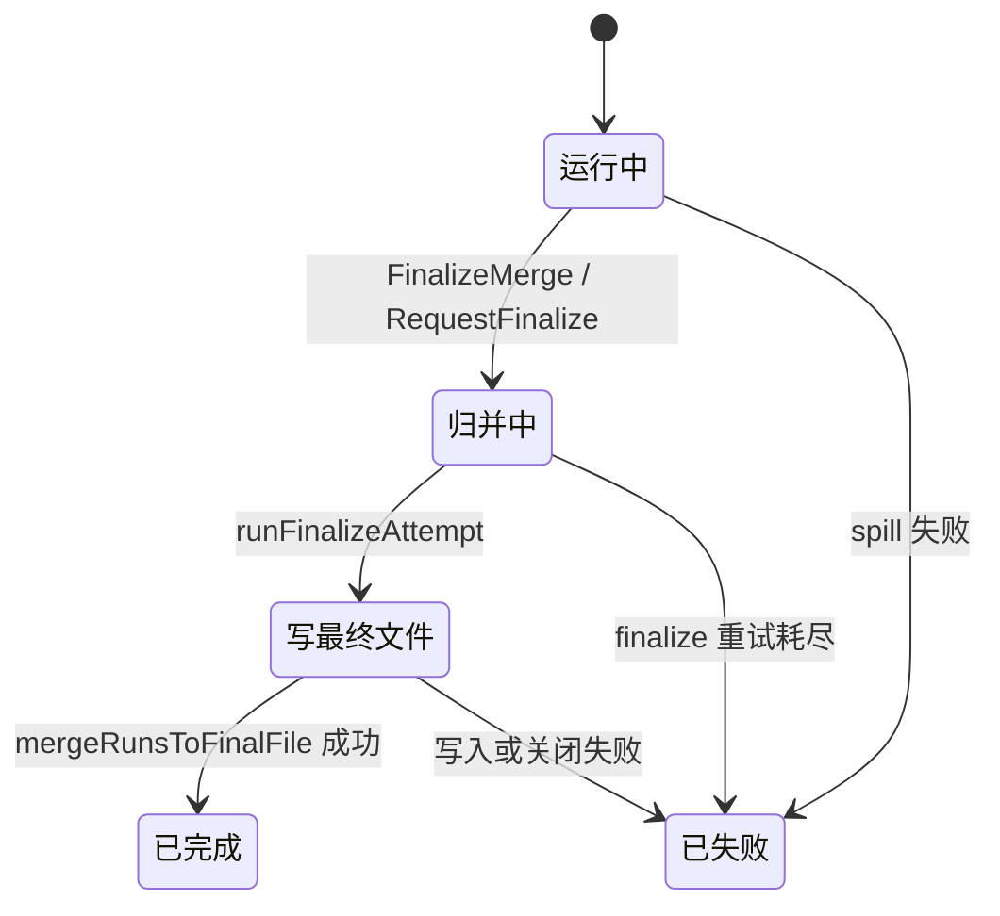

# Bucket State and Spill Management

## 模块职责

`writer/bucket_ctx.go` 负责单个 bucket 在 Writer 内部的状态机、内存缓冲、run 文件 spill、最终归并和进度快照。每个 `WriterCtx` 对应一个 `BucketID`，由 `New` 在 `writer/writer.go` 中创建并放入 `Writer.bucketCtx`。

这个模块的核心目标是：

- 接收 `AppendBatch` 提交的 `ObjectRecord` 批次。
- 将记录先写入内存 `chunkSlot`，达到阈值后异步排序并 spill 成本地 run 文件。
- 在 `FinalizeMerge` / `RequestFinalize` 阶段停止新写入，等待所有 spill 完成。
- 对多个有序 run 文件执行 k-way merge，按 `StoreURI` 精确去重后写入 `FinalOutputSink`。
- 维护 bucket 生命周期状态、计数器和本地磁盘使用量，供 `Snapshot` 上报。

## 生命周期状态

`BucketStatus` 是 Writer 对控制面暴露的 bucket 生命周期状态：

- `BucketStatusRunning`：仍在接收 Reader 写入，并可能周期性生成 run 文件。
- `BucketStatusMerging`：Reader 已结束，正在等待或执行最终归并准备。
- `BucketStatusWritingHDFS`：归并结果正在通过 `FinalOutputWriter.WriteRow` 写入最终输出。
- `BucketStatusDone`：最终输出提交完成，本地临时目录已清理。
- `BucketStatusFailed`：bucket 进入失败终态，后续写入和 finalize 会返回错误。

状态变更通过 `notifyStatusChange` 调用可选回调 `onStatusChange(bucketID, status)`，最终进度由 `Snapshot` 提供给 `collectBucketProgressForID`、`triggerAutoShutdown` 等调用方。



## 并发模型

`WriterCtx` 不直接在 RPC goroutine 中修改复杂状态。外部入口会先构造 `bucketOp`，再通过 `submitOp` 投递到 `opCh`：

- `AppendBatch` 投递 `bucketOpAppend`。
- `SpillRun` 投递 `bucketOpFlush`。
- `FinalizeMerge` 投递 `bucketOpFinalize`。
- `RequestFinalize` 异步投递 `bucketOpFinalize`，不等待归并完成。

`initWorker` 懒启动 `runLoop`。`runLoop` 串行处理 `opCh` 中的 bucket 操作，同时接收 `spillResults`。这种设计让 append、flush、finalize 的主流程按 bucket 串行化；真正耗时的本地 run 文件写入由 `runSpill` 在独立 goroutine 中执行，完成后再把 `spillResult` 发回 `spillResults`。

`mu` 仍然存在，用于保护状态字段、统计计数和进度快照。开发时要注意：`handleAppend`、`handleFinalize`、`handleSpillResult` 等内部方法通常会在持锁状态下读取或更新 `WriterCtx` 字段；不要在持锁期间做长时间 I/O，现有代码把 run 文件写入放在 `runSpill` 中完成。

## 内存缓冲与 arena

内存缓冲由 `chunkSlot` 表示：

```go
type chunkSlot struct {
    records []ObjectRecord
    arena   []byte
}
```

`records` 保存当前 chunk 内的 `ObjectRecord`，`arena` 是 `ObjectRecord.StoreURI` 的共享 backing storage。追加时，`handleAppend` 调用 `cloneObjectRecordIntoArena`，后者通过 `appendArenaBytes` 把 URI 字节复制到 arena 中，避免直接引用 RPC 入参的底层内存。

`newChunkSlot(recordCap)` 会做两类预分配：

- `records` 容量至少为 `16`。
- `arena` 容量由 `initialArenaCapacity` 计算，按 `recordCap * initialArenaBytesPerRecord` 估算，并限制在 `minChunkArenaCapBytes` 到 `defaultChunkArenaCapBytes` 之间。

spill 完成后的 slot 会经过 `sanitizeReusableChunkSlot` 清理后进入 `spareSlots`。它会：

- 用 `clearObjectRecordSlice` 清空旧 `ObjectRecord`，避免保活旧引用。
- 将 arena 长度归零。
- 如果 arena 容量超过 `maxReusableChunkArenaCapBytes`，重新分配到上限容量，避免长期持有过大的 backing array。

`spareChunkPoolSize` 当前为 `2`，意味着每个 bucket 最多缓存少量可复用 chunk，降低高频 spill 的分配成本，同时控制常驻内存。

## Append 与反压

`AppendBatch(objects)` 的实际逻辑在 `handleAppend` 中：

1. 调用 `ensureWritableLocked`，拒绝 `FAILED`、非 `RUNNING` 或已经 `finalizeRequested` 的 bucket。
2. 根据 `effectiveSpillTriggerRecordsLocked` 得到 spill 阈值。
3. 如果本次追加会触发 spill，但当前没有 spare slot 且不能扩容 buffer pool，则返回 `ErrBackPressure`。
4. 将每个 `ObjectRecord` 克隆进当前 `chunk.arena`，并追加到 `chunk.records`。
5. 更新 `totalUrisReceived` 和 `bytesReceived`。
6. 当 `len(chunk.records) >= spillTriggerRecords` 时，调用 `queueActiveChunkLocked` 封存当前 chunk 并启动 spill。

`queueActiveChunkLocked` 会优先从 `spareSlots` 取复用 slot；没有 spare 时，如果 `shouldGrowBufferPoolLocked` 允许，则创建新的 `chunkSlot`；否则返回 `ErrBackPressure`。封存的旧 chunk 被加入 `spillQueue`，然后由 `startNextSpillLocked` 尝试启动下一个 spill。

## Spill 队列与 run 文件

每个 bucket 同一时间只允许一个 `spillInFlight`。`startNextSpillLocked` 从 `spillQueue` 取出一个 `chunkSlot`，分配递增的 `runID`，然后启动 `runSpill(slot, runID)`。

`runSpill` 会调用可选的 `acquireSpillSlot` / `releaseSpillSlot`，这些钩子由上层 Writer 用来限制全局并发 spill 数。真正写文件的逻辑在 `writeRunFile`：

- 对 `slot.records` 使用 `sort.Sort(byStoreURI(records))` 按 `StoreURI` 字典序排序。
- 创建 `${LocalTmpDir}/run_%04d{ext}`。
- 根据 `cfg.Sort.RunFileCompression` 选择 `.zst`、`.snappy` 或 `.run`。
- 逐条调用 `writeRunObjectRecord` 写入二进制记录。
- 清空 `slot.records` 和 `slot.arena`，把 slot 作为可复用对象返回。

run 文件格式由 `writeRunObjectRecord` / `readRunObjectRecord` 成对维护，字段顺序是：

1. `StoreURI`：`writeRunBytes`
2. `Size`：little-endian `int64`
3. `StorageClass`：`writeRunString`
4. `ContentType`：`writeRunString`
5. `Vid`：`writeRunString`
6. `Oid`：`writeRunString`
7. `CreateTimestamp`：little-endian `int64`

`writeRunBytes` 使用 little-endian `uint32` 长度前缀加原始字节。新增字段或调整顺序时，必须同步修改读写两端，并考虑旧 run 文件兼容性。

## Spill 结果处理

`handleSpillResult` 是 spill goroutine 回到 bucket 状态机的入口：

- 失败时设置 `status = BucketStatusFailed`、`lastErr = result.err`，并通知状态变更。
- 成功时把 `runPath` 追加到 `runs`。
- 调用 `recordLocalDiskUsageLocked` 统计 run 文件大小，并更新 `peakLocalDiskUsageMb`。
- 调用 `putSpareSlotLocked` 回收可复用 buffer。
- 如果当前处于 `BucketStatusMerging`，根据 `finalizeSpillTotal` / `finalizeSpillDone` 更新 `mergeProgress`。
- 继续调用 `startNextSpillLocked` 处理队列中的下一个 spill。

测试 `TestWriterCtxPeakLocalDiskUsageAccumulatesAcrossRuns` 覆盖了跨多个 run 文件累计本地磁盘峰值的行为；`TestQueueActiveChunkLockedPrefersPrewarmedSpare` 覆盖了优先复用预热 spare slot 的路径。

## Finalize 与最终归并

`FinalizeMerge` 同步等待最终归并完成，`RequestFinalize` 只异步发起 finalize。两者都会保证一旦接受 finalize 请求，新的 `AppendBatch` 会因为 `finalizeRequested` 被拒绝。

`handleFinalize` 的主要流程是：

1. 检查当前状态，已完成直接返回，失败则返回 `lastErr`。
2. 设置 `finalizeRequested = true`，清零 `mergeProgress` 和 `hdfsWriteProgress`。
3. 调用 `queueActiveChunkForFinalizeLocked` 把残留 chunk 封存为最后一个 spill；finalize 后不再为 `c.chunk` 预留新 buffer。
4. 计算 `finalizeSpillTotal`，调用 `waitForSpills` 等待所有 spill 完成。
5. 通过 `snapshotRuns` 固定本次要归并的 run 文件列表。
6. 最多执行 `finalizeMaxAttempts` 次 `runFinalizeAttempt`。
7. 成功后设置 `BucketStatusDone`、最终路径、最终大小、去重统计和进度。
8. 调用 `os.RemoveAll(c.LocalTmpDir)` 清理本地 run 文件目录。

`runFinalizeAttempt` 会调用可选的 `acquireFinalizeSlot` / `releaseFinalizeSlot`，用于限制全局并发 merge。测试 `TestWriterFinalizeRespectsMaxConcurrentMerges` 验证了 `cfg.Sort.MaxConcurrentMerges` 为 `1` 时两个 bucket 不会同时进入最终输出写入。

## k-way merge 与去重

最终输出由 `mergeRunsToFinalFile` 和 `mergeRunsIntoWriter` 完成。`mergeRunsToFinalFile` 先通过 `finalSink.Open(c.BucketID, c.cfg)` 获取 `FinalOutputWriter`；如果后续归并失败，会调用 `writer.Abort()`。

`mergeRunsIntoWriter` 对每个 run 文件调用 `openRunStream`：

- `newRunFileReader` 根据扩展名选择 zstd、snappy 或原始 reader。
- `runStream.next` 每次读取一条 `ObjectRecord` 到 `stream.current`。
- `runStreamHeap` 按 `current.StoreURI` 建小顶堆。

归并循环每次弹出 URI 最小的 stream。因为每个 run 文件内部已排序，堆顶序列整体有序；代码只需要比较当前记录与 `lastWritten`：

- 如果 `bytes.Equal(lastWritten, stream.current.StoreURI)`，计入 `duplicateCount`。
- 否则调用 `writer.WriteRow(stream.current)`，更新 `lastWritten` 和 `uniqueCount`。

`hdfsWriteProgress` 按 `TotalURIsReceived()` 分 20 个步进更新；总量为 0 时直接设为 1。全部记录处理完成后，调用 `writer.Close()` 返回 `finalPath` 和 `finalSize`。

## 与其他模块的连接

`WriterCtx` 与外部模块的主要边界如下：

- `writer/writer.go`：负责创建每个 bucket 的 `WriterCtx`，初始化 `cfg`、`finalSink`、并发控制钩子、spill 阈值等。
- `writer/handlers.go`：定义 `ObjectRecord`，并提供 `cloneObjectRecordIntoArena`；`handleAppend` 依赖它复制输入记录。
- `writer/final_sink.go`：定义 `FinalOutputSink` 和 `FinalOutputWriter`；最终归并通过 `Open`、`WriteRow`、`Close`、`Abort` 写入 Parquet 或测试 sink。
- `config/config.go`：提供 `config.Config`、`SortConfig` 等配置；本模块使用 `Sort.ChunkRecords`、`Sort.RunFileCompression`、`Sort.LocalTmpDir`、`Sort.MaxConcurrentMerges` 等字段。
- 控制面上报路径：外部通过 `Snapshot` 读取 bucket 状态、接收量、run 文件数、本地磁盘峰值、merge/HDFS 写入进度、最终路径和最终大小。

## 维护注意事项

修改本模块时，优先保持以下不变量：

- `AppendBatch` 只能在 `BucketStatusRunning` 且未 `finalizeRequested` 时写入。
- `chunkSlot` 被加入 `spillQueue` 后不能再被 append 路径修改。
- 每个 bucket 同一时间只有一个 `spillInFlight`，全局并发由 `acquireSpillSlot` 控制。
- run 文件必须按 `StoreURI` 排序，否则 `mergeRunsIntoWriter` 的相邻去重会失效。
- run 文件读写格式必须严格对称。
- 进入 `BucketStatusFailed` 后应保留 `lastErr`，让后续调用返回原始失败原因。
- `Snapshot` 只读取状态，不应触发 I/O 或改变 bucket 行为。
- finalize 成功后才清理 `LocalTmpDir`；失败时保留 run 文件，便于后续接管或排查。