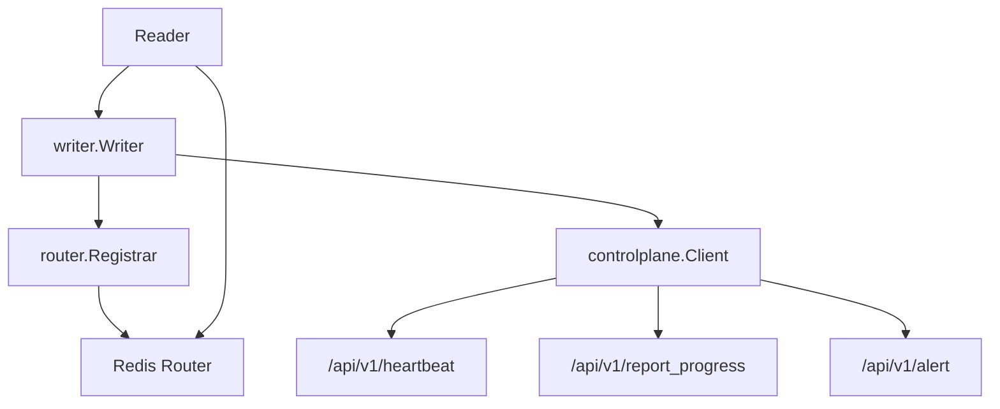
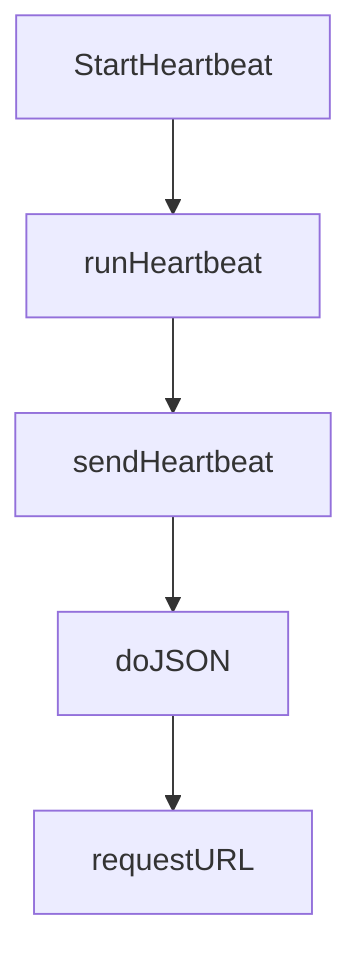
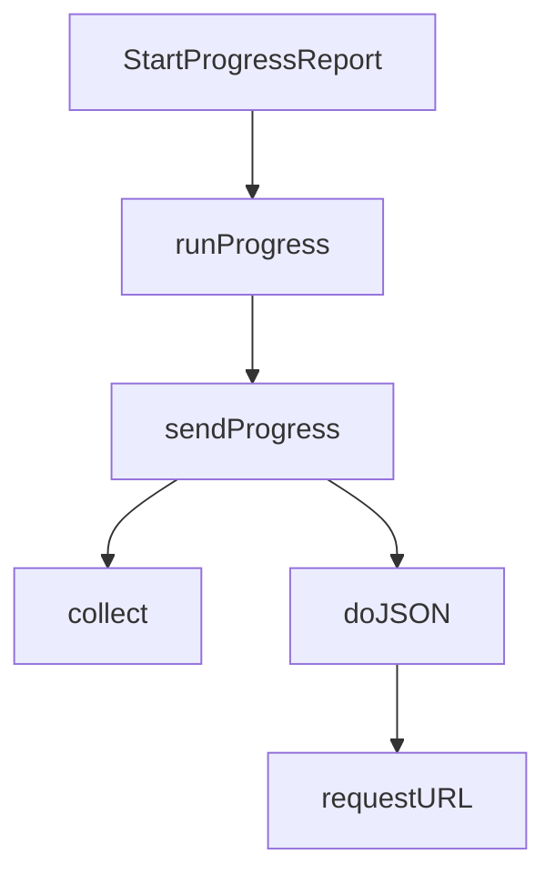
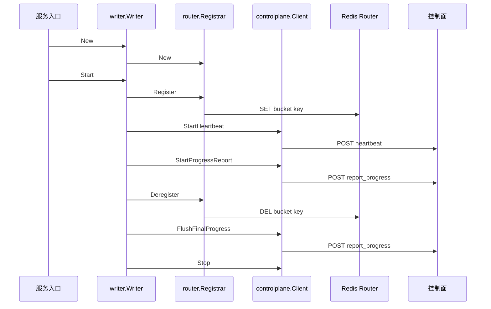

# Control Plane and Routing

## 模块概览

`controlplane` 和 `router` 共同负责 Writer 实例在集群中的“可见性”：

- `controlplane.Client` 向控制面上报 Writer 存活状态、处理进度和异常告警。
- `router.Registrar` 将 bucket 到 Writer endpoint 的映射注册到 Redis Router，供 Reader 发现写入目标。

这两个包都不直接处理 URI 写入或文件生成逻辑，而是服务于 Writer 的生命周期管理、任务调度和路由发现。它们主要由 `writer.Writer` 在启动、运行和关闭阶段调用。

## 架构关系



核心路径：

- Writer 启动时创建 `controlplane.Client` 和 `router.Registrar`。
- Writer 运行期间：
  - `Client.StartHeartbeat` 定期发送心跳。
  - `Client.StartProgressReport` 定期收集并上报 bucket 进度。
  - `Registrar.Register` 将 bucket 路由写入 Redis 并续期。
- Writer 关闭时：
  - `Registrar.Deregister` 删除路由，阻止 Reader 继续写入该实例。
  - `Client.FlushFinalProgress` 同步上报最终进度。
  - `Client.Stop` 停止心跳和进度上报协程。

## 控制面客户端：`controlplane.Client`

`controlplane.Client` 封装 Writer 与控制面的 HTTP 交互。它持有：

- `cfg *Config`：控制面 endpoint、PSM、cluster 和上报间隔。
- `writerID string`：当前 Writer 实例标识。
- `endpoint string`、`ip string`、`port int`：Writer 自身监听地址，用于心跳 payload。
- `buckets []int32`：当前 Writer 负责的 bucket 列表。
- `cli *byted.Client`：Hertz HTTP 客户端。
- `heartbeatCancel`、`progressCancel`、`wg`：后台上报协程的生命周期控制。
- `jobIDFn JobIDProvider`：可选的 job id 注入函数，避免 `controlplane` 反向依赖配置包。

### 构造与配置归一化

`New(cfg *Config, writerID, endpoint string, buckets []int32)` 创建客户端，但不会启动任何后台协程。

构造过程包括：

1. 调用 `normalizeConfig` 填充默认配置：
   - `PSM` 默认为 `bytedance.videoarch.uri_task_control_panel`
   - `Cluster` 默认为 `default`
2. 创建 Hertz `byted.Client`，设置：
   - dial timeout：`1s`
   - read timeout：`defaultRequestTimeout`，即 `3s`
3. 调用 `splitHostPort(endpoint)` 拆分 Writer 自身监听地址。

`endpoint` 期望形如：

```go
"10.1.2.3:8080"
```

如果端口不是纯数字，`splitHostPort` 会返回 host 和 `0` 端口。

### 控制面寻址

请求 URL 由 `requestURL(path string)` 生成：

- 如果 `cfg.Endpoint` 非空，走直连：

```go
strings.TrimRight(c.cfg.Endpoint, "/") + path
```

- 如果 `cfg.Endpoint` 为空，使用 PSM：

```go
"http://" + strings.TrimSpace(c.cfg.PSM) + path
```

在 PSM 模式下，`doJSON` 会额外设置 Hertz discovery 选项：

```go
discovery.WithSD(true)
discovery.WithDestinationCluster(c.cfg.Cluster)
hconfig.WithRequestTimeout(defaultRequestTimeout)
```

因此本地调试或特定环境直连时配置 `Endpoint`；线上服务发现路径通常配置 `PSM` 和 `Cluster`。

## 心跳上报

入口函数是 `StartHeartbeat(ctx context.Context)`。

执行流：



`StartHeartbeat` 的行为：

- 如果 `Client` 或 `cfg` 为 `nil`，直接返回 `nil`。
- 上报间隔来自 `cfg.HeartbeatIntervalSec`。
- 如果间隔小于等于 0，默认使用 `30s`。
- 使用 `context.WithCancel(ctx)` 创建独立心跳上下文。
- 如果心跳协程已经启动，重复调用不会启动第二个协程。

`runHeartbeat` 会立即发送一次心跳，然后按 ticker 周期继续发送。

心跳 payload 由 `sendHeartbeat` 构造：

```go
HeartbeatPayload{
    JobID:     c.jobIDFnSafe(),
    Kind:      "writer",
    WriterID:  c.writerID,
    IP:        c.ip,
    Port:      c.port,
    Buckets:   c.buckets,
    Timestamp: time.Now().UTC(),
}
```

请求路径固定为：

```go
/api/v1/heartbeat
```

## 进度上报

入口函数是 `StartProgressReport(ctx context.Context, collect ProgressCollector)`。

`ProgressCollector` 是一个函数类型：

```go
type ProgressCollector func() ProgressSnapshot
```

Writer 通过这个函数把自身状态暴露给 `controlplane`，避免控制面客户端直接依赖 Writer 内部结构。

执行流：



`StartProgressReport` 的行为：

- 如果 `Client`、`cfg` 或 `collect` 为 `nil`，直接返回 `nil`。
- 上报间隔来自 `cfg.ProgressReportIntervalSec`。
- 如果间隔小于等于 0，默认使用 `60s`。
- 重复调用不会启动多个进度协程。

`sendProgress` 每次调用 `collect()` 获取 `ProgressSnapshot`：

```go
type ProgressSnapshot struct {
    WorkerStatus string
    ErrorMessage string
    Buckets      []BucketProgress
    LastUpdate   time.Time
}
```

如果 `snapshot.Buckets` 为空且 `snapshot.WorkerStatus` 为空，本次上报会被跳过。

上报 payload 为 `ProgressPayload`：

```go
ProgressPayload{
    JobID:          c.jobIDFnSafe(),
    Kind:           "writer",
    WriterID:       c.writerID,
    WorkerStatus:   snapshot.WorkerStatus,
    ErrorMessage:   snapshot.ErrorMessage,
    Buckets:        snapshot.Buckets,
    LastUpdateTime: lastUpdate,
}
```

请求路径固定为：

```go
/api/v1/report_progress
```

`BucketProgress` 描述单个 bucket 的状态，包含：

- `BucketID`
- `Status`
- `TotalUrisReceived`
- `BytesReceived`
- `RunFilesGenerated`
- `PeakLocalDiskUsageMb`
- `MergeProgress`
- `HDFSWriteProgress`
- `FinalParquetPath`
- `FinalByteSize`
- `LastUpdateTime`

`WorkerStatus` 常用值由常量定义：

```go
WorkerStateRunning = "RUNNING"
WorkerStateDone    = "DONE"
WorkerStateFailed  = "FAILED"
```

## 最终进度刷新

`FlushFinalProgress(ctx context.Context, snapshot ProgressSnapshot)` 是同步上报接口，通常在 Writer shutdown 阶段调用。

它不会依赖后台 ticker，而是立即构造 `ProgressPayload` 并 POST 到 `/api/v1/report_progress`。

该方法适合在以下时机调用：

- k-way merge 已完成。
- bucket 状态已更新为最终状态。
- Writer 总体状态已变为 `DONE` 或 `FAILED`。
- 需要控制面基于最终状态推进 Job 状态机。

如果 `snapshot.LastUpdate` 是零值，会使用当前 UTC 时间。

## 告警上报

`SendAlert(ctx context.Context, payload AlertPayload)` 同步发送一次告警。

如果调用方未填充字段，方法会自动补齐：

- `WriterID` 为空时使用 `c.writerID`
- `JobID` 为空时使用 `jobIDFnSafe()`
- `Timestamp` 为零值时使用当前 UTC 时间

告警类型由 `AlertKind` 定义：

```go
AlertKindLocalDiskFull   = "LOCAL_DISK_FULL"
AlertKindOOMRisk         = "OOM_RISK"
AlertKindHDFSUnreachable = "HDFS_UNREACHABLE"
AlertKindPanic           = "PANIC"
```

请求路径固定为：

```go
/api/v1/alert
```

## HTTP 请求行为：`doJSON`

`doJSON(ctx, method, path, payload, out)` 是控制面客户端的统一请求入口。

它执行以下步骤：

1. 使用 `json.Marshal` 序列化 payload。
2. 使用 `protocol.NewRequest` 构造 Hertz 请求。
3. 设置请求头：

```go
Content-Type: application/json
```

4. 在 PSM 模式下启用服务发现和请求超时。
5. 调用 `c.cli.Do(ctx, req, resp)`。
6. 要求 HTTP status 为 `200 OK`。
7. 如果 `out != nil`，解析控制面 envelope：

```go
type envelope struct {
    Code    int             `json:"code"`
    Message string          `json:"message"`
    Data    json.RawMessage `json:"data"`
}
```

需要注意当前调用模式：`sendHeartbeat`、`sendProgress`、`FlushFinalProgress` 和 `SendAlert` 都传入 `out == nil`，因此当前代码只校验 HTTP 200，不会解析 `envelope.code`。如果未来添加需要响应数据的接口并传入 `out`，`doJSON` 会校验 `env.Code == 0` 并把 `env.Data` 反序列化到 `out`。

## Job ID 注入

`controlplane` 不直接依赖外部 config 包，而是通过 `JobIDProvider` 注入 job id：

```go
type JobIDProvider func() string
```

外部调用：

```go
client.SetJobID(func() string {
    return jobID
})
```

所有上报都会通过 `jobIDFnSafe()` 获取 job id。未设置时返回空字符串，对应 JSON 字段带 `omitempty`，不会出现在 payload 中。

## 后台协程停止

`Client.Stop(ctx context.Context)` 会停止心跳和进度上报协程：

1. 在锁内调用 `heartbeatCancel` 和 `progressCancel`。
2. 将 cancel 函数字段置空。
3. 等待 `wg.Wait()`。
4. 如果传入的 `ctx` 提前结束，则停止等待并返回 `nil`。

`Stop` 不会关闭底层 Hertz client，也不会发送最终进度。最终状态上报需要调用方在合适阶段显式调用 `FlushFinalProgress`。

## Redis 路由注册：`router.Registrar`

`router.Registrar` 负责把 Writer 负责的 bucket 注册到 Redis Router。

它持有：

- `cfg *config.RouterConfig`：Redis cluster、key prefix、TTL 等配置。
- `endpoint string`：Writer 当前监听地址，形如 `ip:port`。
- `buckets []int32`：当前 Writer 负责的 bucket 列表。
- `client *goredis.Client`：Redis 客户端。
- `refreshCancel context.CancelFunc`：后台续期协程取消函数。

构造函数：

```go
func New(cfg *config.RouterConfig, endpoint string, buckets []int32) *Registrar
```

构造时不会连接 Redis，也不会写入任何 key。

如果服务启动后才知道真实监听地址，可以调用：

```go
func (r *Registrar) SetEndpoint(endpoint string)
```

## 注册流程

`Register(ctx context.Context)` 执行 Redis 路由注册。

主要步骤：

1. 基础参数检查：
   - `r == nil`
   - `r.cfg == nil`
   - `r.cfg.Cluster == ""`
   - `r.endpoint == ""`

   任一条件成立时直接返回 `nil`，表示跳过注册。

2. 调用 `ensureClient()` 初始化 Redis client。

3. 调用 `registerBuckets(ctx)` 写入所有 bucket key。

4. 启动后台 refresh 协程，定期重新执行 `registerBuckets`，刷新 TTL。

续期间隔计算方式：

```go
interval := time.Duration(r.cfg.TTLSeconds) * time.Second / 5
if interval <= 0 {
    interval = time.Minute
}
```

例如 TTL 为 300 秒时，续期间隔为 60 秒。

后台协程会在以下情况退出：

- `refreshCtx.Done()`：由 `Deregister` 取消。
- `ctx.Done()`：注册时传入的上下文结束。

## Redis key 与 value

`registerBuckets` 对每个 bucket 执行：

```go
pipe.Set(r.bucketKey(bucketID), endpoint, ttl)
```

TTL 来自 `r.cfg.TTLSeconds`，小于等于 0 时默认使用 `5 * time.Minute`。

key 由 `bucketKey(bucketID int32)` 生成：

- `KeyPrefix` 为空时：

```text
bucket:00007
```

- `KeyPrefix` 非空时：

```text
{prefix}:bucket:00007
```

其中 bucket id 使用 `%05d` 补齐到 5 位。

value 是 Writer endpoint，例如：

```text
127.0.0.1:9000
```

这个 key 约定是 Reader 发现 Writer 路由的基础：Reader 根据 bucket id 查询 Redis，拿到 endpoint 后把 `WriteBatch` 请求发往对应 Writer。

## Redis 客户端初始化

`ensureClient()` 负责懒初始化 Redis client。

流程：

1. 如果 `r.client` 已存在，直接返回。
2. 调用 `splitRedisAddrs(r.cfg.Cluster)` 拆分 cluster 字符串。
3. 构造 `goredis.Option`，设置超时：
   - `DialTimeout = 1s`
   - `ReadTimeout = 1s`
   - `WriteTimeout = 1s`
   - `PoolTimeout = 1s`
4. 调用 `ForceDisableMesh()`。
5. 调用 `newGoRedisClient(r.cfg.Cluster, addrs, opt)`。

`splitRedisAddrs` 使用逗号分隔并 trim 空白：

```go
"host1:6379, host2:6379"
```

会变成：

```go
[]string{"host1:6379", "host2:6379"}
```

`newGoRedisClient` 根据地址格式选择连接方式：

- 如果 `isDirectRedisAddrs(addrs)` 为 true，即所有地址都包含 `:`，认为是直连地址。
- 直连模式会设置：
  - `DisableGDPRVerify = true`
  - `DisableAutoLoadConf()`
  - `SetServiceDiscoveryWithoutConsul()`
  - 然后调用 `goredis.NewClientWithServers`
- 否则调用 `goredis.NewClientWithOption`，走普通 cluster/service discovery 路径。

## 取消注册

`Deregister(ctx context.Context)` 用于 Writer shutdown 早期。

它会：

1. 取出并清空 `refreshCancel`。
2. 调用 cancel 停止后台续期协程。
3. 如果 Redis client 或配置不可用，直接返回。
4. 对所有 bucket key 执行 `DEL`。
5. 返回 pipeline `Exec()` 的错误。

调用时机很重要：它应该发生在 Writer 拒绝新请求之后、资源释放之前。这样 Reader 能尽快感知该 Writer 不再负责对应 bucket，避免继续把写入流量打到正在关闭的实例。

## 与 Writer 生命周期的连接

从调用图看，本模块主要接入点在 `writer/writer.go` 和服务入口：

- `writer.New` 创建 `router.Registrar`。
- `writer.Start` 创建并启动 `controlplane.Client`。
- `writer.collectProgressSnapshot` 返回 `controlplane.ProgressSnapshot`。
- `writer.collectBucketProgress` 返回 `controlplane.BucketProgress`。
- `writer.SendAlert` 构造 `controlplane.AlertPayload` 并调用 `Client.SendAlert`。
- `lifecycle.Run` 通过 `writer.Start` 进入控制面初始化路径。
- `main.go` 和 `cmd/writer_server/main.go` 通过 `writer.New` 间接创建 `Registrar`。

典型生命周期：



## 测试覆盖

`router/registrar_test.go` 包含 `TestRegistrar_RegisterAndDeregister`，用于验证 Redis 注册行为。

测试逻辑：

1. 使用固定 Redis cluster：

```go
toutiao.redis.videoarch_storage_test
```

2. 创建 `verifyClient` 直接访问 Redis。
3. 构造 `Registrar`，使用动态 `KeyPrefix`。
4. 调用 `Register(context.Background())`。
5. 读取 Redis key，验证 value 等于 `127.0.0.1:9000`。
6. 验证 TTL 大于 0。

该测试依赖真实 Redis 环境；连接或 `Ping` 失败时会 `Skip`。

贡献时需要注意：生产代码的 key 格式由 `bucketKey` 决定，带非空 prefix 时是 `{prefix}:bucket:%05d`。测试中手动拼接 key 时应与 `bucketKey` 保持一致，否则会出现测试期望和实际写入 key 不匹配的问题。

## 贡献注意事项

修改 `controlplane.Client` 时，重点确认以下行为是否仍然成立：

- 后台协程重复启动是幂等的。
- `Stop` 能取消心跳和进度上报，并等待协程退出。
- `FlushFinalProgress` 不依赖后台 ticker，必须能同步完成最终上报。
- PSM 模式和 `Endpoint` 直连模式都能生成正确 URL。
- 新增控制面接口如果需要读取响应，应传入 `out`，并遵循 envelope 解析语义。

修改 `router.Registrar` 时，重点确认：

- `Register` 首次写入 key 后才启动续期协程。
- `Deregister` 会先停止续期，再删除 key。
- `bucketKey` 的格式必须与 Reader 侧路由查询逻辑一致。
- TTL 默认值和 refresh 间隔需要同时考虑：TTL 太短会导致短暂网络抖动时路由过期，TTL 太长会增加实例异常退出后的残留时间。
- 直连 Redis 地址和服务发现 cluster 两种模式都应保留。