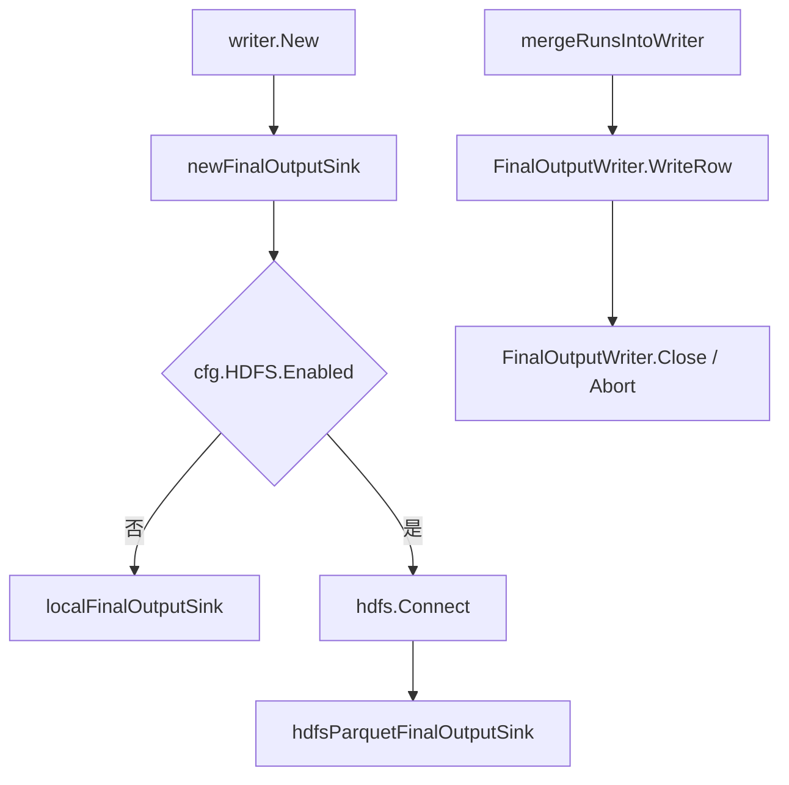
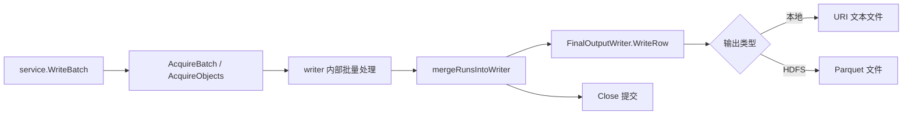

# Output Sinks and Resource Pools

## 模块职责

该模块负责两类基础能力：

1. **最终输出落盘**：通过 `FinalOutputSink` / `FinalOutputWriter` 抽象，把合并后的 `ObjectRecord` 写入本地文本文件或 HDFS Parquet 文件。
2. **临时切片复用**：通过 `AcquireBatch`、`ReleaseBatch`、`AcquireObjects`、`ReleaseObjects` 复用 `[]BatchRecord` 和 `[]ObjectRecord`，降低批量写入路径上的分配压力。

## 输出 Sink 抽象

核心接口定义在 `writer/final_sink.go`：

```go
type FinalOutputSink interface {
	Open(bucketID int32, cfg *config.Config) (FinalOutputWriter, error)
}

type FinalOutputWriter interface {
	WriteRow(row ObjectRecord) error
	Close() (string, int64, error)
	Abort() error
}
```

`FinalOutputSink` 是按 bucket 打开最终输出 writer 的工厂。`FinalOutputWriter` 负责写入单条 `ObjectRecord`，并在结束时通过 `Close` 提交输出，或通过 `Abort` 清理临时文件。

`Close` 返回三个值：

- 最终文件路径
- 最终文件大小
- 错误

该设计让上层合并流程只依赖 `WriteRow`、`Close`、`Abort`，不需要关心本地文件和 HDFS Parquet 的具体差异。

## Sink 选择逻辑

`newFinalOutputSink(cfg *config.Config)` 根据 `cfg.HDFS.Enabled` 选择输出实现：

- `cfg.HDFS.Enabled == false`：返回 `localFinalOutputSink{}`
- `cfg.HDFS.Enabled == true`：通过 `hdfs.Connect(options...)` 建立 HDFS 连接，返回 `*hdfsParquetFinalOutputSink`

HDFS 连接参数来自：

- `cfg.HDFS.NameNode`
- `cfg.HDFS.NameNodePort`
- `cfg.HDFS.UserName`
- `cfg.HDFS.Token`

该函数也会把已建立的 `*hdfs.FileSystem` 返回给调用方。根据调用关系，`writer.New` 会调用 `newFinalOutputSink`，因此 sink 类型在 writer 初始化阶段确定。



## 本地最终输出

本地实现由 `localFinalOutputSink` 和 `localFinalOutputWriter` 组成。

`localFinalOutputSink.Open(bucketID, cfg)` 会构造两个路径：

- 临时路径：`filepath.Join(cfg.HDFSTempDir, fmt.Sprintf(cfg.FinalFileNameTemplate+".tmp", bucketID, bucketID))`
- 最终路径：`filepath.Join(cfg.HDFSRootPath, fmt.Sprintf(cfg.FinalFileNameTemplate, bucketID, bucketID))`

随后它会：

1. 创建临时目录和最终目录：`os.MkdirAll(..., 0o755)`
2. 创建临时文件：`os.Create(tempPath)`
3. 包装 `bufio.NewWriterSize(file, 128*1024)`
4. 返回 `*localFinalOutputWriter`

本地 writer 的写入格式很简单：每个 `ObjectRecord` 只写出 `StoreURI`，并追加换行。

```go
func (w *localFinalOutputWriter) WriteRow(row ObjectRecord) error {
	if w.closed {
		return fmt.Errorf("local final output writer already closed")
	}
	if _, err := w.writer.WriteString(string(row.StoreURI)); err != nil {
		return err
	}
	return w.writer.WriteByte('\n')
}
```

因此，本地输出适合 URI 列表类结果，不包含 `Size`、`StorageClass`、`ContentType`、`Vid`、`Oid`、`CreateTimestamp` 等字段。

`Close` 的提交顺序是：

1. 设置 `closed = true`
2. `Flush` 缓冲区
3. 关闭文件
4. `os.Rename(tempPath, finalPath)`
5. `os.Stat(finalPath)` 获取文件大小

如果 `Close` 被重复调用，函数不会重新写入或重命名，而是直接 `os.Stat(w.finalPath)` 并返回最终文件信息。

`Abort` 用于失败清理：

1. 如果已经关闭，直接返回
2. 设置 `closed = true`
3. 关闭底层文件
4. 删除临时文件：`os.Remove(w.tempPath)`

## HDFS Parquet 最终输出

HDFS 实现由 `hdfsParquetFinalOutputSink` 和 `hdfsParquetFinalOutputWriter` 组成。

`hdfsParquetFinalOutputSink.Open(bucketID, cfg)` 使用 `path.Join` 构造 HDFS 路径：

- 临时路径：`path.Join(cfg.HDFSTempDir, fmt.Sprintf(cfg.FinalFileNameTemplate+".tmp", bucketID, bucketID))`
- 最终路径：`path.Join(cfg.HDFSRootPath, fmt.Sprintf(cfg.FinalFileNameTemplate, bucketID, bucketID))`

它会先调用 `mkdirAllHDFS` 创建临时目录和最终目录，再通过 `s.fs.Create(tempPath)` 创建 HDFS 文件。

Parquet 写入依赖 `github.com/xitongsys/parquet-go/writer`：

```go
pw, err := parquetwriter.NewParquetWriter(parquetFile, new(finalParquetRow), 2)
```

这里的并发数参数为 `2`。`parquetFile` 是 `*hdfsParquetFile`，用于把 HDFS 文件适配成 parquet-go 需要的 `source.ParquetFile`。

### Parquet 行结构

HDFS 输出使用 `finalParquetRow` 作为 Parquet schema：

```go
type finalParquetRow struct {
	StoreURI        string `parquet:"name=store_uri, type=BYTE_ARRAY, convertedtype=UTF8"`
	Size            int64  `parquet:"name=size, type=INT64"`
	StorageClass    string `parquet:"name=storage_class, type=BYTE_ARRAY, convertedtype=UTF8, encoding=PLAIN_DICTIONARY"`
	ContentType     string `parquet:"name=content_type, type=BYTE_ARRAY, convertedtype=UTF8, encoding=PLAIN_DICTIONARY"`
	Vid             string `parquet:"name=vid, type=BYTE_ARRAY, convertedtype=UTF8"`
	Oid             string `parquet:"name=oid, type=BYTE_ARRAY, convertedtype=UTF8"`
	CreateTimestamp int64  `parquet:"name=create_timestamp, type=INT64"`
}
```

`hdfsParquetFinalOutputWriter.WriteRow` 会把 `ObjectRecord` 映射到 `finalParquetRow`：

- `row.StoreURI` → `store_uri`
- `row.Size` → `size`
- `row.StorageClass` → `storage_class`
- `row.ContentType` → `content_type`
- `row.Vid` → `vid`
- `row.Oid` → `oid`
- `row.CreateTimestamp` → `create_timestamp`

如果 writer 已关闭，`WriteRow` 返回错误：`hdfs parquet final output writer already closed`。

### HDFS Parquet 提交流程

`hdfsParquetFinalOutputWriter.Close` 的提交顺序是：

1. 如果已关闭，直接 `w.fs.Stat(w.finalPath)` 并返回最终文件信息
2. 设置 `closed = true`
3. 调用 `w.parquet.WriteStop()` 完成 Parquet footer 和元数据写入
4. 关闭 HDFS 文件
5. 调用 `w.fs.Rename(w.tempPath, w.finalPath, true)` 把临时文件移动到最终路径
6. 调用 `w.fs.Stat(w.finalPath)` 获取最终文件大小

如果 `WriteStop` 失败，代码会尽量关闭底层文件，但不会执行 rename。

`Abort` 会关闭底层 HDFS 文件，并删除临时文件：

```go
return w.fs.Delete(w.tempPath, false)
```

## HDFS 目录创建

`mkdirAllHDFS(fs, dir)` 是 HDFS 目录创建的共享辅助函数。

它会忽略空目录、`.` 和 `/`：

```go
if dir == "" || dir == "." || dir == "/" {
	return nil
}
```

然后执行：

1. `fs.Exists(dir)` 判断目录是否存在
2. 如果存在，直接返回
3. 如果不存在，调用 `fs.Mkdir(dir, 0o755, true)` 递归创建

除 `hdfsParquetFinalOutputSink.Open` 外，`writer.prepareOutputPaths` 也会调用该函数。启动链路中，`lifecycle.Run` 会进入 `writer.Start`，再由 `prepareOutputPaths` 创建输出目录。

## Parquet HDFS 文件适配器

`hdfsParquetFile` 封装 `*hdfs.File`，用于满足 parquet-go 的 `source.ParquetFile` 接口需求。

已实现的方法：

- `Write(p []byte)`：转发到 `h.file.Write(p)`
- `Seek(offset, whence)`：转发到 `h.file.Seek(offset, whence)`
- `Close()`：转发到 `h.file.Close()`

不支持的方法：

- `Read(p []byte)`：返回 `write-only parquet file`
- `Create(name string)`：返回 `nested create is not implemented`
- `Open(name string)`：返回 `open is not implemented`

这说明当前适配器只支持单文件顺序写入场景，不支持 parquet-go 通过同一对象打开子文件或读取文件内容。

## 临时文件提交语义

本地和 HDFS 实现都采用相同的提交模式：

1. 先写入临时路径
2. `Close` 成功后 rename 到最终路径
3. `Abort` 删除临时路径

这种模式避免上游在写入未完成时看到最终文件。上层合并逻辑 `mergeRunsIntoWriter` 通过 `FinalOutputWriter.WriteRow` 写入记录，完成后调用 `Close` 提交。如果过程中失败，应调用 `Abort` 清理临时输出。

## 资源池

`writer/pool.go` 使用 `sync.Pool` 复用两类切片：

- `batchSlicePool`：复用 `[]BatchRecord`
- `objectsSlicePool`：复用 `[]ObjectRecord`

默认容量和最大可复用容量：

```go
const (
	defaultBatchSlicePoolCap   = 256
	defaultObjectsSlicePoolCap = 1024
	maxReusableBatchSliceCap   = defaultBatchSlicePoolCap * 8
	maxReusableObjectsSliceCap = defaultObjectsSlicePoolCap * 8
)
```

也就是说：

- `[]BatchRecord` 默认容量为 `256`，容量超过 `2048` 时不归还池
- `[]ObjectRecord` 默认容量为 `1024`，容量超过 `8192` 时不归还池

## 获取和释放 BatchRecord 切片

`AcquireBatch(capHint int)` 从池中获取一个长度为 `0` 的 `[]BatchRecord`。

行为规则：

- 如果 `capHint < 0`，按 `0` 处理
- 如果池中切片容量小于 `capHint`，重新 `make([]BatchRecord, 0, capHint)`
- 否则复用池中切片，并截断为 `s[:0]`

`ReleaseBatch(b []BatchRecord)` 把切片归还池：

- `nil` 切片直接忽略
- 容量超过 `maxReusableBatchSliceCap` 的切片不复用
- 归还前调用 `clearBatchRecordSlice(b[:cap(b)])` 清空整个底层数组
- 最后以长度 `0` 放回 `batchSlicePool`

清空整个容量范围很重要，因为 `BatchRecord` 可能持有引用类型字段。把底层数组置零可以避免对象被池长期引用，降低意外内存保留风险。

## 获取和释放 ObjectRecord 切片

`AcquireObjects(capHint int)` 和 `ReleaseObjects(o []ObjectRecord)` 与 Batch 版本对称，只是对象类型和容量阈值不同。

`ReleaseObjects` 会调用：

```go
clearReusableObjectRecordSlice(o[:cap(o)])
```

该函数逐项写入零值 `ObjectRecord`，同样用于释放底层数组中可能保留的引用。

根据调用关系，`service.WriteBatch` 会使用：

- `AcquireObjects`
- `AcquireBatch`
- `ReleaseObjects`
- `ReleaseBatch`

因此资源池主要服务于批量写入入口，减少高频请求下的切片分配和 GC 压力。

## 错误定义

`writer/errors.go` 定义了两个包级错误：

```go
var ErrMissingReaderID = errors.New("reader_id is required")
var ErrBackPressure = errors.New("writer back pressure")
```

它们不在 `final_sink.go` 和 `pool.go` 内部使用，但属于同一 writer 包的公共错误语义：

- `ErrMissingReaderID` 表示调用方缺少必要的 `reader_id`
- `ErrBackPressure` 表示 writer 侧触发背压，调用方需要稍后重试或降低写入速度

## 与代码库其他部分的关系

该模块位于 writer 包的底层支撑层：

- `writer.New` 负责初始化输出 sink，并持有 HDFS 文件系统连接
- `writer.Start` / `prepareOutputPaths` 负责启动前创建输出路径，其中 HDFS 路径复用 `mkdirAllHDFS`
- `bucket_ctx.mergeRunsIntoWriter` 负责把 bucket 内部归并后的 `ObjectRecord` 写入 `FinalOutputWriter`
- `service.WriteBatch` 负责接收写入请求，并通过资源池复用 `BatchRecord` 和 `ObjectRecord` 切片

整体数据路径可以概括为：



## 贡献时需要注意

修改输出格式时，需要同时关注本地和 HDFS 的差异。本地 writer 目前只输出 `StoreURI` 文本行，而 HDFS writer 输出完整的 Parquet schema。

修改 `finalParquetRow` 时，需要同步检查所有 `hdfsParquetFinalOutputWriter.WriteRow` 的字段映射，避免 schema 字段存在但没有写入，或 `ObjectRecord` 字段变更后映射失效。

修改资源池容量时，应考虑请求批大小、峰值内存和 GC 行为。最大可复用容量用于阻止异常大切片进入 `sync.Pool`，避免一次大请求长期抬高进程内存占用。

`FinalOutputWriter.Close` 具备重复调用容忍能力，但 `WriteRow` 在关闭后会返回错误。调用方应保证写入完成后再关闭，并在失败路径调用 `Abort` 清理临时文件。