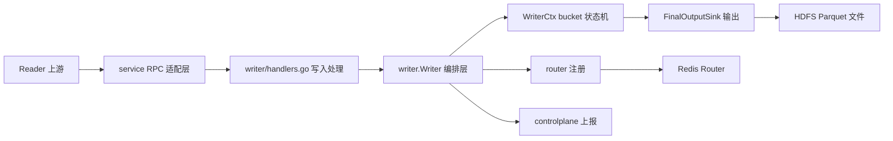

# uri_writer — Wiki

# uri_writer

`uri_writer` 是 VDA/TOS `store_uri` 大规模分桶排序流水线中的 Writer FaaS。它位于整体链路 `Reader → Router → Writer` 的末端：Reader 按 `bucketId` 将 `store_uri` 数据路由到对应 Writer，Writer 在本地完成外排序、去重和归并，最终为每个 bucket 生成有序文件并写入 HDFS。

这个仓库的核心不是通用写入服务，而是一个面向大规模 URI 排序任务的运行时骨架：它接收批量写入请求，按 bucket 管理状态，在内存压力到达阈值时 spill 本地有序 run 文件，并在 Reader 通知完成后执行最终 merge。

## 整体架构



入口层由 [Application Startup and Lifecycle](application-startup-and-lifecycle.md) 负责。FaaS 场景从 `main.go` 通过 `lambda.Start(handler)` 接收启动 payload，本地或常驻进程场景从 `cmd/writer_server/main.go` 读取命令行参数。两条路径都会归一化为 `config.Config`，随后创建 `writer.Writer` 并交给生命周期编排逻辑启动、阻塞等待和停机收尾。

真正的运行时核心在 [Writer Orchestration](writer-orchestration.md)。`writer.Writer` 持有当前实例负责的所有 bucket、RPC server、HDFS 输出 sink、Router 注册器、控制面客户端和反压守卫。它把“启动服务、注册路由、接收写入、汇报进度、最终提交”这些动作串成一个完整 Writer 实例。

## 数据写入路径

上游 Reader 调用 Thrift/Kitex 定义的 `WriterService`。协议源头在 `idl/base.thrift` 和 `idl/uri_writer.thrift`，生成绑定代码由 [Thrift IDL and Generated RPC Bindings](thrift-idl-and-generated-rpc-bindings.md) 说明。RPC 入口本身很薄，[Writer RPC Service](writer-rpc-service.md) 只负责启动 KiteX server、转换请求对象、调用业务方法，并把业务错误映射成响应码。

进入业务层后，[Write Request Handling and Backpressure](write-request-handling-and-backpressure.md) 处理 `WriteBatch`、`MarkBucketDone` 和 `Flush`。写入请求会先经过 bucket 归属校验、CPU 反压检查和 `(ReaderID, seqNo)` 幂等判断，然后按 bucket 分组并追加到对应 `WriterCtx`。

每个 bucket 的内部状态由 [Bucket State and Spill Management](bucket-state-and-spill-management.md) 管理。`AppendBatch` 不直接写最终文件，而是把 `ObjectRecord` 克隆到 bucket 的 arena 与内存 chunk 中；当 chunk 达到阈值时，后台 worker 会排序并 spill 成本地 run 文件。这个设计让 RPC handler 尽量短路径返回，把排序和磁盘 I/O 交给 bucket worker 异步推进。

## 最终归并与输出

当 Reader 完成某个 bucket 的写入后，会通过 `MarkBucketDone` 推动 bucket 进入 finalize 阶段。`WriterCtx` 会停止接收新数据，将仍在内存中的 active chunk 排队 spill，等待所有 spill 完成，然后对多个有序 run 文件做 k-way merge。归并过程中按 `StoreURI` 精确去重，最后通过 [Output Sinks and Resource Pools](output-sinks-and-resource-pools.md) 中的 `FinalOutputSink` 写入最终输出。

输出层抽象为：

```go
type FinalOutputSink interface {
	Open(bucketID int32, cfg *config.Config) (FinalOutputWriter, error)
}

type FinalOutputWriter interface {
	WriteRow(row ObjectRecord) error
	Close() (string, int64, error)
	Abort() error
}
```

这让 bucket 归并逻辑不需要关心最终目标是本地文件还是 HDFS Parquet。资源池能力也集中在同一模块中，用于复用批量写入路径上的临时切片，降低高吞吐场景下的分配压力。

## 路由、控制面与生命周期

Writer 启动后会把自己负责的 bucket 注册到 Redis Router，供 Reader 发现目标 endpoint；运行过程中则向控制面上报心跳、进度和告警。这部分由 [Control Plane and Routing](control-plane-and-routing.md) 覆盖。它们不参与数据排序本身，但决定 Writer 是否能被调度、发现和观测。

关闭阶段同样由 `writer.Writer` 统一协调：收到终止信号或自动退出条件后，它会触发所有 bucket 的 `FinalizeMerge()`，汇总每个 bucket 的输出路径、行数和错误状态，再完成最终上报。新开发者排查“为什么某个 bucket 没有产出文件”时，通常需要同时查看 bucket 状态机、输出 sink 和控制面上报三部分。

## 本地开发与构建

项目模块名为：

```text
code.byted.org/videoarch/uri_writer
```

当前 `go.mod` 使用 Go `1.25`。本地常用入口在 [Project Operations](project-operations.md) 中说明，最小流程是：

```bash
go test -v ./...
go build -o uri_writer
```

也可以使用仓库提供的 `Makefile`：

```bash
make test
make build
```

线上或部署构建流程通常走 `build.sh`，它会读取 `.env` 中的 HDFS 客户端 SCM 版本变量，安装构建依赖并产出 `output/uri_writer`。如果要调试 RPC server 的常驻进程形态，可以从 `cmd/writer_server/main.go` 入口启动；如果要验证 FaaS payload 的解析和生命周期行为，则应从根目录 `main.go` 的 Lambda 入口开始看。