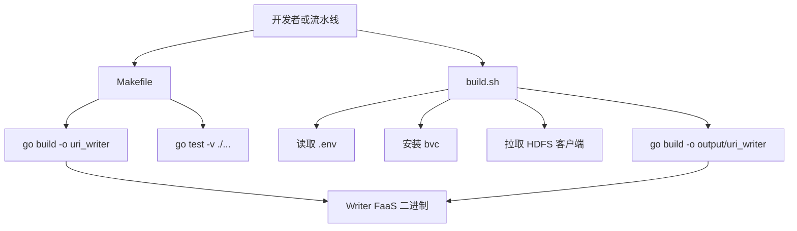

# Project Operations

## 项目运维模块

项目运维模块由仓库根目录的工程文件组成，负责定义 `uri_writer` 的构建、测试、清理、依赖声明和部署构建流程。它不参与 Writer FaaS 的运行时调用链，但决定开发者如何在本地验证代码，以及线上构建环境如何产出可部署二进制。



## 文件职责

`Makefile` 提供本地开发入口：

- `default`: 默认执行 `build`。
- `build`: 运行 `go build -o uri_writer`，在仓库根目录生成本地二进制。
- `test`: 运行 `go test -v ./...`，覆盖当前 module 下所有 Go package。
- `clean`: 删除本地构建产物 `uri_writer`。

`build.sh` 是 Linux 构建脚本，面向部署或流水线环境：

```bash
#!/usr/bin/env bash

if [ $(uname -s | tr A-Z a-z) != "linux" ]; then
    echo "Unsupported OS, only running this script on Linux"
    exit 1
fi

. .env

apt update -y
apt install -y bvc
bvc clone -f data/inf/hdfs_client /opt/tiger/hdfs_client

rm -rf output && mkdir -p output
go build -o output/uri_writer
```

它的关键行为是：

- 只允许在 Linux 上执行。
- 通过 `. .env` 注入 HDFS 客户端相关 SCM 版本变量。
- 使用 `bvc clone -f data/inf/hdfs_client /opt/tiger/hdfs_client` 准备 CGO 依赖的 HDFS 客户端。
- 清空并重建 `output/` 目录。
- 将最终产物输出到 `output/uri_writer`。

`go.mod` 定义 Go module：

```go
module code.byted.org/videoarch/uri_writer

go 1.25
```

该 module 的直接依赖反映了 Writer 的业务边界：

- `code.byted.org/v_lambda/lambda-go-sdk`: FaaS 入口与运行环境。
- `code.byted.org/kite/kitex`、`github.com/cloudwego/kitex`: Reader 与 Writer 之间的 RPC 服务框架。
- `code.byted.org/kv/goredis`: Router 注册、续期和注销所需 Redis 客户端。
- `code.byted.org/inf/hdfs-go-sdk-on-cgo`: HDFS 写入与 rename 提交。
- `github.com/xitongsys/parquet-go`: 生成 bucket 级有序 Parquet 文件。
- `github.com/klauspost/compress`、`github.com/golang/snappy`: 本地 run 文件压缩相关依赖。
- `github.com/shirou/gopsutil/v3`: 进程资源采样，例如 CPU 观测。

`README.md` 是架构级说明文档，定义了当前骨架与目标执行链路。它明确 `uri_writer` 是 VDA/TOS `store_uri` 大规模分桶排序流水线中的 Writer FaaS，位于 `Reader → Router → Writer` 架构的 Writer 角色。

`debug-cpu-spike-analysis.md` 是问题排查记录，当前聚焦 Writer CPU 尖刺。它不是运行时代码，但记录了对 `process.Percent(100ms)`、`HandleWriteBatch` 并发 fan-out、`WriterCtx.SpillRun` 排序压缩开销、`chunk_records=60000` 等实现细节的分析假设和证据。

## 与业务代码的连接

运维模块本身没有内部函数调用关系，但它通过构建入口连接所有业务 package：

- `main.go` 定义 FaaS handler，并调用 `config.FromInput`、`writer.New`、`lifecycle.Run`。
- `config/` 负责启动参数解析。
- `writer/` 承载 `Writer`、`WriterCtx`、`HandleWriteBatch`、`AppendBatch`、`SpillRun`、`FinalizeMerge`、`Shutdown` 等核心逻辑。
- `router/` 负责 Redis 注册与续期。
- `controlplane/` 负责心跳、进度上报和告警。
- `lifecycle/` 负责启动、运行和优雅收尾。
- `service/` 用于衔接 KiteX 生成代码与 writer handler。

因此，`go build` 或 `go test -v ./...` 会把这些包作为一个整体进行编译或测试。任何 package 的类型错误、缺失依赖或 CGO/HDFS 链接问题，最终都会在项目运维入口暴露。

## 常用操作

本地构建：

```bash
make build
```

运行全部测试：

```bash
make test
```

清理本地产物：

```bash
make clean
```

Linux 流水线构建：

```bash
./build.sh
```

本地 `make build` 只生成 `./uri_writer`。部署构建使用 `build.sh`，产物路径是 `./output/uri_writer`，并且会额外准备 `/opt/tiger/hdfs_client`。

## 约束与注意事项

`build.sh` 依赖 Linux、`apt`、`bvc` 和 `.env`。在 macOS 或非 Debian 系环境中不应使用该脚本，本地开发应使用 `make build` 或直接运行 `go build`。

HDFS 客户端来自 `code.byted.org/inf/hdfs-go-sdk-on-cgo` 和 `/opt/tiger/hdfs_client`，因此部署环境必须满足 CGO 和动态库加载要求。构建脚本目前只负责拉取客户端目录，不包含运行时环境校验。

`go.mod` 中同时存在字节内部 `code.byted.org/kite/kitex` 和开源 `github.com/cloudwego/kitex` 依赖，后续生成或接入 `service/` 代码时需要保持 import 路径与 IDL 生成工具一致。

当前 README 标注多数业务方法仍为 TODO。运维入口可以编译项目骨架，但不能代表 Writer 的外排序、HDFS 提交、Redis 注册、控制面上报等完整能力已经实现。