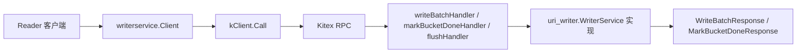

# Thrift IDL and Generated RPC Bindings

## 模块职责

本模块定义 Reader 与 Writer FaaS 实例之间的 Thrift RPC 契约，并包含由 thriftgo / Kitex 生成的 Go 绑定代码。业务代码不应直接修改 `kitex_gen/**`，应以 `idl/base.thrift` 和 `idl/uri_writer.thrift` 作为源头，通过 Kitex 重新生成绑定。

核心服务是 `WriterService`，用于向 Writer 批量写入对象元数据、通知 Bucket 写入结束，以及触发中间刷盘。



## IDL 契约

`idl/base.thrift` 定义通用透传字段：

- `TrafficEnv`：流量环境信息，包含 `Open` 和 `Env`。
- `Base`：请求/响应公共元信息，包含 `LogID`、`Caller`、`Addr`、`Client`、可选 `TrafficEnv` 和可选 `Extra`。
- `BaseResp`：通用状态响应，包含 `StatusMessage`、`StatusCode` 和可选 `Extra`。

`idl/uri_writer.thrift` 定义 Writer RPC 的业务模型：

- `ErrorCode`：结构化错误码。
  - `SUCCESS`：成功。
  - `RETRYABLE_ERROR`：临时错误，客户端可退避重试。
  - `FATAL_ERROR`：请求不可恢复错误，不应重试。
  - `BUCKET_NOT_OWNED`：当前 Writer 不负责该 Bucket，Reader 应清理路由缓存并重新查询。
  - `BACK_PRESSURE`：Writer 反压，客户端应降速或暂停请求。
- `ObjectMeta`：单个待写入对象的元数据。
- `DataRecord`：同一个 `bucketId` 下的一批 `ObjectMeta`。
- `WriteBatchRequest` / `WriteBatchResponse`：批量写入请求与响应。
- `MarkBucketDoneRequest` / `MarkBucketDoneResponse`：Bucket 完成通知请求与响应。
- `WriterService`：对外 RPC 服务，包含 `WriteBatch`、`MarkBucketDone` 和 `Flush`。

## 数据模型

`ObjectMeta` 是写入链路的最小业务单元：

```go
type ObjectMeta struct {
    StoreUri        []byte
    Size            int64
    StorageClass    string
    ContentType     string
    Vid             string
    Oid             string
    CreateTimestamp int64
}
```

IDL 中 `storeUri` 使用 `binary`，生成到 Go 后是 `[]byte`。这样避免跨语言字符串编码差异影响 URI 哈希或排序逻辑。`ObjectMeta` 的所有字段都是 `required`，反序列化时 `FastRead` 会检查字段是否存在，缺失时返回 `thrift.INVALID_DATA`。

`DataRecord` 将同一个 Bucket 的对象聚合在一起：

```go
type DataRecord struct {
    BucketId int32
    Objects  []*ObjectMeta
}
```

`WriteBatchRequest` 支持一个请求中包含多个 `DataRecord`：

```go
type WriteBatchRequest struct {
    SeqNo int64
    Batch []*DataRecord
    Base  *base.Base
}
```

`SeqNo` 是客户端生成的单调递增序列号，用于服务端幂等处理。调用方应按 Writer 连接维护独立序列号。`WriteBatchResponse.AckSeqNo` 表示服务端已经成功处理并持久化的最大序列号，客户端重试时应以此同步本地进度。

`MarkBucketDoneRequest` 用于标记 Bucket 数据流结束：

```go
type MarkBucketDoneRequest struct {
    BucketId  int32
    TotalUris *int64
    Base      *base.Base
}
```

`TotalUris` 是可选字段，服务端可通过 `IsSetTotalUris()` 判断是否传入，再用 `GetTotalUris()` 读取，用于一致性校验。

## 服务接口

生成代码中的核心接口是 `uri_writer.WriterService`：

```go
type WriterService interface {
    WriteBatch(ctx context.Context, req *WriteBatchRequest) (*WriteBatchResponse, error)
    MarkBucketDone(ctx context.Context, req *MarkBucketDoneRequest) (*MarkBucketDoneResponse, error)
    Flush(ctx context.Context, req *MarkBucketDoneRequest) (*MarkBucketDoneResponse, error)
}
```

业务服务实现位于 `service/impl.go`，并通过该接口接入 Kitex server。调用关系中可以看到：

- `service/impl.go` 的 `WriteBatch` 构造 `WriteBatchResponse`。
- `service/impl.go` 的 `MarkBucketDone` 构造 `MarkBucketDoneResponse`，并读取 `IsSetTotalUris()` / `GetTotalUris()`。
- `service/impl.go` 的 `Flush` 复用 `MarkBucketDoneRequest`，返回 `MarkBucketDoneResponse`。
- `service/server.go` 的 `Start` 使用 `writerservice.NewServerWithBytedConfig` 启动服务。

## 生成代码结构

`kitex_gen/base/base.go` 和 `kitex_gen/uri_writer/uri_writer.go` 提供普通 Go 类型、构造函数、getter/setter 和可选字段判断方法。例如：

- `NewObjectMeta()`、`NewDataRecord()`、`NewWriteBatchRequest()`。
- `GetErrorCode()`、`GetMessage()`、`GetAckSeqNo()`。
- `IsSetMessage()`、`IsSetBase()`、`IsSetTotalUris()`。
- `ErrorCode.String()` 和 `ErrorCodeFromString()`。
- `ErrorCode.Scan()` / `ErrorCode.Value()` 支持数据库扫描和值转换。

`kitex_gen/base/k-base.go` 和 `kitex_gen/uri_writer/k-uri_writer.go` 提供 Kitex 高性能 Thrift 编解码实现：

- `FastRead(buf []byte)`：从二进制 Thrift payload 反序列化。
- `FastWrite(buf []byte)` / `FastWriteNocopy(buf []byte, w thrift.NocopyWriter)`：序列化到缓冲区。
- `BLength()`：计算序列化后的字节长度。
- `DeepCopy(s interface{}) error`：深拷贝结构体，避免共享可变切片、map 或嵌套指针。

`FastRead` 会根据字段 ID 和 Thrift 类型读取字段；未知字段或类型不匹配字段会通过 `thrift.Binary.Skip` 跳过，从而保留 Thrift 的前后兼容能力。对 `required` 字段，生成代码会维护 `isset...` 标记，并在字段缺失时返回协议错误。

## RPC 客户端绑定

`kitex_gen/uri_writer/writerservice/client.go` 暴露客户端入口：

```go
client, err := writerservice.NewClient(destService)
resp, err := client.WriteBatch(ctx, req)
```

主要函数：

- `NewClient(destService string, opts ...client.Option)`：创建 `writerservice.Client`，内部配置 `client.WithDestService(destService)` 和 `byted.ClientSuiteWithConfig(...)`。
- `MustNewClient(...)`：创建失败时 panic。
- `NewClientWithBytedConfig(destService string, config *byted.ClientConfig, opts ...client.Option)`：允许调用方传入 ByteDance Kitex 配置。
- `MustNewClientWithBytedConfig(...)`：配置版 panic 构造函数。

实际调用由 `kWriterServiceClient` 转发到 `kClient`：

```go
func (p *kClient) WriteBatch(ctx context.Context, req *uri_writer.WriteBatchRequest) (*uri_writer.WriteBatchResponse, error) {
    var args uri_writer.WriterServiceWriteBatchArgs
    args.Req = req
    var result uri_writer.WriterServiceWriteBatchResult
    if err := p.c.Call(ctx, "WriteBatch", &args, &result); err != nil {
        return nil, err
    }
    return result.GetSuccess(), nil
}
```

`MarkBucketDone` 和 `Flush` 使用相同模式，只是方法名和参数/结果类型不同。

## RPC 服务端绑定

`kitex_gen/uri_writer/writerservice/server.go` 暴露服务端入口：

- `NewServer(handler uri_writer.WriterService, opts ...server.Option)`。
- `NewServerWithBytedConfig(handler uri_writer.WriterService, config *byted.ServerConfig, opts ...server.Option)`。
- `RegisterService(svr server.Server, handler uri_writer.WriterService, opts ...server.RegisterOption)`。

`NewServer` 和 `NewServerWithBytedConfig` 都会注册 `serviceInfo()`，并启用 `server.WithCompatibleMiddlewareForUnary()`。业务侧只需要实现 `uri_writer.WriterService`，再交给这些函数注册。

`writerservice.go` 中的 `serviceMethods` 定义了 Kitex 方法元信息：

- `"WriteBatch"` 对应 `writeBatchHandler`。
- `"MarkBucketDone"` 对应 `markBucketDoneHandler`。
- `"Flush"` 对应 `flushHandler`。

每个 handler 都会将通用 `arg` / `result` 转换为具体生成类型，再调用真实业务实现：

```go
success, err := handler.(uri_writer.WriterService).WriteBatch(ctx, realArg.Req)
if err != nil {
    return err
}
realResult.Success = success
```

## Base 字段与公共元信息

`WriteBatchRequest`、`WriteBatchResponse`、`MarkBucketDoneRequest` 和 `MarkBucketDoneResponse` 都包含字段号 `255` 的 `Base *base.Base`。生成代码还提供：

```go
func (p *WriteBatchRequest) GetOrSetBase() interface{}
func (p *WriteBatchResponse) GetOrSetBase() interface{}
func (p *MarkBucketDoneRequest) GetOrSetBase() interface{}
func (p *MarkBucketDoneResponse) GetOrSetBase() interface{}
```

这些方法在 `Base == nil` 时自动创建 `base.NewBase()`，用于框架或中间件注入公共元信息。业务代码如果需要写入 `LogID`、`Caller` 或 `Extra`，优先通过 `GetOrSetBase()` 获取可写对象，避免 nil 判断散落在调用处。

## 与代码库其他部分的连接

该模块处在 RPC 边界层，上游由 Reader 或测试客户端构造请求，下游由 `service/impl.go` 实现具体写入逻辑。

典型链路如下：

1. 调用方构造 `uri_writer.WriteBatchRequest`，填充 `SeqNo`、`Batch` 和可选 `Base`。
2. `writerservice.Client.WriteBatch` 将请求包装为 `WriterServiceWriteBatchArgs`。
3. `kClient.WriteBatch` 调用底层 `client.Client.Call(ctx, "WriteBatch", ...)`。
4. 服务端 Kitex 根据 `serviceMethods` 分发到 `writeBatchHandler`。
5. `writeBatchHandler` 调用业务实现的 `WriteBatch(ctx, req)`。
6. 业务实现返回 `WriteBatchResponse`，客户端通过 `GetErrorCode()`、`GetMessage()`、`GetAckSeqNo()` 处理结果。

测试中也直接依赖这些绑定：

- `writer/handlers_rpc_integration_test.go` 使用 `writerservice.NewClient` 调用 `WriteBatch`、`MarkBucketDone` 和 `Flush`。
- `writer/local_hdfs_memory_integration_test.go` 构造 `WriteBatchRequest`、`ObjectMeta`、`base.Base`，并通过 `GetErrorCode()` / `GetMessage()` 校验响应。
- `service/server.go` 通过 `writerservice.NewServerWithBytedConfig` 将业务实现注册为 Kitex 服务。

## 维护注意事项

不要手工编辑 `kitex_gen/**`。如果需要调整字段、错误码或 RPC 方法，应先修改 `idl/base.thrift` 或 `idl/uri_writer.thrift`，再重新运行生成命令：

```bash
kitex -module code.byted.org/videoarch/uri_writer idl/uri_writer.thrift
```

IDL 演进时应遵守 Thrift 兼容性约束：

- 不要复用已删除字段号。
- 新增字段优先使用 `optional`，避免旧客户端或旧服务端缺失 required 字段导致 `FastRead` 返回 `required field ... is not set`。
- 已有字段的类型和字段号不要修改。
- 新增 `ErrorCode` 时，客户端需要同步处理默认分支，避免把未知错误码误判为成功。
- `ObjectMeta`、`DataRecord`、`WriteBatchRequest` 等已有 `required` 字段缺失会导致反序列化失败，调用方必须完整填充。

响应中的 `Message` 是可选指针字段，读取前如果需要区分“未设置”和“空字符串”，应使用 `IsSetMessage()`；只关心展示文本时可以使用 `GetMessage()`。同理，`TotalUris` 应通过 `IsSetTotalUris()` 区分未传入和传入 `0`。