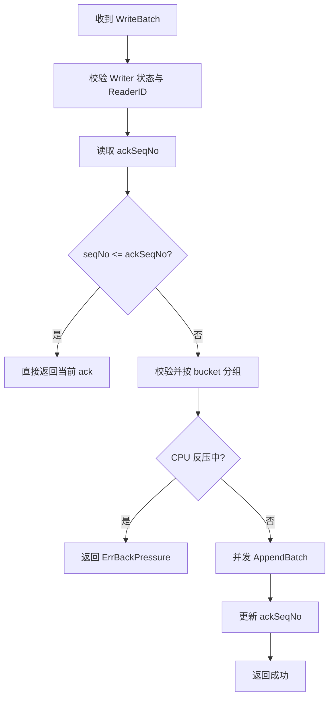

# Write Request Handling and Backpressure

## 模块概览

写入请求处理与反压模块位于 `writer/handlers.go` 和 `writer/cpu_backpressure.go`，负责把上游 Reader 的批量写入请求转成每个 bucket 的 `WriterCtx.AppendBatch` 调用，并在 Writer 过载时尽早拒绝新写入。

核心职责包括：

- 处理 `WriteBatch`、`MarkBucketDone`、`Flush` 三类 RPC 业务逻辑。
- 基于 `(ReaderID, seqNo)` 做写入幂等，避免 Reader 重试导致重复写入。
- 校验 bucket 归属，防止请求写入非本 Writer 负责的 bucket。
- 将一个 batch 内的记录按 bucket 分组，并并发追加到对应 `WriterCtx`。
- 通过 `cpuBackPressureGuard` 检测 CPU 过载，返回 `ErrBackPressure` 让上游降速或重试。
- 将慢路径操作交给 `WriterCtx` 内部 worker 异步推进，避免 RPC handler 长时间阻塞。

## 请求入口

### `HandleWriteBatch`

`HandleWriteBatch(ctx context.Context, src WriteBatchSource, seqNo int64, batch []BatchRecord)` 是 `WriterService.WriteBatch` 的业务实现入口。RPC 层在 `service/impl.go` 中把 thrift 请求转换成：

- `WriteBatchSource`
- `BatchRecord`
- `ObjectRecord`

然后调用本方法。

处理顺序是有意设计的：

1. 检查 Writer 是否正在停止：`w.isStopping()`。
2. 校验 `src.ReaderID` 非空，否则返回 `ErrMissingReaderID`。
3. 调用 `w.touchWriteBatch()`，刷新活跃写入时间，用于生命周期空闲判断。
4. 根据 `src.Key()` 读取当前 ack：`w.currentAck(sourceKey)`。
5. 如果 `seqNo <= ack`，直接返回 `WriteBatchResult{AckSeqNo: ack}`，不做 bucket 校验、不做 CPU 反压检查，也不重复追加数据。
6. 遍历 `BatchRecord`，通过 `w.bucket(record.BucketID)` 校验 bucket 归属，并按 bucket 聚合 `ObjectRecord`。
7. 调用 `w.checkCPUBackPressure()`；若 CPU 已进入反压状态，返回包装了 `ErrBackPressure` 的错误。
8. 按 bucket 并发调用 `WriterCtx.AppendBatch(rows)`。
9. 所有 bucket 追加成功后，调用 `w.updateAck(sourceKey, seqNo)`。
10. 返回 `WriteBatchResult{AckSeqNo: seqNo}`。

简化流程如下：



### 幂等语义

幂等 key 来自 `WriteBatchSource.Key()`：

```go
func (s WriteBatchSource) Key() string {
	return "reader:" + s.ReaderID
}
```

`ReaderID` 是 Reader FaaS 实例级标识。Writer 维护 `reader:<ReaderID> -> ackSeqNo`，只要请求的 `seqNo` 不大于当前 ack，就认为这是已成功处理过的重试请求。

这有两个重要行为：

- 已 ack 的重试请求会快速成功返回，不重复写入 `ObjectRecord`。
- 已 ack 的重试请求会跳过 CPU 反压检查。`TestHandleWriteBatchSkipsCPUBackPressureForAckedRetry` 明确覆盖了这一点，保证上游在重试确认成功时不会被过载状态错误阻断。

### bucket 分组与并发追加

`HandleWriteBatch` 先把输入记录聚合成：

```go
grouped := make(map[int32][]ObjectRecord, len(batch))
order := make([]int32, 0, len(batch))
```

`order` 保存 batch 中首次出现的 bucket 顺序，`grouped` 保存每个 bucket 的对象列表。随后每个 bucket 启动一个 goroutine：

```go
go func(ctx *WriterCtx, rows []ObjectRecord, bucketID int32) {
	err := ctx.AppendBatch(rows)
	...
}(bucket, objects, bucketID)
```

并发粒度是 bucket，而不是对象。这样可以让一个 `WriteBatch` 内不同 bucket 的追加并行执行，同时仍然把单个 bucket 的排队、chunk 管理、spill 触发交给对应的 `WriterCtx` worker 串行处理。

如果任意 bucket 追加失败，方法记录首个错误并返回；只有全部 bucket 追加成功后才更新 ack。这保证了 `ackSeqNo` 表示整个 `seqNo` 的 batch 已经完整被接受。

### 慢请求日志

模块定义了两个慢路径阈值：

```go
const (
	slowWriteBatchLogThreshold = 500 * time.Millisecond
	slowBucketAppendThreshold  = 200 * time.Millisecond
)
```

- 单 bucket `AppendBatch` 超过 `slowBucketAppendThreshold` 时记录 bucket 级日志。
- 整个 `HandleWriteBatch` 超过 `slowWriteBatchLogThreshold` 时记录 batch 级日志。

这些日志只在慢请求时输出，避免高峰期每个请求都打日志造成额外 CPU 压力。

## 数据结构

### `BatchRecord`

`BatchRecord` 与 thrift `DataRecord` 等价，但定义在 `writer` 包内，避免 `writer` 反向依赖 `kitex_gen`。

```go
type BatchRecord struct {
	BucketID int32
	Objects  []ObjectRecord
}
```

RPC adapter 负责字段转换，核心写入逻辑只依赖该内部类型。

### `ObjectRecord`

`ObjectRecord` 是 Writer 内部处理的一条对象记录：

```go
type ObjectRecord struct {
	StoreURI        []byte
	Size            int64
	StorageClass    string
	ContentType     string
	Vid             string
	Oid             string
	CreateTimestamp int64
}
```

排序和去重只依赖 `StoreURI`，其余字段在最终输出时保留。

`handleAppend` 会通过 `cloneObjectRecordIntoArena` 复制 `StoreURI`：

```go
func cloneObjectRecordIntoArena(arena []byte, in ObjectRecord) ([]byte, ObjectRecord)
```

该函数调用 `appendArenaBytes`，把 `StoreURI` 放入 bucket 内部 arena，避免直接持有 RPC 请求传入的底层字节切片。执行流是：

`AppendBatch -> submitOp -> initWorker -> runLoop -> handleOp -> handleAppend -> cloneObjectRecordIntoArena -> appendArenaBytes`

`cloneObjectRecord` 保留给测试或非热点路径使用。

### `WriteBatchResult`

`WriteBatchResult` 是 handler 层返回给 RPC adapter 的纯 Go 结果：

```go
type WriteBatchResult struct {
	AckSeqNo int64
}
```

它对应 thrift `WriteBatchResponse` 中的 `AckSeqNo` 字段。

## CPU 反压

CPU 反压由 `cpu_backpressure.go` 实现。`Writer` 初始化时通过 `newCPUBackPressureGuard(ctx, thresholdPercent)` 创建 guard；如果 `thresholdPercent <= 0`，则不启用 CPU 反压。

`HandleWriteBatch` 只在新请求、且 bucket 归属校验通过后调用：

```go
snapshot, overloaded, cpuErr := w.checkCPUBackPressure()
```

如果 `overloaded == true`，返回包含 `ErrBackPressure` 的错误：

```go
fmt.Errorf("%w: normalized cpu usage %.2f%% exceeds threshold %.2f%% ...", ErrBackPressure, ...)
```

调用方可以用 `errors.Is(err, ErrBackPressure)` 判断。`TestHandleWriteBatchReturnsBackPressureWhenCPUUsageHigh` 覆盖了该行为。

### `processCPUBackPressureGuard`

生产实现是 `processCPUBackPressureGuard`，核心字段包括：

- `proc *process.Process`：来自 `gopsutil/process`，用于采样当前进程 CPU。
- `thresholdPercent float64`：配置阈值。
- `cpuLimitCores float64`：归一化用的 CPU 核数。
- `lastUsagePercent`、`lastSampleAt`、`lastSampleErr`：最近一次采样结果。
- `consecutiveHigh`、`consecutiveLow`：进入/退出反压的连续样本计数。
- `overloaded bool`：当前是否处于反压状态。

后台 goroutine 在 `run()` 中循环调用 `sample()`。`sample()` 使用：

```go
g.proc.Percent(cpuUsageSampleInterval)
```

采样间隔固定为 `1s`。

### CPU 使用率归一化

`gopsutil` 返回的是进程级原始 CPU 百分比，多核机器上可能超过 100%。模块通过 `normalizeCPUUsagePercent` 按 CPU 限额归一化：

```go
func normalizeCPUUsagePercent(rawUsagePercent float64, cpuLimitCores float64) float64 {
	if cpuLimitCores <= 0 {
		cpuLimitCores = 1.0
	}
	return rawUsagePercent / cpuLimitCores
}
```

`resolveCPULimitCores(ctx)` 优先读取 `lambdacontext.FromContext(ctx).Resource.CPU`；如果没有 Lambda CPU 限额，则使用 `runtime.GOMAXPROCS(0)`。

例如原始 CPU 为 `400%`，CPU 限额为 `4`，归一化后是 `100%`。

### 迟滞机制

反压状态不是由单次采样直接决定，而是通过连续样本计数进入或退出：

```go
const (
	requiredConsecutiveHighCPUSamples = 3
	requiredConsecutiveLowCPUSamples  = 2
)
```

- 连续 3 次归一化 CPU 大于等于阈值，才进入反压。
- 已经处于反压时，连续 2 次归一化 CPU 低于阈值，才退出反压。
- 高于 `maxAllowedNormalizedCPUUsagePercent = 150.0` 的异常尖刺样本会被忽略，不计入进入或退出计数。

这避免了 CPU 在阈值附近抖动时，`WriteBatch` 一会儿成功、一会儿反压。对应测试覆盖包括：

- `TestCPUBackPressureGuardRequiresConsecutiveHighSamples`
- `TestCPUBackPressureGuardRequiresConsecutiveLowSamplesToExit`
- `TestCPUBackPressureGuardLowStreakResetByHighSample`
- `TestCPUBackPressureGuardCheckIgnoresAbnormalHighSample`

### `Check`

`Check()` 是 handler 读取 CPU 状态的线程安全接口：

```go
func (g *processCPUBackPressureGuard) Check() (cpuUsageSnapshot, bool, error)
```

如果尚未完成第一次采样，返回空 snapshot 且不过载。若最近一次采样失败，返回 snapshot 和错误，但 `HandleWriteBatch` 只记录 warning，不因为采样失败拒绝请求。

`cpuUsageSnapshot` 暴露以下字段用于错误消息和日志：

```go
type cpuUsageSnapshot struct {
	RawUsagePercent        float64
	NormalizedUsagePercent float64
	CPULimitCores          float64
	ThresholdPercent       float64
}
```

### 停止 guard

`Stop()` 关闭 `stopCh` 并等待 `doneCh`：

```go
func (g *processCPUBackPressureGuard) Stop() error
```

`stopOnce` 确保多次调用不会重复关闭 channel。Writer 关闭流程应调用该方法释放采样 goroutine。

## `MarkBucketDone` 与 `Flush`

### `HandleMarkBucketDone`

`HandleMarkBucketDone(ctx, bucketID, totalUris)` 处理 bucket 完成信号：

1. 通过 `w.bucket(bucketID)` 校验 bucket 属于当前 Writer。
2. 读取本地 `bucket.TotalURIsReceived()`。
3. 如果请求携带 `totalUris > 0`，且本地也已有统计值，则要求两者一致。
4. 调用 `bucket.RequestFinalize()` 投递 finalize 请求。
5. 调用 `w.markFinalizeStarted()` 更新 Writer 生命周期状态。
6. 立即返回，不等待最终 merge 完成。

finalize 的状态推进、成功或失败结果通过后续进度上报完成。这一点和 `HandleWriteBatch` 的设计一致：RPC handler 只负责接受请求，不在调用栈上执行慢操作。

### `HandleFlush`

`HandleFlush(ctx, bucketID)` 只触发一次 `bucket.SpillRun()`：

```go
func (w *Writer) HandleFlush(ctx context.Context, bucketID int32) error
```

它不启动 k-way merge，也不改变 bucket 状态。典型用途是控制面需要中间快照，或者优雅停机前希望把当前内存 chunk 刷成 run 文件。

## 与其他模块的连接

### RPC 层

`service/impl.go` 的 `WriteBatch` 会使用本模块的类型：

- `WriteBatchSource`
- `BatchRecord`
- `ObjectRecord`

RPC 层负责从 thrift 请求里提取字段，例如 `reader_id`，并把 handler 返回的 `WriteBatchResult` 转成 thrift response。业务规则集中在 `writer` 包内，避免 RPC 生成代码泄漏到核心写入逻辑。

### bucket 写入与排序链路

`HandleWriteBatch` 不直接排序、不直接落盘。它把数据交给每个 `WriterCtx`：

```go
ctx.AppendBatch(rows)
```

后续由 `WriterCtx` 内部操作队列和 worker 处理：

- `AppendBatch`
- `submitOp`
- `initWorker`
- `runLoop`
- `handleOp`
- `handleAppend`
- `SpillRun`
- `RequestFinalize`

`ObjectRecord.StoreURI` 在 `handleAppend` 中复制到 arena，然后进入 chunk、spill run、最终 merge 流程。

### 生命周期

`HandleWriteBatch` 调用 `w.touchWriteBatch()`，用于记录最近一次写入时间。生命周期测试 `TestWriterLifecycle_IdleAbortBeforeFinalize` 依赖该行为：如果没有写入且未进入 finalize，Writer 可以因空闲超时退出。

`HandleMarkBucketDone` 调用 `w.markFinalizeStarted()`，用于告诉生命周期流程 Writer 已进入 finalize 阶段。`TestWriterLifecycle_AutoShutdownAfterAllBucketsMarkedDone` 覆盖了所有 bucket 标记完成后自动结束的行为。

## 测试覆盖

本模块的关键行为由单元测试和 RPC 集成测试共同覆盖。

CPU 反压相关测试集中在 `writer/handlers_cpu_backpressure_test.go`：

- `TestHandleWriteBatchReturnsBackPressureWhenCPUUsageHigh`
- `TestHandleWriteBatchSkipsCPUBackPressureForAckedRetry`
- `TestNormalizeCPUUsagePercent`
- `TestCPUBackPressureGuardCheckIgnoresAbnormalHighSample`
- `TestCPUBackPressureGuardRequiresConsecutiveHighSamples`
- `TestCPUBackPressureGuardRequiresConsecutiveLowSamplesToExit`
- `TestCPUBackPressureGuardLowStreakResetByHighSample`

RPC 和端到端行为在 `writer/handlers_rpc_integration_test.go` 中覆盖：

- `TestWriterServiceRPC_WriteBatchAndMarkDone`：通过 RPC 写入、flush、mark done，并校验最终输出排序去重。
- `TestWriterLifecycle_AutoShutdownAfterAllBucketsMarkedDone`：所有 bucket 完成后生命周期正常退出。
- `TestWriterLifecycle_IdleAbortBeforeFinalize`：无写入时空闲退出。
- `TestWriterServiceRPC_SourcePartFileBatchedToLocalOutput`：大输入文件分批写入本地输出。
- `TestWriterServiceRPC_WriteBatchToHDFSDatePartition`：写入 HDFS 分区并校验 Parquet 输出头。

内存和多 bucket 压测在 `writer/local_hdfs_memory_integration_test.go` 中实现，主要用于观察 `WriteBatch -> AppendBatch -> finalize` 在不同 bucket 数和数据规模下的内存表现。

## 贡献注意事项

修改 `HandleWriteBatch` 时需要保持以下语义：

- `ReaderID` 为空必须返回 `ErrMissingReaderID`。
- `seqNo <= ackSeqNo` 的请求必须快速成功返回，不能重复追加，也不应被 CPU 反压阻断。
- 只有整个 batch 内所有 bucket 都 `AppendBatch` 成功后，才能调用 `w.updateAck`。
- bucket 归属必须在追加前完成校验，避免部分写入到错误实例。
- handler 不应等待 finalize merge 等慢操作完成。
- 反压错误必须包装 `ErrBackPressure`，保证调用方可以用 `errors.Is` 判断。
- CPU 采样失败只应降级为日志，不应直接拒绝写入请求。

修改 CPU 反压逻辑时，需要特别关注迟滞计数和异常尖刺样本处理。单点高 CPU 样本不应立刻进入反压，反压状态也不应因为单点低样本立即退出。