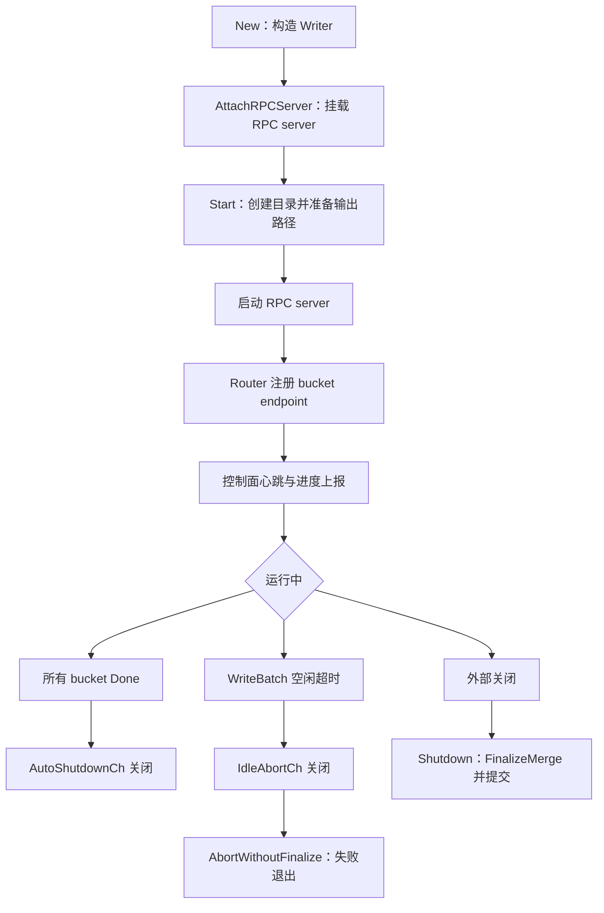

# Writer Orchestration

## 模块职责

`writer/writer.go` 定义 Writer FaaS 实例的编排层。它不直接实现 RPC handler、外排序或 Parquet 写入细节，而是负责把这些能力组装成一个可启动、可收尾、可上报状态的运行时对象：`Writer`。

核心职责包括：

- 为 `cfg.BucketIDs` 中的每个 bucket 创建并持有一个 `*WriterCtx`。
- 初始化最终输出通道 `FinalOutputSink`、HDFS 文件系统、CPU 反压守卫、Router 注册器和控制面客户端。
- 启动 RPC server，注册 bucket 到 Router，并启动心跳与进度上报。
- 在关闭时触发所有 bucket 的 `FinalizeMerge()`，汇总成功和失败结果。
- 维护 worker 级别状态、bucket 进度快照、自动退出信号和空闲中止信号。
- 为 RPC handler 提供 bucket 查找、幂等 ack、停止状态、告警等辅助能力。

## 主要类型

### `Writer`

`Writer` 是模块的中心运行时句柄。它聚合以下状态和组件：

- `cfg *config.Config`：Writer 的完整配置。
- `bucketCtx map[int32]*WriterCtx`：bucket 到 `WriterCtx` 的映射。
- `mergeSlots chan struct{}`：限制并发 merge/finalize 数量，容量来自 `cfg.Sort.MaxConcurrentMerges`。
- `spillSlots chan struct{}`：限制并发 spill 数量，容量由 `defaultMaxConcurrentSpills()` 根据 bucket 数和 CPU limit 计算。
- `router *router.Registrar`：向 Redis 注册当前 Writer 负责的 bucket endpoint。
- `cpClient controlPlaneReporter`：控制面心跳、进度、最终状态和告警上报接口。
- `server RPCServer`：RPC server 抽象，避免 `writer` 包与 service 层循环依赖。
- `idem map[string]int64`：按 source 记录已确认的最大 ack，用于 handler 侧幂等处理。
- `finalSink FinalOutputSink`、`hdfsFS *hdfs.FileSystem`：最终输出写入能力。
- `cpuGuard cpuBackPressureGuard`：CPU 反压检测。
- `autoShutdownCh`：所有 bucket 完成后关闭，供生命周期层自动退出。
- `idleAbortCh`：长时间未收到 `WriteBatch` 且尚未进入 finalize 时关闭，供生命周期层中止实例。

`Writer` 的公共方法是生命周期和上层集成的主要入口：

- `New(ctx, cfg)`：构造 Writer。
- `AttachRPCServer(server)`：挂载 RPC server。
- `Start(ctx)`：启动服务、注册路由、启动控制面上报。
- `Shutdown(ctx)`：优雅 finalize 并关闭依赖。
- `AbortWithoutFinalize(ctx)`：不做 merge/finalize，直接失败退出。
- `AutoShutdownCh()` / `IdleAbortCh()`：暴露生命周期信号。
- `SendAlert(ctx, kind, message)`：向控制面发送告警。

### `RPCServer`

`RPCServer` 是本模块对 RPC server 的最小依赖接口：

```go
type RPCServer interface {
	Start(context.Context) error
	Stop(context.Context) error
	Addr() string
}
```

`Writer.Start()` 只依赖这三个方法：先启动 server，再读取真实监听地址 `Addr()`，随后把 endpoint 写入 Router 和本地 endpoint 文件。

### `controlPlaneReporter`

`controlPlaneReporter` 抽象控制面客户端能力：

```go
type controlPlaneReporter interface {
	SetJobID(controlplane.JobIDProvider)
	StartHeartbeat(context.Context) error
	StartProgressReport(context.Context, controlplane.ProgressCollector) error
	FlushFinalProgress(context.Context, controlplane.ProgressSnapshot) error
	SendAlert(context.Context, controlplane.AlertPayload) error
	Stop(context.Context) error
}
```

生产路径中，`Start()` 通过 `controlplane.New()` 创建具体客户端，并把 `w.collectProgressSnapshot` 注册为进度采集函数。

## 生命周期流程



## 构造阶段：`New`

`New(ctx, cfg)` 只完成对象构造和本地依赖初始化，不启动后台协程，也不对外暴露服务。

它的关键步骤：

1. 校验 `cfg` 非空、`cfg.BucketIDs` 非空。
2. 初始化 `Writer` 的基础字段：
   - `bucketCtx`
   - `mergeSlots`
   - `spillSlots`
   - `router.New(&cfg.Router, "", cfg.BucketIDs)`
   - `idem`
   - `autoShutdownCh`
   - `idleAbortCh`
   - 默认 `writeBatchIdleTimeout`
3. 调用 `touchWriteBatch()` 初始化最近写入时间，避免刚启动就被 idle watcher 误判。
4. 调用 `newFinalOutputSink(cfg)` 初始化最终输出 sink 和 HDFS 文件系统。
5. 调用 `newCPUBackPressureGuard(ctx, cfg.Sort.CPUBackPressureThresholdPercent)` 初始化 CPU 反压守卫。
6. 为每个 bucket 创建 `WriterCtx`：
   - `LocalTmpDir` 使用 `${cfg.Sort.LocalTmpDir}/${cfg.JobID}/${cfg.Service.WriterID}/${bucketID}/`。
   - `chunk` 使用 `newChunkSlot(chunkCap)` 预热。
   - `spareSlots` 预留一个备用 chunk。
   - `spillTriggerRecords` 使用 `spreadSpillTriggerRecords()` 做轻微错峰。
   - 注入 spill/finalize slot 的 acquire/release 回调。
   - 注入 `onStatusChange: w.handleBucketStatusChange`。
7. 调用每个 `WriterCtx` 的 `initWorker()`。
8. 将 worker 状态设置为 `controlplane.WorkerStateRunning`。

`spreadSpillTriggerRecords(baseRecords, bucketIndex, bucketCount)` 的作用是把多个 bucket 的 spill 触发点分散在 `baseRecords` 的 90% 到 100% 区间，降低所有 bucket 同时达到阈值造成的 IO 峰值。

`defaultMaxConcurrentSpills(ctx, bucketCount)` 会读取 `resolveCPULimitCores(ctx)`，默认并发 spill 数约为 CPU limit 的一半，并受 bucket 数约束，最后额外加 1。

## 启动阶段：`Start`

`Start(ctx)` 将构造好的 Writer 变成可服务状态。启动顺序刻意保证“本地和外部依赖准备好之后再注册路由”。

执行顺序：

1. 为每个 `WriterCtx.LocalTmpDir` 调用 `os.MkdirAll()`。
2. 调用 `prepareOutputPaths()` 准备最终输出目录和临时目录。
3. 校验 `w.server` 已通过 `AttachRPCServer()` 挂载。
4. 调用 `w.server.Start(ctx)` 启动 RPC server。
5. 读取 `w.server.Addr()`，保存为 `w.endpoint`。
6. 调用 `w.router.SetEndpoint(w.endpoint)`。
7. 调用 `w.router.Register(ctx)` 把 bucket endpoint 注册到 Router。
8. 调用 `writeEndpointFile()` 在本地写入 endpoint 文件。
9. 通过 `controlplane.New()` 初始化控制面客户端。
10. 调用 `SetJobID()`、`StartHeartbeat()`、`StartProgressReport()`。
11. 启动 `watchWriteBatchIdle(ctx)` 后台协程。

如果 RPC server 启动成功但 Router 注册失败，`Start()` 会调用 `w.server.Stop(ctx)` 尝试回滚监听状态，然后返回错误。

### 输出路径准备：`prepareOutputPaths`

`prepareOutputPaths()` 根据 `cfg.HDFS.Enabled` 选择路径准备方式：

- HDFS 模式：
  - 要求 `w.hdfsFS` 非空。
  - 如果 `cfg.HDFS.SkipStartupCheck` 为 true，只打印 warn 日志并跳过目录创建。
  - 否则调用 `mkdirAllHDFS()` 创建 `cfg.HDFSRootPath` 和 `cfg.HDFSTempDir`。
- 本地模式：
  - 使用 `os.MkdirAll()` 创建 `cfg.HDFSRootPath` 和 `cfg.HDFSTempDir`。

当前测试 `TestPrepareOutputPaths_SkipHDFSStartupCheck` 覆盖了 HDFS 启用且跳过启动检查的路径，确保该模式不会尝试访问真实 HDFS。

## 运行期状态与信号

### bucket 查找

`bucket(bucketID)` 在读锁下从 `bucketCtx` 取出 `*WriterCtx`。RPC handler 通常通过它判断当前 Writer 是否负责某个 bucket。

### 幂等 ack

`currentAck(source)` 和 `updateAck(source, ack)` 维护 `idem map[string]int64`：

- `currentAck(source)` 返回当前 source 已确认的最大 ack。
- `updateAck(source, ack)` 只在新 ack 更大时更新。

这组方法本身不处理 RPC 请求，它们为 handler 层实现 `WriteBatch` 重试幂等提供共享状态。

### worker 状态

`setWorkerStatus(status, errorMessage)` 负责更新 worker 状态，并带有两个保护规则：

- 如果当前状态已经是 `WorkerStateDone`，后续更新被忽略。
- 如果当前状态已经是 `WorkerStateFailed`，除非新状态仍是 failed，否则不会被覆盖。

这避免了完成态和失败态被后续异步上报回调误改。

`workerSnapshot()` 在读锁下返回当前 worker 状态和错误信息。

### 自动退出

`handleBucketStatusChange(bucketID, status)` 是 `WriterCtx` 状态变化回调。它处理三件事：

- bucket failed 时，将 worker 标记为 `WorkerStateFailed`。
- bucket done 时，调用 `triggerAutoShutdown()` 检查是否所有 bucket 都已完成。
- 如果控制面客户端已初始化，异步调用 `FlushFinalProgress()` 上报该 bucket 的最新快照。

`triggerAutoShutdown()` 会遍历所有 bucket 的 `Snapshot()`。只有当所有 bucket 状态都是 `BucketStatusDone` 时，才会通过 `autoShutdownOnce` 关闭 `autoShutdownCh`。

生命周期层通过 `AutoShutdownCh()` 获取这个信号；调用关系中 `lifecycle.Run` 会监听它并进入关闭流程。

### 空闲中止

`watchWriteBatchIdle(ctx)` 用于检测 Writer 长时间未收到 `WriteBatch` 的异常情况。它会定期检查：

- context 是否结束。
- Writer 是否已经 stopping。
- finalize 是否已经开始。
- 距离最近一次 `touchWriteBatch()` 是否超过 `writeBatchIdleTimeout`。

如果超过阈值，它会打印 warn 日志并调用 `triggerIdleAbort()` 关闭 `idleAbortCh`。生命周期层通过 `IdleAbortCh()` 接收该信号，并调用 `AbortWithoutFinalize(ctx)`。

`SetWriteBatchIdleTimeoutForTest(timeout)` 只用于测试缩短 idle 超时时间；生产默认值是 `defaultWriteBatchIdleTimeout`，即 40 分钟。

## 关闭流程：`Shutdown`

`Shutdown(ctx)` 是正常收尾路径，会尝试 finalize 所有 bucket 并提交最终输出。

执行步骤：

1. 在锁内设置 `w.stopping = true`，让后续请求或后台检查看到停止状态。
2. 调用 `w.router.Deregister(ctx)` 注销 Router。
3. 为 `bucketCtx` 中每个 bucket 启动 goroutine，调用 `ctx.FinalizeMerge()`。
4. 等待所有 finalize 完成，并汇总结果：
   - 无错误的 bucket 加入 `committed`。
   - 有错误的 bucket 加入 `failed`，错误通过 `errors.Join()` 汇总。
5. 如果存在失败 bucket 或汇总错误，将 worker 标记为 `WorkerStateFailed`；否则标记为 `WorkerStateDone`。
6. 调用 `w.server.Stop(ctx)` 停止 RPC server。
7. 调用 `w.cpClient.FlushFinalProgress(ctx, w.collectProgressSnapshot())` 上报最终快照。
8. 调用 `w.cpClient.Stop(ctx)` 停止控制面客户端。
9. 关闭 `w.hdfsFS`。
10. 停止 `w.cpuGuard`。
11. 返回 `committed`、`failed` 和汇总错误。

需要注意的是，`Shutdown()` 本身没有直接使用 `mergeSlots`。并发限制是通过 `WriterCtx` 持有的 `acquireFinalizeSlot` / `releaseFinalizeSlot` 回调在 `FinalizeMerge()` 内部执行。

## 非 finalize 中止：`AbortWithoutFinalize`

`AbortWithoutFinalize(ctx)` 用于 idle abort 等不能继续等待数据的路径。它不会调用 `WriterCtx.FinalizeMerge()`，也不会提交最终输出。

它的行为是：

1. 设置 `w.stopping = true`。
2. 将 worker 状态设置为 `WorkerStateFailed`，错误信息为 `writebatch idle timeout before finalize`。
3. 注销 Router。
4. 停止 RPC server。
5. 上报最终进度并停止控制面客户端。
6. 关闭 HDFS 文件系统。
7. 停止 CPU 反压守卫。
8. 返回过程中收集到的错误。

这个路径适合“尚未进入 finalize，且 Writer 已经异常长时间没有收到写入”的场景，避免生成不完整的最终数据。

## 进度采集与控制面集成

`collectBucketProgress()` 会遍历所有 `WriterCtx`，调用每个 bucket 的 `Snapshot()`，转换为 `controlplane.BucketProgress`。

采集字段包括：

- `BucketID`
- `Status`
- `TotalUrisReceived`
- `BytesReceived`
- `RunFilesGenerated`
- `PeakLocalDiskUsageMb`
- `MergeProgress`
- `HDFSWriteProgress`
- `FinalParquetPath`
- `FinalByteSize`
- `LastUpdateTime`

`collectProgressSnapshot()` 在 bucket 进度之外补充 worker 级别状态，返回 `controlplane.ProgressSnapshot`。

`collectBucketProgressForID(bucketID)` 只采集单个 bucket，用于 `handleBucketStatusChange()` 中的即时上报。

`SendAlert(ctx, kind, message)` 是生命周期层、panic recover 等上层逻辑发送告警的出口。它构造 `controlplane.AlertPayload`，填入 `WriterID`、`Kind`、`Message` 和当前 UTC 时间。若 `cpClient` 尚未初始化，则直接返回 nil。

## 与代码库其他模块的连接

`writer` 编排层处在主入口、生命周期层、RPC handler、Router、控制面和存储层之间。

- `main.go` 和 `cmd/writer_server/main.go` 调用 `writer.New()` 创建 Writer。
- `lifecycle.Run` 调用 `AttachRPCServer()`、`Start()`、`Shutdown()`、`AbortWithoutFinalize()`，并监听 `AutoShutdownCh()` 与 `IdleAbortCh()`。
- RPC handler 通过 `bucket()`、`currentAck()`、`updateAck()`、`isStopping()` 等方法访问运行期状态。
- `router.New()` 创建的 `router.Registrar` 负责 Redis 注册和注销。
- `controlplane.New()` 创建控制面客户端，用于心跳、周期进度、最终进度和告警。
- `newFinalOutputSink()`、`mkdirAllHDFS()` 和 `hdfs.FileSystem` 连接最终输出路径。
- `newCPUBackPressureGuard()` 和 `resolveCPULimitCores()` 提供 CPU 反压与并发度计算依据。
- `WriterCtx` 承担单 bucket 的数据缓冲、spill、merge、最终写入和状态快照；`Writer` 只负责创建、持有和协调它们。

## 贡献时需要注意的边界

`Writer` 是编排层，不应把单 bucket 的排序、run 文件格式、merge 算法或 Parquet 写入细节直接塞进 `writer.go`。这些逻辑应继续放在 `WriterCtx`、final sink 或相关存储实现中。

新增启动依赖时，应接入 `Start()` 的顺序控制，并确保失败时能清理已经启动的组件。新增关闭依赖时，应同时考虑 `Shutdown()` 和 `AbortWithoutFinalize()` 两条路径。

修改 worker 状态时，应保留 `setWorkerStatus()` 的单向状态保护，避免异步回调把 done 或 failed 状态覆盖成 running。

新增进度字段时，需要同时更新 `WriterCtx.Snapshot()` 的返回值、`collectBucketProgress()`、`collectBucketProgressForID()` 以及控制面结构体映射。

修改 idle abort 行为时，需要确认 `touchWriteBatch()` 的调用点能准确代表“收到有效 WriteBatch”，并确认 finalize 开始后不会再触发 idle abort。