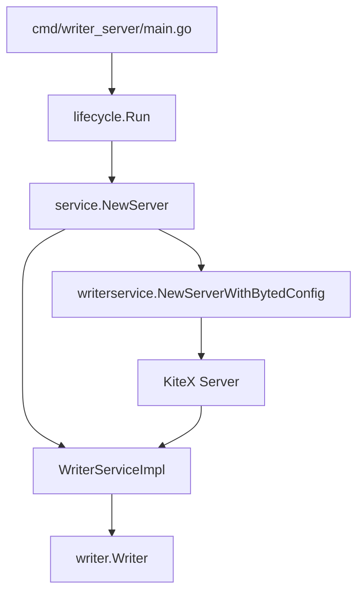
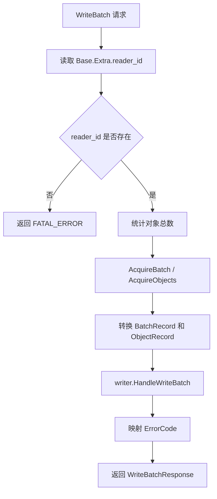

# Writer RPC Service

## 模块定位

`service` 包是 Writer 服务的 RPC 适配层，负责把 KiteX 生成代码暴露出的 `WriterService` 接口接到 `writer.Writer` 的业务处理方法上。它本身不实现写入、分片、落盘或状态推进逻辑，只做三件事：

1. 启动和停止 KiteX server。
2. 将 Thrift 请求对象转换为 `writer` 包内部的数据结构。
3. 将 `writer` 返回的错误转换为 `uri_writer.ErrorCode` 和响应对象。

核心代码分布在：

- `service/impl.go`：实现 RPC handler。
- `service/server.go`：封装 KiteX server 生命周期。
- `service/doc.go`：说明本包作为 KiteX 生成代码与业务实现之间的薄适配层。

## 架构关系



`service.NewServer` 在生命周期入口中被调用，接收全局 `config.Config` 和已构造好的 `writer.Writer`。随后 `Server.Start` 创建监听端口，并通过 `writerservice.NewServerWithBytedConfig` 把 `WriterServiceImpl` 注册到 KiteX server。

## Server 生命周期

`Server` 是对 KiteX server 的轻量封装：

```go
type Server struct {
    cfg      *config.Config
    impl     *WriterServiceImpl
    listener net.Listener
    server   kitexserver.Server
    addr     string
}
```

### 创建服务

`NewServer(cfg *config.Config, w *writer.Writer) *Server` 会构造 `Server`，并通过 `NewWriterServiceImpl(w)` 创建 RPC 实现对象。

调用链为：

```text
lifecycle.Run
  -> service.NewServer
    -> service.NewWriterServiceImpl
```

### 启动服务

`Start(ctx context.Context) error` 负责完成监听和 KiteX server 启动。

启动流程如下：

1. 如果 `s.server != nil`，直接返回，保证重复调用不会重复启动。
2. 从 `s.cfg.Service.Port` 读取端口。
3. 如果端口大于 0，监听 `0.0.0.0:<port>`；否则监听 `0.0.0.0:0`，由系统分配随机端口。
4. 通过 `envutil.IPStr()` 获取本机 IP；如果为空，回退到 `s.cfg.Service.IP`；仍为空则使用 `127.0.0.1`。
5. 设置 `s.addr = net.JoinHostPort(ip, actualPort)`，供测试或注册逻辑读取。
6. 创建 ByteDance KiteX server 配置，关闭 `DebugConfig.Enable`。
7. 调用 `writerservice.NewServerWithBytedConfig(s.impl, serverCfg, cwgserver.WithListener(l))` 创建 server。
8. 在 goroutine 中执行 `s.server.Run()`。
9. 等待三种结果之一：
   - `ctx.Done()`：返回上下文错误。
   - `s.server.Run()` 立即返回：返回该错误。
   - 经过 `200ms`：认为 server 已启动，返回 `nil`。

`Start` 不阻塞到服务退出，而是等待一个很短的启动窗口。这使得上层生命周期可以继续执行后续逻辑，集成测试也可以在启动后通过 `Addr()` 取得真实监听地址。

### 停止服务

`Stop(ctx context.Context) error` 会停止 KiteX server 并关闭监听器：

```go
err := s.server.Stop()
s.server = nil
if s.listener != nil {
    _ = s.listener.Close()
    s.listener = nil
}
return err
```

当前实现没有使用传入的 `ctx`，只是保留了生命周期接口形态。

### 获取地址

`Addr() string` 返回 `Start` 过程中计算出的 `s.addr`。该地址用于集成测试和外部注册流程，例如：

- `writer/handlers_rpc_integration_test.go`
- `writer/waiting_server_integration_test.go`
- `writer/local_hdfs_memory_integration_test.go`

## RPC 实现对象

`WriterServiceImpl` 是 KiteX handler 的实际实现：

```go
type WriterServiceImpl struct {
    w *writer.Writer
}
```

它持有一个 `*writer.Writer`，所有业务请求都会转发到该对象。

构造函数：

```go
func NewWriterServiceImpl(w *writer.Writer) *WriterServiceImpl {
    return &WriterServiceImpl{w: w}
}
```

当前实现了三个 RPC 方法：

- `WriteBatch`
- `MarkBucketDone`
- `Flush`

这些方法返回的 Go `error` 通常为 `nil`。业务错误通过响应体中的 `ErrorCode` 和 `Message` 表达，符合 Thrift RPC 常见模式：RPC 层成功返回，但业务层可能失败。

## WriteBatch 请求处理

`WriteBatch(ctx, req)` 是主要写入入口，负责把 `uri_writer.WriteBatchRequest` 转换为 `writer.Writer.HandleWriteBatch` 所需的内部结构。

核心流程：



### 请求来源信息

`WriteBatch` 会从 `req.Base.Extra["reader_id"]` 中读取 reader 标识：

```go
const requestExtraReaderID = "reader_id"
```

读取结果写入：

```go
src := writer.WriteBatchSource{}
src.ReaderID = req.Base.Extra[requestExtraReaderID]
```

如果 `ReaderID` 为空，方法会直接返回：

```go
&uri_writer.WriteBatchResponse{
    ErrorCode: uri_writer.ErrorCode_FATAL_ERROR,
    Message:   strPtr("reader_id is required"),
    AckSeqNo:  0,
}
```

这意味着 RPC 调用方必须在 `Base.Extra` 中携带 `reader_id`。该字段不是可选业务字段，而是服务端识别写入来源的必要信息。

### 批量数据转换

`WriteBatch` 会先统计所有 record 中的对象总数：

```go
totalObjs := 0
for _, record := range req.Batch {
    totalObjs += len(record.Objects)
}
```

随后通过 `writer` 包的对象池申请复用切片：

```go
batch := writer.AcquireBatch(len(req.Batch))
objectsBuf := writer.AcquireObjects(totalObjs)
defer writer.ReleaseBatch(batch)
defer writer.ReleaseObjects(objectsBuf)
```

转换时，`req.Batch` 中每个 Thrift record 会变成一个 `writer.BatchRecord`；每个 Thrift object 会变成一个 `writer.ObjectRecord`：

```go
objects[i] = writer.ObjectRecord{
    StoreURI:        object.StoreUri,
    Size:            object.Size,
    StorageClass:    object.StorageClass,
    ContentType:     object.ContentType,
    Vid:             object.Vid,
    Oid:             object.Oid,
    CreateTimestamp: object.CreateTimestamp,
}
```

需要注意的是，`objectsBuf` 是一次性申请的大切片。每个 `BatchRecord.Objects` 都是这块缓冲区上的连续分片：

```go
objects := objectsBuf[objCursor : objCursor+numObjs]
objCursor += numObjs
```

因此，`writer.HandleWriteBatch` 不应在返回后继续持有这些切片引用；因为 `WriteBatch` 返回前会通过 `defer` 释放到对象池。

### 调用业务层

转换完成后，RPC 层调用：

```go
result, err := s.w.HandleWriteBatch(ctx, src, req.SeqNo, batch)
```

参数含义：

- `ctx`：RPC 请求上下文。
- `src`：请求来源，目前主要包含 `ReaderID`。
- `req.SeqNo`：调用方传入的序列号。
- `batch`：转换后的内部批量记录。

响应中的 `AckSeqNo` 来自 `result.AckSeqNo`。即使业务层返回错误，当前实现也会把 `result.AckSeqNo` 放入响应，方便调用方理解服务端已确认到哪个序列号。

### 错误映射

`WriteBatch` 将业务错误映射为 Thrift error code：

```go
code := uri_writer.ErrorCode_RETRYABLE_ERROR
if errors.Is(err, writer.ErrMissingReaderID) {
    code = uri_writer.ErrorCode_FATAL_ERROR
} else if errors.Is(err, writer.ErrBackPressure) {
    code = uri_writer.ErrorCode_BACK_PRESSURE
}
```

映射规则：

| 业务错误 | RPC ErrorCode | 含义 |
|---|---|---|
| `nil` | `SUCCESS` | 写入成功 |
| `writer.ErrMissingReaderID` | `FATAL_ERROR` | 请求缺少必要来源信息，重试不能解决 |
| `writer.ErrBackPressure` | `BACK_PRESSURE` | 服务端限流或压力过高，调用方应退避 |
| 其他错误 | `RETRYABLE_ERROR` | 默认认为可以重试 |

错误消息通过 `toMessage(err)` 转成字符串，再由 `strPtr` 转成 `*string` 写入响应。

## MarkBucketDone 请求处理

`MarkBucketDone(ctx, req)` 表示某个 bucket 的 URI 写入已完成，RPC 层会转发给：

```go
s.w.HandleMarkBucketDone(ctx, req.BucketId, totalUris)
```

`totalUris` 的读取逻辑依赖 Thrift 生成代码的 optional 字段判断：

```go
totalUris := int64(0)
if req.IsSetTotalUris() {
    totalUris = req.GetTotalUris()
}
```

如果调用方没有设置 `TotalUris`，服务端传给业务层的值为 `0`。因此业务层需要区分“调用方明确传入 0”和“调用方没有设置字段”时，目前这个适配层并不保留该差异。

错误处理比较简单：

- 成功：返回 `uri_writer.ErrorCode_SUCCESS`。
- 失败：返回 `uri_writer.ErrorCode_RETRYABLE_ERROR`，并把错误写入 `Message`。

## Flush 请求处理

`Flush(ctx, req)` 复用了 `uri_writer.MarkBucketDoneRequest` 和 `uri_writer.MarkBucketDoneResponse` 类型，只使用其中的 `BucketId`：

```go
if err := s.w.HandleFlush(ctx, req.BucketId); err != nil {
    return &uri_writer.MarkBucketDoneResponse{
        ErrorCode: uri_writer.ErrorCode_RETRYABLE_ERROR,
        Message:   strPtr(toMessage(err)),
    }, nil
}
return &uri_writer.MarkBucketDoneResponse{ErrorCode: uri_writer.ErrorCode_SUCCESS}, nil
```

`Flush` 语义上是要求业务层立即刷新指定 bucket 的待写数据。RPC 层不关心 flush 的具体实现，也不做额外状态维护。

## 辅助函数

`toMessage(err error) string` 用于把错误转换成响应中的文本消息：

```go
func toMessage(err error) string {
    if err == nil {
        return ""
    }
    return fmt.Sprintf("%v", err)
}
```

`strPtr(s string) *string` 用于适配 Thrift 生成结构体中 `Message *string` 的字段类型：

```go
func strPtr(s string) *string {
    return &s
}
```

这两个函数只服务于 RPC 响应构造，不包含业务语义。

## 与生成代码的关系

`service` 包依赖 `kitex_gen/uri_writer` 和 `kitex_gen/uri_writer/writerservice`：

- 请求和响应类型来自 `uri_writer` 包，例如 `WriteBatchRequest`、`WriteBatchResponse`、`MarkBucketDoneRequest`。
- server 注册入口来自 `writerservice.NewServerWithBytedConfig`。
- `writerservice` 内部会注册 Thrift service 信息，并把网络请求分发到 `WriterServiceImpl` 的方法上。

`service/doc.go` 中保留了本层设计意图：KiteX 生成代码由 `idl/uri_writer.thrift` 生成，而 `service` 包只负责实现生成接口并转发到 `writer.Writer`。

## 与 writer 包的边界

`service` 包调用的业务入口包括：

- `writer.Writer.HandleWriteBatch`
- `writer.Writer.HandleMarkBucketDone`
- `writer.Writer.HandleFlush`

同时使用 `writer` 包中的内部数据结构和对象池：

- `writer.WriteBatchSource`
- `writer.BatchRecord`
- `writer.ObjectRecord`
- `writer.AcquireBatch`
- `writer.ReleaseBatch`
- `writer.AcquireObjects`
- `writer.ReleaseObjects`

边界职责如下：

| 层级 | 职责 |
|---|---|
| `service` | RPC 生命周期、请求转换、错误码映射 |
| `writer` | 写入业务逻辑、bucket 状态、flush、back pressure、ack 推进 |
| `kitex_gen` | Thrift 生成类型、server glue code、service 注册 |

因此，新增业务行为时通常不应先改 `service`，而应先确认是否属于 `writer` 的职责。只有当 Thrift 字段、RPC 方法、错误码映射或服务启动方式变化时，才需要修改 `service` 包。

## 开发注意事项

`WriteBatch` 当前没有在访问 `req.Batch` 前完整处理 `req == nil` 的情况。它只在读取 `Base.Extra` 时做了 `req != nil` 判断；如果 `req` 为 `nil`，后续 `for _, record := range req.Batch` 会 panic。正常 KiteX 调用通常不会传入 nil request，但如果要增强防御性，需要在方法开头显式处理。

`MarkBucketDone` 和 `Flush` 也直接访问 `req.BucketId`，同样假设请求对象非 nil。

`WriteBatch` 使用对象池复用批量切片，贡献代码时要避免让这些池化对象逃逸到异步 goroutine 或长期状态中。`HandleWriteBatch` 如果需要异步持有数据，应在业务层复制必要字段。

`Start` 使用 `time.After(200 * time.Millisecond)` 作为启动成功的判断窗口。这个实现适合集成测试和当前生命周期模型，但它并不代表 server 已完成所有外部注册或健康检查，只代表 `Run` 没有立即失败。

`Stop` 会同时调用 `s.server.Stop()` 和 `s.listener.Close()`。如果未来 KiteX server 自身已经完全接管 listener 生命周期，需要确认重复关闭 listener 是否仍然符合预期。